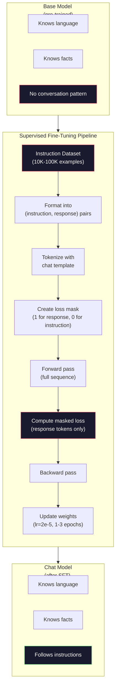

# 指令调谐(SFT

> 基本模型预测下一个标记。就是这样。它不遵循指示，不回答问题，也不拒绝有害的请求。SFT是符号预测器和有用助手之间的桥梁。你见过的每个模特——克劳德、GPT、拉玛·查特——都经历过这一步。

**Type:** Build
**Languages:** Python (with numpy)
**Prerequisites:** Phase 10, Lesson 04 (Pre-Training a Mini GPT)
**Time:** ~90 minutes

## 学习目标

- 实现监督微调（SFT），将基本语言模型转换为指令遵循助手
- 使用具有系统、用户和助理角色的聊天模板格式化训练数据，并掩盖非助理令牌上的损失
- 解释为什么SFT是必要的：基本模型继续文本而不是回答问题
- 通过比较基本模型和微调模型在保留指令集上的响应来评价SFT的质量

## 这个问题

你在第04课训练了一个模型。它可以预测给定序列的下一个标记。输入“转换器架构”，它可能会继续说，“它已经完全改变了自然语言处理。”这对于下一个令牌预测器来说是令人印象深刻的。

现在试试这个：喂它“法国的首都是什么？”一个基本的模型不会回答“巴黎”。它延续了这种模式。它可能会问，“德国的首都是哪里？”西班牙的首都是哪里？因为它从包含问题列表的文件中学习。或者它可能导致“这是一个很多人都会问的问题”，因为这是下一个令牌的合理延续。这个模型没有“响应”的概念。它只知道“继续”。

这是GPT-3（2020年6月发布的基础模型）和ChatGPT（指令调优，2022年11月发布）之间的差距。相同的架构。同样的训练。区别在于2万到10万对精心设计的（指令、响应）对，它们教导模型遵循对话模式。

斯坦福羊驼证明了你不需要无数的例子。2023年3月，他们在GPT-3.5生成的52000对指令响应对上对羊驼7B进行了微调。总费用：600美元。其结果是一个可以遵循指令、回答问题并参与对话的聊天机器人。它不如ChatGPT好，但它非常接近600美元，只需几个小时的培训。

Meta的Llama 2 Chat在最初的SFT阶段只使用了大约27,000个高质量的示例。关键是质量比数量更重要。由熟练的注释员编写的27,000个示例击败了从互联网上抓取的100万个嘈杂的示例。

## 这个概念

### SFT到底做了什么

监督微调从预训练开始延续相同的训练周期——向前传递、计算损失、向后传递和更新权重——但在不同类型的数据上。你训练的不是原文，而是结构化的对话。

‘ ’ ' json
｛
“系统”：“你真是个乐于助人的助手。”
用户：“法国的首都是哪里？”
店员：“法国的首都是巴黎。”
｝
```

The model already knows that Paris is the capital of France. It learned this during pre-training on Wikipedia, textbooks, and web pages. SFT doesn't teach the model new facts. It teaches the model a new *behavior*: when you see a question, produce an answer. When you see an instruction, produce a completion. When you see a harmful request, produce a refusal.

Think of it this way. Pre-training gives the model knowledge. SFT gives the model manners.

### Data Formats

Three formats dominate the industry. Each encodes the same information -- who said what -- with different delimiters.

**Alpaca Format** (Stanford, March 2023):

```json
{
  "instruction": "Summarize the following article in 3 sentences.",
  "input": "The European Central Bank raised interest rates...",
  "output": "The ECB increased rates by 25 basis points..."
}
```

简单，应用广泛。斯坦福大学发布了52,000个由GPT-3.5生成的这种格式的例子，价格为600美元。这开启了开源指令调优运动。

**ShareGPT格式**（社区，2023）

‘ ’ ' json
｛
“对话”:
{"from": "system", "value“: ”你是一个有用的助手。
{"from": "human", "value": “ What cause tides? ”｝
潮汐是由月球的引力引起的。｝
{"from": "human", “value “:”它们出现的频率是多少？ ”｝
大多数沿海地区每天经历两次涨潮和两次退潮。“from”： “gpt”， “value ”："}
］
｝
```

Supports multi-turn conversations. The "from" field uses "human" and "gpt" by convention, regardless of the actual model. Vicuna was trained on 70,000 ShareGPT conversations scraped from user-shared ChatGPT transcripts.

**ChatML Format** (OpenAI, used by many open-source models):

```
系统
你是一个乐于助人的助手
用户
法国的首都在哪里？< | im_end | >
助理
法国的首都是巴黎。< | im_end | >
```

Uses special tokens (`<|im_start|>`, `<|im_end|>`) to delimit roles. These tokens are added to the tokenizer's vocabulary during fine-tuning. Qwen, Yi, and many other models use ChatML.

All three formats accomplish the same thing: they tell the model "this is the instruction, this is the response, learn this pattern."

### Why It Works

The model already knows language from pre-training. It has seen billions of examples of questions followed by answers, instructions followed by completions, and conversations between people. The patterns are already encoded in the weights.

SFT concentrates this latent ability. Instead of the model needing to figure out from context whether it should answer a question or continue a document, SFT explicitly trains on the conversation pattern. After a few thousand examples, the model learns: when you see the assistant role marker, produce a helpful response.

This is why 27,000 examples is enough. You're not teaching the model English. You're not teaching it facts about the world. You're teaching it one simple behavior: respond to instructions. The knowledge was already there.

### The Masked Loss

This is the most important technical detail in SFT, and most tutorials skip it.

During pre-training, you compute loss on every token. The model learns to predict every next token in the sequence. During SFT, you only compute loss on the *response* tokens. The instruction tokens are there for context, but the model is not penalized for "predicting" them incorrectly.

Why? Because you don't want the model to learn to *generate* instructions. You want it to learn to *respond to* instructions. If you compute loss on the instruction tokens, you're training the model to predict "What is the capital of France?" as if it's the one asking the question. That wastes gradient signal and can confuse the model about its role.

In practice, you create a loss mask: 1 for response tokens, 0 for instruction tokens. Multiply the per-token loss by this mask before averaging.

```
托肯：[SYS]你帮了大忙。[用户]大写字母是什么？巴黎是首都。
损耗掩码：0 0 0 0 0 0 0 0 1 1 1 1 1 1 1
```

Only the tokens after `[ASST]` contribute to the loss. The model sees the full conversation during the forward pass (it needs the instruction to produce the right response) but only updates its weights based on how well it predicted the response.

### Training Hyperparameters

SFT uses dramatically different hyperparameters than pre-training. You're not training from scratch. You're adjusting a model that already works.

| Parameter | Pre-Training (Llama 2 7B) | SFT (Llama 2 Chat) |
|-----------|---------------------------|---------------------|
| Learning rate | 3e-4 (peak) | 2e-5 |
| Epochs | 1 (single pass over data) | 2 |
| Batch size | 4M tokens | 64 examples |
| Warmup steps | 2,000 | 0-100 |
| Weight decay | 0.1 | 0.0-0.1 |
| Data size | 2T tokens | 27,000 examples |

The learning rate is 15x lower for SFT. This is critical. A high learning rate during fine-tuning destroys the pre-trained knowledge. The model "forgets" what it learned and overfits to the small fine-tuning dataset. This is catastrophic forgetting.

Two epochs means the model sees each training example twice. More than 3 epochs on a small dataset leads to memorization -- the model starts reproducing training examples verbatim instead of generalizing.

### Catastrophic Forgetting

Fine-tuning can destroy general capabilities. Train too long on instruction-following data and the model loses its ability to write code, do math, or produce creative text. It becomes very good at the specific format of its training data and terrible at everything else.

Three mitigations:

1. **Low learning rate.** 1e-5 to 5e-5. Smaller updates mean less destruction of pre-trained features.

2. **Short training.** 1-3 epochs. Stop before the model overfits.

3. **Mix in pre-training data.** Llama 2 Chat mixed a small percentage (2-5%) of raw pre-training data into the SFT dataset. This "reminds" the model of its general capabilities while learning the new instruction-following behavior.

### Real Numbers

Fine-tuning a 7B model on 10,000 high-quality instruction pairs takes approximately 1 hour on a single NVIDIA A100 80GB GPU. Here's the math:

- 10,000 examples x 512 tokens average = 5.12M tokens
- 2 epochs = 10.24M tokens total
- A100 throughput for 7B model fine-tuning: ~3,000 tokens/second
- 10.24M / 3,000 = ~3,400 seconds = ~57 minutes

For our mini GPT (4 layers, 128 dims), training is nearly instant. The point is understanding the mechanics, not the scale.



## 构建它

### 步骤1：指令数据集

创建一个合成指令数据集。在生产中，Scale AI和Anthropic等公司会雇佣人类注释员来编写这些注释。我们将以编程方式创建它们以演示该格式。

”“python
import numpy as np

Instruction_data = [
｛
“说明”：“法国的首都在哪里？”
答案：“法国的首都是巴黎。”
｝
｛
“说明”：“用一句话解释重力。”
“反作用力”：“引力是使有质量的物体相互吸引的力。”
｝
｛
“说明”：“写一首关于海洋的俳句。”
“回应”：“海浪拍打着海岸，阳光下的盐和泡沫，一片无边无际的蓝色。”
｝
｛
“说明”：“15乘以7等于多少？”
“response”： “15乘以7等于105。”
｝
｛
“指令”：“说三种编程语言。”
这三种编程语言分别是Python、Rust和TypeScript。
｝
｛
“说明”：“总结光合作用。”
“反应”：光合作用将阳光、水和二氧化碳转化为葡萄糖和氧气。
｝
｛
“说明”：“第二次世界大战什么时候结束的？”
回答：“第二次世界大战于1945年结束。”
｝
｛
“指令”：“def 机器学习。”
“回应”：“机器学习是一个算法从数据中学习模式以做出预测的领域。”
｝
］
```

Eight examples is tiny. Stanford Alpaca used 52,000. But the mechanics are identical whether you have 8 or 52,000: tokenize, mask, compute loss on responses only.

### Step 2: Tokenize with Chat Template

Convert instruction-response pairs into token sequences with special role markers. The markers tell the model where the instruction ends and where the response begins.

```python
SPECIAL_TOKENS = {
    "INST_START": 253,
    "INST_END": 254,
    "RESP_START": 255,
}


def tokenize_instruction_pair(instruction, response, vocab_size=256):
    inst_tokens = list(instruction.encode("utf-8"))
    resp_tokens = list(response.encode("utf-8"))

    inst_tokens = [min(t, vocab_size - 4) for t in inst_tokens]
    resp_tokens = [min(t, vocab_size - 4) for t in resp_tokens]

    tokens = (
        [SPECIAL_TOKENS["INST_START"]]
        + inst_tokens
        + [SPECIAL_TOKENS["INST_END"]]
        + [SPECIAL_TOKENS["RESP_START"]]
        + resp_tokens
    )

    return tokens


def create_loss_mask(tokens):
    mask = np.zeros(len(tokens), dtype=np.float32)
    in_response = False

    for i, token in enumerate(tokens):
        if token == SPECIAL_TOKENS["RESP_START"]:
            in_response = True
            continue
        if in_response:
            mask[i] = 1.0

    return mask
```

丢失的掩码对于指令令牌是全0，对于响应令牌是全1。这个

### 步骤3：掩盖交叉熵损失

标准交叉熵，但是乘以损失掩模。只有响应令牌对梯度有贡献。

”“python
（logits, targets, loss_mask）
Batch, seq_len, vocab_size = logits.shape
Logits_flat = logits。（1）
Targets_flat = 0.08塑造(1)
Mask_flat = loss_mask。塑造(1)

Max_logits = logits_flat。max(轴= 1,keepdims = True)
Log_softmax = logits_flat - max_logits - np.log(
np。Exp (logits_flat - max_logits)。sum(轴= 1,keepdims = True)
）

Per_token_loss = -log_softmax

    masked_loss = per_token_loss * mask_flat
    num_response_tokens = mask_flat.sum()
    if num_response_tokens == 0:
        return 0.0
    loss = masked_loss.sum() / num_response_tokens

回波损耗
```

The denominator is `num_response_tokens`, not `seq_len`. If you divide by the total sequence length, longer instructions dilute the gradient signal. Dividing by response token count ensures equal weight per response token regardless of instruction length.

### Step 4: SFT Training Loop

Reuse the MiniGPT from Lesson 04. The training loop looks almost identical to pre-training, but with instruction formatting and masked loss.

```python
import sys
import os
sys.path.insert(0, os.path.join(os.path.dirname(__file__), "..", "..", "04-pre-training-mini-gpt", "code"))
from main import MiniGPT, LayerNorm, FeedForward, MultiHeadAttention, TransformerBlock, Embedding


def sft_train(model, dataset, num_epochs=2, lr=2e-5, seq_len=64):
    formatted_data = []
    for example in dataset:
        tokens = tokenize_instruction_pair(example["instruction"], example["response"])
        mask = create_loss_mask(tokens)
        formatted_data.append((tokens, mask))

    print(f"SFT Training: {len(formatted_data)} examples, {num_epochs} epochs, lr={lr}")
    print(f"Total tokens: {sum(len(t) for t, _ in formatted_data):,}")
    print()

    losses = []

    for epoch in range(num_epochs):
        epoch_loss = 0.0
        num_batches = 0

        indices = np.random.permutation(len(formatted_data))

        for idx in indices:
            tokens, mask = formatted_data[idx]

            if len(tokens) < 3:
                continue
            if len(tokens) > seq_len:
                tokens = tokens[:seq_len]
                mask = mask[:seq_len]

            input_ids = np.array(tokens[:-1]).reshape(1, -1)
            target_ids = np.array(tokens[1:]).reshape(1, -1)
            loss_mask = np.array(mask[1:]).reshape(1, -1)

            logits = model.forward(input_ids)
            loss = masked_cross_entropy_loss(logits, target_ids, loss_mask)

            batch_size, s_len, v_size = logits.shape
            probs = np.exp(logits - logits.max(axis=-1, keepdims=True))
            probs = probs / probs.sum(axis=-1, keepdims=True)
            dlogits = probs.copy()
            dlogits[np.arange(batch_size)[:, None], np.arange(s_len), target_ids] -= 1.0

            mask_expanded = loss_mask[:, :, np.newaxis]
            num_resp = loss_mask.sum()
            if num_resp > 0:
                dlogits = dlogits * mask_expanded / num_resp

            for block in model.blocks:
                block.ffn.W1 -= lr * np.random.randn(*block.ffn.W1.shape) * 0.01
                block.ffn.W2 -= lr * np.random.randn(*block.ffn.W2.shape) * 0.01
                block.ffn.b1 -= lr * np.random.randn(*block.ffn.b1.shape) * 0.01
                block.ffn.b2 -= lr * np.random.randn(*block.ffn.b2.shape) * 0.01

            epoch_loss += loss
            num_batches += 1
            losses.append(loss)

        avg_loss = epoch_loss / max(num_batches, 1)
        print(f"Epoch {epoch + 1}/{num_epochs} | Avg Loss: {avg_loss:.4f}")

    return model, losses
```

学习率为25-5，与羊驼2的聊天速度相当。将它与预训练中使用的3e-4进行比较-小15倍。梯度是被屏蔽的：指令令牌生成一个零梯度。只有响应令牌推送权重。

### 步骤5：将基本模型与SFT模型进行比较

SFT的全部意义在于行为的改变。让我们通过检查模型如何响应指令格式的输入和原始文本的延续来衡量它。

”“python
Def generate_response(model, prompt_tokens, max_new_token =50, temperature=0.8)：
Token = list（prompt_token）
Seq_len = model . htm .pos_embed。形状[0]

For _in range(max_new_tokens)：
上下文= np。阵列(令牌[-seq_len:])。重塑(1,1
Logits =模型。转发(上下文)
Next_logits = logits[0, -1,:]

        next_logits = next_logits / max(temperature, 1e-8)
        probs = np.exp(next_logits - next_logits.max())
        probs = probs / probs.sum()
        probs = np.clip(probs, 1e-10, 1.0)
        probs = probs / probs.sum()

Next_token = np.random。选择（len（聚合氯化铝），p =聚合氯化铝）
令牌。追加（int (next_token)）

返回标签


Def evaluate_instruction_following(model, instructions)：
打印（“以下是评估说明”）
打印（"-" * 50）

对于指令中的指令：
Token = (
[special_tokens [" inst_start "]]
            + [min(t, 252) for t in list(instruction.encode("utf-8"))]
            + [special_tokens [" inst_end "]]
            + [special_tokens [" resp_start "]]
）

Generate_response （model, token, max_new_token =30, temperature=0.6）
Response_start = len（tokens）
Response_tokens = output[response_start:]
Response_bytes = bytes（[t for t in response_tokens if t < 128]）
Response_text = response_bytes.decode（"utf-8", errors="replace"）

print（f“Q:{汉字}”）
print（f" A: {response_text[:80]}"）
print ()
```

On a tiny model with 8 examples, the responses won't be meaningful. That's expected. The important thing is the *structure*: the model learns to produce output after the response marker instead of continuing to generate more instructions.

### Step 6: Measure Catastrophic Forgetting

Compare the model's next-token prediction ability before and after SFT. If SFT damages general capabilities, the loss on raw text will increase.

```python
def measure_forgetting(model, test_text, seq_len=64):
    tokens = np.array(list(test_text.encode("utf-8")[:512]))

    total_loss = 0.0
    num_windows = 0

    for start in range(0, len(tokens) - seq_len - 1, seq_len):
        input_ids = tokens[start:start + seq_len].reshape(1, -1)
        target_ids = tokens[start + 1:start + seq_len + 1].reshape(1, -1)

        logits = model.forward(input_ids)

        batch, s_len, vocab_size = logits.shape
        logits_flat = logits.reshape(-1, vocab_size)
        targets_flat = target_ids.reshape(-1)

        max_logits = logits_flat.max(axis=-1, keepdims=True)
        log_softmax = logits_flat - max_logits - np.log(
            np.exp(logits_flat - max_logits).sum(axis=-1, keepdims=True)
        )

        loss = -log_softmax[np.arange(len(targets_flat)), targets_flat].mean()
        total_loss += loss
        num_windows += 1

    return total_loss / max(num_windows, 1)
```

在真正的微调中，您将在整个训练过程中跟踪此度量。如果原始文本的丢失增加超过10-15%，则表明您的SFT过于激进。降低学习率或减少epoch的个数。

## 使用它

### 一个完整的演示的SFT管道

”“python
如果__name__ == "__main__"：
np.random.seed (42)

test_text = “”转换器架构通过自聚焦处理序列。
每一层应用多头注意力，然后是一个前馈网络。
残余连接和层归一化稳定了深度网络。
这个模型学习在给定所有之前的标签的情况下预测下一个标签。

Print （"=" * 70）
print（“指令调谐（SFT）演示”）
Print （"=" * 70）
print ()

model = MiniGPT(
Vocab_size =256, embed_dim=128, num_heads=4
Num_layers =4, max_seq_len=128, ff_dim=512
）
打印(f "model:{model。Count_parameters ():} parameters ")
打印（f“配置：4层，4头，128 dim（来自第04课的迷你GPT）”）
print ()

印刷（“PRE-SFT：测量原始文本的基本模型损失”）
Base_loss = measure_forgetting （model, test_text）
print （f “基本模型损失：{base_loss:.4f}”）
print ()

Print （"=" * 70）
中国（sft）
Print （"=" * 70）

，loss = sft_train(
model, INSTRUCTION_DATA, num_epochs=3, lr=2e-5, seq_len=128
）

print ()
print（“POST-SFT：测量原始文本上的微调模型损失”）
Sft_loss = measure_forgetting （model, test_text）
print （f" SFT模型损失：{sft_loss:.4f}"）
Print (f "change: {((sft_loss - base_loss)/base_loss * 100): +。1 f} %"
如果abs(sft_loss - base_loss)/base_loss < 0.15：
打印（“最小遗忘（< 15%变化）”）
其他人
打印（“检测到显著遗忘”）
print ()

Print （"=" * 70）
打印（“计算指令”）
Print （"=" * 70）
print ()

Test_instructions = [
法国的首都在哪里？
“说出一种编程语言。”
“def 重力。”
］
test_instructions evaluate_instruction_following(模型)

Print （"=" * 70）
打印（“数据格式示例”）
Print （"=" * 70）
print ()

1、列举(INSTRUCTION_DATA [3])
Tokens = tokenize_instruction_pair（example["instruction"], example["response"]）
Mask = create_loss_mask（token）
Resp_count = int（mask.sum()）
Total_count = len（token）
打印（f " " {i + 1}: {total_count} token, {resp_count} "）。f”)。0}的序列)"
print（f" Instruction: {example[' Instruction ']}"）
print（f" Response: {example[' Response ']}"）
print ()

Print （"=" * 70）
打印（“训练损失曲线”）
Print （"=" * 70）
print ()

如果有损失
Window = max （1, len(losses) // 5）
对于I在range(0, len(losses), window)：
Chunk = losses[i:i + window]
Avg = sum(chunk)/len （chunk）
Print （f "step {I: 3 d} - {I + len (block) - 1:3 d}: avg损失= {avg: 4 f}"）
```

## Ship It

This lesson produces `outputs/prompt-sft-data-curator.md` -- a prompt that helps you design and curate instruction datasets for SFT. Given a target capability (code generation, math, conversation), it produces a data collection plan with format specifications, quality criteria, and diversity requirements.

## Exercises

1. Add system prompt support. Modify `tokenize_instruction_pair` to accept a system message and prepend it before the instruction. Create 5 examples with different system prompts ("You are a poet", "You are a math tutor") and verify the model sees different system prompts during training.

2. Implement data mixing. Create a function that takes an SFT dataset and a raw text corpus, then produces training batches where 5% of examples are raw text (no masking) and 95% are instruction pairs (masked). Run 3 epochs and compare forgetting metrics against pure SFT training.

3. Build a data quality scorer. For each instruction-response pair, compute: (a) response length in tokens, (b) instruction-to-response ratio, (c) vocabulary diversity (unique tokens / total tokens). Filter out examples with response length < 10 tokens or diversity < 0.3. Show how filtering affects the final loss.

4. Implement multi-turn conversation training. Extend the tokenization to handle 3-turn conversations (user-assistant-user-assistant-user-assistant). The loss mask should cover all three assistant turns. Verify the mask is correct by printing the token-mask alignment for one example.

5. Compare learning rates. Train the same model three times with lr=1e-4, lr=2e-5, and lr=1e-6. Plot the loss curves. The 1e-4 run should show rapid initial descent but higher final loss (overfitting). The 1e-6 run should barely move. The 2e-5 run should be the sweet spot.

## Key Terms

| Term | What people say | What it actually means |
|------|----------------|----------------------|
| SFT | "Fine-tuning on conversations" | Supervised Fine-Tuning: continuing training on (instruction, response) pairs with loss computed only on response tokens |
| Instruction tuning | "Teaching the model to follow instructions" | Training on explicit instruction-response pairs so the base model learns the conversation pattern, not new knowledge |
| Loss masking | "Ignoring the prompt" | Setting loss to zero for instruction tokens so gradients only flow from response token predictions |
| ChatML | "Chat Markup Language" | A token format using `<\|im_start\|>` and `<\|im_end\|>` delimiters to mark speaker roles in conversation data |
| Alpaca format | "Stanford's format" | A JSON format with instruction/input/output fields, used for 52K GPT-3.5-generated examples that cost $600 |
| Catastrophic forgetting | "The model gets dumber" | Fine-tuning destroys pre-trained capabilities because gradient updates overwrite general knowledge with task-specific patterns |
| Weight tying | "Shared embeddings" | Using the same matrix for input token embeddings and output prediction head, saving parameters and improving coherence |
| Chat template | "How you format the prompt" | The specific token sequence (role markers, delimiters) that structures a conversation for the model |

## Further Reading

- [Ouyang et al., 2022 -- "Training language models to follow instructions with human feedback" (InstructGPT)](https://arxiv.org/abs/2203.02155) -- the paper that introduced instruction tuning + RLHF at OpenAI
- [Taori et al., 2023 -- "Stanford Alpaca: An Instruction-following LLaMA Model"](https://github.com/tatsu-lab/stanford_alpaca) -- 52K instruction examples for $600, proving SFT works on small datasets
- [Touvron et al., 2023 -- "Llama 2: Open Foundation and Fine-Tuned Chat Models"](https://arxiv.org/abs/2307.09288) -- Meta's SFT + RLHF pipeline with 27K high-quality examples
- [Chiang et al., 2023 -- "Vicuna: An Open-Source Chatbot Impressing GPT-4"](https://lmsys.org/blog/2023-03-30-vicuna/) -- training on 70K ShareGPT conversations
- [Zhou et al., 2023 -- "LIMA: Less Is More for Alignment"](https://arxiv.org/abs/2305.11206) -- proving that 1,000 carefully curated examples can match SFT on much larger datasets