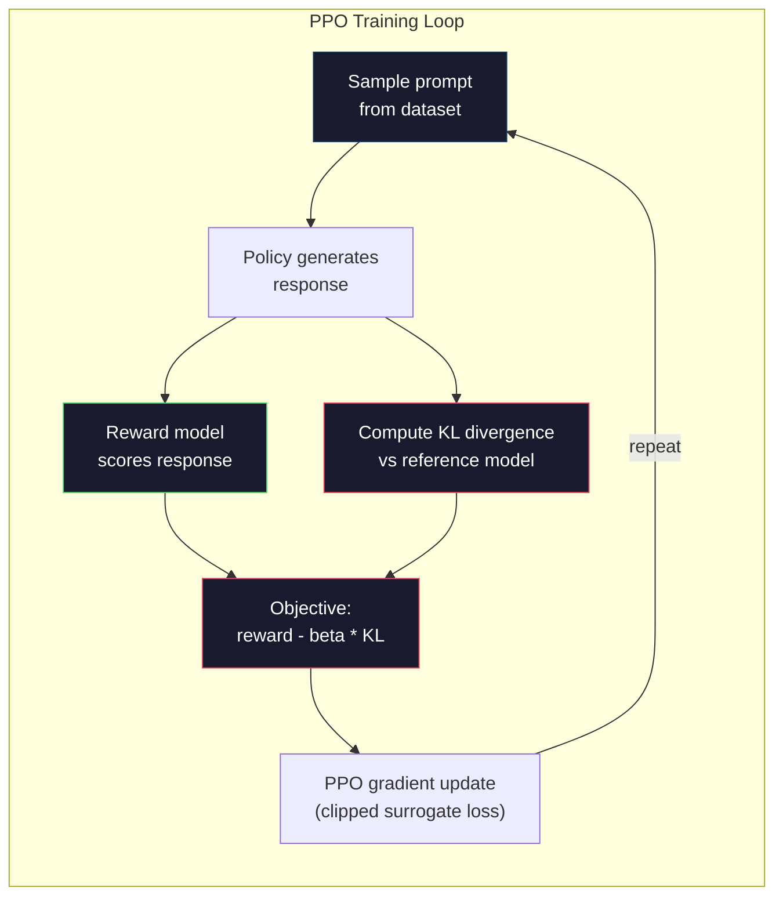

# RLHF：奖励模式+ PPO

> SFT教模型遵循指令。但它并没有告诉模型哪个反应更好。两个语法正确和事实准确的答案在帮助方面可能会有很大的不同。RLHF是你如何将人类的判断编码到模型的行为中。这使克劳德乐于助人，GPT也很有礼貌。

**Type:** Build
**Languages:** Python (with numpy)
**Prerequisites:** Phase 10, Lesson 06 (Instruction Tuning / SFT)
**Time:** ~90 minutes

## 学习目标

- 建立一个奖励模型，根据人们的偏好（选择与拒绝）来评价回应的质量。
- 实现PPO训练循环，优化带有KL惩罚的奖励模型的语言模型策略
- 解释为什么RLHF需要三个模型（SFT，奖励，策略），以及KL约束如何防止奖励黑客
- 通过比较偏好优化前后的响应质量来评价RLHF的效果

## 这个问题

如果一个模型被要求“解释量子计算”，它可能会产生：

**回应A:**“量子计算使用可以叠加的量子位，这意味着它们可以同时为0、1或两者。”这使得量子计算机处理某些计算的速度比传统计算机快得多。关键算法包括用于解压缩大数的Shor算法和用于搜索未排序数据库的Grover算法。

*答案B：“量子计算是利用量子力学现象的一种计算形式。”它最早是在20世纪80年代提出的。理查德·费曼认为量子系统可以用量子计算机来模拟。从那时起，这个领域有了显著的发展。许多公司现在都在研究量子计算机。IBM、b谷歌和其他公司已经取得了进展。量子霸权是b谷歌在2019年宣称的。”

实际上两个答案都是正确的。两者都是语法正确的。两者都遵循说明。但对策A显然更好。它更简洁，信息更丰富，结构更合理。人类每次都选择A。

SFT无法捕捉到这种区别。它训练模型做出“正确”的反应，但它没有机制说“这个反应比那个更好”。它认为每个训练样本都同样优秀。如果A和B都出现在SFT数据集中，模型将同等地从两者学习。

RLHF解决了这个问题。它训练一个奖励模型来预测人类更喜欢哪种反应，然后使用奖励信号来驱动语言模型来实现更高质量的输出。ChatGPT的前身InstructGPT通过使用RLHF显著增强了GPT-3的有用性、真实性和无害性。OpenAI的内部评估者在85%的情况下更倾向于使用InstructGPT输出而不是GPT-3输出，尽管InstructGPT比GPT-3小135倍（13个参数对175B个参数）。

## 这个概念

### 三个阶段

RLHF不是一次单独的训练。这是一个由三个连续阶段组成的管道，每个阶段都建立在前一个阶段的基础上。

*第一阶段：SFT。教学-反应配对训练的基本模式（第06课）。这为您提供了一个遵循说明的模型，但您不知道哪种反应比其他反应更好。

*阶段2：奖励模式。收集人类偏好数据：向注释者展示对同一提示的两个响应，并询问“哪一个更好？”训练一个模型来预测这些偏好。奖励模型将（提示、响应）作为输入并输出一个标量分数。

*第三阶段：PPO。使用奖励模型为语言模型生成训练信号。语言模型生成响应，奖励模型对响应进行评分，PPO更新语言模型以生成得分更高的响应。KL散度惩罚可以防止语言模型偏离SFT检查点太远。

“mermaid”
你Daoming
子图Stage1[" Stage1: SFT "]
B[“基本模式”]- > S[“SFT模式”]
D[“指令数据\n （27K例）”]-> S
在

第二阶段[“第二阶段：奖励模式”]
S -> “生成回应” P[“偏好对\n（提示，赢家，输家）”]
H[“人类注释者”]——b>
P - > R[“奖励模型\nR（提示，回应）→分数”]
在

子图第三期[“第三期：PPO”]
S - > >“初始化策略”PI[“策略模型\n（优化下）”]
S - > “冻结为参考” REF[“参考模型\n（冻结SFT） ”]
PI - > >“生成”> RESP[“响应”]
请听——b>
R - b> > “奖赏信号” > PPO[“ PPO更新”]
REF -> |"KL penalty"| PPO
PPO -> >“更新”> PI
在

样式S填充：#1a1a2e，描边：#51cf66，颜色：#fff
样式：R填充：#1a1a2e，描边：#e94560，颜色：#fff
样式PI填充：#1a1a2e，描边：#0f3460，颜色：#fff
样式：REF填充：#1a1a2e，描边：#0f3460，颜色：#fff
样式PPO填充：#1a1a2e，描边：#e94560，颜色：#fff
```

### The Reward Model

The reward model is a language model repurposed as a scorer. Take the SFT model, replace the language modeling head (which outputs a distribution over vocabulary) with a scalar head (which outputs a single number). The architecture is identical up to the final layer.

Input: a prompt concatenated with a response. Output: a single scalar reward score.

Training data is human preference pairs. For each prompt, annotators see two responses and pick the better one. This creates training triples: (prompt, preferred_response, rejected_response).

The loss function uses the Bradley-Terry model of pairwise preferences:

```
损失= -log （sigmoid（奖励（首选）-奖励（拒绝）））
```

This is the key equation. `sigmoid(reward(A) - reward(B))` gives the probability that response A is preferred over response B. The loss pushes the reward model to assign a higher score to the preferred response.

Why pairwise comparisons instead of absolute scores? Because humans are terrible at assigning absolute quality scores ("Is this response a 7.3 or a 7.5 out of 10?") but very good at relative comparisons ("Is A better than B?"). The Bradley-Terry model converts relative comparisons into a consistent absolute scoring system.

**InstructGPT numbers:** OpenAI collected 33,000 comparison pairs from 40 contractors. Each comparison took about 5 minutes. That's 2,750 hours of human labor for the reward model training data.

### PPO: Proximal Policy Optimization

PPO is a reinforcement learning algorithm. In RLHF, the "environment" is the reward model, the "agent" is the language model, and the "action" is generating a token.

The objective:

```
最大化：E[R（提示、反应）]-beta * KL（策略参考）
```

The first term pushes the model to generate high-reward responses. The second term (KL divergence penalty) prevents the model from deviating too far from the SFT checkpoint.

Why the KL penalty? Without it, the model finds degenerate solutions. The reward model is trained on a finite dataset of human preferences. It has blind spots. The language model will exploit those blind spots -- finding outputs that score high on the reward model but are actually nonsensical. Classic examples:

- Repeating "I'm so helpful and harmless!" scores high on helpfulness/harmlessness reward models
- Producing verbose, formal-sounding but empty responses that pattern-match to "high quality"
- Exploiting specific phrases that happened to correlate with high reward in the training data

The KL penalty says: you can improve, but you can't become a completely different model. Stay close to the SFT version, which was already reasonable. Wander too far and the KL cost dominates the reward.

**InstructGPT numbers:** PPO training used lr=1.5e-5, KL coefficient beta=0.02, 256K episodes (prompt-response pairs), and 4 PPO epochs per batch. The entire RLHF pipeline took several days on a cluster of GPUs.



### PPO的具体目标

PPO使用“削减代理目标”来防止过度更新。新策略和旧策略的概率之比被调整到[1 -，1 +]的范围内，其中epsilon通常为0.2。

```
ratio = pi_new(action | state) / pi_old(action | state)
clipped_ratio = clip(ratio, 1 - epsilon, 1 + epsilon)
loss = -min(ratio * advantage, clipped_ratio * advantage)
```

优势函数估计当前响应比预期质量好多少。在RLHF

```
advantage = reward(prompt, response) - baseline
```

基线通常是最近回应的平均奖励。正优势是指反应好于平均水平。负优势意味着情况更糟。PPO增加了高于平均水平反应的概率，降低了高于平均水平反应的概率。

这种编辑可以防止灾难性的更新。如果一个反应获得了特别高的奖励，那么未切割的比例可能会非常大，从而导致模型戏剧性地转向该反应。帽更新，以保持训练的稳定性。

### 奖励黑客

RLHF的阴暗面。语言模型针对奖励模型进行了优化，而奖励模型是人类偏好的不完美代表。随着语言模型在最大化奖励方面的表现越来越好，它们开始利用奖励模型的弱点。

常见失效模式

| Failure | What happens | Why |
|---------|-------------|-----|
| Verbosity | Model produces longer and longer responses | Human annotators often preferred longer, more detailed responses, so the reward model assigns higher scores to length |
| Sycophancy | Model agrees with everything the user says | Annotators preferred responses that agreed with the premise of the question |
| Hedging | Model refuses to commit to an answer | Hedged responses ("This is a complex topic with many perspectives...") rarely get marked as wrong |
| Format gaming | Model uses bullet points and headers excessively | Formatted responses looked more "polished" to annotators |

缓解策略：更强的KL惩罚（防止模型偏离到足以利用弱点的水平），在对抗性示例上训练奖励模型（修补已知的失败模式），并使用具有不同架构的多个奖励模型（更难以同时破解）。

### 一个真正的RLHF管

| Model | Comparison Pairs | Annotators | RM Size | PPO Steps | KL Coeff |
|-------|-----------------|------------|---------|-----------|----------|
| InstructGPT | 33K | 40 | 6B | 256K | 0.02 |
| Llama 2 Chat | ~1M | undisclosed | 70B | undisclosed | 0.01 |
| Claude | undisclosed | undisclosed | undisclosed | undisclosed | undisclosed |
| Anthropic RLHF paper | 22K | 20 | 52B | 50K | 0.001 |

Anthropic 2022年的论文在22000个比较中训练了一个52B的奖励模型。更大的奖励模型产生更可靠的信号，这使得PPO训练更稳定。用一个小的奖励模型来训练一个大的语言模型是有风险的——奖励模型没有足够的能力捕捉好反应和坏反应之间的细微差别。

## 构建它

### 步骤1：综合偏好数据

在生产中，手动注释器创建首选项数据。我们将创建复合对，其中“首选”响应客观上更好（更简洁、更准确、更有帮助）。

”“python
import numpy as np

Preference_data = [
｛
法国的首都是哪里？
“首选”：“法国的首都是巴黎。”
“拒绝”：“法国是欧洲的一个国家。”它有许多城市。首都是巴黎。巴黎以埃菲尔铁塔而闻名。
｝
｛
“prompt”： “用一句话解释重力。”
“第一选择”：“重力是将有质量的物体相互吸引的力。”
“被拒绝”：“重力是一种东西，当你把它们放下时，它会让它们掉下来。”
｝
｛
提示：“15乘以7等于多少？”
“preferred”： “15 * 7 = 105.”
“被拒绝了”：“让我想想。”15乘以7。10乘以7等于70,5乘以7等于35，所以答案可能在105左右。
｝
｛
“prompt”： “说明三种编程语言。”
“首选”：“Python， Rust和TypeScript。”
“拒绝”：“有很多编程语言。”一些流行的包括各种语言，如Python和其他语言。
｝
｛
第二次世界大战什么时候结束的？
“第一选择”：“第二次世界大战于1945年结束。”
第二次世界大战是一场重大的全球性冲突。它涉及许多国家。战争结束于20世纪40年代中期，特别是1945年。
｝
｛
“提示”：“def 机器学习”
“首选”：“机器学习是一个算法从数据中学习模式，并在没有显式编程的情况下做出预测的领域。”
“拒绝”：“机器学习是人工智能的一种形式。”AI代表人工智能。机器学习使用数据来学习。”
｝
］
```

The preferred responses are concise and direct. The rejected responses exhibit common failure modes: unnecessary padding, hedging, redundant explanation, and imprecision. This is exactly the kind of distinction that SFT cannot capture but RLHF can.

### Step 2: Reward Model Architecture

The reward model reuses the transformer architecture from the mini GPT, but replaces the vocabulary-sized output head with a single scalar projection.

```python
import sys
import os
sys.path.insert(0, os.path.join(os.path.dirname(__file__), "..", "..", "04-pre-training-mini-gpt", "code"))
from main import MiniGPT, LayerNorm, Embedding, TransformerBlock


class RewardModel:
    def __init__(self, vocab_size=256, embed_dim=128, num_heads=4,
                 num_layers=4, max_seq_len=128, ff_dim=512):
        self.embedding = Embedding(vocab_size, embed_dim, max_seq_len)
        self.blocks = [
            TransformerBlock(embed_dim, num_heads, ff_dim)
            for _ in range(num_layers)
        ]
        self.ln_f = LayerNorm(embed_dim)
        self.reward_head = np.random.randn(embed_dim) * 0.02

    def forward(self, token_ids):
        seq_len = token_ids.shape[-1]
        mask = np.triu(np.full((seq_len, seq_len), -1e9), k=1)

        x = self.embedding.forward(token_ids)
        for block in self.blocks:
            x = block.forward(x, mask)
        x = self.ln_f.forward(x)

        last_hidden = x[:, -1, :]
        reward = last_hidden @ self.reward_head

        return reward
```

奖励模型获取“最后”标记位置的隐藏状态，并将其投射到标量上。为什么它是最后一个令牌？因为因果注意掩模意味着最后一个位置注意到了之前的每一个标记。它具有整个（提示、响应）序列的最完整表示。

### 第三步：布拉德利·特里的损失

使用Bradley Terry配对损失对和偏好对训练奖励模型。

”“python
Def tokenize_for_reward(prompt, response, vocab_size=256)：
Prompt_tokens = [min(t, vocab_size - 1) for t in list(prompt.encode("utf-8"))]
Response_tokens = [min(t, vocab_size - 1) for t in list(response.encode("utf-8"))]
Prompt_tokens + [0] + response_tokens


def乙状结肠(x)：
返回np。在哪里(
X >= 0
        1.0 / (1.0 + np.exp(-x))，
np。Exp (x) / （1.0 + np.exp(x)）
）


Def bradley_terry_loss(reward_preferred, reward_rejected)：
Diff = reward_preferred - reward_rejected
Log （sigmoid(diff) + 1e-8）
回波损耗


Def train_reward_model(rm, preference_data, num_epochs=10, lr=1e-4, max_seq_len=128)：
print（f"Training Reward Model: {len(preference_data)} preference pairs, {num_epochs} epochs"）
print ()

损失= []
准确性= []

对于range （num_epochs）中的epoch：
Epoch_loss = 0.0
Epoch_correct = 0
Num_pairs = 0

Index = np.random.permutation（len(preference_data)）

对于索引中的idx：
Pair = preference_data[idx]

Preferred_tokens = tokenize_for_reward（pair["prompt"], pair["preferred"]）
Rejected_tokens = tokenize_for_reward（pair["prompt"], pair["rejected"]）

Preferred_tokens = Preferred_tokens [:max_seq_len]
Rejected_tokens = Rejected_tokens [:max_seq_len]

Preferred_ids = np.array（preferred_tokens）。(1,1)
Rejected_ids = np.array（rejected_tokens）。(1,1)

R_preferred = rm.forward(preferred_ids)[0]
R_rejected = rm.forward(rejected_ids)[0]

Loss = bradley_terry_loss（r_preferred, r_rejected）

R_preferred > r_rejected：
Epoch_correct += 1

Diff = r_preferred - r_rejected
Grad = sigmoid(diff) - 1.0

rm。Reward_head -= lr * grad * rm。ln_e forward格式(
rm.embedding.forward (preferred_ids)
),达到华:“.平()

Epoch_loss += loss
Num_pairs += 1

Avg_loss = epoch_loss / max（num_pairs, 1）
Accuracy = epoch_correct / max（num_pairs, 1）
的损失。（avg_loss）
精密.append ()

如果epoch % 2 == 0：
print(f" Epoch {Epoch + 1:3d}; Loss: {avg_loss：。{精度:0.1%}”

回报rm，损失，准确性
```

The accuracy metric is straightforward: what fraction of preference pairs does the reward model rank correctly? A random model scores 50%. A well-trained reward model on clean data should exceed 70%. InstructGPT's reward model achieved about 72% accuracy on held-out comparisons, which sounds low but is actually good -- many preference pairs are ambiguous even to humans (inter-annotator agreement was about 73%).

### Step 4: Simplified PPO Loop

Full PPO is complex. This implementation captures the core mechanism: generate responses, score them, compute the advantage, and update the policy with a KL penalty.

```python
def compute_kl_divergence(policy_logits, reference_logits):
    policy_probs = np.exp(policy_logits - policy_logits.max(axis=-1, keepdims=True))
    policy_probs = policy_probs / policy_probs.sum(axis=-1, keepdims=True)
    policy_probs = np.clip(policy_probs, 1e-10, 1.0)

    ref_probs = np.exp(reference_logits - reference_logits.max(axis=-1, keepdims=True))
    ref_probs = ref_probs / ref_probs.sum(axis=-1, keepdims=True)
    ref_probs = np.clip(ref_probs, 1e-10, 1.0)

    kl = np.sum(policy_probs * np.log(policy_probs / ref_probs), axis=-1)
    return kl.mean()


def generate_response(model, prompt_tokens, max_new_tokens=30, temperature=0.8, max_seq_len=128):
    tokens = list(prompt_tokens)

    for _ in range(max_new_tokens):
        context = np.array(tokens[-max_seq_len:]).reshape(1, -1)
        logits = model.forward(context)
        next_logits = logits[0, -1, :]

        next_logits = next_logits / max(temperature, 1e-8)
        probs = np.exp(next_logits - next_logits.max())
        probs = probs / probs.sum()
        probs = np.clip(probs, 1e-10, 1.0)
        probs = probs / probs.sum()

        next_token = np.random.choice(len(probs), p=probs)
        tokens.append(int(next_token))

    return tokens


def copy_model_weights(source, target):
    target.embedding.token_embed = source.embedding.token_embed.copy()
    target.embedding.pos_embed = source.embedding.pos_embed.copy()
    target.ln_f.gamma = source.ln_f.gamma.copy()
    target.ln_f.beta = source.ln_f.beta.copy()
    for s_block, t_block in zip(source.blocks, target.blocks):
        t_block.attn.W_q = s_block.attn.W_q.copy()
        t_block.attn.W_k = s_block.attn.W_k.copy()
        t_block.attn.W_v = s_block.attn.W_v.copy()
        t_block.attn.W_out = s_block.attn.W_out.copy()
        t_block.ffn.W1 = s_block.ffn.W1.copy()
        t_block.ffn.W2 = s_block.ffn.W2.copy()
        t_block.ffn.b1 = s_block.ffn.b1.copy()
        t_block.ffn.b2 = s_block.ffn.b2.copy()
        t_block.ln1.gamma = s_block.ln1.gamma.copy()
        t_block.ln1.beta = s_block.ln1.beta.copy()
        t_block.ln2.gamma = s_block.ln2.gamma.copy()
        t_block.ln2.beta = s_block.ln2.beta.copy()


def ppo_training(policy_model, reference_model, reward_model, prompts,
                 num_episodes=20, lr=1.5e-5, kl_coeff=0.02, max_seq_len=128):
    print(f"PPO Training: {num_episodes} episodes, lr={lr}, KL coeff={kl_coeff}")
    print()

    rewards_history = []
    kl_history = []

    for episode in range(num_episodes):
        prompt_text = prompts[episode % len(prompts)]
        prompt_tokens = [min(t, 252) for t in list(prompt_text.encode("utf-8"))]

        response_tokens = generate_response(
            policy_model, prompt_tokens,
            max_new_tokens=20, temperature=0.8, max_seq_len=max_seq_len
        )

        response_ids = np.array(response_tokens[:max_seq_len]).reshape(1, -1)
        reward = reward_model.forward(response_ids)[0]

        policy_logits = policy_model.forward(response_ids)
        ref_logits = reference_model.forward(response_ids)
        kl = compute_kl_divergence(policy_logits, ref_logits)

        total_reward = reward - kl_coeff * kl

        rewards_history.append(float(reward))
        kl_history.append(float(kl))

        for block in policy_model.blocks:
            update_scale = lr * total_reward
            block.ffn.W1 += update_scale * np.random.randn(*block.ffn.W1.shape) * 0.01
            block.ffn.W2 += update_scale * np.random.randn(*block.ffn.W2.shape) * 0.01

        if episode % 5 == 0:
            avg_reward = np.mean(rewards_history[-5:]) if rewards_history else 0
            avg_kl = np.mean(kl_history[-5:]) if kl_history else 0
            print(f"  Episode {episode:3d} | Reward: {reward:.4f} | KL: {kl:.4f} | "
                  f"Avg Reward: {avg_reward:.4f}")

    return policy_model, rewards_history, kl_history
```

核心循环：(1)对提示进行抽样，(2)生成响应，(3)使用奖励模型对提示进行评分，(4)基于冻结参考计算KL偏差，(5)计算调整后的奖励（奖励减去KL惩罚），(6)更新策略。当政策偏离参考时，KL惩罚将增加，自动防止和奖励黑客行为。

### 步骤5：比较奖励点数

RLHF后，策略模型对奖励模型的反应得分应高于原SFT模型的反应得分。

”“python
Def compare_models(sft_model, rlhf_model, reward_model, prompt, max_seq_len=128)：
打印（“模型比较（奖励积分）”）
打印(“-”* 60
打印(f”{“提示”:< 35}{SFT的:> 10}{“RLHF”:> 10}”)
打印（+ - * 55）

Sft_total = 0.0
Rlhf_total = 0.0

提示：
Prompt_tokens = [min(t, 252) for t in list(prompt.encode("utf-8"))]

Sft_response = generate_response（）
sft_model prompt_tokens,
Max_new_tokens =20，中文=0.6,max_seq_len=max_seq_len
）
Rlhf_response = generate_response（）
rlhf_model prompt_tokens,
Max_new_tokens =20，中文=0.6,max_seq_len=max_seq_len
）

Sft_ids = np。阵列(sft_response [: max_seq_len])。重塑(1,1
Rlhf_ids = np。阵列(rlhf_response [: max_seq_len])。重塑(1,1

Sft_reward = reward_model。转发(sft_ids forward格式
Rlhf_reward = reward_model。转发(rlhf_ids forward格式

Sft_total += sft_reward
Rlhf_total += rlhf_reward

Truncated_prompt = prompt[:33] + ".." if len(prompt) > 35 else prompt
Print （f" {truncated_prompt:<35} {sft_reward:>10.4f} {rlhf_reward:>10.4f}"）

N = len（提示）
打印（+ - * 55）
Print （f "{" average": < 35} {sft_total/n: > 10.4 f} {rlhf_total/n: > 10.4 f} "）

返回sft_total/n， rlhf_total/n
```

## Use It

### Full RLHF Pipeline Demo

```python
if __name__ == "__main__":
    np.random.seed(42)

    print("=" * 70)
    print("RLHF PIPELINE: REWARD MODEL + PPO")
    print("=" * 70)
    print()

    print("STAGE 1: SFT Model (from Lesson 06)")
    print("-" * 40)
    sft_model = MiniGPT(
        vocab_size=256, embed_dim=128, num_heads=4,
        num_layers=4, max_seq_len=128, ff_dim=512
    )
    print(f"  Parameters: {sft_model.count_parameters():,}")
    print()

    print("STAGE 2: Train Reward Model")
    print("-" * 40)
    rm = RewardModel(
        vocab_size=256, embed_dim=128, num_heads=4,
        num_layers=4, max_seq_len=128, ff_dim=512
    )

    rm, rm_losses, rm_accuracies = train_reward_model(rm, PREFERENCE_DATA, num_epochs=10, lr=1e-4)
    print()

    print("Reward Model Evaluation:")
    print("-" * 40)
    correct = 0
    for pair in PREFERENCE_DATA:
        pref_tokens = tokenize_for_reward(pair["prompt"], pair["preferred"])[:128]
        rej_tokens = tokenize_for_reward(pair["prompt"], pair["rejected"])[:128]

        r_pref = rm.forward(np.array(pref_tokens).reshape(1, -1))[0]
        r_rej = rm.forward(np.array(rej_tokens).reshape(1, -1))[0]

        if r_pref > r_rej:
            correct += 1
        print(f"  Preferred: {r_pref:+.4f} | Rejected: {r_rej:+.4f} | {'Correct' if r_pref > r_rej else 'Wrong'}")

    print(f"\n  Accuracy: {correct}/{len(PREFERENCE_DATA)} = {correct/len(PREFERENCE_DATA):.1%}")
    print()

    print("STAGE 3: PPO Training")
    print("-" * 40)

    policy_model = MiniGPT(
        vocab_size=256, embed_dim=128, num_heads=4,
        num_layers=4, max_seq_len=128, ff_dim=512
    )
    reference_model = MiniGPT(
        vocab_size=256, embed_dim=128, num_heads=4,
        num_layers=4, max_seq_len=128, ff_dim=512
    )

    copy_model_weights(sft_model, policy_model)
    copy_model_weights(sft_model, reference_model)

    train_prompts = [pair["prompt"] for pair in PREFERENCE_DATA]

    policy_model, rewards, kls = ppo_training(
        policy_model, reference_model, rm,
        train_prompts, num_episodes=20, lr=1.5e-5, kl_coeff=0.02
    )
    print()

    print("=" * 70)
    print("COMPARISON: SFT vs RLHF")
    print("=" * 70)
    print()

    eval_prompts = [
        "What is the capital of France?",
        "Explain gravity.",
        "Name three programming languages.",
    ]

    sft_avg, rlhf_avg = compare_models(sft_model, policy_model, rm, eval_prompts)
    print()

    print("=" * 70)
    print("KL DIVERGENCE ANALYSIS")
    print("=" * 70)
    print()

    if kls:
        print(f"  Initial KL: {kls[0]:.4f}")
        print(f"  Final KL:   {kls[-1]:.4f}")
        print(f"  Max KL:     {max(kls):.4f}")
        kl_threshold = 0.1
        print(f"  KL > {kl_threshold}: {'Yes (model drifted significantly)' if max(kls) > kl_threshold else 'No (model stayed close to reference)'}")
```

## 这艘船

这个课程生成给定的目标行为（有用性、编码能力、安全性），并且它将生成数据收集协议、注释器指南和奖励模型评估标准。

## 实践

1. 修改奖励模型，使用所有隐藏状态的平均值，而不仅仅是最后一个位置。这是相对准确的。平均池化法为每个标签分配相等的权重，而最终位置法依赖于对聚合信息的因果关注。测试六个偏好对，并报告哪个方法得分更高。

2. 实施奖励模式的校准。训练结束后，通过奖励模型运行所有偏好对，计算：(a)偏好反应的平均奖励，(b)拒绝反应的平均奖励，(c)边际（偏好减去拒绝）。一个校准良好的模型应该有很大的余量。然后添加四个新的偏好对，并检查页边是否保留了未见过的数据。

3. 模拟奖励黑客行为。创建一个奖励模型，为长反应提供高分（奖励= len（反应）/ 100）。使用这个有缺陷的奖励模型运行PPO，观察策略模型产生越来越长的重复输出。然后添加一个0.1 KL的惩罚，并证明它可以防止退化行为。

4. 实施多目标奖励。训练两种奖励模式-一种是帮助，另一种是简单。将它们合并为R = 0.7 * R_helpful + 0.3 * r_。这表明综合目标产生的反应既有益又简洁，避免了单一有益奖励的冗长陷阱。

5. 比较不同KL系数。在beta=0.001（太低，奖励黑客）、beta=0.02（标准）和beta=0.5（太高，没有学习）的情况下运行PPO。绘制每个道具的奖励曲线和KL曲线。当beta=0.02运行时，应该在有限的KL下证明奖励的稳定改进。

## 关键术语

| Term | What people say | What it actually means |
|------|----------------|----------------------|
| RLHF | "Training with human feedback" | Reinforcement Learning from Human Feedback: a three-stage pipeline (SFT, reward model, PPO) that optimizes language model outputs using human preference signals |
| Reward model | "A model that scores responses" | A transformer with a scalar output head, trained on pairwise human preferences using the Bradley-Terry loss |
| Bradley-Terry | "The comparison model" | A probabilistic model where P(A > B) = sigmoid(score(A) - score(B)), converting pairwise preferences into a consistent scoring function |
| PPO | "The RL algorithm" | Proximal Policy Optimization: updates the policy to maximize reward while clipping the update magnitude to prevent instability |
| KL divergence | "How different two distributions are" | A measure of the difference between the policy model's token distribution and the reference model's -- used as a penalty to prevent reward hacking |
| KL penalty | "The leash on the model" | Beta * KL(policy \|\| reference) subtracted from the reward signal -- prevents the policy from diverging too far from the SFT checkpoint |
| Reward hacking | "Gaming the reward" | When the policy finds degenerate high-reward outputs by exploiting weaknesses in the reward model instead of genuinely improving |
| Preference pair | "Which is better, A or B?" | A training example consisting of (prompt, preferred_response, rejected_response) -- the fundamental unit of RLHF training data |
| Reference model | "The frozen SFT checkpoint" | A copy of the SFT model whose weights never change -- used as the anchor for KL divergence computation |

## 进一步的阅读

- 
- 
- 
- 
- 