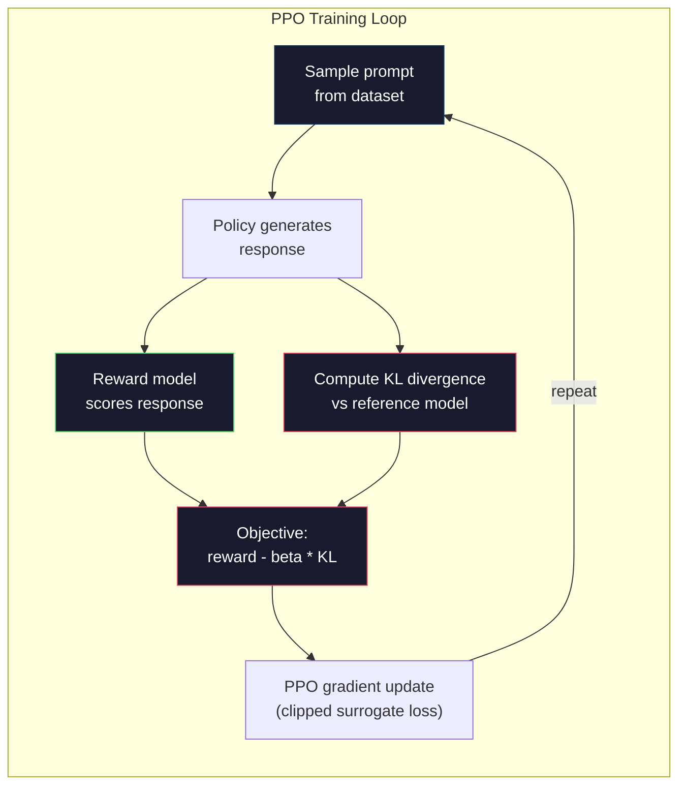

# RLHF: Reward Mode + PPO

> SFT teaches the model to follow instructions. But it didn't tell the model which reaction was better. Two grammatically correct and factually accurate answers may make a significant difference in terms of help. RLHF is how you encode human judgments into the behavior of the model. This made Claude helpful and GPT polite.

**Type:** Build
**Languages:** Python (with numpy)
**Prerequisites:** Phase 10, Lesson 06 (Instruction Tuning / SFT)
**Time:** ~90 minutes

## Learning objectives

- Establish a reward model to rate the quality of responses based on human preferences (choose vs reject).
- Implement the PPO training loop, which optimizes the language model strategy for reward models with KL penalties
- Explain why RLHF requires three models (SFT, reward, policy), and how KL constraints prevent reward hackers
- The effect of RLHF is evaluated by comparing the response quality before and after preference optimization

## This question

If a model is asked to "explain quantum computing", it might produce:

** Response A:** "Quantum computing uses qubits that can be superimposed, which means they can be 0, 1, or both simultaneously." This enables quantum computers to process certain computations much faster than classical computers. The key algorithms include the Shor algorithm for decompressing large numbers and the Grover algorithm for searching unsorted databases.

*Answer B: "Quantum computing is a form of computing that utilizes quantum mechanical phenomena." It was first proposed in the 1980s. Richard Feynman believed that quantum systems could be simulated by quantum computers. Since then, this field has witnessed remarkable development. Many companies are now researching quantum computers. IBM, Google and other companies have made progress. Quantum supremacy was claimed by Google in 2019."

Both answers are actually correct. Both are grammatically correct. Both follow the instructions. But Countermeasure A is clearly better. It is more concise, has richer information and a more reasonable structure. Humans always choose A every time.

SFT is unable to capture this distinction. It trains the model to respond "correctly", but it has no mechanism to say "this response is better than that". It regards each training sample as equally excellent. If both A and B appear in the SFT dataset, the model will learn from both equally.

RLHF has solved this problem. It trains a reward model to predict which reaction humans prefer, and then uses the reward signal to drive the language model to achieve higher-quality output. InstructGPT (the predecessor of ChatGPT) significantly enhanced the usefulness, authenticity and harmlessness of GPT-3 by using RLHF. Internal evaluators of OpenAI preferred the InstructGPT output over the GPT-3 output in 85% of cases, although InstructGPT was 135 times smaller than GPT-3 (13 b versus 175B parameters).

## This concept

### Three stages

RLHF is not a single training session. This is a pipeline composed of three consecutive stages, each of which is built on the foundation of the previous one.

*Phase One: SFT. The basic model of training instruction-response pairs (Lesson 06). This gives you a model to follow the instructions, but you don't know which reaction is better than the others.

*Phase 2: Reward Model. Collect human preference data: Show the annotator two responses to the same prompt and ask, "Which one is better?" Train a model to predict these preferences. The reward model takes (prompts, responses) as input and outputs a scalar score.

*Phase Three: PPO. Generate training signals for the language model using the reward model. The language model generates responses, the reward model scores the responses, and the PPO updates the language model to generate responses with higher scores. KL divergence penalty can prevent language models from deviating too far from the SFT checkpoint.

"Mermaid"
Tu Daoming
Subgraph Stage1[" Stage1: SFT "]
B[" Basic Model "] - > S[" SFT Model "]
D[" Instruction data \n (27K cases) "]-> S
Over

Subimage Stage2[" Phase 2: Reward Mode "]
S -> "Generate Response" P[" Preference Pair \n (Hint, winner, loser) "]
H[" Human Annotator "] -- >
P - > R[" Reward Model \nR (Prompt, Response) → Score "]
Over

Subdiagram Phase Three [" Phase Three: PPO "]
S - > > "Initialization Strategy" PI[" Strategy Model \n (Under Optimization) "]
S - > "Frozen as Reference" REF[" Reference Model \n (Frozen SFT) "]
PI - > > "Generate" > RESP[" Respond "]
Please listen -- b>
R - > > "Reward Signal" > PPO[" PPO Update "]
REF -> |"KL penalty"| PPO
PPO -> > "Update" > PI
Over

Style S fill: #1a1a2e, stroke: #51cf66, color: #fff
Style: R Fill: #1a1a2e, Stroke: #e94560, Color: #fff
Style PI fill: #1a1a2e, stroke: #0f3460, color: #fff
Style: REF Fill: #1a1a2e, Stroke: #0f3460, color: #fff
Style PPO fill: #1a1a2e, stroke: #e94560, color: #fff
```

### The Reward Model

The reward model is a language model repurposed as a scorer. Take the SFT model, replace the language modeling head (which outputs a distribution over vocabulary) with a scalar head (which outputs a single number). The architecture is identical up to the final layer.

Input: a prompt concatenated with a response. Output: a single scalar reward score.

Training data is human preference pairs. For each prompt, annotators see two responses and pick the better one. This creates training triples: (prompt, preferred_response, rejected_response).

The loss function uses the Bradley-Terry model of pairwise preferences:

```
Loss = -log (sigmoid (reward (preferred) - reward (rejected)))
```

This is the key equation. `sigmoid(reward(A) - reward(B))` gives the probability that response A is preferred over response B. The loss pushes the reward model to assign a higher score to the preferred response.

Why pairwise comparisons instead of absolute scores? Because humans are terrible at assigning absolute quality scores ("Is this response a 7.3 or a 7.5 out of 10?") but very good at relative comparisons ("Is A better than B?"). The Bradley-Terry model converts relative comparisons into a consistent absolute scoring system.

**InstructGPT numbers:** OpenAI collected 33,000 comparison pairs from 40 contractors. Each comparison took about 5 minutes. That's 2,750 hours of human labor for the reward model training data.

### PPO: Proximal Policy Optimization

PPO is a reinforcement learning algorithm. In RLHF, the "environment" is the reward model, the "agent" is the language model, and the "action" is generating a token.

The objective:

```
Maximization: E[R (prompt, response)] -beta * KL (strategy reference)
```

The first term pushes the model to generate high-reward responses. The second term (KL divergence penalty) prevents the model from deviating too far from the SFT checkpoint.

Why the KL penalty? Without it, the model finds degenerate solutions. The reward model is trained on a finite dataset of human preferences. It has blind spots. The language model will exploit those blind spots -- finding outputs that score high on the reward model but are actually nonsensical. Classic examples:

- Repeating "I'm so helpful and harmless!" scores high on helpfulness/harmlessness reward models
- Producing verbose, formal-sounding but empty responses that pattern-match to "high quality"
- Exploiting specific phrases that happened to correlate with high reward in the training data

The KL penalty says: you can improve, but you can't become a completely different model. Stay close to the SFT version, which was already reasonable. Wander too far and the KL cost dominates the reward.

**InstructGPT numbers:** PPO training used lr=1.5e-5, KL coefficient beta=0.02, 256K episodes (prompt-response pairs), and 4 PPO epochs per batch. The entire RLHF pipeline took several days on a cluster of GPUs.



### The detailed goals of PPO

PPO uses "Cut proxy targets" to prevent excessive updates. The ratio between the probabilities of the new strategy and the old strategy is trimmed to the range of [1 - epsilon, 1 + epsilon], where epsilon is typically 0.2.

```
ratio = pi_new(action | state) / pi_old(action | state)
clipped_ratio = clip(ratio, 1 - epsilon, 1 + epsilon)
loss = -min(ratio * advantage, clipped_ratio * advantage)
```

The dominance function estimates how much better the current response is than the expected quality. At RLHF

```
advantage = reward(prompt, response) - baseline
```

The baseline is usually the average reward of the most recent responses. Positive advantage means that the response is better than the average level. A negative advantage means the situation is even worse. PPO increases the probability of above-average reactions and reduces the probability of above-average reactions.

This kind of editing can prevent catastrophic updates. If a single reaction receives an exceptionally high reward, the proportion of uncut may be very large, causing the model to dramatically shift towards that reaction. Cap update to maintain training stability.

### Reward hackers

The dark side of RLHF. Language models are optimized for reward models, which are imperfect representatives of human preferences. As language models perform better and better in maximizing rewards, they start to exploit the weaknesses of reward models.

Common failure modes

| Failure | What happens | Why |
|---------|-------------|-----|
| Verbosity | Model produces longer and longer responses | Human annotators often preferred longer, more detailed responses, so the reward model assigns higher scores to length |
| Sycophancy | Model agrees with everything the user says | Annotators preferred responses that agreed with the premise of the question |
| Hedging | Model refuses to commit to an answer | Hedged responses ("This is a complex topic with many perspectives...") rarely get marked as wrong |
| Format gaming | Model uses bullet points and headers excessively | Formatted responses looked more "polished" to annotators |

Mitigation strategies: Stronger KL penalties (to prevent the model from deviating to a level sufficient to exploit weaknesses), training reward models on adversarial examples (to patch known failure patterns), and using multiple reward models with different architectures (more difficult to crack simultaneously).

### A genuine RLHF pipe

| Model | Comparison Pairs | Annotators | RM Size | PPO Steps | KL Coeff |
|-------|-----------------|------------|---------|-----------|----------|
| InstructGPT | 33K | 40 | 6B | 256K | 0.02 |
| Llama 2 Chat | ~1M | undisclosed | 70B | undisclosed | 0.01 |
| Claude | undisclosed | undisclosed | undisclosed | undisclosed | undisclosed |
| Anthropic RLHF paper | 22K | 20 | 52B | 50K | 0.001 |

Anthropic's 2022 paper trained a 52B reward model in 22,000 comparisons. Larger reward models generate more reliable signals, which makes PPO training more stable. It is risky to train a large language model with a small reward model - the reward model does not have sufficient ability to capture the subtle differences between good and bad responses.

## Build it

### Step 1: Synthesize preference data

In production, manual annotators create preference data. We will create composite pairs where the "preferred" response is objectively better (more concise, more accurate, and more helpful).

”“python
Import numpy as np

Preference_data = [
{
What is the capital of France?
"First choice" : "The capital of France is Paris."
"Refuse" : "France is a country in Europe." It has many cities. The capital is Paris. Paris is famous for the Eiffel Tower.
}
{
"prompt" : "Explain gravity in one sentence."
"First choice" : "Gravity is the force that attracts objects with mass to each other."
"Rejected" : "Gravity is something that when you put them down, it makes them fall." "
}
{
Hint: "What is 15 multiplied by 7?"
"preferred" : "15 * 7 = 105."
"Rejected" : "Let me think about it." 15 multiplied by 7. 10 multiplied by 7 equals 70, and 5 multiplied by 7 equals 35, so the answer might be around 105.
}
{
"prompt" : "State three programming languages." "
"preferred" : "Python, Rust, and TypeScript."
"Rejection" : "There are many programming languages." Some popular ones include various languages, such as Python and others.
}
{
When did World War II end?
"First Choice" : "World War II ended in 1945."
World War II was a major global conflict. It involves many countries. The war ended in the mid-1940s, especially in 1945.
}
{
"prompt" : "Define Machine Learning"
"Preferred" : "Machine learning is a field where algorithms learn patterns from data and make predictions without explicit programming." "
"Refuse" : "Machine learning is a form of artificial intelligence." AI stands for Artificial Intelligence. Machine learning uses data to learn."
}
]
```

The preferred responses are concise and direct. The rejected responses exhibit common failure modes: unnecessary padding, hedging, redundant explanation, and imprecision. This is exactly the kind of distinction that SFT cannot capture but RLHF can.

### Step 2: Reward Model Architecture

The reward model reuses the transformer architecture from the mini GPT, but replaces the vocabulary-sized output head with a single scalar projection.

```python
import sys
import os
sys.path.insert(0, os.path.join(os.path.dirname(__file__), "..", "..", "04-pre-training-mini-gpt", "code"))
from main import MiniGPT, LayerNorm, Embedding, TransformerBlock


class RewardModel:
    def __init__(self, vocab_size=256, embed_dim=128, num_heads=4,
                 num_layers=4, max_seq_len=128, ff_dim=512):
        self.embedding = Embedding(vocab_size, embed_dim, max_seq_len)
        self.blocks = [
            TransformerBlock(embed_dim, num_heads, ff_dim)
            for _ in range(num_layers)
        ]
        self.ln_f = LayerNorm(embed_dim)
        self.reward_head = np.random.randn(embed_dim) * 0.02

    def forward(self, token_ids):
        seq_len = token_ids.shape[-1]
        mask = np.triu(np.full((seq_len, seq_len), -1e9), k=1)

        x = self.embedding.forward(token_ids)
        for block in self.blocks:
            x = block.forward(x, mask)
        x = self.ln_f.forward(x)

        last_hidden = x[:, -1, :]
        reward = last_hidden @ self.reward_head

        return reward
```

The reward model acquires the hidden state of the "last" marked position and projects it onto the scalar. Why is it the last token? Because the causal attention mask means that the last position has noticed every previous mark. It has the most complete representation of the entire (prompt, response) sequence.

### Step 3: Bradley Terry loss

Train the reward model using Bradley Terry paired loss pairs and preference pairs.

”“python
Def tokenize_for_reward(prompt, response, vocab_size=256)：
Prompt_tokens = [min(t, vocab_size - 1) for t in list(prompt.encode("utf-8"))]
Response_tokens = [min(t, vocab_size - 1) for t in list(response.encode("utf-8"))]
prompt_tokens + [0] + response_tokens


def Sigmoid colon (x):
Return np.where (
X >= 0
        1.0 / (1.0 + np.exp(-x))，
np。Exp (x) / （1.0 + np.exp(x)）
）


Def bradley_terry_loss(reward_preferred, reward_rejected)：
Diff = reward_preferred - reward_rejected
log（sigmoid(diff) + 1e-8）
回波损耗


Def train_reward_model(rm, preference_data, num_epochs=10, lr=1e-4, max_seq_len=128)：
print（f"Training Reward Model: {len(preference_data)} preference pairs, {num_epochs} epochs"）
print ()

Loss = []
Accuracy = []

For epochs in range (num_epochs) :
Epoch_loss = 0.0
Epoch_correct = 0
Num_pairs = 0

Index = np.random.permutation（len(preference_data)）

For idx in the index:
Pair = preference_data[idx]

Preferred_tokens = tokenize_for_reward（pair["prompt"], pair["preferred"]）
Rejected_tokens = tokenize_for_reward（pair["prompt"], pair["rejected"]）

Preferred_tokens = Preferred_tokens [:max_seq_len]
Rejected_tokens = Rejected_tokens [:max_seq_len]

Preferred_ids = np.array（preferred_tokens）。（1,1）
Rejected_ids = np.array（rejected_tokens）。（1,1）

R_preferred = rm.forward(preferred_ids)[0]
R_rejected = rm.forward(rejected_ids)[0]

Loss = bradley_terry_loss（r_preferred, r_rejected）

r_preferred > r_rejected：
Epoch_correct += 1

Diff = r_preferred - r_rejected
Grad = sigmoid(diff) - 1.0

rm。Reward_head -= lr * grad * rm. ln_e .forward(
rm.embedding.forward (preferred_ids)
),达到华:“.flatten ()

Epoch_loss += loss
Num_pairs += 1

Avg_loss = epoch_loss / max（num_pairs, 1）
Accuracy = epoch_correct / max（num_pairs, 1）
的损失。追加(avg_loss)
precision .append（）

If epoch % 2 == 0:
print(f" Epoch {Epoch + 1:3d}; Loss: {avg_loss:. {Accuracy: 0.1%}"

Return rm, loss, accuracy
```

The accuracy metric is straightforward: what fraction of preference pairs does the reward model rank correctly? A random model scores 50%. A well-trained reward model on clean data should exceed 70%. InstructGPT's reward model achieved about 72% accuracy on held-out comparisons, which sounds low but is actually good -- many preference pairs are ambiguous even to humans (inter-annotator agreement was about 73%).

### Step 4: Simplified PPO Loop

Full PPO is complex. This implementation captures the core mechanism: generate responses, score them, compute the advantage, and update the policy with a KL penalty.

```python
def compute_kl_divergence(policy_logits, reference_logits):
    policy_probs = np.exp(policy_logits - policy_logits.max(axis=-1, keepdims=True))
    policy_probs = policy_probs / policy_probs.sum(axis=-1, keepdims=True)
    policy_probs = np.clip(policy_probs, 1e-10, 1.0)

    ref_probs = np.exp(reference_logits - reference_logits.max(axis=-1, keepdims=True))
    ref_probs = ref_probs / ref_probs.sum(axis=-1, keepdims=True)
    ref_probs = np.clip(ref_probs, 1e-10, 1.0)

    kl = np.sum(policy_probs * np.log(policy_probs / ref_probs), axis=-1)
    return kl.mean()


def generate_response(model, prompt_tokens, max_new_tokens=30, temperature=0.8, max_seq_len=128):
    tokens = list(prompt_tokens)

    for _ in range(max_new_tokens):
        context = np.array(tokens[-max_seq_len:]).reshape(1, -1)
        logits = model.forward(context)
        next_logits = logits[0, -1, :]

        next_logits = next_logits / max(temperature, 1e-8)
        probs = np.exp(next_logits - next_logits.max())
        probs = probs / probs.sum()
        probs = np.clip(probs, 1e-10, 1.0)
        probs = probs / probs.sum()

        next_token = np.random.choice(len(probs), p=probs)
        tokens.append(int(next_token))

    return tokens


def copy_model_weights(source, target):
    target.embedding.token_embed = source.embedding.token_embed.copy()
    target.embedding.pos_embed = source.embedding.pos_embed.copy()
    target.ln_f.gamma = source.ln_f.gamma.copy()
    target.ln_f.beta = source.ln_f.beta.copy()
    for s_block, t_block in zip(source.blocks, target.blocks):
        t_block.attn.W_q = s_block.attn.W_q.copy()
        t_block.attn.W_k = s_block.attn.W_k.copy()
        t_block.attn.W_v = s_block.attn.W_v.copy()
        t_block.attn.W_out = s_block.attn.W_out.copy()
        t_block.ffn.W1 = s_block.ffn.W1.copy()
        t_block.ffn.W2 = s_block.ffn.W2.copy()
        t_block.ffn.b1 = s_block.ffn.b1.copy()
        t_block.ffn.b2 = s_block.ffn.b2.copy()
        t_block.ln1.gamma = s_block.ln1.gamma.copy()
        t_block.ln1.beta = s_block.ln1.beta.copy()
        t_block.ln2.gamma = s_block.ln2.gamma.copy()
        t_block.ln2.beta = s_block.ln2.beta.copy()


def ppo_training(policy_model, reference_model, reward_model, prompts,
                 num_episodes=20, lr=1.5e-5, kl_coeff=0.02, max_seq_len=128):
    print(f"PPO Training: {num_episodes} episodes, lr={lr}, KL coeff={kl_coeff}")
    print()

    rewards_history = []
    kl_history = []

    for episode in range(num_episodes):
        prompt_text = prompts[episode % len(prompts)]
        prompt_tokens = [min(t, 252) for t in list(prompt_text.encode("utf-8"))]

        response_tokens = generate_response(
            policy_model, prompt_tokens,
            max_new_tokens=20, temperature=0.8, max_seq_len=max_seq_len
        )

        response_ids = np.array(response_tokens[:max_seq_len]).reshape(1, -1)
        reward = reward_model.forward(response_ids)[0]

        policy_logits = policy_model.forward(response_ids)
        ref_logits = reference_model.forward(response_ids)
        kl = compute_kl_divergence(policy_logits, ref_logits)

        total_reward = reward - kl_coeff * kl

        rewards_history.append(float(reward))
        kl_history.append(float(kl))

        for block in policy_model.blocks:
            update_scale = lr * total_reward
            block.ffn.W1 += update_scale * np.random.randn(*block.ffn.W1.shape) * 0.01
            block.ffn.W2 += update_scale * np.random.randn(*block.ffn.W2.shape) * 0.01

        if episode % 5 == 0:
            avg_reward = np.mean(rewards_history[-5:]) if rewards_history else 0
            avg_kl = np.mean(kl_history[-5:]) if kl_history else 0
            print(f"  Episode {episode:3d} | Reward: {reward:.4f} | KL: {kl:.4f} | "
                  f"Avg Reward: {avg_reward:.4f}")

    return policy_model, rewards_history, kl_history
```

Core cycle: (1) Sample the prompts, (2) Generate responses, (3) score the prompts using the reward model, (4) Calculate the KL bias based on the frozen reference, (5) calculate the adjusted reward (reward minus KL penalty), (6) update the strategy. As the policy deviates from the reference, the KL penalty will increase, automatically preventing and rewarding hacking behavior.

### Step 5: Comparison of reward points

After RLHF, the response score of the strategy model on the reward model should be higher than that of the original SFT model.

”“python
Def compare_models(sft_model, rlhf_model, reward_model, prompt, max_seq_len=128) :
Print (" Model Comparison (Reward Points) ")
Print ("-" * 60
Print (f "{" hint" :< 35}{SFT's :> 10}{" RLHF ":> 10}")
Print (+ - * 55)

Sft_total = 0.0
Rlhf_total = 0.0

提示：
Prompt_tokens = [min(t, 252) for t in list(prompt.encode("utf-8"))]

Sft_response = generate_response（）
sft_model prompt_tokens,
Max_new_tokens =20，中文=0.6,max_seq_len=max_seq_len
）
Rlhf_response = generate_response（）
rlhf_model prompt_tokens,
Max_new_tokens =20，中文=0.6,max_seq_len=max_seq_len
）

Sft_ids = np.array (sft_response[:max_seq_len]). Reshaping (1,1
Rlhf_ids = np.array (rlhf_response[:max_seq_len]). Reshaping (1,1

Sft_reward = reward_model.forward(sft_ids .forward
Rlhf_reward = reward_model.forward(rlhf_ids .forward

Sft_total += sft_reward
Rlhf_total += rlhf_reward

Truncated_prompt = prompt[:33] + ".." if len(prompt) > 35 else prompt
Print （f" {truncated_prompt:<35} {sft_reward:>10.4f} {rlhf_reward:>10.4f}"）

N = len (hint)
Print (+ - * 55)
Print (f "{" average" : < 35} {sft_total/n: > 10.4 f} {rlhf_total/n: > 10.4 f} ")

Return sft_total/n, rlhf_total/n
```

## Use It

### Full RLHF Pipeline Demo

```python
if __name__ == "__main__":
    np.random.seed(42)

    print("=" * 70)
    print("RLHF PIPELINE: REWARD MODEL + PPO")
    print("=" * 70)
    print()

    print("STAGE 1: SFT Model (from Lesson 06)")
    print("-" * 40)
    sft_model = MiniGPT(
        vocab_size=256, embed_dim=128, num_heads=4,
        num_layers=4, max_seq_len=128, ff_dim=512
    )
    print(f"  Parameters: {sft_model.count_parameters():,}")
    print()

    print("STAGE 2: Train Reward Model")
    print("-" * 40)
    rm = RewardModel(
        vocab_size=256, embed_dim=128, num_heads=4,
        num_layers=4, max_seq_len=128, ff_dim=512
    )

    rm, rm_losses, rm_accuracies = train_reward_model(rm, PREFERENCE_DATA, num_epochs=10, lr=1e-4)
    print()

    print("Reward Model Evaluation:")
    print("-" * 40)
    correct = 0
    for pair in PREFERENCE_DATA:
        pref_tokens = tokenize_for_reward(pair["prompt"], pair["preferred"])[:128]
        rej_tokens = tokenize_for_reward(pair["prompt"], pair["rejected"])[:128]

        r_pref = rm.forward(np.array(pref_tokens).reshape(1, -1))[0]
        r_rej = rm.forward(np.array(rej_tokens).reshape(1, -1))[0]

        if r_pref > r_rej:
            correct += 1
        print(f"  Preferred: {r_pref:+.4f} | Rejected: {r_rej:+.4f} | {'Correct' if r_pref > r_rej else 'Wrong'}")

    print(f"\n  Accuracy: {correct}/{len(PREFERENCE_DATA)} = {correct/len(PREFERENCE_DATA):.1%}")
    print()

    print("STAGE 3: PPO Training")
    print("-" * 40)

    policy_model = MiniGPT(
        vocab_size=256, embed_dim=128, num_heads=4,
        num_layers=4, max_seq_len=128, ff_dim=512
    )
    reference_model = MiniGPT(
        vocab_size=256, embed_dim=128, num_heads=4,
        num_layers=4, max_seq_len=128, ff_dim=512
    )

    copy_model_weights(sft_model, policy_model)
    copy_model_weights(sft_model, reference_model)

    train_prompts = [pair["prompt"] for pair in PREFERENCE_DATA]

    policy_model, rewards, kls = ppo_training(
        policy_model, reference_model, rm,
        train_prompts, num_episodes=20, lr=1.5e-5, kl_coeff=0.02
    )
    print()

    print("=" * 70)
    print("COMPARISON: SFT vs RLHF")
    print("=" * 70)
    print()

    eval_prompts = [
        "What is the capital of France?",
        "Explain gravity.",
        "Name three programming languages.",
    ]

    sft_avg, rlhf_avg = compare_models(sft_model, policy_model, rm, eval_prompts)
    print()

    print("=" * 70)
    print("KL DIVERGENCE ANALYSIS")
    print("=" * 70)
    print()

    if kls:
        print(f"  Initial KL: {kls[0]:.4f}")
        print(f"  Final KL:   {kls[-1]:.4f}")
        print(f"  Max KL:     {max(kls):.4f}")
        kl_threshold = 0.1
        print(f"  KL > {kl_threshold}: {'Yes (model drifted significantly)' if max(kls) > kl_threshold else 'No (model stayed close to reference)'}")
```

## This ship

This lesson generates the given target behaviors (usefulness, coding ability, security), and it will produce data collection protocols, annotator guidelines, and reward model evaluation criteria.

## Practice

1. Modify the reward model to use the average of all hidden states, not just the last position. It's relatively accurate. The average pooling method assigns equal weights to each tag, while the final position method relies on causal attention to the aggregated information. Test six preference pairs and report which method scores with higher accuracy.

2. Implement the calibration of the reward model. After training, run all preference pairs through the reward model and calculate: (a) the average reward of the preferred response, (b) the average reward of the rejection response, and (c) the margin (preferred minus rejection). A well-calibrated model should have a significant margin. Then add four new preference pairs and check if the margins retain unseen data.

3. Simulate rewarding hacking behavior. Create a reward model to provide high scores for long responses (reward = len (response) / 100). Run the PPO using this flawed reward model and observe that the strategy model generates increasingly long repetitive outputs. Then add a 0.1 KL penalty and show that it can prevent degenerate behavior.

4. Implement multi-objective rewards. Train two reward modes - one for assistance and the other for simplicity. Combine them as R = 0.7 * R_helpful + 0.3 * r_ concisely. It indicates that the response generated by the comprehensive goal is both beneficial and concise, avoiding the lengthy trap of a single beneficial reward.

5. Compare different KL coefficients. Run PPO with beta=0.001 (too low, rewarding hackers), beta=0.02 (standard), and beta=0.5 (too high, no learning). Draw the reward curve and KL curve for each item. When beta=0.02 is running, a stable improvement in rewards should be demonstrated under a limited KL.

## Key terms

| Term | What people say | What it actually means |
|------|----------------|----------------------|
| RLHF | "Training with human feedback" | Reinforcement Learning from Human Feedback: a three-stage pipeline (SFT, reward model, PPO) that optimizes language model outputs using human preference signals |
| Reward model | "A model that scores responses" | A transformer with a scalar output head, trained on pairwise human preferences using the Bradley-Terry loss |
| Bradley-Terry | "The comparison model" | A probabilistic model where P(A > B) = sigmoid(score(A) - score(B)), converting pairwise preferences into a consistent scoring function |
| PPO | "The RL algorithm" | Proximal Policy Optimization: updates the policy to maximize reward while clipping the update magnitude to prevent instability |
| KL divergence | "How different two distributions are" | A measure of the difference between the policy model's token distribution and the reference model's -- used as a penalty to prevent reward hacking |
| KL penalty | "The leash on the model" | Beta * KL(policy \|\| reference) subtracted from the reward signal -- prevents the policy from diverging too far from the SFT checkpoint |
| Reward hacking | "Gaming the reward" | When the policy finds degenerate high-reward outputs by exploiting weaknesses in the reward model instead of genuinely improving |
| Preference pair | "Which is better, A or B?" | A training example consisting of (prompt, preferred_response, rejected_response) -- the fundamental unit of RLHF training data |
| Reference model | "The frozen SFT checkpoint" | A copy of the SFT model whose weights never change -- used as the anchor for KL divergence computation |

## Further reading

- Z0
- Z0
- Z0
- Z0
- Z0