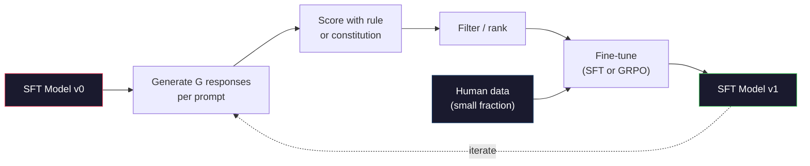

# Constitutional Artificial Intelligence and self-improvement

> RLHF requires human participation. Constitutional artificial intelligence has replaced most of it with the model itself. List a series of principles, have the model criticize its own output based on these principles, and train it according to these criticisms. DeepSeek-R1 further advanced this in 2025: enabling the model to generate millions of inference trajectories, scoring them with rules, and running GRPO on the results. Most of the "alignment work" in the 2026 frontier models is model alignment itself. This lesson constructs two cycles.

**Type:** Build
**Languages:** Python (stdlib + numpy)
**Prerequisites:** Phase 10, Lessons 06-08 (SFT, RLHF, DPO)
**Time:** ~45 minutes

## Learning objectives

- Realize the two-stage cycle of constitutional AI: self-criticism + self-correction, and then conduct preference training on the corrected version
- Export the GRPO objective (group correlation strategy optimization of DeepSeek-R1) and compare it with the value function baseline of PPO
- Generate verifiable inference traces using rule-based result rewards and score them without a separate reward model
- Decide when self-improvement outweighs human preference for data and when it collapses into pattern search

## This question

You established RLHF in Lesson 07 and DPO in Lesson 08. Both rely on the same expensive input: human preference pairs. Anthropic's instructgpt era pipeline utilized approximately 33,000 comparisons. "Alpaca 2" used over 1.5 million. Claude uses it more. These data are slow, expensive, and biased towards whatever the annotators happen to believe when making the ratings.

The 2022 Constitutional Artificial Intelligence Document raises a simple question. What if the model generates preference labels by itself? Give it a written list of principles - the "Constitution" - and let it criticize its own response. Criticism has become a training signal.

In 2024, DeepSeek took this idea a step further. They show that for any task with verifiable results (mathematics with known answers, code that passes tests or fails, or games that win or lose), you can completely skip criticism. Generate many candidate solutions. Score each one with a deterministic rule. Run the policy gradient algorithm for rewards. DeepSeek-R1 was trained in this way, with almost no human preference data, and its inference performance reached level 1.

These two cycles - constitutional artificial intelligence for subjective behavior and rule-based reinforcement learning for verifiable behavior - are the main alignment methods in 2026. The human preference budget that was previously used for RLHF now pays for a much smaller step: choosing the constitution and choosing the reward rules.

## This concept

### Constitutional AI Cycle

Bai et al. (2022) divided pipelines into two stages.

*Phase 1: Supervised Learning Based on AI Feedback (SL-CAI). Start with a useful but potentially harmful SFT model. Prompt it with potentially harmful requests. For each response, it is required that "the same model" criticize its response based on constitutional principles and then modify it. Make minor adjustments to the revised responses. The dataset is (prompt, revised_response) pairs.

*Phase 2: Reinforcement Learning from AI Feedback (RLAIF). The sample of the answers is correct. Ask which model is more constitutional. A reward model was trained with pairwise preferences. Then use this reward to run a PPO or DPO on the model. The key difference from RLHF is that the preference comes from the model rather than from humans.

"Mermaid"
Tu Daoming
Subgraph SL[" Phase One: SL-CAI "]
P1[" Harmful Warning "] - > R1[" Initial Reaction \n (Possibly Harmful) "]
R1 - > C1[" Model Criticism \ Non-Violation of Principles "]
C1 - > REV[" Model Correction \nresponse "]
REV—> SFT["SFT on\n(prompt, revised)"]
Over

Subgraph RL[" Phase Two: RLAIF "]
P2[" Hint "] - > S1[" Sample Answer A "]
P2 - > S2[" Sample Response B "]
S1 - > J[" Model Judge \nA vs B Adopted Constitution "]
S2 -> j
J - > RM[" Preference Dataset "]
RM -> TRAIN[" DPO/PPO Training "]
Over

Sl - b> rl

Style P1: Fill: #1a1a2e, Stroke: #e94560, Color: #fff
Style: #1a1a2e, Stroke: #51cf66, Color: #fff
Style: P2, Fill: #1a1a2e, Stroke: #e94560, Color: #fff
Style: TRAIN Fill: #1a1a2e, Stroke: #51cf66, color: #fff
```

The constitution is the lever. Anthropic's original had 16 principles (later expanded). A principle reads like "Please choose the response that is least likely to be objectionable to anyone from a wide variety of cultural backgrounds." You pick the principle for each step, sometimes at random, sometimes based on the prompt category.

### What the Constitution Actually Does

The constitution moves the alignment contract from *data* to *text*. Changing behavior under RLHF means re-labeling thousands of pairs. Changing behavior under CAI means editing a paragraph. This is the main practical win.

It has a cost. The model's self-judgments are only as good as its starting calibration. If the SFT model has blind spots -- for instance, it cannot recognize manipulative phrasing -- the critique step inherits those blind spots. CAI compresses the alignment loop but cannot amplify signal past the base model's ceiling. This is why every production CAI pipeline still uses some human preference data, typically 5-10% the volume of pure RLHF.

### GRPO: Group-Relative Policy Optimization

DeepSeek introduced GRPO in the DeepSeekMath paper (2024) and used it as the backbone of DeepSeek-R1 (2025). GRPO is a variant of PPO that removes the value function.

Recall PPO's objective (from Lesson 07):

```
L_PPO = E [min (r(θ)*, (r(θ),1-eps, 1 + eps) *)]
```

where `A` is the advantage, typically estimated with GAE using a learned value network `V(s)`. The value network is a second model the same size as the policy. It doubles memory and introduces its own training loop.

GRPO throws out the value function. For each prompt, it samples a group of G responses (typically G=16 or 64). The reward for each response is computed, then normalized within the group:

```
ai = (r_i -意味着(r_1,…),r_G)) /性病(r_1,…r_G)
```

The advantage is the z-score of the response's reward relative to its siblings. No value function. The group acts as its own baseline.

```
L_GRPO = E[min(r(theta) * A_group, clip(r(theta), 1-eps, 1+eps) * A_group)] - beta * KL（pi || pi_ref）
```

The KL penalty against the reference model is still there, same as PPO. The clip ratio is still there. What's gone is the separate critic.

### Why GRPO Matters for Reasoning

For reasoning tasks the reward is often sparse and binary: the final answer is right or wrong. A value function trained on sparse binary rewards is a waste -- it cannot learn useful intermediate estimates because nearly every state has the same expected return until the final step. GRPO's group normalization gives you an immediate relative signal: among 16 attempts on the same math problem, which attempts were above average for this problem?

This is the exact shape of signal you get from rule-based rewards:

- **Math**: sympy or a symbolic checker decides if the final answer matches.
- **Code**: a test suite decides pass/fail.
- **Formatting**: a regex decides whether the answer is in the required XML tag.
- **Multi-step proofs**: a proof assistant (Lean, Coq) decides validity.

DeepSeek-R1-Zero was trained with only two rewards: accuracy on math benchmarks and format compliance (answer inside `<answer>` tags). No human preferences. No critic model. The "aha moment" the DeepSeek paper described -- the model spontaneously learning to self-check and backtrack -- emerged from GRPO on sparse rule rewards alone.

### Process Reward Models vs Outcome Reward Models

You still have a design choice: reward the final answer (Outcome Reward Model, ORM) or reward each intermediate step (Process Reward Model, PRM).

| Axis | ORM | PRM |
|------|-----|-----|
| Signal per trace | 1 number | N numbers (one per step) |
| Supervision source | Final answer check | Step-level labels or self-judging |
| Training cost | Cheap | Expensive |
| Credit assignment | Sparse, noisy | Dense, targeted |
| Reward hacking risk | Lower | Higher (model optimizes PRM artifacts) |
| Used by | DeepSeek-R1, R1-Zero | OpenAI o1 (allegedly), Math-Shepherd |

The 2024-2025 consensus was that ORMs plus GRPO scale better than PRMs. PRMs are more sample-efficient per token but require expensive step-labeled data and tend to collapse into shortcut behaviors (writing steps that look good to the PRM but don't advance the proof). For most teams, ORM + GRPO is the first thing to try.

### Self-Improvement: The Feedback Multiplier

Once you have the two-loop pattern (critique/revise and group-relative RL with rule rewards), you can chain them.

1. Start with an SFT model.
2. Generate many candidate responses per prompt.
3. Score them with a rule-based reward (for verifiable tasks) or a constitutional critic (for subjective tasks).
4. Keep the top candidates as new SFT data or as preference pairs.
5. Fine-tune. Go to step 2 with the improved model.

DeepSeek called this "rejection sampling fine-tuning" when applied after R1-Zero. Anthropic called an earlier version of this "constitutional AI distillation." The pattern is: each iteration amplifies the signal already in the model. It does not add new signal. If the model cannot solve problem class X at all, no amount of self-improvement will create that capability.

The danger is mode collapse. Self-generated data is always a narrower distribution than the training corpus. After 3-5 rounds of self-distillation, models typically lose diversity on creative tasks, become overconfident, and exhibit characteristic "AI voice" (repeated phrasings, formulaic structure). Production pipelines mix self-generated data with a small fraction of fresh human data to keep the distribution honest.



### When to use what

- ** Pure CAI** : Subjective behavior (tone, security, refusal style). You have a definite constitution. You don't have a clear and verifiable result.
- **GRPO + ORM** : Verifiable tasks (mathematics, code, structured extraction). You can check the correctness at a low cost. Rewards are sparse and binary.
- ** Self-generated paired DPO **: Hybrid. Generate preference pairs using construction, and then train with DPO (Lesson 08) instead of PPO/GRPO.
- ** Complete RLHF** : It is still applicable when you need to make multi-objective trade-offs that cannot be expressed by a single rule or a brief constitution.

Most of the border pipelines in 2026 will be four pipelines. Security Layer CAI GRPO is qualified for post-inference training. DPO is the priority for polishing. Small RLHF resists the residual behavior of other methods.

## Build it

The code implements three things using pure Python + numpy. Constitutional AI self-criticism cycle. A simple arithmetic reward checker based on rules. A minimal GRPO trainer runs on a very small language model in Lesson 04.

### The first step: Constitution

A series of principles. In the production environment, each line is richer and has category labels. For lessons, keep them brief.

”“python
Constitution = [
The answer must be direct to the question and not ambiguous.
The reply must not contain unnecessary fillers or additives.
If the answer to the question is only one number, then clearly state the number.
Responses must not reject reasonable and good-faith requests.
]
```

### Step 2: Self-Critique and Revise

In a real system the model itself critiques. In the lesson we simulate a critic with a handwritten rubric so the pipeline runs without an LLM call.

```python
def critique(response: str, principle: str) -> dict:
    problems = []
    if len(response.split()) > 40 and "plainly" in principle:
        problems.append("answer buried in extra prose")
    if response.strip().lower().startswith(("i can't", "i cannot", "as an ai")):
        problems.append("unwarranted refusal")
    if response.count(",") > 4:
        problems.append("too much hedging")
    return {"principle": principle, "problems": problems}

def revise(response: str, critique_result: dict) -> str:
    if "answer buried" in " ".join(critique_result["problems"]):
        return response.split(".")[-2].strip() + "."
    if "unwarranted refusal" in " ".join(critique_result["problems"]):
        return "Here is the answer: " + response.split(":")[-1].strip()
    return response
```

The correction function is a substitute. For a true master of Laws, this will be the second tip: "Take criticism into account and rewrite the answer."

### Step 3: Rule-based rewards

For verifiable tasks, completely replace the critics. This inspector grades the arithmetic answers.

”“python
Imported reinsurance

Def reward_math (hint: str, response: str) -> float:
Give it a try
Expectation = eval (hint). replace (" What is ", "").replace ("?") "").strip()
Except for the exceptions
Return 0.0
number = re.findall (r"-?\d+", response)
If it is not a number:
Return 0.0
If int(numbers[-1]) == expected, return 1.0

Def reward_format(response: str) -> float：
搜索。搜索（r"<answer> "）：*</answer>", response) else 0.0
```

Two deterministic rules. No training data. No human labels. The combined reward is `reward_math + 0.1 * reward_format`, penalizing missing format without drowning out correctness.

### Step 4: Group-Relative Advantage

Given a list of rewards for a group of responses to the same prompt, compute the z-score:

```python
import numpy as np

def group_relative_advantage(rewards: list[float]) -> np.ndarray:
    r = np.array(rewards, dtype=float)
    if r.std() < 1e-8:
        return np.zeros_like(r)
    return (r - r.mean()) / (r.std() + 1e-8)
```

If each sample in the group has the same reward, the advantage is zero and there is no gradient signal flow. This is a feature. It tells you that the prompt is either easy to solve or difficult to solve for the current strategy, and the step should skip it.

### Step 5:GRPO update

One step, the symbol gradually changes. In production, this will be a torch passing through automatically. Here we directly display the update rules.

”“python
defgrpo_step (policy_logprobs: np) ref_logprobs: np.narray;
Advantage :np narray, beta: float = 0.01, clip_eps: float = 0.2)
Ratio = np. Exp (policy_logprobs-ref_logprobs)
Uncut = Ratio * advantage
Clipped = np. Clip (ratio, 1-cliP_eps, 1 + clip_eps) * advantages
Policy_loss = -np. The lowest (uncut, cut).mean ()
Kl = (ref_logprobs - policy_logprobs).mean ()
Total_loss = policy_loss + beta * kl
Return to {
"policy_loss" : Floating (policy_loss)
"Kuala Lumpur" : Floating (Kuala Lumpur
"total_loss" : Floating (total_loss)
"mean_ratio" : floating (ratios.mean ())
}
```

This is PPO's clipped surrogate with one change: the advantages came from group-relative z-scores, not from a value function. No V(s) to train. No GAE. The group is the baseline.

### Step 6: Self-Improvement Round

Tie the pieces together. Sample a group, score each response with the rule, compute advantages, report the metrics you would feed into a real optimizer.

```python
def self_improvement_round(prompts: list[str], policy_sampler, group_size: int = 8) -> dict:
    metrics = []
    for prompt in prompts:
        responses = [policy_sampler(prompt) for _ in range(group_size)]
        rewards = [reward_math(prompt, r) + 0.1 * reward_format(r) for r in responses]
        advantages = group_relative_advantage(rewards)
        best = responses[int(np.argmax(rewards))]
        metrics.append({
            "prompt": prompt,
            "mean_reward": float(np.mean(rewards)),
            "best_reward": float(np.max(rewards)),
            "std_reward": float(np.std(rewards)),
            "best_response": best,
            "advantages": advantages.tolist(),
        })
    return {"per_prompt": metrics,
            "overall_mean": float(np.mean([m["mean_reward"] for m in metrics]))}
```

## Use it

Running the CAI loop generates a small group of (initial, modified) pairs, which you can fine-tune. The GRPO loop generates per-prompt reward statistics for arithmetic problems, showing how group relative dominance enables weak samplers to improve without value functions or human labels.

Numbers are not the key point. In the actual operation of the trained model, the mean reward should rise over multiple rounds, the reward standard should remain positive (if it crashes to zero, the strategy has collapsed and you should stop), and the reference KL should grow slowly. These three curves - average reward rising, standard stable, KL bounded - are the production health checks of GRPO or CAI pipelines.

## This ship

This lesson generates a self-improvement pipeline that provides it with suggestions, and it will enforce non-negotiable thresholds: a actually verifiable reward rule, a KL budget corresponding to the reference, a diversity bottom line, and a human data quota. It refuses to approve a cycle that claims to be "purely self-improvement" without any external basis.

## Practice

1. Replace the handwritten comment in Step 2 with an LLM phone. Use any local chat model. Measure the frequency of the actual improvement responses to criticism and revision, rather than maintaining them unchanged.

2. Add a third constitutional principle regarding fact-finding. Run the pipeline on the prompt that requires a fact statement (in capital letters, date), and measure how many times the modification deletes the fact error instead of introducing a new one.

3. Implement DPO on the preference pairs generated in CAI stage 2. Take 20 prompts, generate two responses for each prompt, let the critics choose a winner for each pair, and then run the DPO loss of Lesson 08. Compare with the GRPO path on the same data.

4. Add entropy regularization to the GRPO target. The term measures whether it delays pattern collapse in five rounds of self-improvement.

5. Build a process reward scorekeeper for a two-step arithmetic problem. Given "What is (3+4)*5?" The model must show the intermediate step 3+4=7. Score the intermediate steps and the final answer separately, and compare the PRM-weighted GRPO with the pure ORM-weighted GRPO for 10 rounds.

## Key terms

| Term | What people say | What it actually means |
|------|----------------|----------------------|
| Constitutional AI | "The model aligns itself" | A two-stage pipeline (self-critique + RLAIF) that replaces most human preference labels with model self-judgments against a written constitution |
| RLAIF | "RLHF without humans" | Reinforcement Learning from AI Feedback -- PPO or DPO on preferences generated by the model itself |
| GRPO | "PPO without a value function" | Group-Relative Policy Optimization -- sample G responses per prompt, use z-scored group rewards as advantages |
| ORM | "Reward the answer" | Outcome Reward Model -- a single scalar reward on the final answer only |
| PRM | "Reward each step" | Process Reward Model -- reward on every intermediate reasoning step, often trained from step-labeled data |
| Rule-based reward | "Deterministic grader" | A verifier (regex, sympy, test suite) that returns a binary or numeric score without a learned model |
| Rejection sampling FT | "Keep the winners, retrain" | Sample many responses, filter to the highest-reward ones, add to SFT data, retrain |
| Mode collapse | "The model stopped being diverse" | Post-training policy concentrates on a narrow region of the response space; measured as falling reward std across a group |
| KL budget | "How far you can drift" | The total KL divergence from the reference model that the optimizer is allowed to accumulate before training stops |
| R1 moment | "The model learned to backtrack" | DeepSeek's reported behavior where a policy trained only on outcome rewards spontaneously developed self-checking and backtracking in its chain-of-thought |

## Further reading

- Z0
- Z0
- Z0
- Z0
- Z0
- Z0