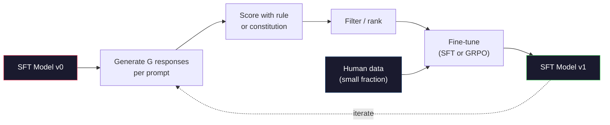

# 宪法人工智能和自我完善

> RLHF需要人的参与。宪法人工智能已经用模型本身取代了它的大部分。列出一系列原则，让模型根据这些原则批评自己的输出，并根据这些批评对其进行训练。DeepSeek-R1在2025年进一步推进了这一点：使模型能够生成数百万个推理轨迹，用规则对它们进行评分，并对结果运行GRPO。2026前沿模型中的大部分“对齐工作”是模型对齐本身。本课构造了两个循环。

**Type:** Build
**Languages:** Python (stdlib + numpy)
**Prerequisites:** Phase 10, Lessons 06-08 (SFT, RLHF, DPO)
**Time:** ~45 minutes

## 学习目标

- 实现宪政AI的自我批评+自我纠错两阶段循环，然后对纠错后的版本进行偏好训练
- 导出GRPO目标（DeepSeek-R1的组关联策略优化），并与PPO的价值函数基线进行比较
- 使用基于规则的结果奖励生成可验证的推理跟踪，并在没有单独奖励模型的情况下对其进行评分
- 决定什么时候自我完善超过了人类对数据的偏好，什么时候它会崩溃为模式搜索

## 这个问题

你在第07课建立了RLHF，在第08课建立了DPO。两者都依赖于同样昂贵的输入：人类偏好对。Anthropic的指令时代管道使用了大约33,000个比较。《羊驼2》的销量超过了150万。克劳德用得更多。这些数据缓慢、昂贵，并且偏向于注释者在进行评级时碰巧相信的任何东西。

2022年宪法人工智能文件提出了一个简单的问题。如果模型自己生成偏好标签呢？给它一份原则的书面清单——“宪法”——让它批评自己的回应。批评已经成为一种训练信号。

2024年，DeepSeek将这个想法推进了一步。他们表明，对于任何具有可验证结果的任务（具有已知答案的数学，通过测试或失败的代码，或输赢的游戏），您可以完全跳过批评。生成许多候选解决方案。用确定性规则给每一个打分。对奖励运行策略梯度算法。DeepSeek-R1就是这样训练的，几乎没有人的偏好数据，其推理性能达到了1级。

这两个周期——针对主观行为的宪法人工智能和针对可验证行为的基于规则的强化学习——是2026年的主要对齐方法。以前用于RLHF的人类偏好预算现在支付了一个小得多的步骤：选择宪法和选择奖励规则。

## 这个概念

### 宪法人工智能周期

Bai et al.（2022）将管道分为两个阶段。

*第一阶段：基于AI反馈的监督学习（SL-CAI）。从一个有用但可能有害的SFT模型开始。用可能有害的请求来提示它。对于每一个回应，都要求“同一模式”根据宪法原则对其回应进行批评，然后对其进行修改。对修改后的回答做一些小的调整。数据集是（prompt, revised_response）对。

*阶段2：基于AI反馈的强化学习（RLAIF）。答案的样本是正确的。问一下哪种模式更符合宪法。用两两偏好训练奖励模型。然后使用此奖励在模型上运行PPO或DPO。与RLHF的关键区别在于，偏好来自模型而不是人类。

“mermaid”
你Daoming
子图SL[“第一期：SL- cai”]
P1[“有害警告”]- > R1[“初始反应\n（可能有害）”]
R1 - > C1[“模范批评\不违反原则”]
C1 - > REV[“模型修正\nresponse”]
REV - > SFT[“SFT on\n（提示，修订）”]
在

子图RL[“第二阶段：RLAIF ”]
P2[“提示”]- > S1[“样本答案A ”]
P2 - > S2[“样本回答B”]
S1 - > J[“模范法官\nA诉B通过宪法”]
S2 -> j
J - > RM[“偏好数据集”]
RM ->培训[“DPO/PPO培训”]
在

Sl - b> rl

样式P1：填充：#1a1a2e，描边：#e94560，颜色：#fff
样式：#1a1a2e，描边：#51cf66，颜色：#fff
样式：P2，填充：#1a1a2e，描边：#e94560，颜色：#fff
样式：TRAIN填充：#1a1a2e，描边：#51cf66，颜色：#fff
```

The constitution is the lever. Anthropic's original had 16 principles (later expanded). A principle reads like "Please choose the response that is least likely to be objectionable to anyone from a wide variety of cultural backgrounds." You pick the principle for each step, sometimes at random, sometimes based on the prompt category.

### What the Constitution Actually Does

The constitution moves the alignment contract from *data* to *text*. Changing behavior under RLHF means re-labeling thousands of pairs. Changing behavior under CAI means editing a paragraph. This is the main practical win.

It has a cost. The model's self-judgments are only as good as its starting calibration. If the SFT model has blind spots -- for instance, it cannot recognize manipulative phrasing -- the critique step inherits those blind spots. CAI compresses the alignment loop but cannot amplify signal past the base model's ceiling. This is why every production CAI pipeline still uses some human preference data, typically 5-10% the volume of pure RLHF.

### GRPO: Group-Relative Policy Optimization

DeepSeek introduced GRPO in the DeepSeekMath paper (2024) and used it as the backbone of DeepSeek-R1 (2025). GRPO is a variant of PPO that removes the value function.

Recall PPO's objective (from Lesson 07):

```
L_PPO = E [min (r(θ)*, (r(θ),1-eps, 1 + eps) *)]
```

where `A` is the advantage, typically estimated with GAE using a learned value network `V(s)`. The value network is a second model the same size as the policy. It doubles memory and introduces its own training loop.

GRPO throws out the value function. For each prompt, it samples a group of G responses (typically G=16 or 64). The reward for each response is computed, then normalized within the group:

```
ai = (r_i - means (r_1,...) r_G))/sexually transmitted diseases (r_1,... r_G)
```

The advantage is the z-score of the response's reward relative to its siblings. No value function. The group acts as its own baseline.

```
L_GRPO = E[min(r(theta) * A_group, clip(r(theta), 1-eps, 1+eps) * A_group)] - beta * KL（pi || pi_ref）
```

The KL penalty against the reference model is still there, same as PPO. The clip ratio is still there. What's gone is the separate critic.

### Why GRPO Matters for Reasoning

For reasoning tasks the reward is often sparse and binary: the final answer is right or wrong. A value function trained on sparse binary rewards is a waste -- it cannot learn useful intermediate estimates because nearly every state has the same expected return until the final step. GRPO's group normalization gives you an immediate relative signal: among 16 attempts on the same math problem, which attempts were above average for this problem?

This is the exact shape of signal you get from rule-based rewards:

- **Math**: sympy or a symbolic checker decides if the final answer matches.
- **Code**: a test suite decides pass/fail.
- **Formatting**: a regex decides whether the answer is in the required XML tag.
- **Multi-step proofs**: a proof assistant (Lean, Coq) decides validity.

DeepSeek-R1-Zero was trained with only two rewards: accuracy on math benchmarks and format compliance (answer inside `<answer>` tags). No human preferences. No critic model. The "aha moment" the DeepSeek paper described -- the model spontaneously learning to self-check and backtrack -- emerged from GRPO on sparse rule rewards alone.

### Process Reward Models vs Outcome Reward Models

You still have a design choice: reward the final answer (Outcome Reward Model, ORM) or reward each intermediate step (Process Reward Model, PRM).

| Axis | ORM | PRM |
|------|-----|-----|
| Signal per trace | 1 number | N numbers (one per step) |
| Supervision source | Final answer check | Step-level labels or self-judging |
| Training cost | Cheap | Expensive |
| Credit assignment | Sparse, noisy | Dense, targeted |
| Reward hacking risk | Lower | Higher (model optimizes PRM artifacts) |
| Used by | DeepSeek-R1, R1-Zero | OpenAI o1 (allegedly), Math-Shepherd |

The 2024-2025 consensus was that ORMs plus GRPO scale better than PRMs. PRMs are more sample-efficient per token but require expensive step-labeled data and tend to collapse into shortcut behaviors (writing steps that look good to the PRM but don't advance the proof). For most teams, ORM + GRPO is the first thing to try.

### Self-Improvement: The Feedback Multiplier

Once you have the two-loop pattern (critique/revise and group-relative RL with rule rewards), you can chain them.

1. Start with an SFT model.
2. Generate many candidate responses per prompt.
3. Score them with a rule-based reward (for verifiable tasks) or a constitutional critic (for subjective tasks).
4. Keep the top candidates as new SFT data or as preference pairs.
5. Fine-tune. Go to step 2 with the improved model.

DeepSeek called this "rejection sampling fine-tuning" when applied after R1-Zero. Anthropic called an earlier version of this "constitutional AI distillation." The pattern is: each iteration amplifies the signal already in the model. It does not add new signal. If the model cannot solve problem class X at all, no amount of self-improvement will create that capability.

The danger is mode collapse. Self-generated data is always a narrower distribution than the training corpus. After 3-5 rounds of self-distillation, models typically lose diversity on creative tasks, become overconfident, and exhibit characteristic "AI voice" (repeated phrasings, formulaic structure). Production pipelines mix self-generated data with a small fraction of fresh human data to keep the distribution honest.



### 什么时候用什么

- **纯CAI**：主观行为（语气、安全感、拒绝风格）。你有明确的体质。你没有一个明确和可证实的结果。
- **GRPO + ORM**：可验证任务（数学、代码、结构化提取）。您可以以较低的成本检查正确性。奖励是稀疏且二元的。
- **自生成配对DPO **: Hybrid。使用构造生成偏好对，然后使用DPO（第08课）而不是PPO/GRPO进行训练。
- ** Complete RLHF**：当您需要进行多目标权衡，而无法通过单一规则或简短构成来表达时，它仍然适用。

到2026年，大多数边境管道将是四条管道。安全层CAI GRPO可以进行后推理训练。DPO是抛光的优先级。小RLHF可以抵抗其他方法的残余行为。

## 构建它

代码使用纯Python + numpy实现了三件事。宪法AI自我批评周期。一个简单的算术奖励检查基于规则。在第04课中，一个最小的GRPO训练器在一个非常小的语言模型上运行。

### 第一步：宪法

一系列的原则。在生产环境中，每条线都更丰富，并且有类别标签。对于课程，保持简短。

”“python
体质= [
答案必须直接针对问题，不能模棱两可。
答复中不得含有不必要的填充物或添加剂。
如果问题的答案只有一个数字，那么清楚地说明这个数字。
答复不得拒绝合理和真诚的请求。
］
```

### Step 2: Self-Critique and Revise

In a real system the model itself critiques. In the lesson we simulate a critic with a handwritten rubric so the pipeline runs without an LLM call.

```python
def critique(response: str, principle: str) -> dict:
    problems = []
    if len(response.split()) > 40 and "plainly" in principle:
        problems.append("answer buried in extra prose")
    if response.strip().lower().startswith(("i can't", "i cannot", "as an ai")):
        problems.append("unwarranted refusal")
    if response.count(",") > 4:
        problems.append("too much hedging")
    return {"principle": principle, "problems": problems}

def revise(response: str, critique_result: dict) -> str:
    if "answer buried" in " ".join(critique_result["problems"]):
        return response.split(".")[-2].strip() + "."
    if "unwarranted refusal" in " ".join(critique_result["problems"]):
        return "Here is the answer: " + response.split(":")[-1].strip()
    return response
```

修正函数是一个代换。对于一个真正的法律大师来说，这将是第二个技巧：“考虑到批评并重写答案。”

### 步骤3：基于规则的奖励

对于可验证的任务，完全取代批评者。检查员给算术答案打分。

”“python
进口再保险

Def reward_math（提示：str，响应：str） -> float：
试一试
期望= eval（提示）。replace （" What is ", ""）。替换(“?”)" ") .strip ()
除了例外情况
返回0.0
Number = re.findall (r"-？\ d +”,响应)
如果不是数字：
返回0.0
如果int(numbers[-1]) == expected，返回1.0

Def reward_format(response: str) -> float：
搜索。（r"<answer> “）：*</answer>”， response) else 0.0
```

Two deterministic rules. No training data. No human labels. The combined reward is `reward_math + 0.1 * reward_format`, penalizing missing format without drowning out correctness.

### Step 4: Group-Relative Advantage

Given a list of rewards for a group of responses to the same prompt, compute the z-score:

```python
import numpy as np

def group_relative_advantage(rewards: list[float]) -> np.ndarray:
    r = np.array(rewards, dtype=float)
    if r.std() < 1e-8:
        return np.zeros_like(r)
    return (r - r.mean()) / (r.std() + 1e-8)
```

如果组中的每个样本都有相同的奖励，则优势为零，并且没有梯度信号流。这是一个特性。它告诉您提示符对于当前策略是容易解决的还是难以解决的，步骤应该跳过它。

### 步骤5:GRPO更新

一步一步，符号逐渐变化。在生产中，这将是一个火炬自动通过。这里我们直接显示更新规则。

”“python
Defgrpo_step (policy_logprobs: np) ref_logprobs: np.narray；
优势：np narray， beta: float = 0.01, clip_eps: float = 0.2)
比率= np。Exp (policy_logprobs-ref_logprobs)
未切割=比率*优势
Clipped = np。Clip (ratio, 1- clip_eps, 1 + clip_eps) *优势
Policy_loss = -np。最低的（未切割，切割）。意思是()
Kl = (ref_logprobs - policy_logprobs)。意思是()
Total_loss = policy_loss + beta * kl
返回{
“policy_loss”： Floating （policy_loss）
“吉隆坡”：浮动的吉隆坡
“total_loss”：浮动（total_loss）
“mean_ratio”：浮动比率。意思是())
｝
```

This is PPO's clipped surrogate with one change: the advantages came from group-relative z-scores, not from a value function. No V(s) to train. No GAE. The group is the baseline.

### Step 6: Self-Improvement Round

Tie the pieces together. Sample a group, score each response with the rule, compute advantages, report the metrics you would feed into a real optimizer.

```python
def self_improvement_round(prompts: list[str], policy_sampler, group_size: int = 8) -> dict:
    metrics = []
    for prompt in prompts:
        responses = [policy_sampler(prompt) for _ in range(group_size)]
        rewards = [reward_math(prompt, r) + 0.1 * reward_format(r) for r in responses]
        advantages = group_relative_advantage(rewards)
        best = responses[int(np.argmax(rewards))]
        metrics.append({
            "prompt": prompt,
            "mean_reward": float(np.mean(rewards)),
            "best_reward": float(np.max(rewards)),
            "std_reward": float(np.std(rewards)),
            "best_response": best,
            "advantages": advantages.tolist(),
        })
    return {"per_prompt": metrics,
            "overall_mean": float(np.mean([m["mean_reward"] for m in metrics]))}
```

## 使用它

运行CAI循环会生成一组（初始的、修改过的）对，您可以对其进行微调。GRPO循环生成算术问题的每提示奖励统计，显示群体相对优势如何使弱样本在没有价值函数或人为标签的情况下提高。

数字不是关键。在训练模型的实际操作中，平均奖励应该在多轮中上升，奖励标准应该保持为正（如果它崩溃为零，则策略已经崩溃，您应该停止），参考KL应该缓慢增长。这三条曲线——平均奖励上升、标准稳定、KL有界——是GRPO或CAI管道的生产健康检查。

## 这艘船

这个课程生成了一个自我完善的管道，为它提供建议，它将强制执行不可协商的门槛：一个实际可验证的奖励规则，与参考相对应的KL预算，多样性底线和人类数据配额。它拒绝批准一个没有任何外部基础、声称“纯粹自我完善”的循环。

## 实践

1. 用LLM手机替换步骤2中的手写评论。使用任何本地聊天模型。度量对批评和修订的实际改进响应的频率，而不是保持它们不变。

2. 增加关于事实调查的第三条宪法原则。在需要事实陈述（大写字母、日期）的提示符上运行管道，并测量修改删除事实错误而不是引入新错误的次数。

3. 对CAI阶段2中生成的首选项对实现DPO。取20个提示，为每个提示生成两个响应，让评论家为每对选择一个赢家，然后运行第08课的DPO损失。与同一数据上的GRPO路径进行比较。

4. 对GRPO目标进行熵正则化。这个术语衡量的是它是否在五轮自我完善中延缓了模式崩溃。

5. 为一个两步算术问题构建一个过程奖励记分员。给定“(3+4)*5等于多少？”模型必须显示中间步骤3+4=7。分别对中间步骤和最终答案打分，并将prm加权GRPO与纯orm加权GRPO进行10轮比较。

## 关键术语

| Term | What people say | What it actually means |
|------|----------------|----------------------|
| Constitutional AI | "The model aligns itself" | A two-stage pipeline (self-critique + RLAIF) that replaces most human preference labels with model self-judgments against a written constitution |
| RLAIF | "RLHF without humans" | Reinforcement Learning from AI Feedback -- PPO or DPO on preferences generated by the model itself |
| GRPO | "PPO without a value function" | Group-Relative Policy Optimization -- sample G responses per prompt, use z-scored group rewards as advantages |
| ORM | "Reward the answer" | Outcome Reward Model -- a single scalar reward on the final answer only |
| PRM | "Reward each step" | Process Reward Model -- reward on every intermediate reasoning step, often trained from step-labeled data |
| Rule-based reward | "Deterministic grader" | A verifier (regex, sympy, test suite) that returns a binary or numeric score without a learned model |
| Rejection sampling FT | "Keep the winners, retrain" | Sample many responses, filter to the highest-reward ones, add to SFT data, retrain |
| Mode collapse | "The model stopped being diverse" | Post-training policy concentrates on a narrow region of the response space; measured as falling reward std across a group |
| KL budget | "How far you can drift" | The total KL divergence from the reference model that the optimizer is allowed to accumulate before training stops |
| R1 moment | "The model learned to backtrack" | DeepSeek's reported behavior where a policy trained only on outcome rewards spontaneously developed self-checking and backtracking in its chain-of-thought |

## 进一步的阅读

- 
- 
- 
- 
- 
- 