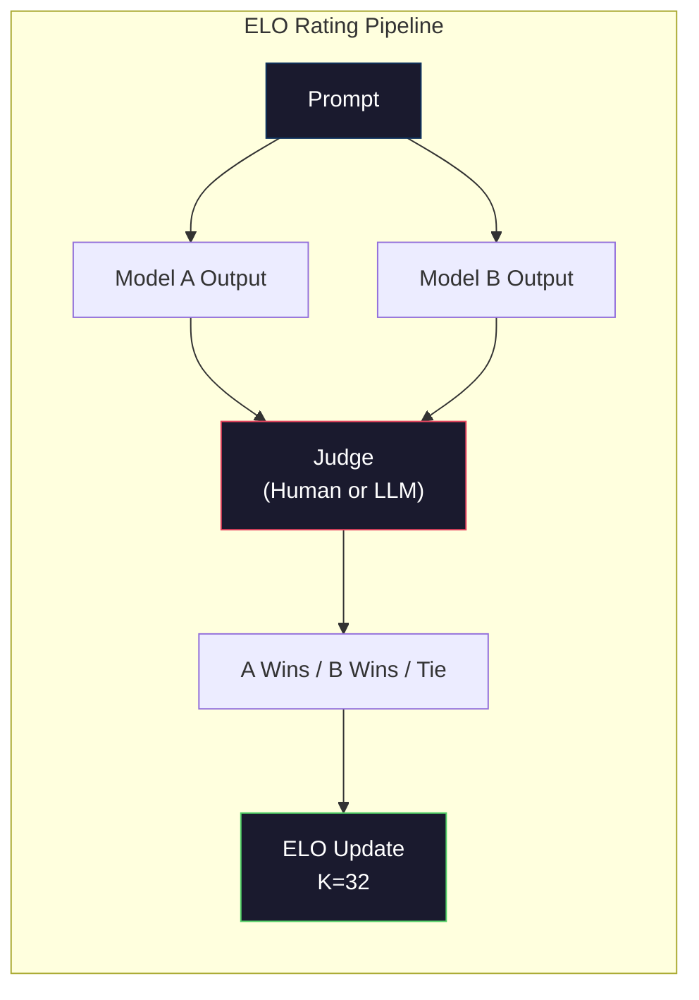

# 评价：基准、考核、LM控制

> 古德哈特定律：当一项措施成为目标时，它就不再是一项好的措施。所有尖端实验游戏的基准。MMLU得分有所上升，但该模型仍不能可靠地计算出“草莓”中的r数。唯一重要的eval是你的eval——对你的任务，使用你的数据。

**Type:** Build
**Languages:** Python
**Prerequisites:** Phase 10, Lessons 01-05 (LLMs from Scratch)
**Time:** ~90 minutes

## 学习目标

- 构建自def 评估工具，以运行基于语言模型的多项选择和开放式基准测试
- 解释为什么标准基准（MMLU, HumanEval）是饱和的，不能区分前沿模型
- 使用适当的度量实现特定于任务的评估：精确匹配、F1、BLEU和llm作为评估分数
- 为你的特定用例设计一个定制的评估套件，而不是仅仅依赖于公共排行榜

## 这个问题

MMLU于2020年发布，由57个科目的15908个问题组成。在三年内，最先进的模型饱和了它。GPT-4评分为86.4%。克劳德3的得分为86.8%。羊驼3405b得分为88.6%。排名被压缩为3分的范围，其中的差异仅仅是统计上的噪音，而不是真正的能力差距。

同时，同样的模型也无法完成一个10岁的孩子不用思考就能完成的任务。克劳德·十四行诗在MMLU上的得分为88.7%。起初，他无法数出“草莓”中的字母——这项任务不需要任何世界知识或推理，只需要字符级的迭代。HumanEval用164个问题测试代码生成。该模型在这方面的得分超过90%，但它仍然会生成在任何初级开发人员都会发现的边缘情况下崩溃的代码。

基准性能与实际可靠性之间的差距是LLM评估的核心问题。基准测试告诉您模型在基准测试中的执行情况。它们几乎不会告诉你这个模型在你的特定任务中，在你的特定数据下，或者在你的特定故障模式下是如何表现的。如果您正在构建客户支持机器人，那么MMLU是无关紧要的。如果您正在构建代码助手，HumanEval只涵盖函数级生成—它不涉及调试、重构或跨文件解释代码。

您需要自def 评估。这并不是因为基准测试无用——它们对于粗略的模型选择是有用的——而是因为最终的评估必须与您的部署条件完全匹配。

## 这个概念

### Eval景观

有三种评估方法，每种方法都有不同的成本和信号质量。

*基准测试是一个标准化的测试套件。MMLU, HumanEval, sw-bench， MATH， ARC, HellaSwag。基于基准运行一个模型并获得一个分数。优点是每个人都使用相同的测试，因此您可以比较模型。缺点是模型和训练数据越来越多地污染了这些基准。实验室对包含基准问题的数据进行培训。分数上升了。这种能力可能并非如此。

*“自def 评估”是您为特定用例构建的测试套件。您已经def 了输入、预期输出和评分函数。法律文件汇总官根据法律文件进行评估。SQL生成器将根据数据库模式执行计算。这些都是昂贵的创造，但它们是预测生产性能的唯一评估。

*人工评估使用付费注释器来确定模型输出的标准，例如有用性、正确性、流畅性和安全性。自动评分失败的开放式任务的黄金标准。聊天机器人Arena已经从100多个模型中收集了超过200万张人类偏好投票。缺点是：成本（每次判决0.10- 2.00美元）和速度（几小时到几天）。

“mermaid”
你Daoming
子图Eval[“评价景观”]
direction LR
“基准\n(MMLU, HumanEval)\n便宜、标准化、可玩、过时”
C[“自def eval \n你的任务，你的数据\n最高信号\昂贵的构建”]
H["Human Evals\n(Chatbot Arena)\nGold standard\nSlow, expensive "]
在

B - >“粗略的模型选择
C ->“模棱两可的情况

样式B:#1a1a2e，描边：# ffa500，颜色：# fff
样式C：填充：#1a1a2e，描边：#51cf66，颜色：#fff
样式：H填充：#1a1a2e，描边：#e94560，颜色：#fff
```

### Why Benchmarks Break

Three mechanisms cause benchmark scores to stop reflecting real capability.

**Data contamination.** Training corpora scrape the internet. Benchmark questions live on the internet. Models see the answers during training. This is not cheating in the traditional sense -- labs do not intentionally include benchmark data. But web-scale scraping makes it nearly impossible to exclude.

**Teaching to the test.** Labs optimize training mixtures for benchmark performance. If 5% of the training mix is MMLU-style multiple choice, the model learns the format and the answer distribution. MMLU is 4-way multiple choice. Models learn that the answer distribution is approximately uniform across A/B/C/D, which helps even when the model does not know the answer.

**Saturation.** When every frontier model scores 85-90% on a benchmark, the benchmark stops discriminating. The remaining 10-15% of questions may be ambiguous, mislabeled, or require obscure domain knowledge. Improving from 87% to 89% on MMLU may mean the model memorized two more obscure questions, not that it got smarter.

### Perplexity: A Quick Health Check

Perplexity measures how surprised a model is by a sequence of tokens. Formally, it is the exponentiated average negative log-likelihood:

```
PPL = exp（-1/N * sum(log P(token_i | context))）
```

A perplexity of 10 means the model is, on average, as uncertain as choosing uniformly among 10 options at each token position. Lower is better. GPT-2 gets a perplexity of ~30 on WikiText-103. GPT-3 gets ~20. Llama 3 8B gets ~7.

Perplexity is useful for comparing models on the same test set, but it has blind spots. A model can have low perplexity by being good at predicting common patterns while being terrible at rare but important patterns. It also says nothing about instruction following, reasoning, or factual accuracy. Use it as a sanity check, not a final verdict.

### LLM-as-Judge

Use a strong model to evaluate a weaker model's output. The idea is simple: ask GPT-4o or Claude Sonnet to rate a response on a 1-5 scale for correctness, helpfulness, and safety. This costs about $0.01 per judgment with GPT-4o-mini and correlates surprisingly well with human judgments -- around 80% agreement on most tasks.

The scoring prompt matters more than the model. A vague prompt ("Rate this response") produces noisy scores. A structured prompt with a rubric ("Score 5 if the answer is factually correct and cites a source, 4 if correct but unsourced, 3 if partially correct...") produces consistent, reproducible scores.

Failure modes: judge models exhibit position bias (prefer the first response in pairwise comparisons), verbosity bias (prefer longer responses), and self-preference (GPT-4 rates GPT-4 outputs higher than equivalent Claude outputs). Mitigations: randomize order, normalize for length, use a different judge than the model being evaluated.

### ELO Ratings from Pairwise Comparisons

Chatbot Arena's approach. Show two responses to the same prompt from different models. A human (or LLM judge) picks the better one. From thousands of these comparisons, compute an ELO rating for each model -- the same system used in chess.

ELO advantages: relative ranking is more reliable than absolute scoring, handles ties gracefully, and converges with fewer comparisons than scoring every output independently. As of early 2026, Chatbot Arena ranks show GPT-4o, Claude 3.5 Sonnet, and Gemini 1.5 Pro within 20 ELO points of each other at the top.



### Eval框架

**lm-evaluation-harness** (EleutherAI)：一个标准的开源评估框架。支持超过200个基准测试。用一个命令运行MMLU， HellaSwag， ARC等的任何拥抱面部模型。由Open LLM排名列表使用。

**RAGAS**：专门为RAG管道设计的评估框架。测量保真度（答案是否与检索到的上下文匹配？）相关性（检索到的上下文是否与问题相关？）”以及答案的正确性。

**promptfoo**：配置驱动程序的eval来提示项目。在YAML中def 测试用例，在多个模型上运行它们，并获得通过/失败报告。它对于回归测试提示非常有用——确保提示更改不会破坏现有的测试用例。

### 创建自def 评估

唯一对生产有影响的eval。过程

1. def 任务。模特到底应该做什么？它是精确的。“回答这个问题”太模糊了。“给定一封客户投诉邮件，提取产品名称、问题类别和情绪”是一项你可以评估的任务。

2. 创建测试用例。至少50个原型评估和200多个产品。每个测试用例是一对（input, expected_output）。包括边缘情况：空输入、对抗性输入、歧义输入和其他语言的输入。

3. def 分数。“精确匹配结构化输出。”BLEU/ROUGE文本相似度。作为一名公开素质的法官获得LLM学位。F1代表提取任务。将多个指标与权重组合。

4. “自动化。每个eval运行一个命令。没有手动步骤。将结果存储为一种可以随时间比较的格式。

5. “跟踪时间。单个eval分数是没有意义的。你需要趋势线。在最后一个提示改变后，分数增加了吗？切换模型后是否出现回归？修改提示符旁边的eval版本。

| Eval Type | Cost per judgment | Agreement with humans | Best for |
|-----------|------------------|----------------------|----------|
| Exact match | ~$0 | 100% (when applicable) | Structured output, classification |
| BLEU/ROUGE | ~$0 | ~60% | Translation, summarization |
| LLM-as-judge | ~$0.01 | ~80% | Open-ended generation |
| Human eval | $0.10-$2.00 | N/A (is the ground truth) | Ambiguous, high-stakes tasks |

## 构建它

### 步骤1：最小的Eval框架

def 核心抽象。eval用例有一个输入、一个预期输出和一个可选的元数据字典。记分员接受预测和引用，并返回从0到1的分数。

”“python
进口json
从集合中导入计数器

类EvalCase:
def __init__(self, input_text, expected, metadata=None)：
自我。Input_text = Input_text
自我。预期的
自我。元数据=元数据或{}

类EvalSuite:
Def __init__(self, name, cases, scorers)：
Self.name = name
Self.cases = case
自我。得分者=得分者

Def run(self, model_fn)：
结果= []
对于self.cases中的情况：
预测= model_fn （case.input_text）
分数= {}
对于self.scorers.items（）中的scorer_name， scorer_fn：
Scores [scorer_name] = scorer_fn（预测，case.expected）
结果。追加({
“输入”:case.input_text
“预期”:case.expected
“预测”：预测
“Score”：得分
})
返回结果
```

### Step 2: Scoring Functions

Build exact match, token F1, and a simulated LLM-as-judge scorer.

```python
def exact_match(prediction, expected):
    return 1.0 if prediction.strip().lower() == expected.strip().lower() else 0.0

def token_f1(prediction, expected):
    pred_tokens = set(prediction.lower().split())
    exp_tokens = set(expected.lower().split())
    if not pred_tokens or not exp_tokens:
        return 0.0
    common = pred_tokens & exp_tokens
    precision = len(common) / len(pred_tokens)
    recall = len(common) / len(exp_tokens)
    if precision + recall == 0:
        return 0.0
    return 2 * (precision * recall) / (precision + recall)

def llm_judge_simulated(prediction, expected):
    pred_words = set(prediction.lower().split())
    exp_words = set(expected.lower().split())
    if not exp_words:
        return 0.0
    overlap = len(pred_words & exp_words) / len(exp_words)
    length_penalty = min(1.0, len(prediction) / max(len(expected), 1))
    return round(overlap * 0.7 + length_penalty * 0.3, 3)
```

### 步骤3:ELO评级系统

使用ELO更新实现两两比较。这正是Chatbot Arena用来对模型进行排名的系统。

”“python
类ELOTracker
Def __init__(self, k=32, initial_rating=1500)：
自我。评级= {}
自我。K = K
自我。Initial_rating = Initial_rating
自我。历史= []

Def _ensure_player(self, name)：
如果名字不在自我评价中：
自我。评级[name] = self.initial_rating

Def expected_score(self, rating_a, rating_b)：
1 / （1 + 10 ** ((rating_b - rating_a) / 400)）

Def record_match(self, player_a, player_b, outcome)：
自我。_ensure_player (player_a)
自我。_ensure_player (player_b)

Ea = self.expected_score（self. expected_score）（player_a）[player_b]
Eb = 1 - ea

== = "a" == =
Sa, sb = 1.0, 0.0
Ai的结果：b = =
Sa, sb = 0.0, 1.0
相关信息
Sa, sb = 0.5, 0.5

自我。得分[player_a] += self。K * (sa-ea
自我。得分[player_b] += self。K * （sb-eb）

self.history.append ({
a: player_a, b: player_b
Result：结果
“rating_a”：圈（自我）。评分（player_a）， 1)
“rating_b”：循环（自我）。评分（player_b）， 1)
})

def Ranking List (Self)：
返回sort （self.ratings）。Items (), key=lambda x: -x[1])
```

### Step 4: Perplexity Calculation

Compute perplexity using token probabilities. In practice you would get these from the model's logits. Here we simulate with a probability distribution.

```python
import numpy as np

def perplexity(log_probs):
    if not log_probs:
        return float("inf")
    avg_neg_log_prob = -np.mean(log_probs)
    return float(np.exp(avg_neg_log_prob))

def token_log_probs_simulated(text, model_quality=0.8):
    np.random.seed(hash(text) % 2**31)
    tokens = text.split()
    log_probs = []
    for i, token in enumerate(tokens):
        base_prob = model_quality
        if len(token) > 8:
            base_prob *= 0.6
        if i == 0:
            base_prob *= 0.7
        prob = np.clip(base_prob + np.random.normal(0, 0.1), 0.01, 0.99)
        log_probs.append(float(np.log(prob)))
    return log_probs
```

### 步骤5：总结结果

计算整个计算操作的汇总统计信息：平均值、中值、阈值通过率和度量分解。

”“python
Def summarize_results(results, threshold=0.8)：
All_scores = {}
对于结果中的r：
对于指标，用r[“scores”]打分。项目():
all_scores。setdefault(公制,[]).append(分数)

摘要= {}
对于度量，all_scores中的分数。项目（）：
Arr = np。阵列(分数)
摘要【测量】= {
“is”的意思是：循环的（浮动的）。它的意思是（arr），
“中位数”：圆形（浮动）；中位数（arr）， 3)
“性传播疾病”：圆形（浮动）。性传播疾病，3)
“最小值”：圆形（浮动）；分钟（arr）， 3)
“Max”：圆形（浮动）；Max (arr), 3)
“pass_rate”：循环（浮动）。平均值（arr >=阈值），3)
“n”:len(分数)
｝
返回的摘要

def print_summary(summary, suite_name="Eval")：
Print （f"\n{'=' * 60}"）
打印（f " {suite_name} errorerrorname "）
Print （f"{'=' * 60}"）
【翻译】【翻译】
（f " \ n{}}: "）
print（f" Mean: {stats[' Mean ']:.3f}"）
print（f" Median: {stats[' Median ']:.3f}"）
print（f" Std: {stats[' Std ']:.3f}"）
（f “受阻：[{[” min "]];3 f},{(" max "):.3f}]）
Print (f" {{stats[' 8080:0 ']: . 1%}(阈。org。> = 0.8)”
print（f" N: {stats[' N ']}"）
```

### Step 6: Run the Full Pipeline

Wire everything together. Define a task, create test cases, simulate two models, run evals, compute ELO from pairwise comparisons, and print the leaderboard.

```python
def demo_model_good(prompt):
    responses = {
        "What is the capital of France?": "Paris",
        "What is 2 + 2?": "4",
        "Who wrote Hamlet?": "William Shakespeare",
        "What language is PyTorch written in?": "Python and C++",
        "What is the boiling point of water?": "100 degrees Celsius",
    }
    return responses.get(prompt, "I don't know")

def demo_model_bad(prompt):
    responses = {
        "What is the capital of France?": "Paris is the capital city of France",
        "What is 2 + 2?": "The answer is four",
        "Who wrote Hamlet?": "Shakespeare",
        "What language is PyTorch written in?": "Python",
        "What is the boiling point of water?": "212 Fahrenheit",
    }
    return responses.get(prompt, "Unknown")

cases = [
    EvalCase("What is the capital of France?", "Paris"),
    EvalCase("What is 2 + 2?", "4"),
    EvalCase("Who wrote Hamlet?", "William Shakespeare"),
    EvalCase("What language is PyTorch written in?", "Python and C++"),
    EvalCase("What is the boiling point of water?", "100 degrees Celsius"),
]

suite = EvalSuite(
    name="General Knowledge",
    cases=cases,
    scorers={
        "exact_match": exact_match,
        "token_f1": token_f1,
        "llm_judge": llm_judge_simulated,
    },
)

results_good = suite.run(demo_model_good)
results_bad = suite.run(demo_model_bad)

print_summary(summarize_results(results_good), "Model A (concise)")
print_summary(summarize_results(results_bad), "Model B (verbose)")
```

“好的”模型提供了一个确切的答案。“坏”模型给出了一个冗长的解释。精确匹配严重惩罚了冗长的模型。令牌F1和llm作为裁判更宽容。这就解释了为什么度量选择很重要：相同的模型看起来是好是坏取决于你如何评价它。

### 第七步：ELO锦标赛

在多轮中对模型进行两两比较。

```python
elo = ELOTracker(k=32)

对于案例中的案例：
Pred_a = demo_model_good（case.input_text）
Pred_b = demo_model_bad（case.input_text）

Score_a = token_f1（pred_a, case.expected）
Score_b = token_f1（pred_b, case.expected）

如果score_a > score_b：
结果= “a”
Elif score_b > score_a：
结果= “b”
其他人
结果= “Draw”

值得信赖。Record_match （“ model_a_简洁”，“model_b_verbose”，输出）

Print （“ \ nELO排名：”）
对于名称，在elo中的排名。排行榜（）：
Print （f" {name}: {rating:.0f}"）
```

### Step 8: Perplexity Comparison

Compare perplexity across "models" of different quality levels.

```python
test_text = "The quick brown fox jumps over the lazy dog in the garden"

for quality, label in [(0.9, "Strong model"), (0.7, "Medium model"), (0.4, "Weak model")]:
    log_probs = token_log_probs_simulated(test_text, model_quality=quality)
    ppl = perplexity(log_probs)
    print(f"  {label} (quality={quality}): perplexity = {ppl:.2f}")
```

## 使用它

### lm-evaluation-harness (EleutherAI)

在任何模型上运行基准测试的标准工具。

”“python
# PIP安装lm-eval
# 命令行:
# Lm_eval——model hf——model_args pretrained=meta-llama/ lama-3.1- 8b——tasks mmlu——batch_size 8

# Python API:
# 进口lm_eval
# = lm_eval.simple_evaluate ()
#     model="hf",
#     Model_args = " pretrained = meta-llama /骆驼- 3.1 - 8b "，
#     tasks=["mmlu", "hellaswag", "arc_easy"],
#     Batch_size = 8，
# ）
# print(results["results"])
```

### promptfoo

Config-driven eval for prompt engineering. Define tests in YAML and run against multiple providers.

```yaml
# promptfoo.yaml
providers:
  - openai:gpt-4o-mini
  - anthropic:claude-3-haiku

prompts:
  - "Answer in one word: {{question}}"

tests:
  - vars:
      question: "What is the capital of France?"
    assert:
      - type: contains
        value: "Paris"
  - vars:
      question: "What is 2 + 2?"
    assert:
      - type: equals
        value: "4"
```

### RAGAS用于RAG评估

”“python
# 通过PIP安装ragas
# 从拉格斯进口评估
# 度量标准导入忠诚度、答案相关性和上下文准确性
#
# 结果=评价
#     数据集
#     参数=[保真度，答案相关性，上下文准确性]
# ）
# Print(结果
```

RAGAS measures what generic evals miss: whether the model's answer is grounded in the retrieved context, not just whether the answer is "correct" in the abstract.

## Ship It

This lesson produces `outputs/prompt-eval-designer.md` -- a reusable prompt that designs custom eval suites for any task. Give it a task description and it generates test cases, scoring functions, and a pass/fail threshold recommendation.

It also produces `outputs/skill-evaluation.md` -- a decision framework for choosing the right evaluation strategy based on your task type, budget, and latency requirements.

## Exercises

1. Add a "consistency" scorer that runs the same input through the model 5 times and measures how often the outputs match. Inconsistent answers on deterministic inputs reveal fragile prompts or high temperature settings.

2. Extend the ELO tracker to support multiple judge functions (exact match, F1, LLM-as-judge) and weight them. Compare how the leaderboard changes when you weight exact match heavily versus F1 heavily.

3. Build an eval suite for a specific task: email classification into 5 categories. Create 100 test cases with diverse examples including edge cases (emails that could belong to multiple categories, empty emails, emails in other languages). Measure how different "models" (rule-based, keyword matching, simulated LLM) perform.

4. Implement contamination detection: given a set of eval questions and a training corpus, check what percentage of eval questions (or close paraphrases) appear in the training data. This is how researchers audit benchmark validity.

5. Build a "model diff" tool. Given eval results from two model versions, highlight which specific test cases improved, which regressed, and which stayed the same. This is the eval equivalent of a code diff -- essential for understanding whether a change helped or hurt.

## Key Terms

| Term | What people say | What it actually means |
|------|----------------|----------------------|
| MMLU | "The benchmark" | Massive Multitask Language Understanding -- 15,908 multiple choice questions across 57 subjects, saturated above 88% by 2025 |
| HumanEval | "Code eval" | 164 Python function-completion problems from OpenAI, tests only isolated function generation |
| SWE-bench | "Real coding eval" | 2,294 GitHub issues from 12 Python repos, measures end-to-end bug fixing including test generation |
| Perplexity | "How confused the model is" | exp(-avg(log P(token_i given context))) -- lower means the model assigns higher probability to the actual tokens |
| ELO rating | "Chess ranking for models" | A relative skill rating computed from pairwise win/loss records, used by Chatbot Arena to rank 100+ models |
| LLM-as-judge | "Using AI to grade AI" | A strong model scores a weaker model's outputs against a rubric, ~80% agreement with human judges at ~$0.01/judgment |
| Data contamination | "The model saw the test" | Training data includes benchmark questions, inflating scores without improving real capability |
| Eval suite | "A bunch of tests" | A versioned collection of (input, expected_output, scorer) triples that measure a specific capability |
| Pass rate | "What percentage it gets right" | Fraction of eval cases scoring above a threshold -- more actionable than mean score because it measures reliability |
| Chatbot Arena | "Model ranking website" | LMSYS platform with 2M+ human preference votes, producing the most trusted LLM leaderboard via ELO ratings |

## Further Reading

- [Hendrycks et al., 2021 -- "Measuring Massive Multitask Language Understanding"](https://arxiv.org/abs/2009.03300) -- the MMLU paper, still the most cited LLM benchmark despite its saturation
- [Chen et al., 2021 -- "Evaluating Large Language Models Trained on Code"](https://arxiv.org/abs/2107.03374) -- the HumanEval paper from OpenAI, established code generation evaluation methodology
- [Zheng et al., 2023 -- "Judging LLM-as-a-Judge"](https://arxiv.org/abs/2306.05685) -- systematic analysis of using LLMs to evaluate LLMs, including position bias and verbosity bias findings
- [LMSYS Chatbot Arena](https://chat.lmsys.org/) -- crowdsourced model comparison platform with 2M+ votes, the most trusted real-world LLM ranking