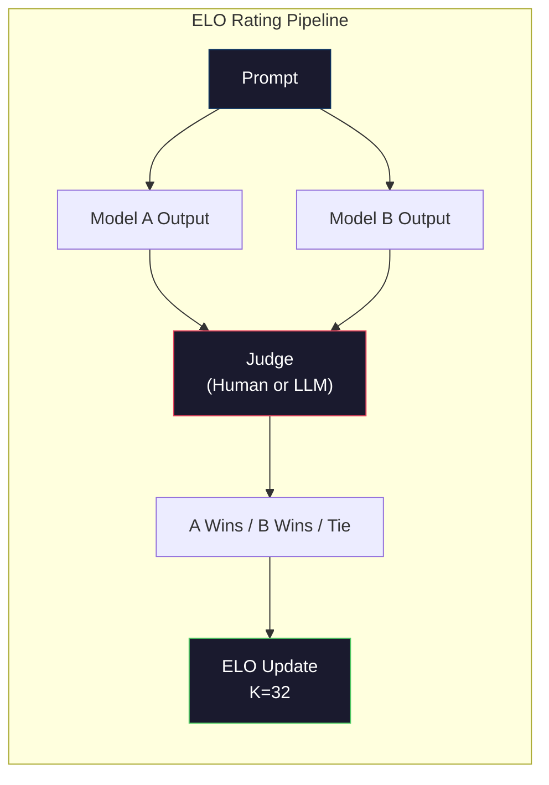

# Evaluation: Benchmark, assessment, LM control

> Goodhart's Law: When a measure becomes an objective, it is no longer a good measure. The benchmark of every cutting-edge laboratory game. The MMLU score has risen, but the model still cannot reliably calculate the number of Rs in "strawberries". The only important eval is your eval - on your task, using your data.

**Type:** Build
**Languages:** Python
**Prerequisites:** Phase 10, Lessons 01-05 (LLMs from Scratch)
**Time:** ~90 minutes

## Learning objectives

- Build a custom evaluation tool to run multiple-choice and open benchmarking tests based on language models
- Explain why the standard benchmarks (MMLU, HumanEval) are saturated and unable to distinguish between frontier models
- Implement task-specific evaluations using appropriate metrics: exact match, F1, BLEU, and llm as evaluation scores
- Design a customized evaluation suite for your specific use case instead of relying solely on public leaderboards

## This question

The MMLU was released in 2020 and consists of 15,908 questions across 57 subjects. Within three years, cutting-edge models saturated it. The GPT-4 score was 86.4%. Claude 3's score was 86.8%. Alpaca 3 405B scored 88.6%. The ranking list has been compressed into a three-point range, and the differences within it are merely statistical noises rather than true ability gaps.

Meanwhile, the same model is also unable to accomplish the tasks that a 10-year-old child can complete without thinking. Claude Sonnet scored 88.7% on MMLU. Initially, he couldn't count the letters in "Strawberry" - a task that doesn't require any world knowledge or reasoning, only character-level iterations. HumanEval tests code generation with 164 questions. The model scores over 90% in this aspect, but it still generates code that crashes in edge cases that any junior developer would find.

The gap between benchmark performance and actual reliability is the core issue in LLM evaluation. Benchmark tests tell you how the model performs on benchmark tests. They hardly tell you how this model will perform in your specific task, under your specific data, or in your specific failure mode. If you are building a customer support robot, MMLU is irrelevant. If you are building a code assistant, HumanEval only covers function-level generation - it does not mention debugging, refactoring, or interpreting code across files.

You need to customize the assessment. This is not because benchmark tests are useless - they are useful for rough model selection - but because the final evaluation must exactly match your deployment conditions.

## This concept

### Eval Landscape

There are three evaluation methods, each with different costs and signal qualities.

*A benchmark is a standardized test suite. MMLU, HumanEval, sw-bench, MATH, ARC, HellaSwag. Run a model based on the benchmark and obtain a score. The advantage is that everyone uses the same test, so you can compare the models. The drawback is that the models and training data are increasingly contaminating these benchmarks. The laboratory conducts training on data containing benchmark problems. The score has risen. The ability might not be so.

*"Custom Evaluation" is a test suite you build for specific use cases. You have defined the input, expected output and scoring function. The legal document summary officer conducts an assessment based on the legal documents. The SQL generator will perform calculations based on the database schema. These are expensive creations, but they are the only evaluations for predicting production performance.

*Human evaluation uses paid annotators to determine the criteria for model output, such as usefulness, correctness, fluency, and security. The gold standard for automatically scoring failed open-ended tasks. The chatbot Arena has collected over 2 million human preference votes from more than 100 models. The disadvantages are: cost ($0.10- $2.00 per judgment) and speed (several hours to several days).

"Mermaid"
Tu Daoming
Subgraph Eval[" Evaluate Landscape "]
Direction LR
B[" benchmark \n(MMLU, HumanEval)\n Cheap, standardized, playable, outdated "]
C[" Customize eval \n Your task, your data \n Highest Signal \ Expensive build "]
H["Human Evals\n(Chatbot Arena)\nGold standard\nSlow, expensive "]
Over

B - > "Rough Model Selection
C -> "Ambiguous situations" H

Style B:#1a1a2e, Stroke :# ffa500, Color :# fff
Style C: Fill: #1a1a2e, Stroke: #51cf66, Color: #fff
Style: H Fill: #1a1a2e, Stroke: #e94560, Color: #fff
```

### Why Benchmarks Break

Three mechanisms cause benchmark scores to stop reflecting real capability.

**Data contamination.** Training corpora scrape the internet. Benchmark questions live on the internet. Models see the answers during training. This is not cheating in the traditional sense -- labs do not intentionally include benchmark data. But web-scale scraping makes it nearly impossible to exclude.

**Teaching to the test.** Labs optimize training mixtures for benchmark performance. If 5% of the training mix is MMLU-style multiple choice, the model learns the format and the answer distribution. MMLU is 4-way multiple choice. Models learn that the answer distribution is approximately uniform across A/B/C/D, which helps even when the model does not know the answer.

**Saturation.** When every frontier model scores 85-90% on a benchmark, the benchmark stops discriminating. The remaining 10-15% of questions may be ambiguous, mislabeled, or require obscure domain knowledge. Improving from 87% to 89% on MMLU may mean the model memorized two more obscure questions, not that it got smarter.

### Perplexity: A Quick Health Check

Perplexity measures how surprised a model is by a sequence of tokens. Formally, it is the exponentiated average negative log-likelihood:

```
PPL = exp（-1/N * sum(log P(token_i | context))）
```

A perplexity of 10 means the model is, on average, as uncertain as choosing uniformly among 10 options at each token position. Lower is better. GPT-2 gets a perplexity of ~30 on WikiText-103. GPT-3 gets ~20. Llama 3 8B gets ~7.

Perplexity is useful for comparing models on the same test set, but it has blind spots. A model can have low perplexity by being good at predicting common patterns while being terrible at rare but important patterns. It also says nothing about instruction following, reasoning, or factual accuracy. Use it as a sanity check, not a final verdict.

### LLM-as-Judge

Use a strong model to evaluate a weaker model's output. The idea is simple: ask GPT-4o or Claude Sonnet to rate a response on a 1-5 scale for correctness, helpfulness, and safety. This costs about $0.01 per judgment with GPT-4o-mini and correlates surprisingly well with human judgments -- around 80% agreement on most tasks.

The scoring prompt matters more than the model. A vague prompt ("Rate this response") produces noisy scores. A structured prompt with a rubric ("Score 5 if the answer is factually correct and cites a source, 4 if correct but unsourced, 3 if partially correct...") produces consistent, reproducible scores.

Failure modes: judge models exhibit position bias (prefer the first response in pairwise comparisons), verbosity bias (prefer longer responses), and self-preference (GPT-4 rates GPT-4 outputs higher than equivalent Claude outputs). Mitigations: randomize order, normalize for length, use a different judge than the model being evaluated.

### ELO Ratings from Pairwise Comparisons

Chatbot Arena's approach. Show two responses to the same prompt from different models. A human (or LLM judge) picks the better one. From thousands of these comparisons, compute an ELO rating for each model -- the same system used in chess.

ELO advantages: relative ranking is more reliable than absolute scoring, handles ties gracefully, and converges with fewer comparisons than scoring every output independently. As of early 2026, Chatbot Arena ranks show GPT-4o, Claude 3.5 Sonnet, and Gemini 1.5 Pro within 20 ELO points of each other at the top.



### Eval framework

**lm-evaluation-harness** (EleutherAI) : A standard open-source evaluation framework. Supports over 200 benchmark tests. Run any embrace face model for MMLU, HellaSwag, ARC, etc. with one command. Used by the Open LLM ranking list.

**RAGAS** : An evaluation framework specifically designed for RAG pipelines. Measure fidelity (does the answer match the retrieved context?) Relevance (Is the retrieved context relevant to the question?)" And the correctness of the answer.

**promptfoo** : Configure the driver's eval to prompt the project. Define test cases in YAML, run them on multiple models, and obtain pass/fail reports. It is very useful for regression test prompts - ensuring that prompt changes do not break the existing test cases.

### Create custom evaluations

The only eval that has an impact on production. Process

1. Define the task. What exactly should a model do? It is precise. "Answering the question" is too vague. "Given a customer complaint email, extracting the product name, problem category and sentiment" is a task that you can evaluate.

2. Create test cases. At least 50 prototype evaluations and over 200 productions. Each test case is a pair (input, expected_output). Including edge cases: empty input, adversarial input, ambiguous input, and input in other languages.

3. Define the score. "Precisely match structured output." BLEU/ROUGE text similarity. A Master of Laws as an open quality judge. F1 stands for extraction task. Combine multiple indicators with weights.

4. "Automation. Each eval runs a command. There are no manual steps. Store the results in a format that can be compared over time.

5. "Track time. A single eval score is meaningless. You need trend lines. Did the score increase after the last prompt was changed? Does regression occur after switching models? Modify the version of eval next to the prompt.

| Eval Type | Cost per judgment | Agreement with humans | Best for |
|-----------|------------------|----------------------|----------|
| Exact match | ~$0 | 100% (when applicable) | Structured output, classification |
| BLEU/ROUGE | ~$0 | ~60% | Translation, summarization |
| LLM-as-judge | ~$0.01 | ~80% | Open-ended generation |
| Human eval | $0.10-$2.00 | N/A (is the ground truth) | Ambiguous, high-stakes tasks |

## Build it

### Step 1: The smallest Eval framework

Define the core abstraction. The eval case has one input, one expected output and an optional metadata dictionary. The scorekeeper accepts predictions and references and returns scores ranging from 0 to 1.

”“python
Imported json
Import the counter from the collection

Class EvalCase:
def __init__(self, input_text, expected, metadata=None) :
Self. Input_text = Input_text
Self. Expected = Anticipated
Self. Metadata = Metadata or {}

Class EvalSuite:
Def __init__(self, name, cases, scorers) :
Self.name = name
Self.cases = case
Self. The scorer = the scorer

Def run(self, model_fn) :
Result = []
For the case in self.cases:
Prediction = model_fn (case.input_text)
Score = {}
For scorer_name in self.scorers.items (), scorer_fn:
Scores [scorer_name] = scorer_fn (prediction, case.expected)
results.append ({
"Input" :case.input_text
"expected" :case.expected
"Prediction" : Prediction
"Score" : Score
})
Return result
```

### Step 2: Scoring Functions

Build exact match, token F1, and a simulated LLM-as-judge scorer.

```python
def exact_match(prediction, expected):
    return 1.0 if prediction.strip().lower() == expected.strip().lower() else 0.0

def token_f1(prediction, expected):
    pred_tokens = set(prediction.lower().split())
    exp_tokens = set(expected.lower().split())
    if not pred_tokens or not exp_tokens:
        return 0.0
    common = pred_tokens & exp_tokens
    precision = len(common) / len(pred_tokens)
    recall = len(common) / len(exp_tokens)
    if precision + recall == 0:
        return 0.0
    return 2 * (precision * recall) / (precision + recall)

def llm_judge_simulated(prediction, expected):
    pred_words = set(prediction.lower().split())
    exp_words = set(expected.lower().split())
    if not exp_words:
        return 0.0
    overlap = len(pred_words & exp_words) / len(exp_words)
    length_penalty = min(1.0, len(prediction) / max(len(expected), 1))
    return round(overlap * 0.7 + length_penalty * 0.3, 3)
```

### Step 3:ELO Rating System

Implement pairwise comparisons using ELO updates. This is precisely the system that Chatbot Arena uses to rank models.

”“python
Class ELOTracker
Def __init__(self, k=32, initial_rating=1500) :
Self. Rating = {}
Self. K = K
Self. Initial_rating = Initial_rating
Self. History = []

Def _ensure_player(self, name) :
If the name is not in the self-evaluation:
Self. Rating [name] = self.initial_rating

Def expected_score(self, rating_a, rating_b)：
1 / （1 + 10 ** ((rating_b - rating_a) / 400)）

Def record_match(self, player_a, player_b, outcome)：
自我。_ensure_player (player_a)
自我。_ensure_player (player_b)

Ea = self.expected_score（self. expected_score）（player_a） self。评级[player_b])
Eb = 1 - ea

== = "a" == =
sa, sb = 1.0, 0.0
Ai's result :b = =
sa, sb = 0.0, 1.0
Relevant information
sa, sb = 0.5, 0.5

Self. Score [player_a] += self. K * (sa-ea
Self. Score [player_b] += self. K * (sb-eb)

self.history.append ({
"a" : player_a, "b" : player_b
"Result" : Result
"rating_a" : Circle (self. Rating (player_a), 1)
"rating_b" : Circle (Self. Rating (player_b), 1)
})

def Ranking List (Self):
Return the sort (self.ratings. Items (), key=lambda x: -x[1])
```

### Step 4: Perplexity Calculation

Compute perplexity using token probabilities. In practice you would get these from the model's logits. Here we simulate with a probability distribution.

```python
import numpy as np

def perplexity(log_probs):
    if not log_probs:
        return float("inf")
    avg_neg_log_prob = -np.mean(log_probs)
    return float(np.exp(avg_neg_log_prob))

def token_log_probs_simulated(text, model_quality=0.8):
    np.random.seed(hash(text) % 2**31)
    tokens = text.split()
    log_probs = []
    for i, token in enumerate(tokens):
        base_prob = model_quality
        if len(token) > 8:
            base_prob *= 0.6
        if i == 0:
            base_prob *= 0.7
        prob = np.clip(base_prob + np.random.normal(0, 0.1), 0.01, 0.99)
        log_probs.append(float(np.log(prob)))
    return log_probs
```

### Step 5: Summarize the results

Calculate the summary statistics of the entire eval operation: average, median, threshold pass rate, and metric decomposition.

”“python
Def summarize_results(results, threshold=0.8) :
All_scores = {}
For r in the result:
For metrics, score in r[" scores "]. items() :
all_scores. setdefault(metric,[]).append(fraction)

Abstract = {}
For the metric, the score in all_scores.items () :
Arr = np.array (Fraction)
Abstract [Measurement]= {
The meaning of "is" : circular (floating (np. It means (arr), 3),
"Median" : Circular (floating (np. Median (arr), 3)
"Sexually transmitted disease" : circular (floating (np. Sexually transmitted Disease (arr), 3)
"Minimum value" : circular (floating (np. Minutes (arr), 3)
"Max" : Circular (floating (np. Max (arr), 3)
"pass_rate" : Circular (floating (np. Mean (arr >= threshold), 3)
"n" :len(fraction)
}
The returned summary

def print_summary(summary, suite_name="Eval")：
Print （f"\n{'=' * 60}"）
Print （f " {suite_name} errorerrorname "）
Print （f"{'=' * 60}"）
【翻译】【翻译】
（f " \ n{}}: "）
print（f" Mean: {stats[' Mean ']:.3f}"）
print（f" Median: {stats[' Median ']:.3f}"）
print（f" Std: {stats[' Std ']:.3f}"）
打印(f”范围:[{统计[“min”]];3 f},{统计(“max”):.3f}]”)
print(f" {{stats[‘通过率’]：。1%}（阈. org . >= 0.8）"
print（f" N: {stats[' N ']}"）
```

### Step 6: Run the Full Pipeline

Wire everything together. Define a task, create test cases, simulate two models, run evals, compute ELO from pairwise comparisons, and print the leaderboard.

```python
def demo_model_good(prompt):
    responses = {
        "What is the capital of France?": "Paris",
        "What is 2 + 2?": "4",
        "Who wrote Hamlet?": "William Shakespeare",
        "What language is PyTorch written in?": "Python and C++",
        "What is the boiling point of water?": "100 degrees Celsius",
    }
    return responses.get(prompt, "I don't know")

def demo_model_bad(prompt):
    responses = {
        "What is the capital of France?": "Paris is the capital city of France",
        "What is 2 + 2?": "The answer is four",
        "Who wrote Hamlet?": "Shakespeare",
        "What language is PyTorch written in?": "Python",
        "What is the boiling point of water?": "212 Fahrenheit",
    }
    return responses.get(prompt, "Unknown")

cases = [
    EvalCase("What is the capital of France?", "Paris"),
    EvalCase("What is 2 + 2?", "4"),
    EvalCase("Who wrote Hamlet?", "William Shakespeare"),
    EvalCase("What language is PyTorch written in?", "Python and C++"),
    EvalCase("What is the boiling point of water?", "100 degrees Celsius"),
]

suite = EvalSuite(
    name="General Knowledge",
    cases=cases,
    scorers={
        "exact_match": exact_match,
        "token_f1": token_f1,
        "llm_judge": llm_judge_simulated,
    },
)

results_good = suite.run(demo_model_good)
results_bad = suite.run(demo_model_bad)

print_summary(summarize_results(results_good), "Model A (concise)")
print_summary(summarize_results(results_bad), "Model B (verbose)")
```

The "good" model provides an exact answer. The "bad" model offers a lengthy explanation. Exact matching severely punishes lengthy models. Token F1 and llm are more lenient as referees. This explains why metric selection is important: whether the same model looks good or bad depends on how you rate it.

### Step 7: ELO Championship

Compare the models pairwise in multiple rounds.

```python
elo = ELOTracker(k=32)

对于案例中的案例：
Pred_a = demo_model_good（case.input_text）
Pred_b = demo_model_bad（case.input_text）

Score_a = token_f1（pred_a, case.expected）
Score_b = token_f1（pred_b, case.expected）

If score_a > score_b:
The result = "a"
Elif score_b > score_a:
The result = "b"
Others
Result = "Draw"

Trustworthy. Record_match (" model_a_ concise ", "model_b_verbose", output)

Print (" \ nELO Ranking: ")
For names, the ranking in elo.leaderboard () :
Print (f" {name}: {rating:.0f}")
```

### Step 8: Perplexity Comparison

Compare perplexity across "models" of different quality levels.

```python
test_text = "The quick brown fox jumps over the lazy dog in the garden"

for quality, label in [(0.9, "Strong model"), (0.7, "Medium model"), (0.4, "Weak model")]:
    log_probs = token_log_probs_simulated(test_text, model_quality=quality)
    ppl = perplexity(log_probs)
    print(f"  {label} (quality={quality}): perplexity = {ppl:.2f}")
```

## Use it

### lm-evaluation-harness (EleutherAI)

A standard tool for running benchmarks on any model.

”“python
# PIP installs lm-eval
# Command line:
# Lm_eval——model hf——model_args pretrained=meta-llama/ lama-3.1- 8b——tasks mmlu——batch_size 8

# Python API:
# Imported lm_eval
# = lm_eval.simple_evaluate（）
#     model="hf",
#     Model_args = " pretrained = meta-llama /骆驼- 3.1 - 8b "，
#     tasks=["mmlu", "hellaswag", "arc_easy"],
#     Batch_size = 8，
# ）
# print(results["results"])
```

### promptfoo

Config-driven eval for prompt engineering. Define tests in YAML and run against multiple providers.

```yaml
# promptfoo.yaml
providers:
  - openai:gpt-4o-mini
  - anthropic:claude-3-haiku

prompts:
  - "Answer in one word: {{question}}"

tests:
  - vars:
      question: "What is the capital of France?"
    assert:
      - type: contains
        value: "Paris"
  - vars:
      question: "What is 2 + 2?"
    assert:
      - type: equals
        value: "4"
```

### RAGAS is used for RAG evaluation

”“python
# Install ragas via PIP
# Import assessment from ragas
# From Lage The metrics import loyalty, answer_relevance and context accuracy
#
# Result = Evaluation
#     Dataset
#     Parameter =[Fidelity, Answer Relevance, Context Accuracy]
# ）
# Print (result
```

RAGAS measures what generic evals miss: whether the model's answer is grounded in the retrieved context, not just whether the answer is "correct" in the abstract.

## Ship It

This lesson produces `outputs/prompt-eval-designer.md` -- a reusable prompt that designs custom eval suites for any task. Give it a task description and it generates test cases, scoring functions, and a pass/fail threshold recommendation.

It also produces `outputs/skill-evaluation.md` -- a decision framework for choosing the right evaluation strategy based on your task type, budget, and latency requirements.

## Exercises

1. Add a "consistency" scorer that runs the same input through the model 5 times and measures how often the outputs match. Inconsistent answers on deterministic inputs reveal fragile prompts or high temperature settings.

2. Extend the ELO tracker to support multiple judge functions (exact match, F1, LLM-as-judge) and weight them. Compare how the leaderboard changes when you weight exact match heavily versus F1 heavily.

3. Build an eval suite for a specific task: email classification into 5 categories. Create 100 test cases with diverse examples including edge cases (emails that could belong to multiple categories, empty emails, emails in other languages). Measure how different "models" (rule-based, keyword matching, simulated LLM) perform.

4. Implement contamination detection: given a set of eval questions and a training corpus, check what percentage of eval questions (or close paraphrases) appear in the training data. This is how researchers audit benchmark validity.

5. Build a "model diff" tool. Given eval results from two model versions, highlight which specific test cases improved, which regressed, and which stayed the same. This is the eval equivalent of a code diff -- essential for understanding whether a change helped or hurt.

## Key Terms

| Term | What people say | What it actually means |
|------|----------------|----------------------|
| MMLU | "The benchmark" | Massive Multitask Language Understanding -- 15,908 multiple choice questions across 57 subjects, saturated above 88% by 2025 |
| HumanEval | "Code eval" | 164 Python function-completion problems from OpenAI, tests only isolated function generation |
| SWE-bench | "Real coding eval" | 2,294 GitHub issues from 12 Python repos, measures end-to-end bug fixing including test generation |
| Perplexity | "How confused the model is" | exp(-avg(log P(token_i given context))) -- lower means the model assigns higher probability to the actual tokens |
| ELO rating | "Chess ranking for models" | A relative skill rating computed from pairwise win/loss records, used by Chatbot Arena to rank 100+ models |
| LLM-as-judge | "Using AI to grade AI" | A strong model scores a weaker model's outputs against a rubric, ~80% agreement with human judges at ~$0.01/judgment |
| Data contamination | "The model saw the test" | Training data includes benchmark questions, inflating scores without improving real capability |
| Eval suite | "A bunch of tests" | A versioned collection of (input, expected_output, scorer) triples that measure a specific capability |
| Pass rate | "What percentage it gets right" | Fraction of eval cases scoring above a threshold -- more actionable than mean score because it measures reliability |
| Chatbot Arena | "Model ranking website" | LMSYS platform with 2M+ human preference votes, producing the most trusted LLM leaderboard via ELO ratings |

## Further Reading

- [Hendrycks et al., 2021 -- "Measuring Massive Multitask Language Understanding"](https://arxiv.org/abs/2009.03300) -- the MMLU paper, still the most cited LLM benchmark despite its saturation
- [Chen et al., 2021 -- "Evaluating Large Language Models Trained on Code"](https://arxiv.org/abs/2107.03374) -- the HumanEval paper from OpenAI, established code generation evaluation methodology
- [Zheng et al., 2023 -- "Judging LLM-as-a-Judge"](https://arxiv.org/abs/2306.05685) -- systematic analysis of using LLMs to evaluate LLMs, including position bias and verbosity bias findings
- [LMSYS Chatbot Arena](https://chat.lmsys.org/) -- crowdsourced model comparison platform with 2M+ votes, the most trusted real-world LLM ranking