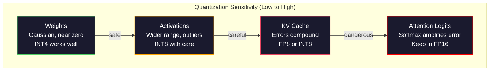

# 量化：使模型拟合

> FP16的70B型号需要140GB。两架a100只是用来承重的。量化到FP8: 80GB GPU。INT4：一台MacBook。

**Type:** Build
**Languages:** Python (with numpy)
**Prerequisites:** Phase 10, Lessons 01-10 (LLMs from Scratch)
**Time:** ~120 minutes

## 学习目标

- 实现FP16到INT8和INT4的对称和非对称量化，包括按张量和按通道缩放
- 计算量化内存节省，并确定哪种精度适合给定GPU的VRAM
- 解释训练后量化（PTQ）和量化意识训练（QAT）的区别
- 应用GPTQ或AWQ来量化真实模型，并在基准测试中度量精度与内存之间的权衡

## 这个问题

羊驼370b有700亿个参数。每个参数是一个16位浮点数。也就是1400亿字节。140 gb。单个A100具有80GB的VRAM。你甚至不能在单个GPU上加载权重，更不用说运行推理了。你需要两架a100，每小时2美元。

但是，每个参数浪费了16位。神经网络中的大多数权值都接近于零。FP16的全动态范围（从0.000000059到65,504）几乎完全未被使用。如果你测量Llama 370b的实际重量分布，95%的重量在-0.1和+0.1之间。烧录16位表示可以加载4位的值。

用低精度的数字代替高精度的数字来量化。从FP16到FP8的内存减少了一半。将FP16至INT4切成四等份。原来的140GB已经减少到35GB。它适用于单个消费级GPU。如果采用2位量化（激进、有损，但对某些任务有用），同样的模型可以在16GB的笔记本电脑上运行。

代价是准确性。你删除的每一个字节都会毁掉信息。问题是你在哪里失去了多少精确度。在大多数基准测试中，量化良好的INT4模型保持了其原始质量的95-99%。对INT4的天真量化可能会彻底破坏模型。区别在于技术。

使用GPTQ对Llama 3到INT4的社区量化显示，在WikiText上丢失了大约1-2个混淆点。Mistral已经为midtral 8x22B发布了FP8检查点，MMLU没有可测量的质量损失。GGUF格式支持lama.cpp，并在配备m系列芯片的macbook上运行70B型号。量化不是一个hack。它是每个大于7B的模型的标准部署路径。

## 这个概念

### 每个比特在数字格式中有什么作用

每个浮点数都有三个部分：符号、指数和尾数（也称为有效数字）。符号是一个比特。索引决定了范围（数字可以有多大或多小）。尾数决定精度（获得多少位小数）。

```
FP32:  [1 sign] [8 exponent] [23 mantissa]  = 32 bits
FP16:  [1 sign] [5 exponent] [10 mantissa]  = 16 bits
BF16:  [1 sign] [8 exponent] [7  mantissa]  = 16 bits
FP8:   [1 sign] [4 exponent] [3  mantissa]  = 8  bits (E4M3)
FP8:   [1 sign] [5 exponent] [2  mantissa]  = 8  bits (E5M2)
INT8:  [1 sign] [7 value]                   = 8  bits (uniform steps)
INT4:  [1 sign] [3 value]                   = 4  bits (16 levels total)
```

*FP32是全精度的。最后23位数字的精度近似于7十进制数。范围：约1.2 × 10^-38至3.4 × 10^38。过去的培训只在FP32中进行。累加（在矩阵乘法期间计算和）也是如此。

*FP16将比特减半。最后10位代表大约3.3个十进制数。该指数下降到5位，大幅缩小了范围（最大值为65,504）。这对于重量（集中在零附近）是有益的，但对于在训练过程中可能出现峰值的激活和梯度是危险的。FP16训练需要损失缩放以防止底流。

**BF16** (Brain Float 16)保持FP32的8位指数，但将要求降低到7位。范围与FP32相同，但精度低于FP16。谷歌专门为深度学习设计的。直觉：对于神经网络来说，范围比准确性更重要。在FP16中，10^-20的梯度流为零，但在BF16中仍然存在。在BF16中，将0.07342的重量四舍五入到0.0734已经非常接近了。每个现代训练运行使用BF16或BF16/FP32混合。

*FP8有两种版本。E4M3（4个指数，3个尾数）用于推理期间的权重和激活。E5M2（5个指数，2个强制值）用于训练期间的梯度，其中距离比精度更重要。与FP16相比，H100 gpu上的FP8推理实现了30-50%的加速，而质量损失可以忽略不计。

**INT8**为整数形式。没有指数也没有尾数。只有256个均匀间隔的值，范围从-128到127。您需要一个比例因子来将浮点权重映射到这个范围。它的优点是：整数操作比浮点操作更快，更节能。在A100上执行INT8矩阵乘法运算的速度为624 TOPS，在FP16上执行INT8矩阵乘法运算的速度为312 TFLOPS。

*“INT4”进一步推广。只有16个可能的值。比例系数起着重要的作用。质量完全取决于你如何选择尺度和你量化的权重。最先进的INT4方法（GPTQ， AWQ）保留了95%以上的原始模型质量。

“美人鱼”
“图LR
子图格式[“数码格式景观”]
定向肺结核
FP32[“ FP32\n32位\n4字节/参数\nTraining黄金标准”]
BF16["BF16\n16 bits\n2 bytes/param\nTraining default"]
FP16["FP16\n16 bits\n2 bytes/param\nInference baseline"]
FP8[“ FP8\n8位\n1字节/参数\n30-50%快”]
INT8[“ INT8\n8位\n1字节/参数\n2x吞吐量”]
INT4[“ INT4\n4 bits\n0.5 bytes/param\n4x压缩”]
在

FP32 - >“训练”- BF16
BF16 - >“推理”FP16
“原生H100”FP8
FP16 - > >“服务器部署”> INT8
FP16 -> "Edge/Laptop" INT4

样式：FP32，填充：#1a1a2e，描边：#0f3460，颜色：#fff
样式：BF16，填充：#1a1a2e，描边：#0f3460，颜色：#fff
样式：FP16填充：#1a1a2e，描边：#ffa500，颜色：#fff
样式：FP8，填充：#1a1a2e，描边：#51cf66，颜色：#fff
样式：INT8，填充：#1a1a2e，描边：#51cf66，颜色：#fff
样式：INT4，填充：#1a1a2e，描边：#e94560，颜色：#fff
```

### How Quantization Works

The core operation is simple. Take a tensor of floating-point values, find a scale factor, multiply, round to the nearest integer, and store the integers plus the scale factor.

**Quantize:**
```
Scale = max （abs（张量））/max_int_value
量化=圆（张量/尺度）
```

**Dequantize:**
```
重构=量化*缩放
```

For INT8 with a symmetric range (-127 to 127):
```
Scale = max （abs（张量））/ 127
量子化=箝位（圆（张量/尺度），-128,127）
```

The error is the rounding error. Each value can be off by at most `scale / 2`. The total error across a layer depends on how many weights you have and how sensitive the model is to perturbations in those weights.

**Per-tensor vs per-channel quantization.** Per-tensor uses one scale factor for the entire weight matrix. Simple but lossy: if one column has large values and another has small values, the small values lose most of their precision. Per-channel uses one scale factor per output channel (per row or column of the weight matrix). More overhead (you store N scale factors instead of 1) but dramatically better quality. Every production quantization method uses per-channel or finer granularity.

**Asymmetric quantization** adds a zero-point offset: `quantized = round(tensor / scale) + zero_point`. This handles distributions that are not centered at zero. ReLU activations, for example, are always non-negative. Symmetric quantization wastes half the integer range on negative values that never appear. Asymmetric quantization maps the actual range [min, max] to the full integer range.

### Sensitivity Hierarchy

Not everything in a model tolerates quantization equally. There is a clear hierarchy.

**Weights (most robust).** Model weights change slowly during training and follow a roughly Gaussian distribution centered near zero. They quantize well. INT8 weights with per-channel scales produce nearly lossless results. INT4 requires more sophisticated methods but works.

**Activations (moderate sensitivity).** Activations are the intermediate values flowing through the network during inference. They have wider dynamic range than weights and contain outliers. A single attention head might produce activation values 100x larger than the mean. These outliers are critical for model quality. Quantizing them naively destroys information. Solutions: keep outlier channels in higher precision (LLM.int8()), use per-token or per-channel activation scales.

**KV cache (high sensitivity).** The key-value cache stores attention states for all previous tokens. At long context lengths, the KV cache dominates memory. For a 70B model at 32K context, the KV cache alone is 40GB in FP16. Quantizing the KV cache to FP8 or INT8 saves massive memory but any error compounds across all future attention computations. The quality impact scales with sequence length.

**Attention logits (most sensitive).** The softmax in attention is highly sensitive to small changes in its inputs. A quantization error of 0.01 in a pre-softmax logit can shift the attention distribution meaningfully. Most quantization schemes keep attention computation in higher precision (FP16 or BF16) even when everything else is quantized.



### PTQ vs QAT

*训练后量化（PTQ）对训练后的模型进行量化。没有进一步的培训。获取FP16权重，计算比例因子，四舍五入，然后部署。快速（几分钟到几个小时）而且便宜。适用于INT8和FP8。对于INT4，由于舍入误差的累积，朴素PTQ通常会严重失败。先进的PTQ方法（GPTQ， AWQ）使用校准数据来最小化量化误差。

*定量感知训练（QAT）在训练过程中将错误的量化操作插入前传。模型学习设置舍入误差小的权重。梯度流使用透传估计器（STE）进行伪量化：假设舍入操作的梯度为1。QAT比PTQ生成更好的INT4和INT2模型，但它需要完整的训练运行。谷歌使用QAT进行高效的双子星服务。Meta对一些羊驼部署目标使用了QAT。

| Aspect | PTQ | QAT |
|--------|-----|-----|
| Cost | Minutes to hours | Full training run |
| Quality at INT8 | Excellent (< 0.1% loss) | Excellent |
| Quality at INT4 | Good with GPTQ/AWQ (1-3% loss) | Better (< 1% loss) |
| Quality at INT2 | Poor | Usable for some tasks |
| Calibration data | 128-1024 examples | Full training dataset |
| When to use | Deployment, iteration | Maximum quality at low bit-width |

### GPTQ, AWQ, GGUF

*GPTQ （GPT Quantification）是一次性的PTQ方法。它一次量化一个层的权重，使用一个小的校准数据集（通常是128个例子）来测量Hessian（关于输出对每个权重的灵敏度的二阶信息）。Hesson提到的重要权重被更仔细地量化了。GPTQ是第一个将INT4量化应用于LLMS的方法。TheBloke on hug Face通过发布数百个模型的量化版本来推广GPTQ。

*AWQ（激活感知权重量化）观察到，一小部分权重（大约1%）不成比例地重要，因为它们乘以较大的激活值。AWQ使用校准数据来识别这些重要的权重，并在量化之前放大它们（然后减少相应的激活）。这使重要权重保持在INT4量化的准确范围内。AWQ的质量通常与GPTQ相当或略好于GPTQ，但其应用速度要快1.5到2倍。

**GGUF (GPT-Generated Unified Format)**是llama.cpp及其生态系统使用的文件格式。它支持混合量化：不同的层获得不同的比特宽度。第一层和最后一层（嵌入和输出头）通常保持较高的精度。中间层产生INT4或INT3。GGUF文件是自包含的：权重、标记和元数据都在一个文件中。这种格式是为CPU推理和Apple Silicon设计的，其中将整个模型加载到内存中并在CPU或Metal GPU上运行矩阵乘法是标准路径。Q4_K_M是最流行的GGUF量化变体，用于平衡质量和大小。

“美人鱼”
你Daoming
子图法[“量化法”]
定向肺结核
GPTQ_["GPTQ\ nessian -guided\nPer-layer optimization\nPopular on HuggingFace"]
AWQ_["AWQ\nActivation-aware\nSalient weight scaling \n1.5-2倍GPTQ"]
GGUF_["GGUF\nMixed precision\nCPU + Metal optimized\nllama.cpp ecosystem"]
在

使用“Best For”
“GPU推理\n（CUDA, ROCm）”]
EDGE[" EDGE / Laptop\n(CPU, Metal)"]
在

    GPTQ_ --> GPU
    AWQ_ --> GPU
    GGUF_ --> EDGE

样式GPTQ_填充：#1a1a2e，描边：#ffa500，颜色：#fff
样式：AWQ_填充：#1a1a2e，描边：#51cf66，颜色：#fff
样式GGUF_填充：#1a1a2e，描边：#0f3460，颜色：#fff
```

### Quality Measurement

How do you know if your quantized model is still good?

**Perplexity.** The most common metric. Lower is better. Compute perplexity on a held-out dataset (WikiText-2 is standard) for both the original and quantized model. The delta tells you how much information the quantization destroyed. Rules of thumb: delta < 0.5 is excellent, 0.5-1.0 is good, 1.0-2.0 is acceptable for most tasks, > 2.0 means something went wrong.

**Task-specific benchmarks.** Run the quantized model on MMLU, HumanEval, GSM8K, or your custom eval suite. Compare against the original. Quantization affects different capabilities unevenly. Math and code tasks are more sensitive to precision loss than general knowledge.

**Output comparison.** Generate responses from both models on the same prompts and compare. LLM-as-judge (Lesson 10) works well here. Compute a win rate: what fraction of prompts does the quantized model match or beat the original on?

**Latency and throughput.** Quantization exists to make models faster and cheaper. Measure tokens per second, time to first token, and memory usage. A quantized model that is slower than the original is worse than useless.

| Model | Format | Size | Perplexity (WikiText-2) | MMLU | Tokens/sec (A100) |
|-------|--------|------|------------------------|------|-------------------|
| Llama 3 70B | FP16 | 140GB | 3.12 | 79.5% | 38 |
| Llama 3 70B | FP8 | 70GB | 3.14 | 79.3% | 55 |
| Llama 3 70B | GPTQ INT4 | 35GB | 4.32 | 77.8% | 72 |
| Llama 3 70B | AWQ INT4 | 35GB | 4.18 | 78.1% | 75 |
| Llama 3 70B | GGUF Q4_K_M | 40GB | 4.25 | 77.9% | 28 (CPU) |

The pattern: FP8 is nearly free. INT4 costs 1-2 MMLU points but doubles throughput and quarters memory. The tradeoff is worth it for almost every deployment.

### Real Numbers

FP16 to FP8 on H100: 30-50% inference speedup, < 0.1% quality loss. This is the no-brainer quantization. Every H100 deployment should use it.

FP16 to INT8 (LLM.int8()): 2x memory reduction, < 0.5% quality loss. The mixed-precision approach keeps outlier features in FP16 while quantizing everything else to INT8.

FP16 to INT4 (GPTQ/AWQ): 4x memory reduction, 1-3% quality loss depending on the model and method. Enables 70B models on a single 48GB GPU.

FP16 to INT4 (GGUF Q4_K_M): 3.5x memory reduction, 1-2% quality loss. Optimized for CPU inference. A 70B model at Q4_K_M is about 40GB and runs at 10-15 tokens/second on an M3 Max with 64GB.

FP16 to INT2: 8x memory reduction, 5-15% quality loss. Only viable for specific narrow tasks where you can tolerate degradation. Research frontier, not production-ready for general use.

## Build It

### Step 1: Number Format Representations

Build the bit-level representation of each format to see exactly what sign, exponent, and mantissa do.

```python
import numpy as np


def float_to_fp32_bits(value):
    bits = np.float32(value).view(np.uint32)
    sign = (bits >> 31) & 1
    exponent = (bits >> 23) & 0xFF
    mantissa = bits & 0x7FFFFF
    return {"sign": int(sign), "exponent": int(exponent), "mantissa": int(mantissa),
            "exponent_bits": format(int(exponent), '08b'),
            "mantissa_bits": format(int(mantissa), '023b'),
            "value": float(value),
            "actual_exponent": int(exponent) - 127}


def float_to_fp16_bits(value):
    fp16 = np.float16(value)
    bits = fp16.view(np.uint16)
    sign = (bits >> 15) & 1
    exponent = (bits >> 10) & 0x1F
    mantissa = bits & 0x3FF
    return {"sign": int(sign), "exponent": int(exponent), "mantissa": int(mantissa),
            "exponent_bits": format(int(exponent), '05b'),
            "mantissa_bits": format(int(mantissa), '010b'),
            "value": float(fp16),
            "actual_exponent": int(exponent) - 15}


def float_to_bf16_bits(value):
    fp32_bits = np.float32(value).view(np.uint32)
    bf16_bits = (fp32_bits >> 16).astype(np.uint16)
    sign = (bf16_bits >> 15) & 1
    exponent = (bf16_bits >> 7) & 0xFF
    mantissa = bf16_bits & 0x7F
    reconstructed = np.uint32(bf16_bits.astype(np.uint32) << 16).view(np.float32)
    return {"sign": int(sign), "exponent": int(exponent), "mantissa": int(mantissa),
            "exponent_bits": format(int(exponent), '08b'),
            "mantissa_bits": format(int(mantissa), '07b'),
            "value": float(reconstructed),
            "actual_exponent": int(exponent) - 127}


def simulate_fp8_e4m3(value):
    sign = 1 if value < 0 else 0
    abs_val = abs(value)
    max_val = 448.0
    abs_val = min(abs_val, max_val)
    if abs_val == 0:
        return {"sign": sign, "exponent": 0, "mantissa": 0, "value": 0.0,
                "exponent_bits": "0000", "mantissa_bits": "000"}
    exp = int(np.floor(np.log2(abs_val)))
    exp = max(-6, min(8, exp))
    mantissa_val = abs_val / (2.0 ** exp) - 1.0
    mantissa_quant = round(mantissa_val * 8) / 8
    mantissa_quant = max(0, min(0.875, mantissa_quant))
    reconstructed = (1.0 + mantissa_quant) * (2.0 ** exp)
    if sign:
        reconstructed = -reconstructed
    mantissa_int = int(round(mantissa_quant * 8))
    return {"sign": sign, "exponent": exp + 7, "mantissa": mantissa_int,
            "exponent_bits": format(exp + 7, '04b'),
            "mantissa_bits": format(mantissa_int, '03b'),
            "value": float(reconstructed),
            "actual_exponent": exp}


def display_format_comparison(value):
    fp32 = float_to_fp32_bits(value)
    fp16 = float_to_fp16_bits(value)
    bf16 = float_to_bf16_bits(value)
    fp8 = simulate_fp8_e4m3(value)

    print(f"\n  Value: {value}")
    print(f"  {'Format':<8} {'Stored Value':>14} {'Error':>12} {'Sign':>5} {'Exp Bits':>10} {'Man Bits':>25}")
    print(f"  {'-'*76}")
    print(f"  {'FP32':<8} {fp32['value']:>14.6f} {abs(fp32['value'] - value):>12.8f} {fp32['sign']:>5} {fp32['exponent_bits']:>10} {fp32['mantissa_bits']:>25}")
    print(f"  {'FP16':<8} {fp16['value']:>14.6f} {abs(fp16['value'] - value):>12.8f} {fp16['sign']:>5} {fp16['exponent_bits']:>10} {fp16['mantissa_bits']:>25}")
    print(f"  {'BF16':<8} {bf16['value']:>14.6f} {abs(bf16['value'] - value):>12.8f} {bf16['sign']:>5} {bf16['exponent_bits']:>10} {bf16['mantissa_bits']:>25}")
    print(f"  {'FP8e4m3':<8} {fp8['value']:>14.6f} {abs(fp8['value'] - value):>12.8f} {fp8['sign']:>5} {fp8['exponent_bits']:>10} {fp8['mantissa_bits']:>25}")
```

### 步骤2：对称量化（每个张量和每个通道）

基本的定量操作。每个张量对整个矩阵使用一个尺度。每个通道对每一行或每一列使用一个刻度。

”“python
Def quantize_symmetric(tensor, num_bits=8)：
（2 ** (num_bits - 1)）
Qmax = 2 ** (num_bits - 1) - 1
Abs_max = np.max（np.abs(tensor)）
桌面桌面== 0：
# # #;Zeros_like (tensor, dtype=np.int32), 1.0 .
Scale = abs_max / qmax
Quantized = np.clip (np.clip) circle (tensor/scale), qmin, qmax).astype (np.int32)
Return quantization, floating-point (scaling)


Def dequantize_symmetric(quantized, scale)：
返回量子化的。A类型（np）。Float64) *缩放


Def quantize_per_channel(tensor, num_bits=8, axis=0)：
（2 ** (num_bits - 1)）
Qmax = 2 ** (num_bits - 1) - 1

如果轴== 0：
Abs_max = np.max(np。abs（张量），axis =1,keepdim =True
其他人
Abs_max = np.max(np。abs（张量），axis=0, keepdim =True

Abs_max = np。Where （abs_max == 0, 1.0, abs_max）
<s:1> <s:1> = abs_max / qmax
Quantized = np.clip（np. clip）（剪辑），qmin, qmax).astype（np.int32）
规模.squeeze ()


Def dequantize_per_channel(quantized, scales, axis=0)：
如果轴== 0：
返回量子化的。A类型（np）。Float64) *缩放。重塑(1,1
其他人
返回量子化的。A类型（np）。Float64) *缩放。重塑(1,1


Def quantize_asymmetric(tensor, num_bits=8)：
Qmin = 0
Qmax = 2 ** num_bits - 1
T_min = np.min
T_max = np.max
T_max == t_min：
# # #;Zeros_like (tensor, dtype=np.int32), 1.0, 0
Scale = (t_max - t_min) / （qmax - qmin）
Zero_point = int（np;Round (qmin - t_min / scale)）
Zero_point = max（qmin, min(qmax, Zero_point)）
Quantized = np.clip（np. clip）Round (tensor / scale + zero_point), qmin, qmax).astype（np.int32）
float(scale), int（0点）


Def dequantize_asymmetric(quantized, scale, zero_point)：
量化的。（np）Float64) - zero_point) * scale
```

### Step 3: Quality Measurement

Measure how much information quantization destroys. Mean squared error, signal-to-noise ratio, and cosine similarity between original and reconstructed tensors.

```python
def quantization_error(original, reconstructed):
    diff = original - reconstructed
    mse = float(np.mean(diff ** 2))
    rmse = float(np.sqrt(mse))
    max_error = float(np.max(np.abs(diff)))
    signal_power = float(np.mean(original ** 2))
    snr_db = 10 * np.log10(signal_power / max(mse, 1e-20))

    orig_flat = original.flatten()
    recon_flat = reconstructed.flatten()
    norm_orig = np.linalg.norm(orig_flat)
    norm_recon = np.linalg.norm(recon_flat)
    if norm_orig == 0 or norm_recon == 0:
        cosine_sim = 0.0
    else:
        cosine_sim = float(np.dot(orig_flat, recon_flat) / (norm_orig * norm_recon))

    return {"mse": mse, "rmse": rmse, "max_error": max_error,
            "snr_db": float(snr_db), "cosine_similarity": cosine_sim}


def compare_quantization_methods(tensor, num_bits=8):
    q_pt, s_pt = quantize_symmetric(tensor, num_bits)
    recon_pt = dequantize_symmetric(q_pt, s_pt)
    err_pt = quantization_error(tensor, recon_pt)

    q_pc, s_pc = quantize_per_channel(tensor, num_bits, axis=0)
    recon_pc = dequantize_per_channel(q_pc, s_pc, axis=0)
    err_pc = quantization_error(tensor, recon_pc)

    q_asym, s_asym, zp = quantize_asymmetric(tensor, num_bits)
    recon_asym = dequantize_asymmetric(q_asym, s_asym, zp)
    err_asym = quantization_error(tensor, recon_asym)

    print(f"\n  Quantization Comparison ({num_bits}-bit, tensor shape {tensor.shape}):")
    print(f"  {'Method':<20} {'MSE':>12} {'SNR (dB)':>10} {'Cosine Sim':>12} {'Max Error':>12}")
    print(f"  {'-'*68}")
    print(f"  {'Per-tensor sym':<20} {err_pt['mse']:>12.8f} {err_pt['snr_db']:>10.2f} {err_pt['cosine_similarity']:>12.8f} {err_pt['max_error']:>12.8f}")
    print(f"  {'Per-channel sym':<20} {err_pc['mse']:>12.8f} {err_pc['snr_db']:>10.2f} {err_pc['cosine_similarity']:>12.8f} {err_pc['max_error']:>12.8f}")
    print(f"  {'Asymmetric':<20} {err_asym['mse']:>12.8f} {err_asym['snr_db']:>10.2f} {err_asym['cosine_similarity']:>12.8f} {err_asym['max_error']:>12.8f}")

    return {"per_tensor": err_pt, "per_channel": err_pc, "asymmetric": err_asym}
```

### 步骤4：位宽扫描

量化具有不同比特宽度（2、3、4、8、16）的同一个张量，并测量每个级别的质量。这样可以准确地显示出质量悬崖的位置。

”“python
def bit_width_sweep (tensor):
打印(f "\ n-bit宽扫描（张量形状{张量）。shape ")})
Print （f "{" bit": > 6} {8} "level": > {MSE: > 14} {the signal-to-noise ratio (dB): > 10} {the cosine Sim: > 12} {12} "compression": > "）
打印（f “{”—“ * 64}”）

结果= []
对于[2,3,4,8,16]中的位：
Q, s= quantize_per_channel（张量，位，轴=0）
Recon = dequantize_per_channel （q, s, axis=0）
Err = quantization_error （tensor, recon）
电平= 2位
压缩= 32.0 / bits

Print （f "{: > 6} {8} level: > {error (mse): > 14.8 f} {wrong [' snr_db]: > 10.2 f} {wrong [' cosine_similarity]: > 12.8 f}} {compression: > 11.1 f x"）
结果。Append （{"bits": bits, "levels": levels, "error": err, "compression": compression}）

返回结果
```

### Step 5: Sensitivity Experiment

Simulate quantizing different parts of a transformer and measure which components are most sensitive. This demonstrates the sensitivity hierarchy: weights < activations < KV cache < attention.

```python
def simulate_transformer_layer(input_data, weights, kv_scale=1.0):
    hidden = input_data @ weights["qkv"]
    seq_len = hidden.shape[1]
    d_model = weights["qkv"].shape[1] // 3
    q, k, v = hidden[:, :, :d_model], hidden[:, :, d_model:2*d_model], hidden[:, :, 2*d_model:]

    attn_scores = (q @ k.transpose(0, 2, 1)) / np.sqrt(d_model) * kv_scale
    attn_max = np.max(attn_scores, axis=-1, keepdims=True)
    attn_exp = np.exp(attn_scores - attn_max)
    attn_weights = attn_exp / np.sum(attn_exp, axis=-1, keepdims=True)

    attn_output = attn_weights @ v
    output = attn_output @ weights["out"]
    return output, {"q": q, "k": k, "v": v, "attn_scores": attn_scores,
                    "attn_weights": attn_weights, "attn_output": attn_output}


def sensitivity_experiment(batch_size=2, seq_len=16, d_model=64, num_bits=8):
    np.random.seed(42)
    input_data = np.random.randn(batch_size, seq_len, d_model) * 0.1

    weights = {
        "qkv": np.random.randn(d_model, 3 * d_model) * (2.0 / d_model) ** 0.5,
        "out": np.random.randn(d_model, d_model) * (2.0 / d_model) ** 0.5,
    }

    baseline_output, baseline_internals = simulate_transformer_layer(input_data, weights)

    experiments = {}

    q_qkv, s_qkv = quantize_per_channel(weights["qkv"], num_bits, axis=0)
    q_out, s_out = quantize_per_channel(weights["out"], num_bits, axis=0)
    quantized_weights = {
        "qkv": dequantize_per_channel(q_qkv, s_qkv, axis=0),
        "out": dequantize_per_channel(q_out, s_out, axis=0),
    }
    weight_quant_output, _ = simulate_transformer_layer(input_data, quantized_weights)
    experiments["Weights only"] = quantization_error(baseline_output, weight_quant_output)

    _, fresh_internals = simulate_transformer_layer(input_data, weights)
    q_act, s_act = quantize_per_channel(
        fresh_internals["attn_output"].reshape(-1, d_model), num_bits, axis=0
    )
    quant_attn_out = dequantize_per_channel(q_act, s_act, axis=0).reshape(batch_size, seq_len, d_model)
    act_quant_output = quant_attn_out @ weights["out"]
    experiments["Activations only"] = quantization_error(baseline_output, act_quant_output)

    q_k, s_k = quantize_per_channel(fresh_internals["k"].reshape(-1, d_model), num_bits, axis=0)
    q_v, s_v = quantize_per_channel(fresh_internals["v"].reshape(-1, d_model), num_bits, axis=0)
    quant_k = dequantize_per_channel(q_k, s_k, axis=0).reshape(batch_size, seq_len, d_model)
    quant_v = dequantize_per_channel(q_v, s_v, axis=0).reshape(batch_size, seq_len, d_model)
    attn_scores_kv = (fresh_internals["q"] @ quant_k.transpose(0, 2, 1)) / np.sqrt(d_model)
    attn_max_kv = np.max(attn_scores_kv, axis=-1, keepdims=True)
    attn_exp_kv = np.exp(attn_scores_kv - attn_max_kv)
    attn_weights_kv = attn_exp_kv / np.sum(attn_exp_kv, axis=-1, keepdims=True)
    kv_quant_output = (attn_weights_kv @ quant_v) @ weights["out"]
    experiments["KV cache only"] = quantization_error(baseline_output, kv_quant_output)

    noise_scale = np.std(fresh_internals["attn_scores"]) * 0.05
    noisy_scores = fresh_internals["attn_scores"] + np.random.randn(*fresh_internals["attn_scores"].shape) * noise_scale
    noisy_max = np.max(noisy_scores, axis=-1, keepdims=True)
    noisy_exp = np.exp(noisy_scores - noisy_max)
    noisy_weights = noisy_exp / np.sum(noisy_exp, axis=-1, keepdims=True)
    attn_quant_output = (noisy_weights @ fresh_internals["v"]) @ weights["out"]
    experiments["Attention logits (5% noise)"] = quantization_error(baseline_output, attn_quant_output)

    print(f"\n  Sensitivity Experiment ({num_bits}-bit quantization):")
    print(f"  {'Component':<30} {'MSE':>14} {'SNR (dB)':>10} {'Cosine Sim':>12}")
    print(f"  {'-'*68}")
    for name, err in sorted(experiments.items(), key=lambda x: x[1]["mse"]):
        print(f"  {name:<30} {err['mse']:>14.8f} {err['snr_db']:>10.2f} {err['cosine_similarity']:>12.8f}")

    return experiments
```

### 第六步：模拟GPTQ

GPTQ每次量化一列，并使用Hessian来确定如何分配舍入误差。这是一个简化的版本，它抓住了核心思想：使用校准数据来衡量权重的重要性，然后更积极地量化最不重要的权重。

”“python
Def simulated_gptq(weight_matrix, calibration_inputs, num_bits=4)：
N_in, n_out = weight_matrix.shape
（2 ** (num_bits - 1)）
Qmax = 2 ** (num_bits - 1) - 1

H = np。0 （(n_in n_in)）
对于calibration_inputs中的x：
如果X. ndim == 1，则X.
对于线路范围（x.shape[0]）：
Xi = x[直线]。重塑(1,1
H += xi @ xi。T
H /= len（校准输入）
H += np。眼睛(n_in) * 1e-4

weight_importance = np.diag(H)

Quantized = np. Zeros_like (weight_matrix dtype = np.int32)
Scale = np. Zero (n_out
Error = np. Zero (n_out

W = weight_matrix.copy（）

【 Translation 】【 Translation
w_col = W[:, col]
Abs_max = np.max (np.abs(w_col))
Desktop == 0:
[col] = 1.0
continue
Scale = abs_max / qmax
[col] = size

Q_col = np.clip（np. clip）圆（w_col / scale）， qmin, qmax).astype（np.int32）
Quantized [:, col] = q_col

Qant_error = w_col - q_col * scale
错误[col] = np.sqrt(np。平均值（quant_error ** 2）

< n_out - 1：
Importance_weights = weight_importance / （np;Max (weight_importance) + 1e-10）
For next_col in range(col + 1, min(col + 4, n_out))：
* Importance_weights * 0.1
[:, next_col] += [:]

{“column_errors”:错误;
“mean_error”： Floating （np.mean(error)）
“max_error”： Floating (np.max(error))}


Def dequantize_gptq(quantized, scales)：
结果是np。Zeros_like （quantized,dtype = np.float64）
对于范围（量子化）中的col。形状[1]):
Result [:, col] = quantized[:, col] * scales[col]
返回结果
```

### Step 7: AWQ Simulation

AWQ identifies salient weights (those that multiply with large activations) and protects them by scaling before quantization.

```python
def simulated_awq(weight_matrix, calibration_inputs, num_bits=4, salient_fraction=0.01):
    n_in, n_out = weight_matrix.shape
    qmin = -(2 ** (num_bits - 1))
    qmax = 2 ** (num_bits - 1) - 1

    activation_magnitudes = np.zeros(n_in)
    for x in calibration_inputs:
        if x.ndim == 1:
            activation_magnitudes += np.abs(x)
        else:
            activation_magnitudes += np.mean(np.abs(x), axis=0)
    activation_magnitudes /= len(calibration_inputs)

    n_salient = max(1, int(n_in * salient_fraction))
    salient_indices = np.argsort(activation_magnitudes)[-n_salient:]

    scale_factors = np.ones(n_in)
    for idx in salient_indices:
        col_max = np.max(np.abs(weight_matrix[idx, :]))
        if col_max > 0:
            scale_factors[idx] = min(4.0, 1.0 / (col_max + 1e-8) * np.mean(np.abs(weight_matrix)))

    scaled_weights = weight_matrix * scale_factors.reshape(-1, 1)

    quantized, scales = quantize_per_channel(scaled_weights, num_bits, axis=0)
    dequantized = dequantize_per_channel(quantized, scales, axis=0)

    result = dequantized / scale_factors.reshape(-1, 1)

    err = quantization_error(weight_matrix, result)

    return result, {"salient_indices": salient_indices,
                    "scale_factors": scale_factors[salient_indices],
                    "error": err,
                    "n_salient": n_salient}
```

### 步骤8：完成管道

把所有东西连接在一起。为了相对简单的量化，每个通道、GPTQ和AWQ具有相同的权重矩阵。

”“python
Def full_quantization_comparison(d_in=256, d_out=512, num_bits=4, n_calibration=32)：
np.random.seed (42)

权重= np.random。Randn (d_in, d_out) * 0.02
Outlier_rows = np.random。Select （d_in, size=5, replace=False）
权重[outlier_rows] *= 10

Random; Random; [Randn (8, d_in) * 0.1 for _in range(n_calibration)]

Q_naive, s_naive = quantize_symmetric（weight, num_bits）
Recon_naive = dequantize_symmetric（q_naive, s_naive）
Err_naive = quantization_error（weight, recon_naive）

Q_pc, s_pc = quantize_per_channel（weight, num_bits, axis=0）
Recon_pc = dequantize_per_channel（q_pc, s_pc, axis=0）
Err_pc = quantization_error（weight, recon_pc）

Q_gptq, s_gptq, gptq_info = simulated_gptq（weight, calibration, num_bits）
Recon_gptq = dequantize_gptq（q_gptq, s_gptq）
Err_gptq = quantization_error（weight, recon_gptq）

Recon_awq, awq_info = simulated_awq（weight, calibration, num_bits）
Err_awq = awq_info["error"]

print （f “\n全量化比较（{num_bits}-bit, {d_in}x{d_out} matrix）”）
print(f "matrix has {len （outlier_rows)} abnormal row (10x scaling)"）
print ()
打印（f {" method ":" < 20} {the MSE: > 14} {the signal-to-noise ratio (dB): > 10} {the cosine Sim: > 12} "）
印刷（f “{”—“ * 58}”）
打印(f "{" naive per - tensor“: < 20} {err_naive [mse]: > 14.8 f} {err_naive [' snr_db]: > 10.2f} {err_naive [' cosine_similarity ']: > 12.8f}”
打印（f "{" each channel": < 20} {err_pc [mse]: > 14.8 f} {err_pc [' snr_db]: > 10.2 f} {err_pc [' cosine_similarity]: > 12.8 f} "）
打印（f "{" simulation GPTQ": < 20} {err_gptq [mse]: > 14.8 f} {err_gptq [' snr_db]: > 10.2 f} {err_gptq [' cosine_similarity]: > 12.8f} "）
打印（f "{" simulation AWQ": < 20} {err_awq [mse]: > 14.8 f} {err_awq [' snr_db]: > 10.2 f} {err_awq [' cosine_similarity]: > 12.8f} "）

Test_input = np.random。Randn (4, d_in) * 0.1
* * * = test_input @ * * * *
Output_naive = test_input @ recon_naive
Output_pc = test_input @ recon_pc
Output_gptq = test_input @ recon_gptq
Output_awq = test_input @ recon_awq

Print （f “\n端到端输出错误（matmul和test输入）：”）
Print （f "{" method":< 20}{输出MSE:> 14}{输出余弦：> 14}"）
Print （f “{”——“ * 50}”）
对于名称，输出在[("Naive", output_naive), ("Per-channel", output_pc)，
（"GPTQ", output_gptq）， （"AWQ", output_awq）]：
Out_err = quantization_error（基线，输出）
Print （f {name: "< 20} {out_err [mse]: > 14.8 f} {out_err [' cosine_similarity]: > 14.8 f}"）

Return to {" naive ": err_naive," per_channel ": err_pc," GPTQ ": err_gptq," awq ": err_awq}


def memory_calculator(num_params_billions, bits_per_param):
    bytes_per_param = bits_per_param / 8
    total_bytes = num_params_billions * 1e9 * bytes_per_param
    total_gb = total_bytes / (1024 ** 3)
    return total_gb


Def print_memory_table
“<s:1> <s:1>”)
打印(f“{”模型”:< 15}{“FP32”:> 8}{“FP16”:> 8}{“FP8”:> 8}{“INT8”:> 8}{“INT4”:> 8}{“INT2”:> 8}”)
(f“{”——“* 64}”)
名字,params[(“7 b”,7),(“13 b”,13),(34岁的“34 b”)(“70 b”,70年),(“405 b”,405)):
Fp32 = memory_calculator（params, 32）
Fp16 = memory_calculator（params, 16）
Fp8 = memory_calculator（params, 8）
Int8 = memory_calculator（params, 8）
Int4 = memory_calculator（params, 4）
Int2 = memory_calculator（params, 2）
打印(f”{名称:< 15}{fp32: > 7.1 f} G f} {fp16: > 7.1 G f} {fp8: > 7.1 G f} {int8: > 7.1 G f} {int4: > 7.1 G f} {int2: > 7.1 G”)


如果__name__ == "__main__"：
np.random.seed (42)

Print （"=" * 70）
打印（“量化：使模型适合”）
Print （"=" * 70）

print （“ \nSTEP 1：数码格式的比较”）
打印（"-" * 50）
对于val [0.1, 3.14159, -0.00073, 42.5, 0.0000012]：
display_format_comparison (val)

print（"\n\nSTEP 2: Memory Requirements"）
打印（"-" * 50）
print_memory_table ()

print（" \n\nSTEP 3: "）
打印（"-" * 50）
Weight_matrix = np.random。Randn (128, 256) * 0.02
Weight_matrix [0] *= 15
Weight_matrix [42] *= 8
Compare_quantization_methods （weight_matrix num_bits = 8）
Compare_quantization_methods （weight_matrix num_bits = 4）

print（"\n\nSTEP 4: Bit-Width Sweep"）
打印（"-" * 50）
Sweep_tensor = np.random。Randn (64,128) * 0.05
bit_width_sweep (sweep_tensor)

print （“ \n\nSTEP 5：灵敏度实验”）
打印（"-" * 50）
Print （" \ n INT8: "）
灵敏度（num_bits = 8）
Print （" \ n INT4: "）
灵敏度（num_bits = 4）

print（"\n\nSTEP 6: GPTQ vs AWQ vs Naive (INT4)"）
打印（"-" * 50）
Full_quantization_comparison （d_in=256, d_out=512, num_bits=4）

print （“ \n\n第7步：分布分析”）
打印（"-" * 50）
np.random.seed (0)
Simulated_weights = np.random。Randn (1000) * 0.02
Abs_vals = np。abs (simulated_weights)
Pct_in_range = np。平均值(abs_vals < 0.1) * 100
Print （f “\n模拟重量分布（1000个参数，std=0.02）：”）
Print (f "weight [-0.1,0.1]:{pct_in_range：。1 f} %”)
print(f" Weights in [-0.05, 0.05]: {np。平均值(abs_vals < 0.05) * 100:.1f}%
打印(f" weight in [-0.01, 0.01]: {np。平均值(abs_vals < 0.01) * 100: 0.1f}%)
Print （f “最大绝对值：{np.max(abs_vals):.6f}”）
Print （f “均值绝对值：{np.mean(abs_vals):.6f}”）

直方图= np。直方图（simulated_weights trash = 20）
Print （f “\n权重直方图：”）
Max_count = max（直方图[0]）
对于range （len(histogram[0])）中的I：
Bar_len = int（直方图[0][i] / max_count * 40）
Lo =直方图[1][i]
Hi =直方图[1][i + 1]
打印(f[{看到:> 7.4 f},{你好:> 7.4 f }] {' # '* bar_len}({直方图[0][我]})”)

打印（\n\n + = * 70）
打印（“完成”）
Print （"=" * 70）
```

## Use It

### Quantizing with AutoGPTQ

```python
# pip install auto-gptq transformers
# from auto_gptq import AutoGPTQForCausalLM, BaseQuantizeConfig
# from transformers import AutoTokenizer
#
# model_id = "meta-llama/Llama-3.1-8B"
# quantize_config = BaseQuantizeConfig(
#     bits=4,
#     group_size=128,
#     desc_act=False,
# )
#
# tokenizer = AutoTokenizer.from_pretrained(model_id)
# model = AutoGPTQForCausalLM.from_pretrained(model_id, quantize_config)
#
# calibration = [tokenizer(t, return_tensors="pt") for t in calibration_texts[:128]]
# model.quantize(calibration)
# model.save_quantized("llama-8b-gptq-int4")
```

### 使用AutoAWQ进行量化

”“python
# PIP安装autoawq
# 进口AutoAWQForCausalLM
# 从转换器导入AutoTokenizer
#
# Model_id = “ meta-llama/ lama-3.1- 8b ”
# model = AutoAWQForCausalLM.from_pretrained（model_id）
# tokenizer = AutoTokenizer.from_pretrained（model_id）
#
# 模型。quantize（tokenizer, quant_config={"zero_point": True, "q_group_size": 128, "w_bit": 4}）
# model.save_quantized(“llama-8b-awq-int4”)
```

### Converting to GGUF

```bash
# pip install llama-cpp-python
# python convert_hf_to_gguf.py meta-llama/Llama-3.1-8B --outtype q4_k_m --outfile llama-8b-q4km.gguf
# llama-server -m llama-8b-q4km.gguf -c 4096 -ngl 99
```

### 使用vLLM

”“python
# PIP安装VLLM
# VLLM服务模型- awq-量化awq-dtype half-max-model-len 8192
```

vLLM natively supports AWQ and GPTQ models. It handles the dequantization during matrix multiplication and uses paged attention for the KV cache. For FP8 on H100, add `--dtype float8_e4m3fn`.

## Ship It

This lesson produces `outputs/skill-quantization.md`, a decision framework for choosing the right quantization strategy. Given your model size, target hardware, and quality requirements, it tells you which format, method, and validation steps to use. It includes memory budget calculations, per-component precision recommendations, and deployment recipes for vLLM, llama.cpp, and TensorRT-LLM.

## Exercises

1. Implement group quantization. Instead of one scale per channel, use one scale per group of 128 weights within a channel. This is what GPTQ and AWQ actually use. Compare group sizes of 32, 64, 128, and 256 on the same weight matrix. Smaller groups give better quality but more storage overhead for scale factors.

2. Build a mixed-precision quantizer. Quantize the first and last layers of a multi-layer network at INT8 while quantizing middle layers at INT4. Compare end-to-end output quality against uniform INT4 and uniform INT8. Measure the memory savings compared to all-INT8.

3. Implement the straight-through estimator (STE) for quantization-aware training. Insert fake quantize/dequantize operations in the forward pass of a simple two-layer network trained on a regression task. Compare final loss between a model trained normally (then PTQ to INT4) versus a model trained with QAT from the start.

4. Build an outlier-aware quantizer inspired by LLM.int8(). Detect channels where the activation magnitude exceeds 6x the mean. Keep those channels in FP16 and quantize everything else to INT8. Measure end-to-end quality on the transformer layer from Step 5 with varying outlier thresholds (3x, 6x, 10x).

5. Implement a quantization quality dashboard. Given a weight matrix, compute and display: the weight distribution histogram, the quantization error distribution, per-channel scale factors, the worst-quantized channels (highest reconstruction error), and the cosine similarity between original and quantized outputs across 100 random inputs. Identify which channels should be kept at higher precision.

## Key Terms

| Term | What people say | What it actually means |
|------|----------------|----------------------|
| FP16 | "Half precision" | 16-bit float with 5 exponent bits and 10 mantissa bits, max value 65,504, standard inference format |
| BF16 | "Brain float" | 16-bit float with 8 exponent bits (same range as FP32) and 7 mantissa bits, designed by Google for training |
| FP8 | "Eight-bit float" | Two variants: E4M3 (inference, more precision) and E5M2 (training, more range), native on H100 |
| INT8 | "Eight-bit integer" | 256 uniformly spaced values from -128 to 127, needs a scale factor to map from floats |
| INT4 | "Four-bit integer" | 16 levels total, requires sophisticated methods (GPTQ, AWQ) to maintain quality |
| Per-channel quantization | "One scale per row" | Uses a separate scale factor for each output channel instead of one for the whole tensor, dramatically reduces error |
| GPTQ | "The Hessian method" | Post-training quantization using second-order information to minimize output error, one layer at a time |
| AWQ | "Activation-aware" | Scales salient weights (those multiplied by large activations) before quantization to protect them |
| GGUF | "The llama.cpp format" | Self-contained model file with mixed-precision layers, optimized for CPU and Apple Silicon inference |
| PTQ | "Quantize after training" | Convert a trained model's weights to lower precision without retraining, fast but limited at extreme compression |
| QAT | "Quantize during training" | Insert fake quantization into the forward pass so the model learns to tolerate rounding, better at INT4/INT2 |
| Calibration data | "The 128 examples" | A small dataset run through the model to compute activation statistics for setting scale factors |
| Scale factor | "The multiplier" | Converts between floating-point range and integer range: `float_val = int_val * scale` |
| Perplexity delta | "How much worse" | Difference in perplexity between original and quantized model, < 0.5 is excellent, > 2.0 is a problem |

## Further Reading

- [Frantar et al., 2022 -- "GPTQ: Accurate Post-Training Quantization for Generative Pre-trained Transformers"](https://arxiv.org/abs/2210.17323) -- the paper that made INT4 quantization practical for LLMs using Hessian-guided weight rounding
- [Lin et al., 2023 -- "AWQ: Activation-aware Weight Quantization for LLM Compression and Acceleration"](https://arxiv.org/abs/2306.00978) -- protecting salient weights by scaling before quantization, matching or beating GPTQ
- [Dettmers et al., 2022 -- "LLM.int8(): 8-bit Matrix Multiplication for Transformers at Scale"](https://arxiv.org/abs/2208.07339) -- mixed-precision INT8 that keeps outlier features in FP16, enabling INT8 inference without quality loss
- [Xiao et al., 2023 -- "SmoothQuant: Accurate and Efficient Post-Training Quantization for Large Language Models"](https://arxiv.org/abs/2211.10438) -- migrating quantization difficulty from activations to weights for W8A8 deployment
- [Micikevicius et al., 2022 -- "FP8 Formats for Deep Learning"](https://arxiv.org/abs/2209.05433) -- the NVIDIA/ARM/Intel paper defining E4M3 and E5M2 formats now native on H100