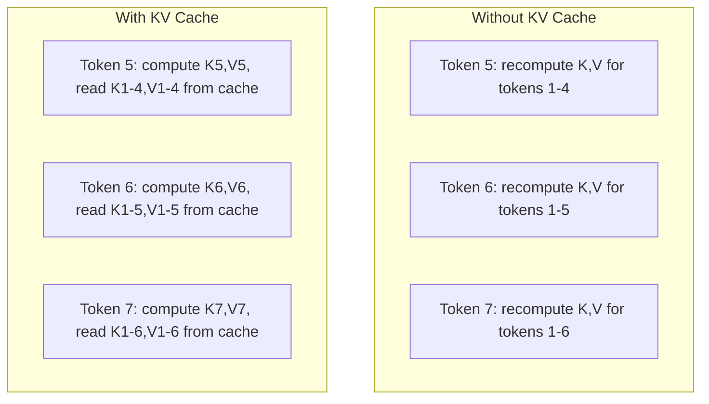
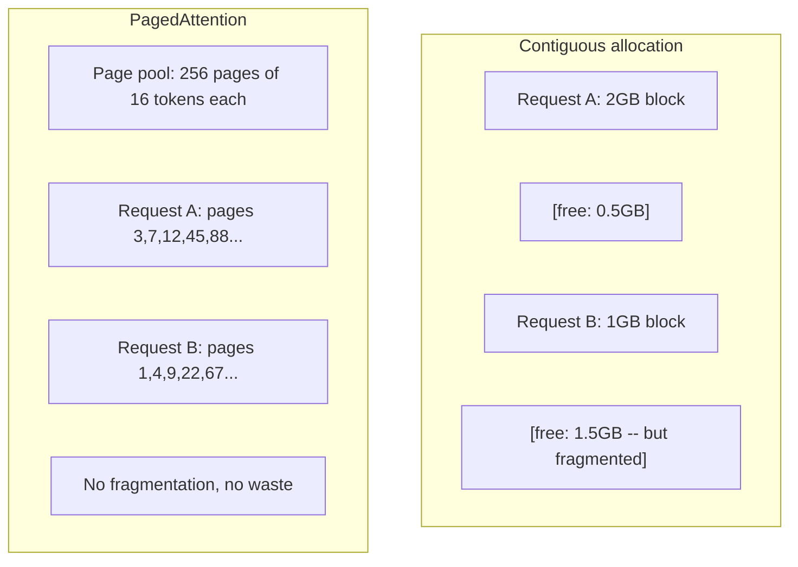

# 推理优化

> 两个阶段def 了LLM推理。预先填充并行处理您的提示-计算约束。解码每次产生一个令牌，内存是有限的。每个优化都针对一个或两个目标。

**Type:** Build
**Languages:** Python
**Prerequisites:** Phase 10, Lessons 01-08 (Transformer architecture, attention)
**Time:** ~120 minutes

## 学习目标

- 实现KV-cache，消除自回归令牌生成过程中的冗余计算
- 解释LLM推理的预填充和解码阶段，以及为什么每个阶段都有不同的瓶颈（计算限制和内存限制）
- 实现连续批处理和PagedAttention的概念，以最大限度地提高并发请求下的GPU利用率
- 比较推理优化技术（KV-cache，推测解码，闪光注意）与它们的吞吐量/延迟权衡

## 这个问题

您将Llama 370b部署在4xA100 gpu上。单个用户每秒获得大约50个令牌。感觉很快。然后100个用户同时访问端点。吞吐量下降到每个用户每秒3个令牌。你对每月25000美元的GPU账单的反应比人类慢。

模型本身在一个用户和一百个用户之间不会改变。同样的权重，同样的结构，同样的数学。改变的是你安排工作的方式。朴素推理浪费了超过90%的可用GPU计算。当GPU内存总线空闲时，等待令牌47的用户保持整个批处理插槽打开。同时，针对新用户的2,000个令牌提示可以填充有用的计算，以弥补停机时间。

这不是一个规模问题。这是一个调度问题。本课中的技术——KV缓存、连续批处理、页面保留、推测解码和前缀缓存——是用来区分每月25,000美元的推理账单和每月50,000美元的流量账单的技术。

在4xA100-80GB上为Llama 370b提供服务的vLLM在低并发性下实现了每个用户每秒大约50个令牌，并通过连续批处理和页面保留在100个并发请求下保持了每个用户15-25个TPS。如果没有这些优化，在这种并发性下，相同的硬件将为每个用户提供5 TPS的服务。同样的gpu，同样的型号，四倍的吞吐量。

## 这个概念

### 预填充vs解码

每个LLM推理请求有两个不同的阶段。

*“预填充”处理整个输入提示。所有的标记都是已知的，所以注意力可以在整个序列中并行计算。这是一个非常大的矩阵乘法——GPU核心总是很忙。瓶颈是计算：您的硬件每秒可以提供多少个FLOPS ？A100的TFLOPS为312 （BF16）。预填充70B型号上的4096令牌提示在单个A100上大约需要400ms。

**Decode**每次生成一个输出令牌。每个新令牌都关注所有以前的令牌，但每次向前传递时只生成一个令牌。权重矩阵的大小与预填充期间相同，但您将它们乘以单个向量而不是矩阵。GPU核心在几微秒内完成，然后等待下一批权重从内存到达。瓶颈是内存带宽：模型权重从HBM传输到计算单元的速度有多快。A100的带宽为2tb /s。FP16的70B型号为140gb。一次读取完整的模型需要70毫秒——这是解码步骤的下限。

“mermaid”
“图LR
子图“预填充（计算绑定）”
P1[“所有提示令牌”]- > P2[“平行注意”]
P3[“充分利用”]
在

子图“解码（内存限制）”
D1[“一次一个令牌”]- > D2[“顺序生成”]
D2 - > D3[等待内存读取]
在

P3 -> d1
```

The **ops:byte ratio** (also called arithmetic intensity) captures this tradeoff. It measures how many operations you perform per byte loaded from memory.

```
ops：字节比率=从内存中读取每个令牌/字节的FLOPs数
```

During prefill with a batch of 4,096 tokens, you perform ~4,096 multiply-accumulate operations per weight loaded. The ratio is high -- you are compute-bound. During decode with batch size 1, you perform ~1 operation per weight loaded. The ratio is low -- you are memory-bound.

The fundamental insight: *decode is memory-bound because you read the entire model to produce a single token*. Every optimization below either reduces what you read, increases the batch of tokens processed per read, or avoids reads entirely.

### KV Cache

During attention, each token's query attends to every previous token's key and value vectors. Without caching, generating token N requires recomputing the key and value projections for all N-1 preceding tokens. Token 1 gets projected when generating token 2, then again for token 3, then again for token 4. By token 1,000, you have projected token 1 a total of 999 times.

The KV cache stores the key and value projections from all previous tokens. When generating token N, you only compute the key and value for token N, then concatenate them with the cached K/V from tokens 1 through N-1.



*千伏高速缓存存储器的公式

```
KV cache size = 2 * num_layers * num_kv_heads * head_dim * seq_len * bytes_per_param
```

对于Llama 370b(80层，8 KV头部与GQA， head_dim=128, BF16)：

```
per token: 2 * 80 * 8 * 128 * 2 bytes = 327,680 bytes = 320 KB
at 4,096 tokens: 320 KB * 4,096 = 1.28 GB
at 128K tokens: 320 KB * 131,072 = 40 GB
```

Llama 370b的单个128k上下文对话消耗40gb KV缓存- A100内存的一半。对于100个并发用户，每个用户使用一个4K令牌，仅KV缓存就需要128 GB。这就是为什么KV缓存管理是推理优化中的一个核心挑战。

### 连续配料

静态批处理等待一批N个请求到达，一起处理它们，直到“全部”完成后才接受新请求。如果一个请求需要500个令牌，而另一个请求需要10个令牌，那么短请求将在完成后空闲490个解码步骤。

连续批处理（也称为迭代批处理）在任何请求完成后立即将新请求插入到批处理中。批处理在每个解码步骤被重新评估。在10个令牌之后完成的请求将立即被一个等待的请求所取代。

“mermaid”
sequenceDiagram
参与者GPU
参与者R1作为请求1（50个令牌）
参与者R2作为请求2（10个令牌）
参与者R3作为请求3（30个代币）
参与者R4作为请求4（等待）

GPU：静态批处理
GPU->>R1：处理批处理[R1， R2, R3]
R2: R2在步骤10中完成
注意R2:40步浪费了…
备注R3: R3在步骤30中完成
R3：浪费20步…
GPU->>R4：最后，在步骤50中启动R4

GPU：连续批处理
GPU->>R1：处理批处理[R1， R2, R3]
R2: R2在步骤10中完成
GPU->>R4：在步骤11中插入R4
备注R3: R3在步骤30中完成
```

The throughput improvement depends on how much output lengths vary. With uniform lengths, continuous batching matches static batching. With variable lengths (the common case), continuous batching can deliver 2-5x higher throughput because GPU slots never sit empty.

### PagedAttention

The KV cache for each request is a contiguous block of memory. As requests arrive and depart, memory fragments -- exactly like RAM fragmentation in operating systems. A 4K-token request needs 1.28 GB contiguous. Even if you have 2 GB free total, you might not have 1.28 GB *contiguous*. You either waste memory or reject the request.

PagedAttention (from vLLM) applies OS-style virtual memory to KV cache. Instead of allocating one contiguous block per request, it allocates fixed-size "pages" (typically 16 tokens each). Pages can be anywhere in physical GPU memory. A page table maps each request's logical sequence positions to physical page locations.



PagedAttention还为共享前缀启用了“写时复制”功能。如果50个请求共享相同的系统提示符，则该系统提示符的KV缓存页存储一次，并由所有50个请求引用。只有当请求偏离（不同的用户消息）时，它才会得到自己的页面。对于具有共享系统提示的应用程序，这大大减少了内存使用。

vLLM通过PagedAttention报告几乎为零的内存浪费（~4% vs ~60-80%的初始分配）。

### 解码投机

解码是缓慢的，因为它是连续的——你生成一个令牌，反馈它，然后生成下一个。但是，如果你可以便宜地猜出接下来的五个令牌，然后一次验证它们呢？

推测解码使用一个小的、快速的草案模型来生成K个候选令牌。然后，大目标模型在一次前向传递中处理所有K个候选对象（看起来像预填充-并行，计算约束，高效）。如果目标模型的预测与草案模型的预测一致，则在目标向前通过一次的时间内，所有K个令牌将被接受。如果它与位置j不一致，则接受令牌1到j-1，并放弃其余的。

“mermaid”
“图LR
D["Draft model (1B)“] - >|”生成5个令牌<br/>~5ms"| C[" candidate: the cat sitting on the"]
C - >t[“目标模型（70B）”]
T——> “一次验证所有5个<br/>~70ms” V{“ Match?”｝
V - > “4/5 Match“ A[”在75ms内接受4个令牌<br/>vs 280ms序列”]
V - >“第5点不匹配”R[“拒绝令牌5<br/>来自目标的样本”]
```

The speedup depends on the **acceptance rate** -- how often the draft model's predictions match the target. For a Llama 3 8B drafting for Llama 3 70B, acceptance rates of 70-85% are typical on natural language. This translates to 2-3x decode speedup.

Three approaches to speculative decoding:

| Method | Draft source | Acceptance rate | Overhead |
|--------|-------------|-----------------|----------|
| Draft-target (Leviathan et al.) | Separate small model | 70-85% | Draft model memory |
| EAGLE (Li et al.) | Lightweight head on target | 75-90% | ~1% extra parameters |
| N-gram lookup | Token n-gram table | 40-60% | Negligible |

**EAGLE** trains a small autoregressive head on top of the target model's hidden states. It predicts the next token's embedding using the target model's second-to-last layer features. Because it operates on the target model's own representations (not a separate model's), it achieves higher acceptance rates with minimal extra memory. EAGLE-2 adds a dynamic draft tree that adjusts candidate count based on context.

**N-gram speculative decoding** maintains a table of n-gram continuations from the current context or a prebuilt corpus. If the draft matches what appeared before in the same conversation (repetitive patterns, code, structured output), it fires with zero neural network overhead. Acceptance rates are lower on average but the cost per speculation is essentially free.

Speculative decoding is *mathematically exact* -- the output distribution is identical to the target model's distribution. It is not an approximation. The verification step ensures that every accepted token has exactly the probability the target model would have assigned.

### Prefix Caching

Many requests share the same prefix. A chatbot system prompt. A RAG context block. A few-shot example set. Without prefix caching, every request recomputes the KV cache for these shared tokens from scratch.

Prefix caching stores the KV cache for common prefixes and reuses it across requests. When a new request arrives with a known prefix, the system copies (or references) the cached KV entries and only computes the KV for the unique suffix.

For a 2,000-token system prompt shared across all requests, prefix caching eliminates ~400ms of prefill per request. At 100 requests/second, that saves 40 seconds of GPU compute per second -- more than one GPU's worth of work.

SGLang's RadixAttention implements prefix caching with a radix tree (trie) that indexes prefixes by their token content. Any request matching a stored prefix gets its KV cache for free. The tree enables partial prefix matches -- if you share 1,500 of 2,000 prefix tokens with a cached entry, you reuse those 1,500 and recompute only 500.

### Inference Engines

Three engines dominate production LLM serving:

| Engine | Key innovation | Best for |
|--------|---------------|----------|
| vLLM | PagedAttention, continuous batching | General-purpose serving, highest compatibility |
| SGLang | RadixAttention (prefix caching), structured generation | Multi-turn chatbots, constrained decoding |
| TensorRT-LLM | NVIDIA kernel fusion, FP8 quantization | Maximum single-GPU throughput on NVIDIA hardware |

**vLLM** is the default starting point. It supports the widest range of models, runs on any GPU vendor (NVIDIA, AMD, Intel), and achieves strong throughput through PagedAttention + continuous batching. The OpenAI-compatible API means you can drop it in as a replacement for any OpenAI API call.

**SGLang** builds on the same foundations as vLLM but adds RadixAttention for prefix caching and a domain-specific language for structured LLM programs. If your workload involves multi-turn conversations, tool use, or constrained decoding (JSON output, regex-guided generation), SGLang often outperforms vLLM by 2-5x through prefix reuse.

**TensorRT-LLM** compiles models into optimized NVIDIA GPU kernels. It fuses operations (attention + linear + activation in one kernel), uses FP8 on H100 GPUs, and integrates with NVIDIA Triton Inference Server for production deployment. It achieves the highest single-GPU throughput on NVIDIA hardware but requires more setup and only works on NVIDIA GPUs.

Real-world numbers for Llama 3 70B (4xA100-80GB, BF16):

| Metric | vLLM | SGLang | TensorRT-LLM |
|--------|------|--------|---------------|
| Throughput (1 user) | ~50 TPS | ~55 TPS | ~65 TPS |
| Throughput (100 users) | ~2,500 total TPS | ~3,200 total TPS | ~3,000 total TPS |
| Time to first token | ~400ms | ~300ms (prefix hit) | ~350ms |
| Max context | 128K | 128K | 128K |

### The Ops:Byte Framework

You cannot optimize what you do not measure. The ops:byte ratio tells you whether you are compute-bound or memory-bound, which determines which optimizations matter.

```
计算峰值：GPU的FLOPS峰值
内存top：峰值带宽* ops：字节比
```

When ops:byte is low (decode, small batches), you hit the memory bandwidth roof. Adding more compute (higher clock, more cores) does not help. You need to reduce memory reads (quantization, KV cache compression) or increase the batch size to amortize reads across more useful work.

When ops:byte is high (prefill, large batches), you hit the compute roof. Memory bandwidth optimization does not help. You need faster GPUs, kernel fusion, or reduced precision to squeeze more FLOPS.

| Scenario | ops:byte | Bound | Optimize with |
|----------|----------|-------|---------------|
| Prefill, batch=1 | ~4,096 | Compute | Kernel fusion, FP8 |
| Decode, batch=1 | ~1 | Memory | Quantization, KV compression |
| Decode, batch=32 | ~32 | Memory | Larger batch, continuous batching |
| Decode, batch=256 | ~256 | Transitioning | Both matter |
| Decode, batch=1024 | ~1,024 | Compute | Kernel fusion, tensor parallelism |

The crossover point on A100 is around ops:byte = 156 (312 TFLOPS / 2 TB/s). Below 156, you are memory-bound. Above 156, you are compute-bound. Continuous batching pushes decode toward this crossover by packing more tokens per iteration.

## Build It

### Step 1: KV Cache from Scratch

We build a multi-head KV cache that stores key and value projections per layer, per head, and demonstrates the memory growth pattern.

```python
import numpy as np

class KVCache:
    def __init__(self, num_layers, num_heads, head_dim, max_seq_len, dtype=np.float16):
        self.num_layers = num_layers
        self.num_heads = num_heads
        self.head_dim = head_dim
        self.max_seq_len = max_seq_len
        self.dtype = dtype

        self.k_cache = np.zeros(
            (num_layers, num_heads, max_seq_len, head_dim), dtype=dtype
        )
        self.v_cache = np.zeros(
            (num_layers, num_heads, max_seq_len, head_dim), dtype=dtype
        )
        self.seq_len = 0

    def update(self, layer_idx, new_keys, new_values):
        num_new = new_keys.shape[1]
        end = self.seq_len + num_new
        self.k_cache[layer_idx, :, self.seq_len:end, :] = new_keys
        self.v_cache[layer_idx, :, self.seq_len:end, :] = new_values
        return (
            self.k_cache[layer_idx, :, :end, :],
            self.v_cache[layer_idx, :, :end, :]
        )

    def advance(self, num_tokens):
        self.seq_len += num_tokens

    def memory_bytes(self):
        return self.k_cache.nbytes + self.v_cache.nbytes

    def used_bytes(self):
        per_token = 2 * self.num_layers * self.num_heads * self.head_dim * np.dtype(self.dtype).itemsize
        return per_token * self.seq_len
```

### 第二步：注意千伏缓存

一个简化的多头注意，使用KV缓存为解码步骤。

”“python
Def scaled_dot_product_attention（查询，键，值）：
Head_dim = query.shape[-1]
得分= np。matmul(查询、关键。转置(0,1,3,2)/ np。√head_dim
Seq_len_q = scores.shape[-2]
Seq_len_k = scores.shape[-1]
如果seq_len_q > 1：
掩码= np。triu (np。triu) Ones ((seq_len_q, seq_len_k), dtype=np。Float32), k=seq_len_k - seq_len_q + 1)
分数=分数+掩码* （-1e9）
Max_scores = np。max （scores, axis=-1, keepdim =True）
Exp_scores = np。Exp （scores - max_scores）
Attn_weights = exp_scores/np。sum （exp_scores, axis=-1, keepdim =True）
返回np。Matmul （attn_weights value）


类MultiHeadAttention:
Def __init__(self, d_model, num_heads)：
自我。Num_heads = Num_heads
自我。Head_dim = d_model // num_heads
尺度= np。SQRT （2.0 / d_model）
自我。W_q = np.random。Randn （d_model）astype (np)。Float32) *缩放
自我。W_k = np.random。Randn （d_model）astype (np)。Float32) *缩放
自我。W_v = np.random。Randn （d_model）astype (np)。Float32) *缩放
自我。W_o = np.random。Randn （d_model）astype (np)。Float32) *缩放

def forward(self, x, kv_cache=None, layer_idx=0)：
Batch, seq_len, d_model = x.shape
Q = np.self。W_q matmul (x)。Batch, seq_len, self。Num_heads self.head_dim)。（0,2,1,3）
K = np.self。W_k matmul (x)batch, seq_len, self。Num_heads self.head_dim)。（0,2,1,3）
V = np.self。W_v matmul (x)batch, seq_len, self。Num_heads self.head_dim)。（0,2,1,3）

如果kv_cache不为空：
K_full, v_full=kv_cacheupdate（layer_idx, k[0], v[0]）
K =k_full [npnewaxis,:,:,:]
V =v_full [npnewaxis,:,:,:]
如果seq_lene = = 1:
kv_cache。推进(1)

attn_out = scaled_dot_product_attention（Q， K， V）
Attn_out = Attn_out .（0,2,1,3）。** * （batch, -1, d_model）
# [au:] [au:]W_o)
```

### Step 3: Continuous Batching Simulator

This simulates the scheduling difference between static and continuous batching.

```python
import heapq

class Request:
    def __init__(self, request_id, prompt_tokens, output_tokens, arrival_step):
        self.request_id = request_id
        self.prompt_tokens = prompt_tokens
        self.output_tokens = output_tokens
        self.arrival_step = arrival_step
        self.tokens_generated = 0
        self.start_step = None
        self.end_step = None

    def is_done(self):
        return self.tokens_generated >= self.output_tokens


def simulate_static_batching(requests, batch_size):
    step = 0
    completed = []
    queue = list(requests)
    queue.sort(key=lambda r: r.arrival_step)

    while queue:
        batch = []
        while queue and len(batch) < batch_size:
            r = queue.pop(0)
            r.start_step = max(step, r.arrival_step)
            batch.append(r)

        if batch:
            step = max(step, max(r.start_step for r in batch))
            max_output = max(r.output_tokens for r in batch)
            for r in batch:
                r.tokens_generated = r.output_tokens
                r.end_step = step + max_output
            step += max_output
            completed.extend(batch)

    return completed


def simulate_continuous_batching(requests, batch_size):
    step = 0
    completed = []
    queue = sorted(requests, key=lambda r: r.arrival_step)
    queue_idx = 0
    active = []
    waiting = []

    while queue_idx < len(queue) or active or waiting:
        while queue_idx < len(queue) and queue[queue_idx].arrival_step <= step:
            waiting.append(queue[queue_idx])
            queue_idx += 1

        while waiting and len(active) < batch_size:
            r = waiting.pop(0)
            r.start_step = step
            active.append(r)

        if not active:
            if waiting:
                step += 1
                continue
            elif queue_idx < len(queue):
                step = queue[queue_idx].arrival_step
                continue
            else:
                break

        for r in active:
            r.tokens_generated += 1

        done = [r for r in active if r.is_done()]
        for r in done:
            r.end_step = step + 1
            completed.append(r)
        active = [r for r in active if not r.is_done()]

        step += 1

    return completed


def batching_stats(completed):
    latencies = [r.end_step - r.arrival_step for r in completed]
    total_time = max(r.end_step for r in completed) - min(r.arrival_step for r in completed)
    total_tokens = sum(r.output_tokens for r in completed)
    return {
        "avg_latency": np.mean(latencies),
        "p50_latency": np.median(latencies),
        "p99_latency": np.percentile(latencies, 99),
        "total_time": total_time,
        "throughput": total_tokens / total_time if total_time > 0 else 0,
    }
```

### 步骤4：前缀缓存

一种基于试用的前缀缓存，用于存储共享前缀的KV条目。

”“python
类TrieNode:
def __init__(自我):
自我。子节点= {}
自我。Kv_data = none
自我。Hit_count = 0


类PrefixCache
Def __init__(self, max_entries=1000)：
自我。root = TrieNode （）
自我。Max_entries = Max_entries
自我。Total_entries = 0
自我。命中次数= 0
自我。误差= 0

Def _walk(self, token_ids)：
节点= self.root
深度= 0
对于token_ids中的tid：
如果tid不在node.children中：
“突破”
Node = Node .children[tid]
深度+= 1
返回节点，深度

Def lookup(self, token_ids)：
节点，深度= self。_walk (token_ids)
如果深度> 0：
自我。点击次数+= 1
Current = self.root
对于token_ids[:depth]中的tid：
Current =当前.children[tid]
电流。Hit_count += 1
Kv_entries = []
Current = self.root
对于token_ids[:depth]中的tid：
Current =当前.children[tid]
如果电流。kv_data不为None：
kv_entries。追加(current.kv_data)
返回深度，kv_entries
自我。错误次数+= 1
返回0，[]

Def insert(self, token_ids, kv_per_token)：
节点= self.root
对于i， tid在enumerate （token_ids）中：
如果tid不在node.children中：
如果自己。Total_entries >= self.max_entries：
回到我身边
节点。children[tid] = TrieNode （）
自我。Total_entries += 1
Node = Node .children[tid]
如果我< len(kv_per_token)：
节点。Kv_data = kv_per_token[i]
返回len （token_ids）

def hit_rate(自我):
Total = self。点击+ self。错过
回归自我。如果总点击次数大于0，则为0.0
```

### Step 5: Speculative Decoding Simulator

We simulate draft-target speculative decoding with configurable acceptance rates.

```python
class DraftModel:
    def __init__(self, vocab_size, acceptance_rate=0.8):
        self.vocab_size = vocab_size
        self.acceptance_rate = acceptance_rate

    def generate(self, context, num_tokens):
        tokens = np.random.randint(0, self.vocab_size, size=num_tokens)
        return tokens

    def get_probs(self, context, token):
        probs = np.random.dirichlet(np.ones(self.vocab_size))
        return probs


class TargetModel:
    def __init__(self, vocab_size):
        self.vocab_size = vocab_size

    def get_probs(self, context, tokens=None):
        if tokens is not None:
            return [np.random.dirichlet(np.ones(self.vocab_size)) for _ in tokens]
        return np.random.dirichlet(np.ones(self.vocab_size))


def speculative_decode(draft_model, target_model, context, num_speculative=5,
                       draft_cost=1.0, target_cost=10.0, verify_cost=12.0):
    total_tokens = 0
    total_cost = 0.0
    accepted_counts = []
    context = list(context)

    max_tokens = 100

    while total_tokens < max_tokens:
        draft_tokens = draft_model.generate(context, num_speculative)
        total_cost += draft_cost * num_speculative

        target_probs = target_model.get_probs(context, draft_tokens)
        total_cost += verify_cost

        accepted = 0
        for i, token in enumerate(draft_tokens):
            draft_p = draft_model.get_probs(context + list(draft_tokens[:i]), token)
            target_p = target_probs[i]

            r = np.random.random()
            acceptance_prob = min(1.0, target_p[token] / (draft_p[token] + 1e-10))

            if r < draft_model.acceptance_rate:
                accepted += 1
                context.append(token)
                total_tokens += 1
            else:
                new_token = np.random.choice(draft_model.vocab_size, p=target_p)
                context.append(new_token)
                total_tokens += 1
                break

        accepted_counts.append(accepted)

        if accepted == num_speculative:
            bonus_probs = target_model.get_probs(context)
            bonus_token = np.random.choice(draft_model.vocab_size, p=bonus_probs)
            context.append(bonus_token)
            total_tokens += 1

    sequential_cost = total_tokens * target_cost
    return {
        "total_tokens": total_tokens,
        "speculative_cost": total_cost,
        "sequential_cost": sequential_cost,
        "speedup": sequential_cost / total_cost if total_cost > 0 else 1.0,
        "avg_accepted": np.mean(accepted_counts),
        "acceptance_rate": np.mean(accepted_counts) / num_speculative,
    }


def compare_speculation_strategies(vocab_size=1000, num_trials=20):
    results = {}

    for name, acceptance_rate, spec_tokens in [
        ("Draft-target (8B->70B)", 0.78, 5),
        ("EAGLE", 0.85, 6),
        ("N-gram", 0.50, 4),
        ("No speculation", 0.0, 0),
    ]:
        if spec_tokens == 0:
            results[name] = {
                "speedup": 1.0,
                "acceptance_rate": 0.0,
                "avg_accepted": 0.0,
            }
            continue

        trial_results = []
        for _ in range(num_trials):
            draft = DraftModel(vocab_size, acceptance_rate=acceptance_rate)
            target = TargetModel(vocab_size)
            context = list(np.random.randint(0, vocab_size, size=10))
            result = speculative_decode(draft, target, context, num_speculative=spec_tokens)
            trial_results.append(result)

        results[name] = {
            "speedup": np.mean([r["speedup"] for r in trial_results]),
            "acceptance_rate": np.mean([r["acceptance_rate"] for r in trial_results]),
            "avg_accepted": np.mean([r["avg_accepted"] for r in trial_results]),
        }

    return results
```

### 第六步：KV高速缓存分析器

计算真实模型配置的千伏缓存内存需求。

```python
MODEL_CONFIGS = {
    "Llama-3-8B": {
        "num_layers": 32, "num_kv_heads": 8, "head_dim": 128,
        "model_params_b": 8, "gqa": True,
    },
    "Llama-3-70B": {
        "num_layers": 80, "num_kv_heads": 8, "head_dim": 128,
        "model_params_b": 70, "gqa": True,
    },
    "Llama-3-405B": {
        "num_layers": 126, "num_kv_heads": 8, "head_dim": 128,
        "model_params_b": 405, "gqa": True,
    },
    "Mistral-7B": {
        "num_layers": 32, "num_kv_heads": 8, "head_dim": 128,
        "model_params_b": 7, "gqa": True,
    },
    "GPT-4-est": {
        "num_layers": 120, "num_kv_heads": 96, "head_dim": 128,
        "model_params_b": 1800, "gqa": False,
    },
}


def kv_cache_memory(config, seq_len, dtype_ byte =2):
per_token = 2 * config[num_layers] * config[num_kv_heads] * dtype_ bytes
All = per_token * seq_len
return (
“per_token_bytes”:per_token,
per_token_kb: per_token / 1024
"total_bytes" : Total
"All mb" : Total/(1024 ** 2)
Total/(1024 ** 3)
)


Def memory_budget(config, gpu_memory_gb, model_dtype_bytes=2, kv_dtype_bytes=2)：
Model_memory_gb = config["model_params_b"] * 1e9 * model_dtype_bytes / （1024 ** 3）
Overhead_gb = gpu_memory_gb * 0.1
Available_for_kv = gpu_memory_gb - model_memory_gb - overhead_gb

如果available_for_kv <= 0：
return {"error ": "Model is not suitable for GPU memory", "model_memory_gb": model_memory_gb}

Per_token = 2 * config["num_layers"] * config["num_kv_heads"] * config["head_dim"] * kv_dtype_bytes
Max_tokens = int（available_for_kv * (1024 ** 3) / per_token）

返回{
“gpu_memory_gb”:gpu_memory_gb,
“ model_memory_gb ”： round(model_memory_gb, 1)，
“ overhead_gb ”： round(overhead_gb, 1)，
“ available_for_kv_gb ”： round(available_for_kv, 1)，
“max_total_tokens”:max_tokens,
“ max_users_at_2k ”： max_tokens // 2048，
“ max_users_at_4k ”： max_tokens // 4096，
“ max_users_at_32k ”： max_tokens // 32768，
｝
```

## Use It

With vLLM:

```python
from vllm import LLM, SamplingParams

llm = LLM(
    model="meta-llama/Llama-3-70B-Instruct",
    tensor_parallel_size=4,
    enable_prefix_caching=True,
    max_model_len=8192,
    gpu_memory_utilization=0.9,
)

params = SamplingParams(temperature=0.7, max_tokens=256)
outputs = llm.generate(["Explain inference optimization in one paragraph."], params)
```

使用SGLang进行前缀缓存+结构化输出：

”“python
将sglang导入为SGL

@sgl.function
未分类（s，文本）：
S += sgl。系统(“你是一个分类器。只输出JSON。”)
S += sgl。用户（f“分类此文本：{text}”）
S += sgl.assistant；Create (" Result ",regex = r \{" Label ":" (Positive - Neutral) "\}"))

Runtime = sgl。运行时（model_path = "meta-llama/camel-3-70-b - indication",tp_size = 4）
sgl.set_default_backend(运行时)

Results = classify.run_batch([
这个产品太神奇了！｝
{“ text “:”糟糕体验”}
“text”： "我想还可以。
])
```

With TensorRT-LLM:

```python
import tensorrt_llm
from tensorrt_llm.runtime import ModelRunner

runner = ModelRunner.from_dir("./llama-70b-trt-engine/", rank=0)

outputs = runner.generate(
    batch_input_ids=[tokenizer.encode("Explain KV caching.")],
    max_new_tokens=256,
    temperature=0.7,
)
```

## 这艘船

这个教训产生：
- 

## 实践

1. 修改千伏缓存分析仪，比较FP16， FP8和INT4千伏缓存量化。对于4K上下文中的Llama 370b，计算每个4xA100-80GB上的最大并发用户。将KV量化为INT4应约为用户容量的四倍。

2. 扩展连续批处理模拟器以跟踪GPU利用率（每一步填充的批处理槽的比例）。对于输出长度符合Pareto分布（形状=1.5，规模=20）的50个请求的静态和连续批处理，绘制随时间变化的利用率图。连续批处理应保持80%的BBB利用率。

3. 实现KV缓存的组查询关注（GQA）版本，其中Llama 370b使用64个查询头，但只有8个KV头。计算与全多头注意相比的内存节省（KV缓存的大小减少了8倍）。

4. 构建一个使用LRU回收的前缀缓存。将max_entries设置为500，生成1000个请求，其中60%的请求共享5个常见前缀之一。测量命中率并将其与无限缓存进行比较。一个好的驱逐应该保持在55%以上的命中率。

5. 扩展推理解码模拟器，实现基于树的推理（EAGLE-2风格）。与其生成K个草案令牌的单一链，不如生成一个候选树（例如，3个关卡中的每一个都有2个分支= 8个叶子候选）。将每个验证轮中接受的令牌总数与线性猜测进行比较。

## 关键术语

| Term | What people say | What it actually means |
|------|----------------|----------------------|
| Prefill | "Processing the prompt" | Computing attention over all input tokens in parallel -- compute-bound because the full matrix multiplication keeps GPU cores busy |
| Decode | "Generating tokens" | Producing one token per forward pass, reading the full model weights each time -- memory-bound because compute finishes before the next weights arrive |
| KV cache | "Caching attention states" | Storing the key and value projections for all previous tokens so they are not recomputed at each decode step -- trades memory for compute |
| Continuous batching | "Dynamic batching" | Inserting new requests into the running batch as soon as any request finishes, evaluated at every decode iteration rather than waiting for the whole batch |
| PagedAttention | "Virtual memory for KV cache" | Allocating KV cache in fixed-size pages instead of contiguous blocks, eliminating memory fragmentation and enabling copy-on-write for shared prefixes |
| Speculative decoding | "Draft and verify" | Using a fast draft model to propose multiple tokens, then verifying them all in one target model forward pass -- mathematically exact, 2-3x speedup |
| EAGLE | "Self-speculative decoding" | A speculative decoding variant that trains a lightweight head on the target model's own hidden states, achieving higher acceptance rates than a separate draft model |
| Prefix caching | "Reusing system prompt KV" | Storing computed KV cache entries for common prefixes (system prompts, few-shot examples) and reusing them across requests to skip redundant prefill |
| Ops:byte ratio | "Arithmetic intensity" | The ratio of compute operations to memory bytes read -- determines whether a workload is compute-bound (high ratio) or memory-bound (low ratio) |
| Time to first token | "TTFT" | Latency from receiving a request to producing the first output token -- dominated by prefill time for long prompts |

## 进一步的阅读

- Kwon等人，“基于PagedAttention Service的大型语言模型的高效内存管理”(2023)-这篇vLLM论文介绍了分页KV缓存管理，这是现在推理服务的行业标准
- 利维坦等人，“通过推理解码从Transformer的快速推理”(2023)-这篇基础论文证明了草案验证推理产生了准确的目标模型分布，同时实现了2-3倍的加速
- Li等人，“EAGLE：投机性采样需要重新考虑特征不确定性”(2024)-通过在目标模型本身的特征上训练头部而不是使用单独的草稿模型来实现更高的接受率
- Zheng等人，《SGLang: Efficient Execution of Structured Language Model Programs》（2024）——介绍了前缀缓存的RadixAttention和多调用LLM程序的编程模型
- Williams等人，“rooline：多核架构的深度视觉性能模型”（2009）——最初的rooline论文形式化了用于推理计算和内存瓶颈的ops: Byte框架