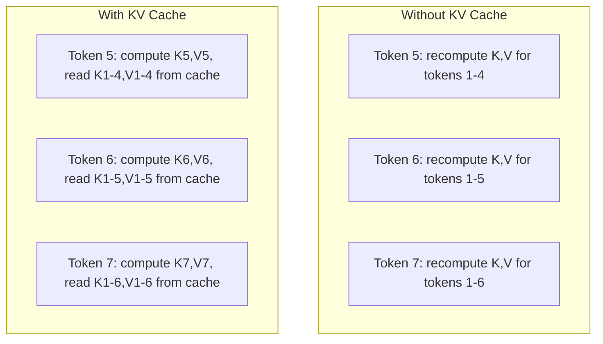
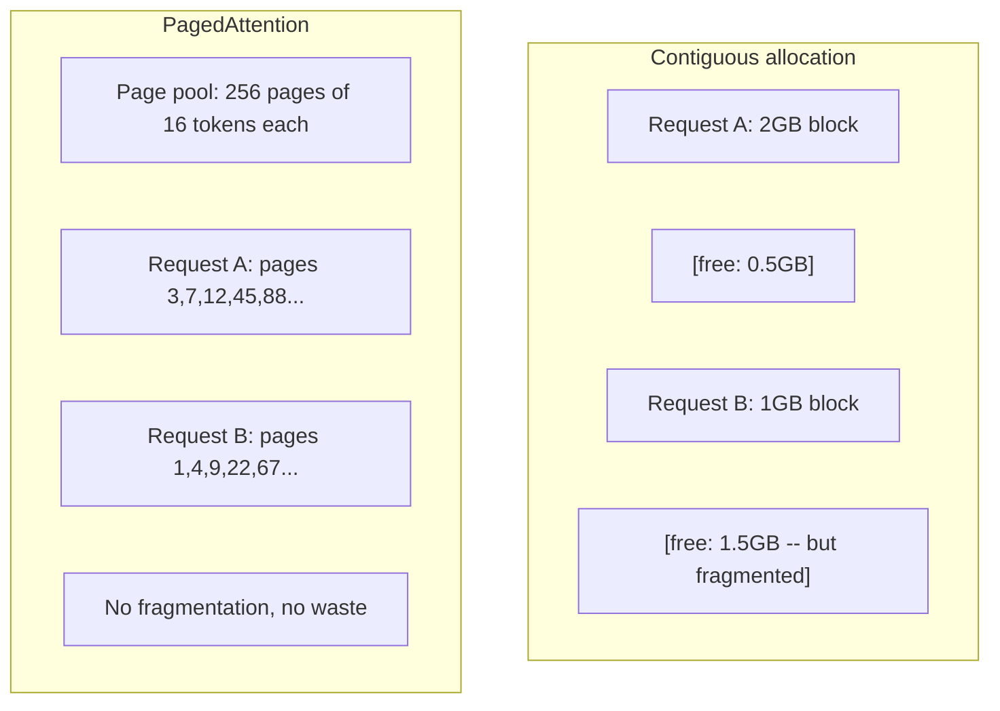

# Optimization of reasoning

> Two stages define LLM inference. Prefill parallel processes your prompt - compute constraints. Decode generates one token each time - memory is limited. Each optimization is targeted at one or two goals.

**Type:** Build
**Languages:** Python
**Prerequisites:** Phase 10, Lessons 01-08 (Transformer architecture, attention)
**Time:** ~120 minutes

## Learning objectives

- Implement KV-cache to eliminate redundant computations in the autoregressive token generation process
- Explain the pre-filling and decoding stages of LLM inference, and why each stage has different bottlenecks (computational limitations and memory limitations)
- Implement the concepts of continuous batch processing and PagedAttention to maximize GPU utilization under concurrent requests
- Compare reasoning optimization techniques (KV-cache, speculative decoding, flash attention) with their throughput/latency trade-offs

## This question

You deploy Llama 370b on a 4xA100 gpu. A single user acquires approximately 50 tokens per second. It feels fast. Then 100 users access the endpoint simultaneously. The throughput has dropped to 3 tokens per second per user. Your response to your $25,000 monthly GPU bill is slower than that of humans.

The model itself does not change between one user and one hundred users. The same weights, the same structure, the same mathematics. What has changed is the way you arrange your work. Naive reasoning wastes over 90% of the available GPU computing. Users waiting for Token 47 keep the entire batch processing slot open when the GPU memory bus is idle. Meanwhile, the 2,000 token prompts for new users can be filled with useful calculations to make up for this downtime.

This is not a scaling issue. This is a scheduling problem. The techniques in this lesson - KV caching, continuous batch processing, page retention, speculative decoding, and prefix caching - are the ones that distinguish a monthly inference bill of $25,000 from a monthly traffic bill of $50,000.

The vLLM serving Llama 370b on 4xA100-80GB achieved approximately 50 tokens per second per user under low concurrency, and maintained 15-25 TPS per user with 100 concurrent requests through continuous batch processing and page retention. Without these optimizations, the same hardware would serve 5 TPS per user under this concurrency. The same gpu, the same model, four times the throughput.

## This concept

### Pre-fill vs decoding

Each LLM inference request has two distinct stages.

*"Pre-fill" processes the entire input prompt. All the markers are known, so the attention can be calculated in parallel throughout the sequence. This is a very large matrix multiplication - the GPU core is always very busy. The bottleneck is computing: how many FLOPS can your hardware provide per second? The TFLOPS of the A100 is 312 (BF16). Pre-filling 4096 token prompts on the 70B model takes approximately 400ms on a single A100.

**Decode** generates an output token each time. Each new token pays attention to all previous tokens, but only one token is generated each time it is passed forward. The size of the weight matrix is the same as during the pre-filling period, but you multiply them by a single vector instead of a matrix. The GPU core completes within microseconds and then waits for the next batch of weights to arrive from memory. The bottleneck is memory bandwidth: how fast can the model weights be transferred from the HBM to the computing unit. The bandwidth of A100 is 2tb /s. The 70B model of FP16 is 140gb. It takes 70 milliseconds to read the complete model at one time - this is the lower limit of a decoding step.

"Mermaid"
"Figure LR
Subgraph "Pre-fill (Compute Binding)
P1[" All Prompt Tokens "] - > P2[" Parallel Attention "]
P2 - > P3[" Make Full Use of "]
Over

Subgraph "Decoding (Memory Limit)
D1[" One token at a time "] - > D2[" Sequential generation "]
D2 - > D3[" Wait for Memory Read "]
Over

P3 -> d1
```

The **ops:byte ratio** (also called arithmetic intensity) captures this tradeoff. It measures how many operations you perform per byte loaded from memory.

```
ops: Byte ratio = the number of FLOPs per token/byte read from memory
```

During prefill with a batch of 4,096 tokens, you perform ~4,096 multiply-accumulate operations per weight loaded. The ratio is high -- you are compute-bound. During decode with batch size 1, you perform ~1 operation per weight loaded. The ratio is low -- you are memory-bound.

The fundamental insight: *decode is memory-bound because you read the entire model to produce a single token*. Every optimization below either reduces what you read, increases the batch of tokens processed per read, or avoids reads entirely.

### KV Cache

During attention, each token's query attends to every previous token's key and value vectors. Without caching, generating token N requires recomputing the key and value projections for all N-1 preceding tokens. Token 1 gets projected when generating token 2, then again for token 3, then again for token 4. By token 1,000, you have projected token 1 a total of 999 times.

The KV cache stores the key and value projections from all previous tokens. When generating token N, you only compute the key and value for token N, then concatenate them with the cached K/V from tokens 1 through N-1.



*The formula for kilovolt high-speed cache memory

```
KV cache size = 2 * num_layers * num_kv_heads * head_dim * seq_len * bytes_per_param
```

For Llama 370b(80 layers, 8 KV head with GQA, head_dim=128, BF16) :

```
per token: 2 * 80 * 8 * 128 * 2 bytes = 327,680 bytes = 320 KB
at 4,096 tokens: 320 KB * 4,096 = 1.28 GB
at 128K tokens: 320 KB * 131,072 = 40 GB
```

A single 128k context conversation of Llama 370b consumes 40gb KV cache - half of the memory of A100. For 100 concurrent users, each using a 4K token, the KV cache alone requires 128 GB. This is why KV cache management is a core challenge in inference optimization.

### Continuous batching

Static batch processing waits for a batch of N requests to arrive, processes them together, and waits until "all" are completed before accepting new requests. If one request requires 500 tokens and another requires 10 tokens, then the short request will idle 490 decoding steps after completion.

Continuous batch processing (also known as iterative batch processing) inserts new requests into the batch processing immediately after any request is completed. Batch processing is re-evaluated at each decoding step. A request completed after 10 tokens will be immediately replaced by a waiting request.

"Mermaid"
sequenceDiagram
Participant GPU
Participant R1 as Request 1 (50 tokens)
Participant R2 as Request 2 (10 tokens)
Participant R3 as request 3 (30 tokens)
Participant R4 as request 4 (waiting)

Note GPU: Static batch processing
GPU->>R1: Processes batch processing [R1, R2, R3]
Note R2: R2 is completed in Step 10
Note R2:40 steps wasted...
Note R3: R3 is completed in step 30
Note R3: Wasting 20 steps...
GPU->>R4: Finally, start R4 in step 50

GPU: Continuous Batch processing
GPU->>R1: Processes batch processing [R1, R2, R3]
Note R2: R2 is completed in Step 10
GPU->>R4: Insert R4 in step 11
Note R3: R3 is completed in step 30
```

The throughput improvement depends on how much output lengths vary. With uniform lengths, continuous batching matches static batching. With variable lengths (the common case), continuous batching can deliver 2-5x higher throughput because GPU slots never sit empty.

### PagedAttention

The KV cache for each request is a contiguous block of memory. As requests arrive and depart, memory fragments -- exactly like RAM fragmentation in operating systems. A 4K-token request needs 1.28 GB contiguous. Even if you have 2 GB free total, you might not have 1.28 GB *contiguous*. You either waste memory or reject the request.

PagedAttention (from vLLM) applies OS-style virtual memory to KV cache. Instead of allocating one contiguous block per request, it allocates fixed-size "pages" (typically 16 tokens each). Pages can be anywhere in physical GPU memory. A page table maps each request's logical sequence positions to physical page locations.



PagedAttention also enables "copy-on-write" for shared prefixes. If 50 requests share the same system prompt, the KV cache page of that system prompt is stored once and referenced by all 50 requests. It will only get its own page when the request diverges (different user messages). For applications with shared system prompts, this greatly reduces memory usage.

vLLM reports almost zero memory waste (~4% vs ~60-80% initial allocation) through PagedAttention.

### Decoding Speculation

Decoding is slow because it is continuous - you generate a token, feed it back, and generate the next one. But what if you could cheaply guess the next five tokens and then verify them all at once?

Speculative decoding uses a small, fast draft model to generate K candidate tokens. Then, the large target model processes all K candidate objects in one forward pass (looking like pre-filled - parallel, computationally constrained, efficient). If the prediction of the target model is consistent with that of the draft model, all K tokens will be accepted within the time of one forward pass of the target. If it does not agree with position j, you accept tokens 1 to j-1 and abandon the rest.

"Mermaid"
"Figure LR
D["Draft model (1B)"]—>|"Generate 5 token <br/>~5ms"| C[" candidate: the cat sitting on the"]
C - > T[" Target Model (70B) "]
T -- > "Verify all 5 at once <br/>~70ms" V{" Match?" }
V - > "4/5 Match" A[" Accept 4 tokens within 75ms <br/>vs 280ms sequence "]
V - > "Point 5 does not match" R[" Rejection token 5<br/> Sample from the target "]
```

The speedup depends on the **acceptance rate** -- how often the draft model's predictions match the target. For a Llama 3 8B drafting for Llama 3 70B, acceptance rates of 70-85% are typical on natural language. This translates to 2-3x decode speedup.

Three approaches to speculative decoding:

| Method | Draft source | Acceptance rate | Overhead |
|--------|-------------|-----------------|----------|
| Draft-target (Leviathan et al.) | Separate small model | 70-85% | Draft model memory |
| EAGLE (Li et al.) | Lightweight head on target | 75-90% | ~1% extra parameters |
| N-gram lookup | Token n-gram table | 40-60% | Negligible |

**EAGLE** trains a small autoregressive head on top of the target model's hidden states. It predicts the next token's embedding using the target model's second-to-last layer features. Because it operates on the target model's own representations (not a separate model's), it achieves higher acceptance rates with minimal extra memory. EAGLE-2 adds a dynamic draft tree that adjusts candidate count based on context.

**N-gram speculative decoding** maintains a table of n-gram continuations from the current context or a prebuilt corpus. If the draft matches what appeared before in the same conversation (repetitive patterns, code, structured output), it fires with zero neural network overhead. Acceptance rates are lower on average but the cost per speculation is essentially free.

Speculative decoding is *mathematically exact* -- the output distribution is identical to the target model's distribution. It is not an approximation. The verification step ensures that every accepted token has exactly the probability the target model would have assigned.

### Prefix Caching

Many requests share the same prefix. A chatbot system prompt. A RAG context block. A few-shot example set. Without prefix caching, every request recomputes the KV cache for these shared tokens from scratch.

Prefix caching stores the KV cache for common prefixes and reuses it across requests. When a new request arrives with a known prefix, the system copies (or references) the cached KV entries and only computes the KV for the unique suffix.

For a 2,000-token system prompt shared across all requests, prefix caching eliminates ~400ms of prefill per request. At 100 requests/second, that saves 40 seconds of GPU compute per second -- more than one GPU's worth of work.

SGLang's RadixAttention implements prefix caching with a radix tree (trie) that indexes prefixes by their token content. Any request matching a stored prefix gets its KV cache for free. The tree enables partial prefix matches -- if you share 1,500 of 2,000 prefix tokens with a cached entry, you reuse those 1,500 and recompute only 500.

### Inference Engines

Three engines dominate production LLM serving:

| Engine | Key innovation | Best for |
|--------|---------------|----------|
| vLLM | PagedAttention, continuous batching | General-purpose serving, highest compatibility |
| SGLang | RadixAttention (prefix caching), structured generation | Multi-turn chatbots, constrained decoding |
| TensorRT-LLM | NVIDIA kernel fusion, FP8 quantization | Maximum single-GPU throughput on NVIDIA hardware |

**vLLM** is the default starting point. It supports the widest range of models, runs on any GPU vendor (NVIDIA, AMD, Intel), and achieves strong throughput through PagedAttention + continuous batching. The OpenAI-compatible API means you can drop it in as a replacement for any OpenAI API call.

**SGLang** builds on the same foundations as vLLM but adds RadixAttention for prefix caching and a domain-specific language for structured LLM programs. If your workload involves multi-turn conversations, tool use, or constrained decoding (JSON output, regex-guided generation), SGLang often outperforms vLLM by 2-5x through prefix reuse.

**TensorRT-LLM** compiles models into optimized NVIDIA GPU kernels. It fuses operations (attention + linear + activation in one kernel), uses FP8 on H100 GPUs, and integrates with NVIDIA Triton Inference Server for production deployment. It achieves the highest single-GPU throughput on NVIDIA hardware but requires more setup and only works on NVIDIA GPUs.

Real-world numbers for Llama 3 70B (4xA100-80GB, BF16):

| Metric | vLLM | SGLang | TensorRT-LLM |
|--------|------|--------|---------------|
| Throughput (1 user) | ~50 TPS | ~55 TPS | ~65 TPS |
| Throughput (100 users) | ~2,500 total TPS | ~3,200 total TPS | ~3,000 total TPS |
| Time to first token | ~400ms | ~300ms (prefix hit) | ~350ms |
| Max context | 128K | 128K | 128K |

### The Ops:Byte Framework

You cannot optimize what you do not measure. The ops:byte ratio tells you whether you are compute-bound or memory-bound, which determines which optimizations matter.

```
Computing peak: The peak FLOPS of the GPU
Memory top: Peak bandwidth * ops: Byte ratio
```

When ops:byte is low (decode, small batches), you hit the memory bandwidth roof. Adding more compute (higher clock, more cores) does not help. You need to reduce memory reads (quantization, KV cache compression) or increase the batch size to amortize reads across more useful work.

When ops:byte is high (prefill, large batches), you hit the compute roof. Memory bandwidth optimization does not help. You need faster GPUs, kernel fusion, or reduced precision to squeeze more FLOPS.

| Scenario | ops:byte | Bound | Optimize with |
|----------|----------|-------|---------------|
| Prefill, batch=1 | ~4,096 | Compute | Kernel fusion, FP8 |
| Decode, batch=1 | ~1 | Memory | Quantization, KV compression |
| Decode, batch=32 | ~32 | Memory | Larger batch, continuous batching |
| Decode, batch=256 | ~256 | Transitioning | Both matter |
| Decode, batch=1024 | ~1,024 | Compute | Kernel fusion, tensor parallelism |

The crossover point on A100 is around ops:byte = 156 (312 TFLOPS / 2 TB/s). Below 156, you are memory-bound. Above 156, you are compute-bound. Continuous batching pushes decode toward this crossover by packing more tokens per iteration.

## Build It

### Step 1: KV Cache from Scratch

We build a multi-head KV cache that stores key and value projections per layer, per head, and demonstrates the memory growth pattern.

```python
import numpy as np

class KVCache:
    def __init__(self, num_layers, num_heads, head_dim, max_seq_len, dtype=np.float16):
        self.num_layers = num_layers
        self.num_heads = num_heads
        self.head_dim = head_dim
        self.max_seq_len = max_seq_len
        self.dtype = dtype

        self.k_cache = np.zeros(
            (num_layers, num_heads, max_seq_len, head_dim), dtype=dtype
        )
        self.v_cache = np.zeros(
            (num_layers, num_heads, max_seq_len, head_dim), dtype=dtype
        )
        self.seq_len = 0

    def update(self, layer_idx, new_keys, new_values):
        num_new = new_keys.shape[1]
        end = self.seq_len + num_new
        self.k_cache[layer_idx, :, self.seq_len:end, :] = new_keys
        self.v_cache[layer_idx, :, self.seq_len:end, :] = new_values
        return (
            self.k_cache[layer_idx, :, :end, :],
            self.v_cache[layer_idx, :, :end, :]
        )

    def advance(self, num_tokens):
        self.seq_len += num_tokens

    def memory_bytes(self):
        return self.k_cache.nbytes + self.v_cache.nbytes

    def used_bytes(self):
        per_token = 2 * self.num_layers * self.num_heads * self.head_dim * np.dtype(self.dtype).itemsize
        return per_token * self.seq_len
```

### Step 2: Pay attention to the KV cache

A simplified multi-head attention, using KV cache for the decoding step.

”“python
Def scaled_dot_product_attention (query, key, value) :
Head_dim = query.shape[-1]
The score = np. matmul(Query, key. Transpose (0,1,3,2)/ np.sqrt (head_dim)
Seq_len_q = scores.shape[-2]
Seq_len_k = scores.shape[-1]
If seq_len_q > 1:
Mask = np.triu (np.triu) Ones ((seq_len_q, seq_len_k), dtype=np. Float32), k=seq_len_k - seq_len_q + 1)
Score = Score + Mask * (-1e9)
Max_scores = np. max (scores, axis=-1, keepdim =True)
Exp_scores = np. Exp (scores - max_scores)
Attn_weights = exp_scores/np. sum (exp_scores, axis=-1, keepdim =True)
Return np. matmul (attn_weights value)


Class MultiHeadAttention:
Def __init__(self, d_model, num_heads) :
Self. Num_heads = Num_heads
Self. Head_dim = d_model // num_heads
Scale = np.sqrt (2.0 / d_model)
Self. W_q = np.random. randn (d_model d_model.astype (np). Float32) * scaling
Self. W_k = np.random. randn (d_model d_model.astype (np). Float32) * scaling
Self. W_v = np.random. randn (d_model d_model.astype (np). Float32) * scaling
Self. W_o = np.random. randn (d_model d_model.astype (np). Float32) * scaling

def forward(self, x, kv_cache=None, layer_idx=0)：
Batch, seq_len, d_model = x.shape
Q = np.self。W_q matmul (x)。batch, seq_len, self。Num_heads self.head_dim)。神经病（0,2,1,3）
K = np.self。W_k matmul (x)batch, seq_len, self。Num_heads self.head_dim)。神经病（0,2,1,3）
V = np.self。W_v matmul (x)batch, seq_len, self。Num_heads self.head_dim)。神经病（0,2,1,3）

If kv_cache is not empty:
k_full, v_full=kv_cacheupdate(layer_idx, k[0], v[0])
k=k_full [npnewaxis, :, :, :]
v=v_full [npnewaxis, :, :, :]
If seq_lene==1:
kv_cache.advance (1)

attn_out = scaled_dot_product_attention（Q， K， V）
Attn_out = Attn_out .神经病（0,2,1,3）。* * * （batch, -1, d_model）
# # #；[au:] [au:]W_o)
```

### Step 3: Continuous Batching Simulator

This simulates the scheduling difference between static and continuous batching.

```python
import heapq

class Request:
    def __init__(self, request_id, prompt_tokens, output_tokens, arrival_step):
        self.request_id = request_id
        self.prompt_tokens = prompt_tokens
        self.output_tokens = output_tokens
        self.arrival_step = arrival_step
        self.tokens_generated = 0
        self.start_step = None
        self.end_step = None

    def is_done(self):
        return self.tokens_generated >= self.output_tokens


def simulate_static_batching(requests, batch_size):
    step = 0
    completed = []
    queue = list(requests)
    queue.sort(key=lambda r: r.arrival_step)

    while queue:
        batch = []
        while queue and len(batch) < batch_size:
            r = queue.pop(0)
            r.start_step = max(step, r.arrival_step)
            batch.append(r)

        if batch:
            step = max(step, max(r.start_step for r in batch))
            max_output = max(r.output_tokens for r in batch)
            for r in batch:
                r.tokens_generated = r.output_tokens
                r.end_step = step + max_output
            step += max_output
            completed.extend(batch)

    return completed


def simulate_continuous_batching(requests, batch_size):
    step = 0
    completed = []
    queue = sorted(requests, key=lambda r: r.arrival_step)
    queue_idx = 0
    active = []
    waiting = []

    while queue_idx < len(queue) or active or waiting:
        while queue_idx < len(queue) and queue[queue_idx].arrival_step <= step:
            waiting.append(queue[queue_idx])
            queue_idx += 1

        while waiting and len(active) < batch_size:
            r = waiting.pop(0)
            r.start_step = step
            active.append(r)

        if not active:
            if waiting:
                step += 1
                continue
            elif queue_idx < len(queue):
                step = queue[queue_idx].arrival_step
                continue
            else:
                break

        for r in active:
            r.tokens_generated += 1

        done = [r for r in active if r.is_done()]
        for r in done:
            r.end_step = step + 1
            completed.append(r)
        active = [r for r in active if not r.is_done()]

        step += 1

    return completed


def batching_stats(completed):
    latencies = [r.end_step - r.arrival_step for r in completed]
    total_time = max(r.end_step for r in completed) - min(r.arrival_step for r in completed)
    total_tokens = sum(r.output_tokens for r in completed)
    return {
        "avg_latency": np.mean(latencies),
        "p50_latency": np.median(latencies),
        "p99_latency": np.percentile(latencies, 99),
        "total_time": total_time,
        "throughput": total_tokens / total_time if total_time > 0 else 0,
    }
```

### Step 4: Prefix caching

A trial-based prefix cache for storing KV entries of shared prefixes.

”“python
Class TrieNode:
def __init__(self):
Self. Child node = {}
Self. kv_data = none
Self. Hit_count = 0


Class PrefixCache
Def __init__(self, max_entries=1000) :
Self. root = TrieNode ()
Self. Max_entries = Max_entries
Self. Total_entries = 0
Self. The number of hits = 0
Self. Error = 0

Def _walk(self, token_ids) :
Node = self.root
Depth = 0
For the tid in token_ids:
If the tid is not in node.children:
"Break"
Node = Node .children[tid]
Depth += 1
Return node, depth

Def lookup(self, token_ids) :
Node, depth = self._walk (token_ids)
If depth > 0:
Self. The number of hits += 1
Current = self.root
For the tid in token_ids[:depth] :
Current = Current .children[tid]
Electric current. Hit_count += 1
Kv_entries = []
Current = self.root
For the tid in token_ids[:depth] :
Current = Current .children[tid]
If the current. kv_data is not None:
kv_entries.append (current.kv_data)
Return depth, kv_entries
Self. The number of mistakes += 1
Return 0, []

Def insert(self, token_ids, kv_per_token) :
Node = self.root
For i, tid is in enumerate (token_ids) :
If the tid is not in node.children:
If oneself. Total_entries >= self.max_entries:
Return to me
Node. children[tid] = TrieNode ()
Self. Total_entries += 1
Node = Node .children[tid]
If I < len(kv_per_token) :
Node. Kv_data = kv_per_token[i]
Return len (token_ids)

def hit_rate(self):
Total = self. Hit + self. misses
Return to oneself. If the total number of clicks is greater than 0, it is 0.0
```

### Step 5: Speculative Decoding Simulator

We simulate draft-target speculative decoding with configurable acceptance rates.

```python
class DraftModel:
    def __init__(self, vocab_size, acceptance_rate=0.8):
        self.vocab_size = vocab_size
        self.acceptance_rate = acceptance_rate

    def generate(self, context, num_tokens):
        tokens = np.random.randint(0, self.vocab_size, size=num_tokens)
        return tokens

    def get_probs(self, context, token):
        probs = np.random.dirichlet(np.ones(self.vocab_size))
        return probs


class TargetModel:
    def __init__(self, vocab_size):
        self.vocab_size = vocab_size

    def get_probs(self, context, tokens=None):
        if tokens is not None:
            return [np.random.dirichlet(np.ones(self.vocab_size)) for _ in tokens]
        return np.random.dirichlet(np.ones(self.vocab_size))


def speculative_decode(draft_model, target_model, context, num_speculative=5,
                       draft_cost=1.0, target_cost=10.0, verify_cost=12.0):
    total_tokens = 0
    total_cost = 0.0
    accepted_counts = []
    context = list(context)

    max_tokens = 100

    while total_tokens < max_tokens:
        draft_tokens = draft_model.generate(context, num_speculative)
        total_cost += draft_cost * num_speculative

        target_probs = target_model.get_probs(context, draft_tokens)
        total_cost += verify_cost

        accepted = 0
        for i, token in enumerate(draft_tokens):
            draft_p = draft_model.get_probs(context + list(draft_tokens[:i]), token)
            target_p = target_probs[i]

            r = np.random.random()
            acceptance_prob = min(1.0, target_p[token] / (draft_p[token] + 1e-10))

            if r < draft_model.acceptance_rate:
                accepted += 1
                context.append(token)
                total_tokens += 1
            else:
                new_token = np.random.choice(draft_model.vocab_size, p=target_p)
                context.append(new_token)
                total_tokens += 1
                break

        accepted_counts.append(accepted)

        if accepted == num_speculative:
            bonus_probs = target_model.get_probs(context)
            bonus_token = np.random.choice(draft_model.vocab_size, p=bonus_probs)
            context.append(bonus_token)
            total_tokens += 1

    sequential_cost = total_tokens * target_cost
    return {
        "total_tokens": total_tokens,
        "speculative_cost": total_cost,
        "sequential_cost": sequential_cost,
        "speedup": sequential_cost / total_cost if total_cost > 0 else 1.0,
        "avg_accepted": np.mean(accepted_counts),
        "acceptance_rate": np.mean(accepted_counts) / num_speculative,
    }


def compare_speculation_strategies(vocab_size=1000, num_trials=20):
    results = {}

    for name, acceptance_rate, spec_tokens in [
        ("Draft-target (8B->70B)", 0.78, 5),
        ("EAGLE", 0.85, 6),
        ("N-gram", 0.50, 4),
        ("No speculation", 0.0, 0),
    ]:
        if spec_tokens == 0:
            results[name] = {
                "speedup": 1.0,
                "acceptance_rate": 0.0,
                "avg_accepted": 0.0,
            }
            continue

        trial_results = []
        for _ in range(num_trials):
            draft = DraftModel(vocab_size, acceptance_rate=acceptance_rate)
            target = TargetModel(vocab_size)
            context = list(np.random.randint(0, vocab_size, size=10))
            result = speculative_decode(draft, target, context, num_speculative=spec_tokens)
            trial_results.append(result)

        results[name] = {
            "speedup": np.mean([r["speedup"] for r in trial_results]),
            "acceptance_rate": np.mean([r["acceptance_rate"] for r in trial_results]),
            "avg_accepted": np.mean([r["avg_accepted"] for r in trial_results]),
        }

    return results
```

### Step 6:KV Cache Memory analyzer

Calculate the KV cache memory requirements for the real model configuration.

```python
MODEL_CONFIGS = {
    "Llama-3-8B": {
        "num_layers": 32, "num_kv_heads": 8, "head_dim": 128,
        "model_params_b": 8, "gqa": True,
    },
    "Llama-3-70B": {
        "num_layers": 80, "num_kv_heads": 8, "head_dim": 128,
        "model_params_b": 70, "gqa": True,
    },
    "Llama-3-405B": {
        "num_layers": 126, "num_kv_heads": 8, "head_dim": 128,
        "model_params_b": 405, "gqa": True,
    },
    "Mistral-7B": {
        "num_layers": 32, "num_kv_heads": 8, "head_dim": 128,
        "model_params_b": 7, "gqa": True,
    },
    "GPT-4-est": {
        "num_layers": 120, "num_kv_heads": 96, "head_dim": 128,
        "model_params_b": 1800, "gqa": False,
    },
}


def kv_cache_memory(config, seq_len, dtype_ byte =2):
per_token = 2 * config[num_layers] * config[num_kv_heads] * dtype_ bytes
All = per_token * seq_len
return (
“per_token_bytes”:per_token,
per_token_kb: per_token / 1024
"total_bytes" : Total
"All mb" : Total/(1024 ** 2)
Total/(1024 ** 3)
)


Def memory_budget(config, gpu_memory_gb, model_dtype_bytes=2, kv_dtype_bytes=2)：
Model_memory_gb = config["model_params_b"] * 1e9 * model_dtype_bytes / （1024 ** 3）
Overhead_gb = gpu_memory_gb * 0.1
Available_for_kv = gpu_memory_gb - model_memory_gb - overhead_gb

If available_for_kv <= 0:
return {"error ": "Model is not suitable for GPU memory", "model_memory_gb": model_memory_gb}

Per_token = 2 * config["num_layers"] * config["num_kv_heads"] * config["head_dim"] * kv_dtype_bytes
Max_tokens = int（available_for_kv * (1024 ** 3) / per_token）

返回{
“gpu_memory_gb”:gpu_memory_gb,
“ model_memory_gb ”： round(model_memory_gb, 1)，
“ overhead_gb ”： round(overhead_gb, 1)，
“ available_for_kv_gb ”： round(available_for_kv, 1)，
“max_total_tokens”:max_tokens,
“ max_users_at_2k ”： max_tokens // 2048，
“ max_users_at_4k ”： max_tokens // 4096，
“ max_users_at_32k ”： max_tokens // 32768，
｝
```

## Use It

With vLLM:

```python
from vllm import LLM, SamplingParams

llm = LLM(
    model="meta-llama/Llama-3-70B-Instruct",
    tensor_parallel_size=4,
    enable_prefix_caching=True,
    max_model_len=8192,
    gpu_memory_utilization=0.9,
)

params = SamplingParams(temperature=0.7, max_tokens=256)
outputs = llm.generate(["Explain inference optimization in one paragraph."], params)
```

Use SGLang for prefix caching + structured output:

”“python
Import sglang as SGL

@sgl.function
defclassified (s, text) :
S += sgl. The system (" You are a classifier. Only output JSON." )
S += sgl. User (f "categorizes this text: {text}")
S += sgl.assistant;" Create (" Result ",regex = r \{" Label ":" (Positive - Neutral) "\}"))

Runtime = sgl. Runtime (model_path = "meta-llama/camel-3-70-b - indication",tp_size = 4)
sgl.set_default_backend(runtime)

Results = classify.run_batch([
This product is so amazing! }
{" text ":" Bad experience "}
"text": "It was okay I guess.
])
```

With TensorRT-LLM:

```python
import tensorrt_llm
from tensorrt_llm.runtime import ModelRunner

runner = ModelRunner.from_dir("./llama-70b-trt-engine/", rank=0)

outputs = runner.generate(
    batch_input_ids=[tokenizer.encode("Explain KV caching.")],
    max_new_tokens=256,
    temperature=0.7,
)
```

## This ship

This lesson generates:
- Z0

## Practice

1. Modify the KV cache analyzer to compare FP16, FP8 and INT4 KV cache quantization. For Llama 370b in the 4K context, calculate the maximum concurrent users on each 4xA100-80GB. Quantization of KV to INT4 should be approximately four times the user capacity.

2. Expand the continuous batch processing simulator to track GPU utilization (the proportion of batch slots filled at each step). For the static and continuous batch processing of 50 requests whose output length follows the Pareto distribution (shape =1.5, scale =20), plot the utilization graph over time. Continuous batch processing should maintain an 80% utilization rate of BBB.

3. The Group Query Concern (GQA) version for implementing KV caching, where Llama 370b uses 64 query headers but only 8 KV headers. Calculate memory savings compared to full multi-head attention (the size of the KV cache is reduced by 8 times).

4. Build a prefix cache that uses LRU recycling. Set max_entries to 500 and generate 1000 requests, among which 60% of the requests share one of the five common prefixes. Measure the hit rate and compare it with the infinite cache. A good eviction should maintain a shooting percentage of over 55%.

5. Expand the inference decoding simulator to achieve tree-based inference (EAGLE-2 style). Instead of a single chain of K draft tokens, generate a candidate tree (for example, each of the 3 levels has 2 branches = 8 leaf candidates). Compare the total number of tokens accepted in each verification round with the linear guess.

## Key terms

| Term | What people say | What it actually means |
|------|----------------|----------------------|
| Prefill | "Processing the prompt" | Computing attention over all input tokens in parallel -- compute-bound because the full matrix multiplication keeps GPU cores busy |
| Decode | "Generating tokens" | Producing one token per forward pass, reading the full model weights each time -- memory-bound because compute finishes before the next weights arrive |
| KV cache | "Caching attention states" | Storing the key and value projections for all previous tokens so they are not recomputed at each decode step -- trades memory for compute |
| Continuous batching | "Dynamic batching" | Inserting new requests into the running batch as soon as any request finishes, evaluated at every decode iteration rather than waiting for the whole batch |
| PagedAttention | "Virtual memory for KV cache" | Allocating KV cache in fixed-size pages instead of contiguous blocks, eliminating memory fragmentation and enabling copy-on-write for shared prefixes |
| Speculative decoding | "Draft and verify" | Using a fast draft model to propose multiple tokens, then verifying them all in one target model forward pass -- mathematically exact, 2-3x speedup |
| EAGLE | "Self-speculative decoding" | A speculative decoding variant that trains a lightweight head on the target model's own hidden states, achieving higher acceptance rates than a separate draft model |
| Prefix caching | "Reusing system prompt KV" | Storing computed KV cache entries for common prefixes (system prompts, few-shot examples) and reusing them across requests to skip redundant prefill |
| Ops:byte ratio | "Arithmetic intensity" | The ratio of compute operations to memory bytes read -- determines whether a workload is compute-bound (high ratio) or memory-bound (low ratio) |
| Time to first token | "TTFT" | Latency from receiving a request to producing the first output token -- dominated by prefill time for long prompts |

## Further reading

- Kwon et al., "Efficient Memory Management for Large Language Models Based on PagedAttention Service" (2023) - This vLLM paper introduces pagination KV cache management, which is now the industry standard for inference services
- Leviathan et al., "Rapid Inference from Transformers through Inference Decoding" (2023) - This fundamental paper demonstrates that the draft verification inference generates an accurate target model distribution while achieving an acceleration of 2-3 times
- Li et al., "EAGLE: Speculative Sampling Requires Reconsidering Feature Uncertainty" (2024) - Achieving higher acceptance rates by training heads on the features of the target model itself rather than using a separate draft model
- Zheng et al., "SGLang: Efficient Execution of Structured Language Model Programs" (2024) - introduced the RadixAttention of prefix caching and the programming model of multi-call LLM programs
- Williams et al., "rooline: A Deep Visual Performance Model for Multi-Core Architectures" (2009) - the original rooline paper formalized the ops: Byte framework for inference computing and memory bottlenecks