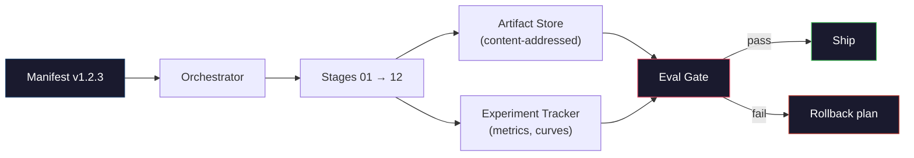

# 构建一个完整的LLM管道

> 从第01课到第12课的所有内容都是管道的一个阶段。本课程旨在将这些阶段转化为一个端到端运行框架：标记化，预训练，缩放，SFT，对齐，评估，量化和服务。你不会在笔记本电脑上训练70B模型。您将生成编排层、检查表、评估门和回滚计划，2026 Frontier团队将使用它们来确定要交付的内容。这是顶点。

**Type:** Build
**Languages:** Python (stdlib)
**Prerequisites:** All Phase 10 lessons 01-12
**Time:** ~120 minutes

## 学习目标

- 将之前的11门课程（标记、数据、预训练、缩放、SFT、RLHF、DPO、CAI、评估、量化、推理）整合到一个可重复的管道规范中
- 定义阶段之间的工件契约：每个阶段消耗、生成什么，以及下一个阶段如何验证输入
- 构建一个协调器来跟踪实验、散列工件，并根据评估阈值做出决策
- 设计回滚计划：重新运行哪些工件成本低，哪些成本高，以及损坏检查点的成本是多少

## 这个问题

前面的课程都有各自的功能。标记作业培训。微型GPT的预训练。SFT数据集汇编。奖励模式训练。DPO操作。评估测量。导出定量权重。推理服务器已启动。每个都是一个笔记本。每个协议都有自己的协议、自己的输出路径和自己的种子。

边境训练可不是笔记本。羊驼3405b在大约54天的时间里花费了大约3000万小时。DeepSeek V3的使用时间约为280万H800小时。在此期间，检查点损坏、数据污染和评估回归可能会占用团队一周或一个月的GPU预算。团队生存的方式是通过管道卫生：在每个阶段，都有一个明确的输入，一个明确的输出，一个清单，一个散列和一个门。

这是顶点。您不会在笔记本电脑上端到端运行管道。您将编写一个协调每个阶段的编排器，一个描述操作的检查表，一个确定船舶决策的验证器，以及一个允许第三方从单个文件重新运行您的工作的重播计划。代码非常小。这个题目涉及面很广。

在100M ~ 1T范围内，参数不变。同样的四个组件——manifest、orchestrator、eval gate、artifact store——运行Llama 3和您最喜欢的GPT。区别在于每个阶段配置中数字的大小，而不是管道的形状。

## 这个概念

### 十二个阶段

阶段10的每节课都是一个阶段。下面是完整的依赖关系图。

“美人鱼”
你Daoming
S1[" 01 Tokenizer vocab "] - > S2[" 02训练Tokenizer "]
S2 - > S3[“ 03分片数据集”]
S3 - > S4[“ 04基本模型检查点”]
S4 - > S5[“05缩放训练公式”]
S5 - > S6[“ 06 SFT关卡”]
S7[“07奖励模式+ PPO政策”]
S8[“2008年DPO政策”]
S7 - > S9[“09 CAI/GRPO详细政策”]
S8 - > s9
S9 - > S10[“10评估报告”]
S11[“11个量化权重”]
S11 - > S12[“12推理服务器”]
S10 - > GATE[“船门”]
S12 - >栅极

样式：S1，填充：#1a1a2e，描边：#e94560，颜色：#fff
样式：S4，填充：#1a1a2e，描边：#0f3460，颜色：#fff
样式S9，填充：#1a1a2e，描边：#0f3460，颜色：#fff
样式门填充：#1a1a2e，描边：#51cf66，颜色：#fff
```

Stages 07 and 08 can run in parallel. Everything else is a hard dependency. A change in stage 02 (tokenizer) invalidates every downstream artifact. A change in stage 10 (eval) invalidates only the ship decision.

### The Manifest

A manifest is a single file that describes a run completely enough to replay it. Nothing the pipeline produces should depend on state that is not in the manifest. The fields are boring and mandatory.

```
pipeline_version: 1.2.3
种子:42
git_commit: a1b2c3d4
阶段:
01 _tokenizer:
中文：bpe_32k
input_hash: sha256:……
output_hash: sha256:……
wall_clock_sec: 3600
cost_usd: 12
```

The output hash of stage N is the input hash of stage N+1. Any deviation and the pipeline halts. This is how you catch data corruption early. It is also how a teammate on a different continent verifies that their replay produced the same artifact as yours.

In practice teams use a small YAML schema plus a manifest checker that diffs against the previous successful run. Any delta outside the expected fields (cost, wall clock) is a red flag.

### Artifact Typing

Each stage's output is a typed artifact. Not a directory blob, not a pickle, but a named type with a known schema.

| Stage | Artifact Type | Key Fields |
|-------|--------------|-----------|
| 01-02 | Tokenizer | vocab.json, merges.txt, config.json, hash |
| 03 | Dataset | shards[], row count, token count, dedup stats |
| 04-05 | Checkpoint | weights.safetensors, config.json, optimizer state, step count |
| 06 | SFT Model | checkpoint + SFT recipe + data mix |
| 07 | Reward Model | RM checkpoint + preference data hash |
| 08-09 | Policy | checkpoint + reference hash + beta + KL budget consumed |
| 10 | Eval Report | benchmark scores + regression diffs + eval data hash |
| 11 | Quantized Model | quantized weights + calibration data + accuracy delta vs FP16 |
| 12 | Server Spec | endpoint + model hash + config + observability hooks |

The typing prevents the most common failure mode: using a stage 08 output as a stage 06 input, shipping a DPO-trained model through the SFT path. Typed artifacts and typed stage signatures make these errors compile-time failures, not day-five failures.

### The Eval Gate

Shipping is not "training finished." Shipping is "training finished and the eval gate passed." The gate is defined before the run starts.

```
盖茨
Mmlu: >=基线+ 0.5 #无回归
Humaneval: >=基线+ 1.0
Truthfulqa: >= baseline # no drop
Safety_refusal_rate: <= 0.05
Kl_from_reference: <= 25.0
Cost_total_usd: <= 50000
```

Every gate is a numeric threshold. No "looks good" gates. No subjective sign-offs. If every gate passes, the artifact is marked shippable. If any gate fails, the run is held pending explicit override by a named reviewer, which itself is logged in the manifest.

Two gates catch most disasters. A *regression* gate (the new model must be at least as good as the previous on core benchmarks) catches training bugs. A *KL budget* gate (the aligned policy must not have drifted further than X from its reference) catches alignment overcooking. Every production pipeline has both.

### The Orchestrator

A small piece of code that reads the manifest, dispatches stages, tracks artifacts, and halts on any contract violation. This is not Airflow. This is not Kubeflow. For pipeline hygiene you want something boring that you wrote.

The orchestrator's job is narrow:

1. Resolve the DAG from the manifest.
2. For each stage, check if the expected output already exists at the correct hash (skip if so).
3. Run the stage, capture stdout/stderr, measure wall clock and cost.
4. Verify the output hash against the downstream stage's expected input hash.
5. On failure, write a partial manifest with the exact failing stage and exit nonzero.

That is 200 lines of Python. It will look like the file `code/main.py` in this lesson. Under the hood, the real pipeline uses `torchrun` or `ray` to execute individual stages on clusters, but the orchestrator itself runs on a single box.

### Experiment Tracking and Artifact Storage

Two external systems anchor the pipeline.

**Experiment tracker (wandb, neptune, mlflow).** Logs loss curves, eval metrics, system telemetry per stage. The tracker is where you go when you need to compare run A against run B three weeks later. Teams almost always use a hosted tracker for this -- writing your own loses time that should go into training.

**Artifact store (S3, R2, GCS).** Immutable object store for checkpoints, datasets, tokenizers, eval reports. Artifacts are addressed by hash, not by filename. A filename like `latest.pt` is a foot-gun; `ckpt-7b-step-20000-sha256:abc123.safetensors` is a contract.

The orchestrator writes to both. The tracker is for humans looking at charts. The artifact store is for the next stage looking up inputs.

### Costing

A frontier run has a dollar number attached. Budget discipline happens in two places.

**Pre-run estimate.** From the manifest, compute expected FLOPs (for pre-training: 6 x params x tokens), expected GPU hours (FLOPs / peak throughput / utilization), and dollar cost at the current rental rate. If the estimate exceeds the budget gate, the pipeline refuses to start.

**In-run tracking.** Stage-by-stage wall clock and cost are logged to the manifest. After every stage, the remaining budget is checked. If a stage overran, the next stage's gate is evaluated with the new remaining budget. You do not find out you are out of money when the VC calls.

Llama 3's reported cost was $61M. DeepSeek-V3 reported $5.6M for the main pre-training run. The ratio is mostly hardware efficiency plus mixture-of-experts -- but the specific cost is visible because both teams tracked it per stage, not per run.

### Reproducibility vs Determinism

These are not the same. *Reproducible* means the same manifest plus the same code plus the same infrastructure produces a checkpoint with equivalent downstream metrics. *Deterministic* means bit-identical output.

Modern LLM training is reproducible but not deterministic. Distributed training's reduce-order, GPU kernel non-determinism (cuBLAS, flash-attn), and mixed precision rounding combine to produce floats that differ at the 1e-5 level between runs. This is fine for the final metrics, which do not move. It is fatal if you are trying to debug with bit-level diffs. The cure is to log every stage's input hash, output hash, and headline metrics -- if those match, the run is "reproduced" even if the weights are not bit-identical.



### 回滚计划

在开始运行之前，写下如果每个阶段失败将会发生什么。三类。

- **重新运行**（小时）：标记器，eval，量化，推理服务器。重新运行。
- **中国**（日）：SFT、DPO、CAI保留基本模型；只重新运行对齐阶段。
- 昂贵（数周甚至数百万美元）：预训练。此处的回滚计划不是“重新运行”。它是“使用最后一个好的检查点，并使用修改后的数据重新运行成本较低的下游阶段。”

由于阶段依赖关系是类型化和散列的，因此编排器可以自动计算回滚集：使失败的阶段和每个后代失效。第06段（SFT）的失效使第06、07、08、09、10、11和12段失效。第11阶段（量化）的失败只会使第11阶段和第12阶段无效。提前命名可以防止团队在凌晨4点疲惫不堪时突发奇想。

### 2026年的生产公式

大多数尖端团队都集中在同一个框架上。

- 令牌：128k BPE，带字节回滚。在一个小的，平衡的多语言切片训练。
- 预训练：10-20T token，主要是web +代码+合成。Muon或AdamW优化器。FSDP2或DeepSpeed 0-3。梯度检查点。BF16权重，FP32专家。
- SFT: 500k-2M指令对，人工与合成混合，严格按eval集划分。
- 对齐方式：DPO或CAI + GRPO。RLHF仅在首选信号过于多维而无法执行DPO时使用。
- 评估：MMLU-Pro， MATH, HumanEval+， GPQA, sw-bench Verified, LiveBench，以及一套从未被公众见过的私人持有的工具。
- 量化：业务采用4位GPTQ或AWQ，安全评估采用8位，准确性较差。
- 服务：vLLM、TensorRT-LLM或internal。连续批处理。解码投机。KV缓存清理。

这些数字每六个月改变一次。但是没有骨头。

## 构建它

课程代码是一个编排器和检查表检查器，而不是12个培训脚本。每个阶段都用占位符模拟，占位符生成具有正确形状和散列的输出工件。端到端的运行编排器可以在实际阶段消耗GPU资金之前验证管道的管道工作。

请参阅关键部分

- Z0
- Z0
- Z0
- Z0
- Z0
- Z0

管道用相应课程中的实际培训脚本替换每个占位符，您将拥有使用尖端管道的真正框架。

## 使用它

有三个命令用于标准化工作流。

```
python code/main.py plan    # validate manifest, compute cost estimate, print DAG
python code/main.py run     # execute stages, writing to manifest.out.yaml
python code/main.py gate    # read manifest.out.yaml, apply eval gates, ship-or-hold
```

大多数管道漏洞都是在计划的时间发生的——缺少阈值、过时的散列和预算超支。在便宜的地方跑步，抓虫子，省钱。

输出的延迟操作不是失败。这是一个决策点。指定的审阅者要么重写（并记录重写），要么批准回滚。

## 这艘船

本课程为其生成一个拟议的管道列表，该列表将检查所有合同：阶段类型、散列链、门、回滚计划和成本估算。它拒绝批准包含缺失评估、无界KL预算或评估和训练数据混合的运行列表。

## 实践

1. 扩展编排器以支持阶段07和阶段08的并行执行。最后的列表是使用标准库来确认的，以记录两个阶段的输出，并且阶段09的输入散列是两者的确定性组合。

2. 添加一个“污染检查”门。给定eval数据集的哈希值和训练数据集的分片，计算重叠（精确字符串匹配或13克匹配）。当重叠超过0.1%时，门失效。给它一套受污染的训练装置，并确认闸门可以继续运行。

3. 从第一个原则开始实施成本估算器。对于阶段04（预训练），估计的FLOPs是6 x params x token。假设H100上40%的MFU（模型FLOPs利用率）为989 TFLOPs BF16，则价格为每gpu小时2.50美元。报告在2T令牌上训练的7B模型的估计。与《羊驼2》发布的数据相比。

4. 构建部分回滚。模拟阶段09 （CAI）的故障，然后重新运行阶段09到12，同时保留01到08的缓存。编排器应该通过散列检测缓存的工件并跳过它们。测量时钟被保存并完全重新运行。

5. 添加可观测性。Emit OpenTelemetry跨越每个阶段，并具有参数、令牌、损失和成本等属性。将跨管连接到本地采集器。钥匙不在仪表板上；关键是每个阶段的运行状态可以通过单个跟踪ID进行跟踪。

## 关键术语

| Term | What people say | What it actually means |
|------|----------------|----------------------|
| Manifest | "The recipe file" | YAML or JSON describing pipeline version, seed, per-stage config, and gate thresholds — sufficient to replay a run |
| Content-addressed | "By hash not name" | Artifacts stored by SHA-256 of their contents, so you can never confuse version A with version B |
| Eval gate | "The ship criteria" | Numeric thresholds on benchmark metrics and safety scores that must pass before an artifact is marked shippable |
| KL budget | "How far alignment drifted" | A cap on cumulative KL(policy || reference) across alignment stages, enforced as a gate |
| MFU | "How much of the GPU you used" | Model FLOPs Utilization — achieved FLOPs divided by theoretical peak. 40% is typical at 70B scale, 55% at 7B |
| Rollback plan | "What we do when it breaks" | Pre-written set of actions per stage on failure: re-run, fall back, retrain with revised inputs |
| Orchestrator | "The conductor" | The process that reads the manifest, dispatches stages, verifies hashes, halts on any contract violation |
| Artifact store | "Versioned S3 for weights" | Immutable content-addressed object store — single source of truth for checkpoints, datasets, eval reports |
| Reproducible | "Same metrics on replay" | Different bit-level weights but equivalent downstream metrics — the realistic target for distributed LLM training |
| Cost gate | "You cannot exceed X" | Pre-run cost estimate plus in-run tracker — the pipeline refuses to start if the estimate exceeds budget |

## 进一步的阅读

- Z0
- Z0
- Z0
- Z0
- Z0
- Z0