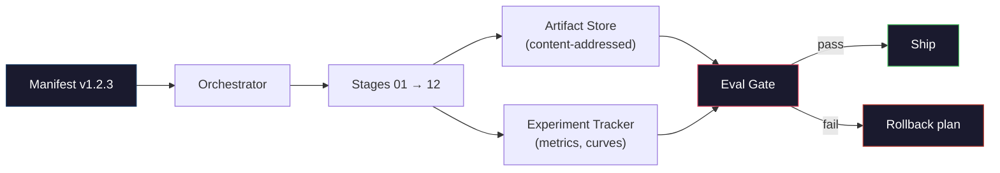

# Build a complete LLM pipeline

> All the content from Lesson 01 to Lesson 12 is a stage of a pipeline. This course aims to transform these stages into a single end-to-end running framework: tokenization, pre-training, scaling, SFT, alignment, evaluation, quantization, and service. You won't train a 70B model on a laptop. You will generate the orchestration layer, checklist, evaluation gate and rollback plan, which the 2026 Frontier team will use to determine what to deliver. This is the vertex.

**Type:** Build
**Languages:** Python (stdlib)
**Prerequisites:** All Phase 10 lessons 01-12
**Time:** ~120 minutes

## Learning objectives

- Integrate the previous 11 courses (tokener, data, pre-training, scaling, SFT, RLHF, DPO, CAI, evaluation, quantization, inference) into a repeatable pipeline specification
- Define the artifact contracts between stages: What each stage consumes, generates, and how does the next stage validate the input
- Build a coordinator to track experiments, hash artifacts, and make decisions based on evaluation thresholds
- Design a rollback plan: Re-run which artifacts have low costs, which have high costs, and what the cost of damaged checkpoints is

## This question

The previous courses each have their own functions. Marker assignment training. Pre-training of micro GPT. SFT dataset assembly. Reward mode training. DPO operation. Evaluation measurement. Export the quantitative weights. The inference server is started. Each one is a notebook. Each one has its own agreement, its own output path, and its own seed.

Border training is not a notebook. Alpaca 3405b spent approximately 30 million hours over a period of about 54 days. DeepSeek V3 was used for approximately 2.8 million H800 hours. During this period, a broken checkpoint, a data contamination, and an evaluation regression could take the team a week and a month's GPU budget. The way the team survives is through pipeline hygiene: at each stage, there is a definite input, a definite output, a checklist, a hash and a door.

This is the vertex. You won't run the pipeline end-to-end on your laptop. You will write an orchestrator that coordinates each stage, a checklist that describes the operation, a validator that determines the ship's decisions, and a replay plan that allows third parties to re-run your work from a single file. The code is very small. This subject is very broad.

The parameters remain unchanged when the mode scale ranges from 100M to 1T. The same four components - manifest, orchestrator, eval gate, artifact store - run Llama 3 as well as your favorite GPT. The difference lies in the size of the numbers in each stage configuration, rather than the shape of the pipeline.

## This concept

### Twelve stages

Each lesson in Stage 10 is a stage. The following is the complete dependency diagram.

"Mermaid"
Tu Daoming
S1[" 01 Tokenizer vocab "] - > S2[" 02 Trained Tokenizer "]
S2 - > S3[" 03 Sharded Dataset "]
S3 - > S4[" 04 Basic Model Checkpoints "]
S4 - > S5[" 05 Scaling Training Formula "]
S5 - > S6[" 06 SFT Checkpoint "]
S7[" 07 Reward Mode + PPO Policy "]
S8[" 08 DPO Policy "]
S7 - > S9[" 09 CAI/GRPO Detailed Policy "]
S8—> s9
S9 - > S10[" 10 Evaluation Report "]
S11[" 11 Quantified Weights "]
S11 - > S12[" 12 Inference Server "]
S10 - > GATE[" Ship Gate "]
S12 - > Gate

Style S1, Fill: #1a1a2e, Stroke: #e94560, Color: #fff
Style: S4, Fill: #1a1a2e, Stroke: #0f3460, Color: #fff
Style S9, Fill: #1a1a2e, Stroke: #0f3460, Color: #fff
Style GATE fill: #1a1a2e, stroke: #51cf66, color: #fff
```

Stages 07 and 08 can run in parallel. Everything else is a hard dependency. A change in stage 02 (tokenizer) invalidates every downstream artifact. A change in stage 10 (eval) invalidates only the ship decision.

### The Manifest

A manifest is a single file that describes a run completely enough to replay it. Nothing the pipeline produces should depend on state that is not in the manifest. The fields are boring and mandatory.

```
pipeline_version: 1.2.3
种子:42
git_commit: a1b2c3d4
阶段:
01 _tokenizer:
中文：bpe_32k
input_hash: sha256:……
output_hash: sha256:……
wall_clock_sec: 3600
cost_usd: 12
```

The output hash of stage N is the input hash of stage N+1. Any deviation and the pipeline halts. This is how you catch data corruption early. It is also how a teammate on a different continent verifies that their replay produced the same artifact as yours.

In practice teams use a small YAML schema plus a manifest checker that diffs against the previous successful run. Any delta outside the expected fields (cost, wall clock) is a red flag.

### Artifact Typing

Each stage's output is a typed artifact. Not a directory blob, not a pickle, but a named type with a known schema.

| Stage | Artifact Type | Key Fields |
|-------|--------------|-----------|
| 01-02 | Tokenizer | vocab.json, merges.txt, config.json, hash |
| 03 | Dataset | shards[], row count, token count, dedup stats |
| 04-05 | Checkpoint | weights.safetensors, config.json, optimizer state, step count |
| 06 | SFT Model | checkpoint + SFT recipe + data mix |
| 07 | Reward Model | RM checkpoint + preference data hash |
| 08-09 | Policy | checkpoint + reference hash + beta + KL budget consumed |
| 10 | Eval Report | benchmark scores + regression diffs + eval data hash |
| 11 | Quantized Model | quantized weights + calibration data + accuracy delta vs FP16 |
| 12 | Server Spec | endpoint + model hash + config + observability hooks |

The typing prevents the most common failure mode: using a stage 08 output as a stage 06 input, shipping a DPO-trained model through the SFT path. Typed artifacts and typed stage signatures make these errors compile-time failures, not day-five failures.

### The Eval Gate

Shipping is not "training finished." Shipping is "training finished and the eval gate passed." The gate is defined before the run starts.

```
Gates
Mmlu: >= baseline + 0.5 # No regression
Humaneval: >= Baseline + 1.0
Truthfulqa: >= baseline # no drop
Safety_refusal_rate: <= 0.05
Kl_from_reference: <= 25.0
Cost_total_usd: <= 50000
```

Every gate is a numeric threshold. No "looks good" gates. No subjective sign-offs. If every gate passes, the artifact is marked shippable. If any gate fails, the run is held pending explicit override by a named reviewer, which itself is logged in the manifest.

Two gates catch most disasters. A *regression* gate (the new model must be at least as good as the previous on core benchmarks) catches training bugs. A *KL budget* gate (the aligned policy must not have drifted further than X from its reference) catches alignment overcooking. Every production pipeline has both.

### The Orchestrator

A small piece of code that reads the manifest, dispatches stages, tracks artifacts, and halts on any contract violation. This is not Airflow. This is not Kubeflow. For pipeline hygiene you want something boring that you wrote.

The orchestrator's job is narrow:

1. Resolve the DAG from the manifest.
2. For each stage, check if the expected output already exists at the correct hash (skip if so).
3. Run the stage, capture stdout/stderr, measure wall clock and cost.
4. Verify the output hash against the downstream stage's expected input hash.
5. On failure, write a partial manifest with the exact failing stage and exit nonzero.

That is 200 lines of Python. It will look like the file `code/main.py` in this lesson. Under the hood, the real pipeline uses `torchrun` or `ray` to execute individual stages on clusters, but the orchestrator itself runs on a single box.

### Experiment Tracking and Artifact Storage

Two external systems anchor the pipeline.

**Experiment tracker (wandb, neptune, mlflow).** Logs loss curves, eval metrics, system telemetry per stage. The tracker is where you go when you need to compare run A against run B three weeks later. Teams almost always use a hosted tracker for this -- writing your own loses time that should go into training.

**Artifact store (S3, R2, GCS).** Immutable object store for checkpoints, datasets, tokenizers, eval reports. Artifacts are addressed by hash, not by filename. A filename like `latest.pt` is a foot-gun; `ckpt-7b-step-20000-sha256:abc123.safetensors` is a contract.

The orchestrator writes to both. The tracker is for humans looking at charts. The artifact store is for the next stage looking up inputs.

### Costing

A frontier run has a dollar number attached. Budget discipline happens in two places.

**Pre-run estimate.** From the manifest, compute expected FLOPs (for pre-training: 6 x params x tokens), expected GPU hours (FLOPs / peak throughput / utilization), and dollar cost at the current rental rate. If the estimate exceeds the budget gate, the pipeline refuses to start.

**In-run tracking.** Stage-by-stage wall clock and cost are logged to the manifest. After every stage, the remaining budget is checked. If a stage overran, the next stage's gate is evaluated with the new remaining budget. You do not find out you are out of money when the VC calls.

Llama 3's reported cost was $61M. DeepSeek-V3 reported $5.6M for the main pre-training run. The ratio is mostly hardware efficiency plus mixture-of-experts -- but the specific cost is visible because both teams tracked it per stage, not per run.

### Reproducibility vs Determinism

These are not the same. *Reproducible* means the same manifest plus the same code plus the same infrastructure produces a checkpoint with equivalent downstream metrics. *Deterministic* means bit-identical output.

Modern LLM training is reproducible but not deterministic. Distributed training's reduce-order, GPU kernel non-determinism (cuBLAS, flash-attn), and mixed precision rounding combine to produce floats that differ at the 1e-5 level between runs. This is fine for the final metrics, which do not move. It is fatal if you are trying to debug with bit-level diffs. The cure is to log every stage's input hash, output hash, and headline metrics -- if those match, the run is "reproduced" even if the weights are not bit-identical.



### Rollback plan

Before starting to run, write down what will happen if each stage fails. Three categories.

- ** Re-run ** (hours) : tokener, eval, quantization, inference server. Re-run.
- ** China ** (Day) : SFT, DPO, CAI Retain the basic model; Only re-run the alignment phase.
- Expensive (weeks or even millions of dollars) : Pre-training. The rollback plan here is not "re-running". It is "to use the last good checkpoint and re-run the lower-cost downstream stage with the modified data."

Because the stage dependencies are typed and hashed, the orchestrator can automatically calculate the rollback set: invalidating the failed stages and each descendant. The failure of stage 06 (SFT) invalidated stages 06, 07, 08, 09, 10, 11, and 12. The failure of stage 11 (quantification) will only render Stage 11 and stage 12 ineffective. Naming in advance can prevent the team from having a sudden whim when they are exhausted at 4 a.m.

### The production formula observed in 2026

Most of the cutting-edge teams are concentrated on the same framework.

- Tokener: 128k BPE, with byte rollback. In a small, balanced multilingual slice training.
- Pre-training: 10-20T tokens, mainly web + code + compositing. Muon or AdamW optimizer. FSDP2 or DeepSpeed 0-3. Gradient checkpoint. BF16 weights, FP32 expert.
- SFT: 500k-2M instruction pair, a mixture of artificial and synthetic, strictly divided according to the eval set.
- Alignment: DPO or CAI + GRPO. RLHF is only used when the preferred signal is too multi-dimensional to perform DPO.
- Eval: MMLU-Pro, MATH, HumanEval+, GPQA, sw-bench Verified, LiveBench, plus a privately held set never seen by the public.
- Quantification: 4-bit GPTQ or AWQ is used for services, and 8-bit is used for security assessment with poor accuracy.
- Services: vLLM, TensorRT-LLM, or internal. Continuous batch processing. Decoding Speculation. KV cache clearing.

These figures change every six months. But there are no bones.

## Build it

The course code is an orchestrator and checklist checker, not 12 training scripts. Each stage is simulated with a placeholder, which generates an output artifact with the correct shape and hash. The end-to-end running orchestrator can verify the pipeline work of the pipeline before you consume GPU funds at the actual stage.

See the key sections

- Z0
- Z0
- Z0
- Z0
- Z0
- Z0

The pipeline replaces each placeholder with the actual training script in the corresponding course, and you will have the true framework for the use of cutting-edge pipelines.

## Use it

There are three commands for standardizing the workflow.

```
python code/main.py plan    # validate manifest, compute cost estimate, print DAG
python code/main.py run     # execute stages, writing to manifest.out.yaml
python code/main.py gate    # read manifest.out.yaml, apply eval gates, ship-or-hold
```

Most pipeline vulnerabilities occur at planned times - missing thresholds, outdated hashes, and budget overruns. Run in cheap places to catch bugs to save money.

The delayed operation of the output is not a failure. This is a decision point. The designated reviewer either rewrites (and the rewrite is recorded) or approves the rollback.

## This ship

This lesson generates a proposed pipeline list for it, which will examine all the contracts: stage types, hash chains, gates, rollback plans, and cost estimates. It refuses to approve lists of runs that contain missing evaluations, unbounded KL budgets, or a mixture of evaluation and training data.

## Practice

1. Expand the orchestrator to support the parallel execution of stage 07 and stage 08. The final list was confirmed using the standard library to record the outputs of the two stages, and the input hash of stage 09 is a deterministic combination of the two.

2. Add a "Pollution Check" door. Given the hash of the eval dataset and the sharding of the training dataset, calculate the overlap (exact string matching or 13-gram matching). When the overlap exceeds 0.1%, the door fails. Feed it a set of contaminated training devices and confirm that the gate can remain in operation.

3. Implement the cost estimator starting from the first principle. For stage 04 (pre-training), the estimated FLOPs is 6 x params x Tokens. Assuming that 40% of the MFU (Model FLOPs Utilization) on H100 is 989 TFLOPs BF16, the price is $2.50 per gpu hour. Report the estimation of the 7B model trained on 2T tokens. Compared with the figures released by Alpaca 2.

4. Build a partial rollback. Simulate the faults of Phase 09 (CAI), then re-run phases 09 to 12, while retaining the caches of 01 to 08. The orchestrator should detect cached artifacts through hashing and skip them. The measurement clock is saved and fully re-run.

5. Add observability. Emit OpenTelemetry spans each stage and has attributes such as parameters, tokens, losses, and costs. Connect the span pipe to the local collector. The key does not lie in the dashboard; The key point is that the operational status of each stage can be tracked through a single tracking ID.

## Key terms

| Term | What people say | What it actually means |
|------|----------------|----------------------|
| Manifest | "The recipe file" | YAML or JSON describing pipeline version, seed, per-stage config, and gate thresholds — sufficient to replay a run |
| Content-addressed | "By hash not name" | Artifacts stored by SHA-256 of their contents, so you can never confuse version A with version B |
| Eval gate | "The ship criteria" | Numeric thresholds on benchmark metrics and safety scores that must pass before an artifact is marked shippable |
| KL budget | "How far alignment drifted" | A cap on cumulative KL(policy || reference) across alignment stages, enforced as a gate |
| MFU | "How much of the GPU you used" | Model FLOPs Utilization — achieved FLOPs divided by theoretical peak. 40% is typical at 70B scale, 55% at 7B |
| Rollback plan | "What we do when it breaks" | Pre-written set of actions per stage on failure: re-run, fall back, retrain with revised inputs |
| Orchestrator | "The conductor" | The process that reads the manifest, dispatches stages, verifies hashes, halts on any contract violation |
| Artifact store | "Versioned S3 for weights" | Immutable content-addressed object store — single source of truth for checkpoints, datasets, eval reports |
| Reproducible | "Same metrics on replay" | Different bit-level weights but equivalent downstream metrics — the realistic target for distributed LLM training |
| Cost gate | "You cannot exceed X" | Pre-run cost estimate plus in-run tracker — the pipeline refuses to start if the estimate exceeds budget |

## Further reading

- Z0
- Z0
- Z0
- Z0
- Z0
- Z0