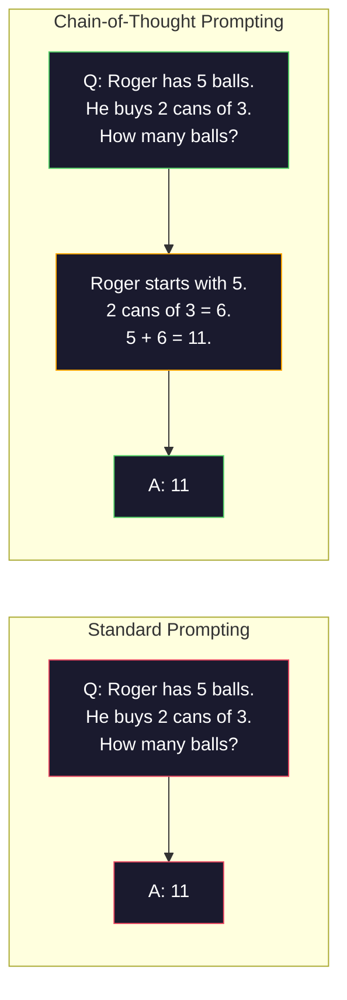
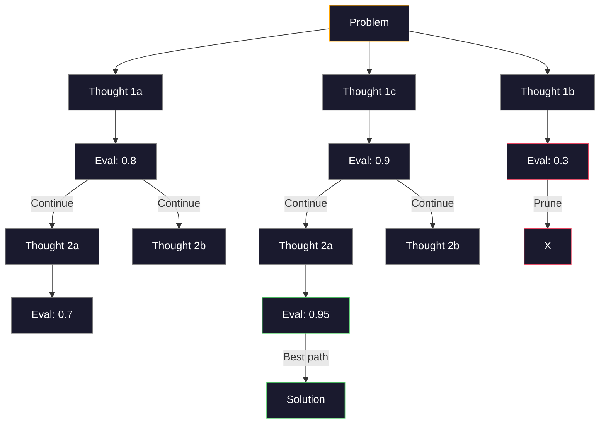

# 几枪，思维链，思维树

> 告诉模特该做什么就是提示。告诉它如何思考是工程学。同样的模型，同样的任务，同样的数据，准确率在78%和91%之间的差距并不是一个更好的模型。这是一个更好的推理策略。

**Type:** Build
**Languages:** Python
**Prerequisites:** Lesson 11.01 (Prompt Engineering)
**Time:** ~45 minutes

## 学习目标

- 通过选择和格式化示例演示来实现少量提示，从而最大限度地提高任务准确性
- 应用思维链（CoT）推理来提高数学字谜等多步骤问题的准确性
- 建立一个思维树提示，探索多种推理路径，并选择最好的一个
- 在标准基准上测量从零发、少发和CoT的精度改进

## 这个问题

你开发了一个数学辅导应用。你的提示是：“解决这个单词问题。”GPT-5在GSM8K（标准的小学数学基准）上的正确率为94%。你认为你已经达到顶峰了。你没有——思维链仍然增加3-4分。

再加上五个词——“让我们一步一步地思考”——准确率就跃升到了91%。再加上一些算例，它达到了95%。相同的模型。相同的温度。相同的API成本。唯一的区别是你给了模型草稿纸。

这不是黑客。这就是推理的原理。人类不可能在一次思维飞跃中解决多个步骤的问题。变形金刚也一样。当您强制一个模型生成中间令牌时，这些令牌将成为下一个令牌上下文的一部分。每一步推理都是下一步的推手。这个模型会逐字计算出答案。

但是“一步一步思考”只是开始，而不是结束。如果你抽样五种推理路径，然后进行多数投票呢？如果让模型探索一棵可能性树，评估并修剪分支，会怎么样？如果你将推理与工具使用交织在一起呢？这些都不是假设。它们是已发布的技术，具有可衡量的改进，您将在本课中构建所有这些技术。

## 这个概念

### 零射击vs少射击：当例子胜过说明时

零射击提示只给模型一个任务。几个镜头提示首先给出了示例。

Wei等人（2022）通过8个基准进行了测量。对于像情绪分类这样的简单任务，zero-shot和few-shot的准确率相差不到2%。对于像多步算术和符号推理这样的复杂任务，few-shot可以将准确率提高10-25%。

直觉：示例是压缩的指令。不是描述输出格式，而是显示输出格式。而不是解释推理过程，你演示它。与解释抽象指令相比，模型对示例的模式匹配更可靠。

“‘美人鱼
图道明
子图比较[0 - shot vs . Few-Shot]
方向LR
Z["Zero-Shot\n' classified this review'\nModel guess format\n78% on GSM8K"]
这里有3个例子…现在将此评论分类为“\nModel匹配模式\n85%在GSM8K上”]
结束

Z ~~~ f

样式Z填充：#1a1a2e，描边：#e94560，颜色：#fff
样式F填充：#1a1a2e，描边：#51cf66，颜色：#fff
```

**When few-shot wins:** format-sensitive tasks, classification, structured extraction, domain-specific jargon, any task where the model needs to match a specific pattern.

**When zero-shot wins:** simple factual questions, creative tasks where examples constrain creativity, tasks where finding good examples is harder than writing good instructions.

### Example Selection: Similar Beats Random

Not all examples are equal. Choosing examples similar to the target input outperforms random selection by 5-15% on classification tasks (Liu et al., 2022). Three principles:

1. **Semantic similarity**: pick examples closest to the input in embedding space
2. **Label diversity**: cover all output categories in your examples
3. **Difficulty matching**: match the complexity level of the target problem

The optimal number of examples for most tasks is 3-5. Below 3, the model does not have enough signal to extract the pattern. Above 5, you hit diminishing returns and waste context window tokens. For classification with many labels, use one example per label.

### Chain-of-Thought: Giving Models Scratch Paper

Chain-of-Thought (CoT) prompting was introduced by Wei et al. (2022) at Google Brain. The idea is simple: instead of asking the model for just the answer, ask it to show its reasoning steps first.



为什么这是机械地工作？转换器生成的每个令牌都成为下一个令牌的上下文。如果没有CoT，模型必须将所有推理压缩到单个前向传递的隐藏状态。使用CoT，模型将中间计算外部化为令牌。每个推理令牌都扩展了有效的计算深度。

**GSM8K基准（小学数学，8.5K题）：**

| Model | Zero-Shot | Zero-Shot CoT | Few-Shot CoT |
|-------|-----------|---------------|--------------|
| GPT-4o | 78% | 91% | 95% |
| GPT-5 | 94% | 97% | 98% |
| o4-mini (reasoning) | 97% | — | — |
| Claude Opus 4.7 | 93% | 97% | 98% |
| Gemini 3 Pro | 92% | 96% | 98% |
| Llama 4 70B | 80% | 89% | 94% |
| DeepSeek-V3.1 | 89% | 94% | 96% |

**关于推理模型的说明。**像OpenAI的o系列（o3, o4-mini）和DeepSeek-R1这样的模型在给出答案之前会在内部运行思维链。在推理模型中加入“让我们一步一步地思考”是多余的，有时会适得其反——他们已经这么做了。

两种口味的CoT：

**Zero-shot CoT**：在提示符后面加上“Let's think step by step”。不需要例子。Kojima等人（2022）表明，这句话提高了算术、常识和符号推理任务的准确性。

**几个镜头的CoT**：提供包括推理步骤的例子。比零射击CoT更有效，因为模型可以看到您期望的确切推理格式。

*当CoT受伤时：简单的事实回忆（“法国的首都是哪里？”）例如，单步分类，速度比准确性更重要的任务。CoT为每个查询增加50-200个令牌的推理开销。对于高吞吐量、低复杂性的任务，这是浪费成本。

### 自我一致性：多次取样，一次投票

Wang et al.（2023）引入了自一致性。洞察：单个CoT路径可能包含推理错误。但是，如果你对N个独立推理路径（使用温度> 0）进行抽样，并对最终答案进行多数投票，错误就会被抵消。

“‘美人鱼
图道明
问题：一家商店有48个苹果。他们星期一卖掉1/3，剩下的1/4在星期二卖掉。还剩下多少？’”)

P——>路径1[“路径1:48 - 16 = 32\n32 - 8 = 24\nAnswer: 24”]
P ->路径2[“路径2:1/3的48 = 16\ n剩余：32\n1/4的32 = 8\n32 - 8 = 24\nAnswer: 24”]
P——> Path3[“路径3:48/3 = 16 sold\n48 - 16 = 32\n32/4 = 8 sold\n32 - 8 = 24\nAnswer: 24”]
P -> Path4[“路径4：卖出1/3:48 - 12 = 36\nSell 1/4: 36 - 9 = 27\nAnswer: 27”]
P——> Path5[“路径5：星期一：48 * 2/3 = 32\ n星期二：32 * 3/4 = 24\nAnswer: 24”]

Path1—> V["Majority Vote\n24: 4票\n27: 1票\nFinal: 24"]
路径2——>
Path3——>
路径4——>
Path5——>

样式P：填充：#1a1a2e，描边：#ffa500，颜色：#fff
样式路径1：填充：#1a1a2e，描边：#51cf66，颜色：#fff
样式：#1a1a2e， #51cf66，颜色：#fff
样式路径3：填充：#1a1a2e，描边：#51cf66，颜色：#fff
样式路径4：填充：#1a1a2e，描边：#e94560，颜色：#fff
样式路径5：填充：#1a1a2e，描边：#51cf66，颜色：#fff
样式V填充：#1a1a2e，描边：#51cf66，颜色：#fff
```

Self-consistency improved GSM8K accuracy from 56.5% (single CoT) to 74.4% with N=40 on the original PaLM 540B experiments. On GPT-5 the improvement is small (97% to 98%) because base accuracy is already saturated. The technique shines most on models with 60-85% base CoT accuracy -- the sweet spot where single-path errors are frequent but not systematic. For reasoning models (o-series, R1) self-consistency is subsumed by the built-in internal sampling.

The tradeoff: N samples means Nx the API cost and latency. In practice, N=5 captures most of the benefit. N=3 is the minimum for a meaningful vote. N > 10 has diminishing returns for most tasks.

### Tree-of-Thought: Branching Exploration

Yao et al. (2023) introduced Tree-of-Thought (ToT). Where CoT follows one linear reasoning path, ToT explores multiple branches and evaluates which are most promising before continuing.



ToT有三个组成部分：

1. **思想生成**：产生多个候选下一步
2. **状态评估**：对每个候选人进行评分（可以使用LLM本身作为评估者）
3. **搜索算法**:BFS或DFS遍历树，修剪低评分分支

在“24游戏”任务中（用算术将4个数字组合成24），GPT-4在标准提示下解决了7.3%的问题。对于CoT，则为4.0%（这里的CoT实际上是有害的，因为搜索空间很宽）。对于ToT， 74%。

ToT很贵。树中的每个节点都需要一个LLM调用。分支因子为3、深度为3的树需要多达39个LLM调用。它只适用于搜索空间大但可评估的问题——计划、解谜、有约束的创造性问题。

### 反应：思考+行动

Yao等人（2022）将推理痕迹与行动相结合。该模型在思考（生成推理）和行动（调用工具、搜索、计算）之间交替。

“‘美人鱼
图LR
问题：埃菲尔铁塔所在国家的人口是多少？］
[“我想：我需要找出哪个国家有埃菲尔铁塔”]
A1[“行动：搜索\n‘埃菲尔铁塔位置’”]
O1群(“观察:\ nParis、法国”)
T2[“我想：现在我需要法国的人口”]
A2[“行动：搜索‘法国2024年人口’”]
O2(“观察:\ n68.4百万”)
“我想：我有答案了”
F(“回答:\ n68.4百万”)

问——> T1 - > A1 - - - - - > O1群——> T2 > A2 - > O2 - - - - - > T3 > F

    style Q fill:#1a1a2e,stroke:#ffa500,color:#fff
    style T1 fill:#1a1a2e,stroke:#51cf66,color:#fff
    style A1 fill:#1a1a2e,stroke:#e94560,color:#fff
    style O1 fill:#1a1a2e,stroke:#808080,color:#fff
    style T2 fill:#1a1a2e,stroke:#51cf66,color:#fff
    style A2 fill:#1a1a2e,stroke:#e94560,color:#fff
    style O2 fill:#1a1a2e,stroke:#808080,color:#fff
    style T3 fill:#1a1a2e,stroke:#51cf66,color:#fff
    style F fill:#1a1a2e,stroke:#51cf66,color:#fff
```

ReAct outperforms pure CoT on knowledge-intensive tasks because it can ground its reasoning in real data. On HotpotQA (multi-hop question answering), ReAct with GPT-4 achieves 35.1% exact match vs 29.4% for CoT alone. The real power is that reasoning errors get corrected by observations -- the model can update its plan mid-execution.

ReAct is the foundation of modern AI agents. Every agent framework (LangChain, CrewAI, AutoGen) implements some variant of the Thought-Action-Observation loop. You will build full agents in Phase 14. This lesson covers the prompting pattern.

### Structured Prompting: XML Tags, Delimiters, Headers

As prompts get complex, structure prevents the model from confusing sections. Three approaches:

**XML tags** (works best with Claude, solid everywhere):
```
> <上下文
您正在审核拉取请求。
代码库使用TypeScript和React。
> < /上下文

<任务>
检查下面的错误、安全问题和样式违反。
> < /任务

< diff >
{diff_content}
< / diff >

< output_format >
列出每个问题：文件，行，严重性（关键/警告/信息），描述。
< / output_format >
```

**Markdown headers** (universal):
```
## 角色
一家金融科技公司的高级安全工程师。

## 任务
分析此API端点是否存在漏洞。

## 输入
{api_code

## 规则
- 关注OWASP前10名
- 给每个发现打分：关键、高、中、低
- 包括补救步骤
```

**Delimiters** (minimal but effective):
```
-——输入
{user_text}
-——输入结束

-——说明
将上述内容总结为3个要点。
-——结束指令
```

### Prompt Chaining: Sequential Decomposition

Some tasks are too complex for a single prompt. Prompt chaining breaks them into steps, where the output of one prompt becomes the input of the next.


链接优于单提示有三个原因：

1. **每一步都更简单**：模型处理一个重点任务，而不是处理所有事情
2. **中间输出是可检查的**：您可以验证和纠正步骤之间
3. **不同的步骤可以使用不同的模型：使用便宜的模型进行提取，使用昂贵的模型进行推理

### 性能比较

| Technique | Best For | GSM8K Accuracy (GPT-5) | API Calls | Token Overhead | Complexity |
|-----------|----------|------------------------|-----------|----------------|------------|
| Zero-Shot | Simple tasks | 94% | 1 | None | Trivial |
| Few-Shot | Format matching | 96% | 1 | 200-500 tokens | Low |
| Zero-Shot CoT | Quick reasoning boost | 97% | 1 | 50-200 tokens | Trivial |
| Few-Shot CoT | Maximum single-call accuracy | 98% | 1 | 300-600 tokens | Low |
| Self-Consistency (N=5) | High-stakes reasoning | 98.5% | 5 | 5x token cost | Medium |
| Reasoning model (o4-mini) | Drop-in CoT replacement | 97% | 1 | hidden (2-10x internal) | Trivial |
| Tree-of-Thought | Search/planning problems | N/A (74% on Game of 24) | 10-40+ | 10-40x token cost | High |
| ReAct | Knowledge-grounded reasoning | N/A (35.1% on HotpotQA) | 3-10+ | Variable | High |
| Prompt Chaining | Complex multi-step tasks | 96% (pipeline) | 2-5 | 2-5x token cost | Medium |

正确的技术取决于三个因素：准确性要求、延迟预算和成本容忍度。对于大多数生产系统，带有3个样本的自一致性回退的少量CoT覆盖了90%的用例。

## 构建它

我们将构建一个数学问题解决器，它将少量提示、思维链推理和自一致性投票结合到一个管道中。然后，我们将为困难的问题添加思想树。

完整的实现已经完成以下是关键组件。

### 步骤1:Few-Shot示例存储

第一个组件管理少量示例，并为给定问题选择最相关的示例。

”“python
Gsm8k_examples = [
｛
“问题”：“珍妮特的鸭子每天下16个蛋。她每天早上吃三个早餐，每天用四个为她的朋友烤松饼。她在农贸市场每个鸡蛋卖2美元。她每天在农贸市场能赚多少钱？”
“推理”：“珍妮特的鸭子每天下16个蛋。她吃了3个，烤了4个，用3 + 4 = 7个鸡蛋。所以她还剩下16 - 7 = 9个卵子。她每个卖2美元，所以她每天赚9 * 2 = 18美元。”
“答案”:“18”
}，
…
］
```

Each example has three parts: the question, the reasoning chain, and the final answer. The reasoning chain is what transforms a regular few-shot example into a CoT few-shot example.

### Step 2: Chain-of-Thought Prompt Builder

The prompt builder assembles a system message, few-shot examples with reasoning chains, and the target question into a single prompt.

```python
def build_cot_prompt(question, examples, num_examples=3):
    system = (
        "You are a math problem solver. "
        "For each problem, show your step-by-step reasoning, "
        "then give the final numerical answer on the last line "
        "in the format: 'The answer is [number]'."
    )

    example_text = ""
    for ex in examples[:num_examples]:
        example_text += f"Q: {ex['question']}\n"
        example_text += f"A: {ex['reasoning']} The answer is {ex['answer']}.\n\n"

    user = f"{example_text}Q: {question}\nA:"
    return system, user
```

格式约束（“答案是[number]”）至关重要。没有它，自一致性就不能提取和比较样本之间的答案。

### 第三步：自我一致投票

抽样N条推理路径，取多数答案。

”“python
Def self_consistency_solve(question, examples, client, model, n_samples=5)：
System, user = build_cot_prompt（问题，示例）

答案= []
推理= []
对于_in range(n_samples)：
Response = client.chat.completions.create(
模型=模型,
消息= [
{"role": "system", "content": system}，
{"role": "user", "content": user}
]，
温度= 0.7
）
Text = response.choices[0].message.content
reasonings.append(文本)
Answer = extract_answer（text）
如果答案不是“无”：
answers.append(答案)

vote_counts = Counter（答案）
Best_answer = vote_counts。most_common(1)[0][0] if vote_counts else无
Confidence = vote_counts[best_answer] / len(answers) if best_answer else 0

返回best_answer， confidence, reasoning, vote_counts
```

Temperature 0.7 is important. At temperature 0.0, all N samples would be identical, defeating the purpose. You need enough randomness for diverse reasoning paths but not so much that the model produces gibberish.

### Step 4: Tree-of-Thought Solver

For problems where linear reasoning fails, ToT explores multiple approaches and evaluates which direction is most promising.

```python
def tree_of_thought_solve(question, client, model, breadth=3, depth=3):
    thoughts = generate_initial_thoughts(question, client, model, breadth)
    scored = [(t, evaluate_thought(t, question, client, model)) for t in thoughts]
    scored.sort(key=lambda x: x[1], reverse=True)

    for current_depth in range(1, depth):
        next_thoughts = []
        for thought, score in scored[:2]:
            extensions = extend_thought(thought, question, client, model, breadth)
            for ext in extensions:
                ext_score = evaluate_thought(ext, question, client, model)
                next_thoughts.append((ext, ext_score))
        scored = sorted(next_thoughts, key=lambda x: x[1], reverse=True)

    best_thought = scored[0][0] if scored else ""
    return extract_answer(best_thought), best_thought
```

评估器本身就是一个LLM调用。你问模型：“在0.0到1.0的范围内，这个推理路径解决问题的可能性有多大？”这是ToT的关键见解——模型评估它自己的部分解决方案。

### 步骤5：完整的管道

管道将所有技术与升级策略结合在一起。

”“python
Def solve_with_escalation（问题，示例，客户端，模型）：
System, user = build_cot_prompt（问题，示例）
Single_response = call_llm（客户端、模型、系统、用户、温度=0.0）
Single_answer = extract_answer（single_response）

Sc_answer, confidence, _, _ = self_consistency_solve（）
问题，示例，客户端，模型，n_samples=5
）

如果置信度>= 0.8：
返回sc_answer，“self_consistency”，信心

Tot_answer, _ = tree_of_thoughtt_solve（问题，客户端，模型）
return tot_answer, "tree_of_thought"，无
```

The escalation logic: try cheap (single CoT) first. If self-consistency confidence is below 0.8 (less than 4 of 5 samples agree), escalate to ToT. This balances cost and accuracy -- most problems are solved cheaply, hard problems get more compute.

## Use It

### With LangChain

LangChain provides built-in support for prompt templates and output parsing that simplify few-shot and CoT patterns:

```python
from langchain_core.prompts import FewShotPromptTemplate, PromptTemplate
from langchain_openai import ChatOpenAI

example_prompt = PromptTemplate(
    input_variables=["question", "reasoning", "answer"],
    template="Q: {question}\nA: {reasoning} The answer is {answer}."
)

few_shot_prompt = FewShotPromptTemplate(
    examples=examples,
    example_prompt=example_prompt,
    suffix="Q: {input}\nA: Let's think step by step.",
    input_variables=["input"]
)

llm = ChatOpenAI(model="gpt-4o", temperature=0.7)
chain = few_shot_prompt | llm
result = chain.invoke({"input": "If a train travels 120 km in 2 hours..."})
```

LangChain也有

”“python
从langchain_core。example_selectors导入semanticsimilarityexampleeselector
从langchain_openai导入OpenAIEmbeddings

selector = SemanticSimilarityExampleSelector.from_examples（）
的例子,
OpenAIEmbeddings (),
k = 3
）
```

### With DSPy

DSPy treats prompting strategies as optimizable modules. Instead of handcrafting CoT prompts, you define a signature and let DSPy optimize the prompt:

```python
import dspy

dspy.configure(lm=dspy.LM("openai/gpt-4o", temperature=0.7))

class MathSolver(dspy.Module):
    def __init__(self):
        self.solve = dspy.ChainOfThought("question -> answer")

    def forward(self, question):
        return self.solve(question=question)

solver = MathSolver()
result = solver(question="Janet's ducks lay 16 eggs per day...")
```

DSPy的`dspy.majority` implements self-consistency:

”“python
结果= dspy.majority(
[求解器（question=q） for _ in range(5)]，
场= "答案"
）
```

### Comparison: From-Scratch vs Frameworks

| Feature | From-Scratch (this lesson) | LangChain | DSPy |
|---------|--------------------------|-----------|------|
| Control over prompt format | Full | Template-based | Automatic |
| Self-consistency | Manual voting | Manual | Built-in (`dspy.majority`) |
| Example selection | Custom logic | `ExampleSelector` | `dspy.BootstrapFewShot` |
| Tree-of-Thought | Custom tree search | Community chains | Not built-in |
| Prompt optimization | Manual iteration | Manual | Automatic compilation |
| Best for | Learning, custom pipelines | Standard workflows | Research, optimization |

## Ship It

This lesson produces two artifacts.

**1. Reasoning Chain Prompt** (`outputs/prompt-reasoning-chain.md`): a production-ready prompt template for few-shot CoT with self-consistency. Plug in your examples and problem domain.

**2. CoT Pattern Selection Skill** (`outputs/skill-cot-patterns.md`): a decision framework for choosing the right reasoning technique based on task type, accuracy requirements, and cost constraints.

## Exercises

1. **Measure the gap**: Take 10 GSM8K problems. Solve each with zero-shot, few-shot, zero-shot CoT, and few-shot CoT. Record accuracy for each. Which technique gives the biggest lift on your model?

2. **Example selection experiment**: For the same 10 problems, compare random example selection vs hand-picked similar examples. Measure accuracy difference. At what point does example quality matter more than example quantity?

3. **Self-consistency cost curve**: Run self-consistency with N=1, 3, 5, 7, 10 on 20 GSM8K problems. Plot accuracy vs cost (total tokens). Where is the knee of the curve for your model?

4. **Build a ReAct loop**: Extend the pipeline with a calculator tool. When the model generates a math expression, execute it with Python's `eval()` (in a sandbox) and feed the result back. Measure if tool-grounded reasoning outperforms pure CoT.

5. **ToT for creative tasks**: Adapt the Tree-of-Thought solver for a creative writing task: "Write a 6-word story that is both funny and sad." Use the LLM as evaluator. Does branching exploration produce better creative outputs than single-shot generation?

## Key Terms

| Term | What people say | What it actually means |
|------|----------------|----------------------|
| Few-shot prompting | "Give it some examples" | Including input-output demonstrations in the prompt to anchor the model's output format and behavior |
| Chain-of-Thought | "Make it think step by step" | Eliciting intermediate reasoning tokens that extend the model's effective computation before producing a final answer |
| Self-Consistency | "Run it multiple times" | Sampling N diverse reasoning paths at temperature > 0 and selecting the most common final answer by majority vote |
| Tree-of-Thought | "Let it explore options" | Structured search over reasoning branches where each partial solution is evaluated and only promising paths are expanded |
| ReAct | "Thinking + tool use" | Interleaving reasoning traces with external actions (search, compute, API calls) in a Thought-Action-Observation loop |
| Prompt chaining | "Break it into steps" | Decomposing a complex task into sequential prompts where each output feeds the next input |
| Zero-shot CoT | "Just add 'think step by step'" | Appending a reasoning trigger phrase to a prompt without any examples, relying on the model's latent reasoning capability |

## Further Reading

- [Chain-of-Thought Prompting Elicits Reasoning in Large Language Models](https://arxiv.org/abs/2201.11903) -- Wei et al. 2022. The original CoT paper from Google Brain. Read sections 2-3 for the core results.
- [Self-Consistency Improves Chain of Thought Reasoning in Language Models](https://arxiv.org/abs/2203.11171) -- Wang et al. 2023. The self-consistency paper. Table 1 has all the numbers you need.
- [Tree of Thoughts: Deliberate Problem Solving with Large Language Models](https://arxiv.org/abs/2305.10601) -- Yao et al. 2023. ToT paper. The Game of 24 results in section 4 are the highlight.
- [ReAct: Synergizing Reasoning and Acting in Language Models](https://arxiv.org/abs/2210.03629) -- Yao et al. 2022. The foundation of modern AI agents. Section 3 explains the Thought-Action-Observation loop.
- [Large Language Models are Zero-Shot Reasoners](https://arxiv.org/abs/2205.11916) -- Kojima et al. 2022. The "Let's think step by step" paper. Surprisingly effective for how simple it is.
- [DSPy: Compiling Declarative Language Model Calls into Self-Improving Pipelines](https://arxiv.org/abs/2310.03714) -- Khattab et al. 2023. Treats prompting as a compilation problem. Read if you want to move beyond manual prompt engineering.
- [OpenAI — Reasoning models guide](https://platform.openai.com/docs/guides/reasoning) -- vendor guidance on when chain-of-thought becomes an internal, priced-per-token "reasoning" mode versus a prompt-level trick.
- [Lightman et al., "Let's Verify Step by Step" (2023)](https://arxiv.org/abs/2305.20050) -- process reward models (PRM) that grade each step of a chain; the reasoning supervision signal that succeeds outcome-only rewards.
- [Snell et al., "Scaling LLM Test-Time Compute Optimally" (2024)](https://arxiv.org/abs/2408.03314) -- systematic study of CoT length, self-consistency sampling, and MCTS; where "think step by step" goes when accuracy matters more than latency.