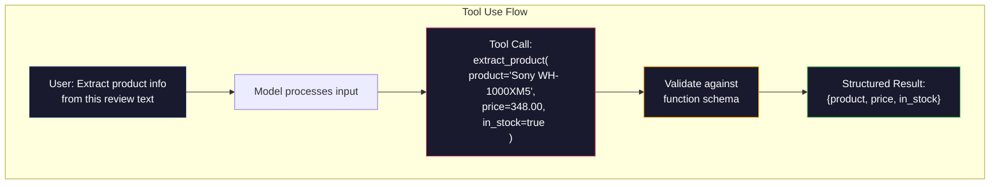

# 结构化输出：JSON、模式验证、约束解码

> LLM返回一个字符串。您的应用程序需要JSON。这种差距导致的生产系统崩溃，比任何模型幻觉都要多。结构化输出是自然语言和类型化数据之间的桥梁。如果做对了，你的LLM就会变成一个可靠的API。错了，你在凌晨3点用正则表达式解析自由文本。

**Type:** Build
**Languages:** Python
**Prerequisites:** Phase 10, Lessons 01-05 (LLMs from Scratch)
**Time:** ~90 minutes
**相关：**第5·20阶段（结构化输出和约束解码）涵盖了解码器级理论（FSM/CFG logit处理器，概述，XGrammar）。本课的重点是生产SDK表面(OpenAI

## 学习目标

- 使用OpenAI和Anthropic API参数实现json模式和模式约束输出
- 构建一个Pydantic验证层，该层拒绝格式不正确的LLM输出，并使用错误反馈进行重试
- 解释约束解码如何在没有后处理的情况下在令牌级别强制执行有效的JSON
- 设计健壮的提取提示，可靠地将非结构化文本转换为类型化数据结构

## 这个问题

你问法学硕士：“从文本中提取产品名称、价格和可用性。”响应:

```
The product is the Sony WH-1000XM5 headphones, which cost $348.00 and are currently in stock.
```

这是一个完全正确的答案。它对您的应用程序也是完全无用的。你的库存系统需要您需要一个具有特定键、特定类型和特定值约束的JSON对象。你不需要一句话。

幼稚的解决方案：在提示符中添加“响应JSON”。这在90%的情况下是有效的。另外10%的模型将JSON包装在降价代码栏中，或者添加像“这是JSON：”这样的序言，或者生成语法上无效的JSON，因为它提前关闭了一个括号。JSON解析器崩溃。你的管道断裂了。添加try/except和重试循环。重试有时会产生不同的数据。现在，在解析问题之上又出现了一个一致性问题。

这不是一个即时的工程问题。这是一个解码问题。该模型从左到右生成令牌。在每个位置，它从100K多个选项的词汇表中选择最有可能的下一个标记。这些选项中的大多数将在任何给定位置生成无效的JSON。如果模型刚刚发射否则将生成无效的JSON。在没有约束的情况下，模型可能会选择一个完全合理的英语单词，但在语法上却出现了灾难性的错误。

## 这个概念

### 结构化输出谱

有四个层次的结构化输出控制，一个比一个可靠。

“‘美人鱼
图LR
子图频谱〔“结构化输出频谱”〕
方向LR
A[“基于提示的\n‘返回JSON’\n~90%有效”]——> B[“JSON模式\n保证有效JSON\n无模式保证”]
B—> C[“模式模式\nJSON +匹配模式\nGuaranteed compliance”]
C—> D[“受限解码\ n令牌级强制\n100%合规”]
结束

样式A：填充：#1a1a2e，描边：#ff6b6b，颜色：#fff
样式B:#1a1a2e，描边：#ffa500，颜色：#fff
样式C：填充：#1a1a2e，描边：#51cf66，颜色：#fff
样式D：填充：#1a1a2e，描边：#0f3460，颜色：#fff
```

**Prompt-based** ("Respond in valid JSON"): no enforcement. The model usually complies but sometimes does not. Reliability: ~90%. Failure mode: markdown fences, preamble text, truncated output, wrong structure.

**JSON mode**: the API guarantees the output is valid JSON. OpenAI's `response_format: { type: "json_object" }` enables this. The output will parse without errors. But it may not match your expected schema -- extra keys, wrong types, missing fields.

**Schema mode**: the API takes a JSON Schema and guarantees the output matches it. In 2026 every major provider supports this natively: OpenAI's `response_format: { type: "json_schema", json_schema: {...} }` (also as `tool_choice="required"`), Anthropic's tool use with `input_schema`, and Gemini's `response_schema` + `response_mime_type: "application/json"`. The output has the exact keys, types, and constraints you specified.

**Constrained decoding**: at each token position during generation, the decoder masks out all tokens that would produce invalid output. If the schema requires a number and the model is about to emit a letter, that token is set to probability zero. The model can only produce tokens that lead to valid output. This is what OpenAI's structured output mode and libraries like Outlines and Guidance implement under the hood.

### JSON Schema: The Contract Language

JSON Schema is how you tell the model (or validation layer) what shape the output must have. Every major structured output system uses it.

```json
{
  "type": "object",
  "properties": {
    "product": { "type": "string" },
    "price": { "type": "number", "minimum": 0 },
    "in_stock": { "type": "boolean" },
    "categories": {
      "type": "array",
      "items": { "type": "string" }
    }
  },
  "required": ["product", "price", "in_stock"]
}
```

该模式规定：输出必须是一个带有字符串的对象任何不匹配的输出都会被拒绝。

模式处理困难的情况：嵌套对象、带有类型项的数组、枚举（将字符串约束为特定值）、模式匹配（字符串上的正则表达式）和组合子（用于多态输出的oneOf、anyOf、allOf）。

### Pydantic模式

在Python中，您不需要手工编写JSON Schema。您定义一个Pydantic模型，它为您生成模式。

”“python
从pydantic导入BaseModel

类产品(BaseModel):
产品:str
价格:浮动
in_stock: bool
类别：list[str] = []
```

This produces the same JSON Schema as above. The Instructor library (and OpenAI's SDK) accept Pydantic models directly: pass the model class, get back a validated instance. If the LLM output does not match, Instructor retries automatically.

### Function Calling / Tool Use

An alternative interface for the same problem. Instead of asking the model to produce JSON directly, you define "tools" (functions) with typed parameters. The model outputs a function call with structured arguments. OpenAI calls this "function calling." Anthropic calls it "tool use." The result is the same: structured data.



当模型需要选择调用哪个函数时，首选使用工具，而不仅仅是填充参数。如果您有10种不同的提取模式，并且模型必须根据输入选择正确的模式，那么使用工具可以同时为您提供模式选择和结构化输出。

### 常见故障模式

即使使用模式强制，结构化输出也可能以微妙的方式失败。

**幻觉值**：输出与模式匹配，但包含虚构的数据。该模型产生模式验证无法捕捉到这一点——类型是正确的，值是错误的。

**Enum混淆**：将字段约束为模型输出好的约束解码可以防止这种情况。基于提示的方法则不然。

*嵌套对象深度**：深度嵌套模式（4级以上）会产生更多错误。嵌套的每一层都是模型可能失去结构轨迹的另一个地方。

**数组长度**：模型可能在数组中产生过多或过少的项。模式支持

**可选字段省略**：模型省略技术上可选但语义上对你的用例很重要的字段。在模式中根据需要设置它们，即使有时缺少数据——强制模型生成

## 构建它

### 步骤1:JSON模式验证器

从头开始构建一个验证器，检查Python对象是否与JSON Schema匹配。这是在输出端运行以验证遵从性的程序。

”“python
进口json

Def validate_schema(data, schema)：
错误= []
_validate（data, schema, "", errors）
返回错误

Def _validate(data, schema, path, errors)：
Schema_type = schema.get（"type"）

如果schema_type == "object"：
如果不是，isinstance(data, dict)：
错误。附加（f"{path}：期望的对象，得到{type(data).__name__}"）
返回
用于模式中的键。get(“需要”,[]):
如果键不在数据中：
errors.append (f”}{路径。{key}：必需的字段缺少")
属性=模式。get(“属性”,{})
对于data.items（）中的key， value：
如果输入properties：
_validate(value, properties[key], f“{path}”。{关键}”,错误)

Elif schema_type == "array"：
如果不是isinstance(data, list)：
错误。附加（f"{path}：期望的数组，得到{type(data).__name__}"）
返回
Min_items = schema。(“minItems”,0)
Max_items = schema。get(“maxItems”,浮子(“正”))
如果len(data) < min_items：
错误。附加（f"{path}：数组有{len(data)}项，最小值是{min_items}"）
如果len(data) > max_items：
错误。附加（f"{path}：数组有{len(data)}项，最大值是{max_items}"）
Items_schema = schema。(“项目”,{})
对于i， enumerate（data）中的item：
_validate（item, items_schema, f"{path}[{i}]"，错误）

Elif schema_type == "string"：
如果不是，isinstance(data, str)：
错误。附加（f"{path}：期望的字符串，得到{type(data).__name__}"）
返回
Enum_values = schema.get（"enum"）
如果enum_values和data不在enum_values中：
错误。附加（f"{path}: ‘{data}’不在允许的值{enum_values}"）

Elif schema_type == "number"：
如果不是，isinstance(data, (int, float))：
错误。附加（f"{path}：期望的数字，得到{type(data).__name__}"）
返回
Minimum = schema.get（" Minimum "）
Maximum = schema.get（" Maximum "）
如果minimum不为None且data < minimum：
错误。附加（f"{path}: {data}小于最小值{最小值}"）
如果maximum不为None且数据>为maximum：
错误。附加（f"{path}: {data}大于最大值{maximum}"）

Elif schema_type == "boolean"：
如果不是，isinstance(data, bool)：
错误。附加（f"{路径}：期望的布尔值，得到{type(data).__name__}"）

Elif schema_type == "integer"：
如果不是isinstance（data, int）或isinstance(data, bool)：
错误。附加（f"{path}：期望的整数，得到{type(data).__name__}"）
```

### Step 2: Pydantic-Style Model to Schema

Build a minimal class-to-schema converter. Define a Python class and generate its JSON Schema automatically.

```python
class SchemaField:
    def __init__(self, field_type, required=True, default=None, enum=None, minimum=None, maximum=None):
        self.field_type = field_type
        self.required = required
        self.default = default
        self.enum = enum
        self.minimum = minimum
        self.maximum = maximum

def python_type_to_schema(field):
    type_map = {
        str: "string",
        int: "integer",
        float: "number",
        bool: "boolean",
    }

    schema = {}

    if field.field_type in type_map:
        schema["type"] = type_map[field.field_type]
    elif field.field_type == list:
        schema["type"] = "array"
        schema["items"] = {"type": "string"}
    elif isinstance(field.field_type, dict):
        schema = field.field_type

    if field.enum:
        schema["enum"] = field.enum
    if field.minimum is not None:
        schema["minimum"] = field.minimum
    if field.maximum is not None:
        schema["maximum"] = field.maximum

    return schema

def model_to_schema(name, fields):
    properties = {}
    required = []

    for field_name, field in fields.items():
        properties[field_name] = python_type_to_schema(field)
        if field.required:
            required.append(field_name)

    return {
        "type": "object",
        "properties": properties,
        "required": required,
    }
```

### 步骤3：约束令牌筛选

模拟约束解码。给定部分JSON字符串和模式，确定哪些令牌类别在当前位置是有效的。

”“python
defnext_valid_tokens (partial_json, schema)：
strip = partial_json.strip（）

如果没有剥离：
["{")返回

试一试:
json.loads(剥离)
返回(“< EOS >”)
除了json。JSONDecodeError:
通过

Last_char = stripping [-1] if strip else “”

    if last_char == "{":
        return ['"', "}"]
    elif last_char == '"':
        if stripped.endswith('":'):
            return ['"', "0-9", "true", "false", "null", "[", "{"]
        return ["a-z", '"']
    elif last_char == ":":
        return [" ", '"', "0-9", "true", "false", "null", "[", "{"]
    elif last_char == ",":
        return [" ", '"', "{", "["]
    elif last_char in "0123456789":
        return ["0-9", ".", ",", "}", "]"]
    elif last_char == "}":
        return [",", "}", "]", "<EOS>"]
    elif last_char == "]":
        return [",", "}", "<EOS>"]
    elif last_char == "[":
        return ['"', "0-9", "true", "false", "null", "{", "[", "]"]
    else:
        return ["any"]

def demonstrate_constrained_decoding ():
Partial_states = [
＇＇，
‘{’,
{“产品”,
{“产品”:,
”{“产品”:“索尼”,
”{“产品”:“索尼”,’,
‘{"product": "Sony", "price":’，
‘{"product": "Sony", "price": 348’，
‘{"product": "Sony", "price": 348}’，
］

print（f"{'Partial JSON':<45} {'Valid Next Tokens'}"）
打印（"-" * 80）
对于partial_states中的state：
Valid = next_valid_tokens（state, {}）
Display = state if state else “（空）”
打印(f”{显示:< 45}{有效}”)
```

### Step 4: Extraction Pipeline

Combine everything into an extraction pipeline: define a schema, simulate an LLM producing structured output, validate the output, and handle retries.

```python
def simulate_llm_extraction(text, schema, attempt=0):
    if "headphones" in text.lower() or "sony" in text.lower():
        if attempt == 0:
            return '{"product": "Sony WH-1000XM5", "price": 348.00, "in_stock": true, "categories": ["audio", "headphones"]}'
        return '{"product": "Sony WH-1000XM5", "price": 348.00, "in_stock": true}'

    if "laptop" in text.lower():
        return '{"product": "MacBook Pro 16", "price": 2499.00, "in_stock": false, "categories": ["computers"]}'

    return '{"product": "Unknown", "price": 0, "in_stock": false}'

def extract_with_retry(text, schema, max_retries=3):
    for attempt in range(max_retries):
        raw = simulate_llm_extraction(text, schema, attempt)

        try:
            data = json.loads(raw)
        except json.JSONDecodeError as e:
            print(f"  Attempt {attempt + 1}: JSON parse error -- {e}")
            continue

        errors = validate_schema(data, schema)
        if not errors:
            return data

        print(f"  Attempt {attempt + 1}: Schema validation errors -- {errors}")

    return None

product_schema = {
    "type": "object",
    "properties": {
        "product": {"type": "string"},
        "price": {"type": "number", "minimum": 0},
        "in_stock": {"type": "boolean"},
        "categories": {"type": "array", "items": {"type": "string"}},
    },
    "required": ["product", "price", "in_stock"],
}
```

### 步骤5：运行完整的管道

”“python
def run_demo ():
Print （"=" * 60）
print（“结构化输出管道演示”）
Print （"=" * 60）

print（“\n——模式定义——”）
Product_fields = {
“产品”:SchemaField (str),
“price”： SchemaField(float, minimum=0)，
“in_stock”:SchemaField (bool),
“categories”： schemaffield (list, required=False)，
｝
generated_schema = model_to_schema（"Product", product_fields）
打印(json。转储(generated_schema,缩进= 2))

print（“\n——模式验证——”）
Test_cases = [
({“产品”:“测试”,“价格”:10.0,“in_stock”:真正的},“有效的对象”),
({“产品”:“测试”,“价格”:-5.0,“in_stock”:真正的},“负价格”),
({“产品”:“测试”、“in_stock”:真正的},“失踪的价格”),
({“产品”:“测试”,“价格”:“十”、“in_stock”:真正的},“价格”),
（“不是对象”，“字符串而不是对象”），
］

对于数据，在test_cases中标记：
错误= validate_schema（data, product_schema）
status = “PASS“如果没有错误，则f”FAIL: {errors}”
Print （f" {label}: {status}"）

print（“\n——约束解码模拟——”）
demonstrate_constrained_decoding ()

print（“\n——提取管道——”）
文本= [
“索尼WH-1000XM5耳机售价为348美元，目前已上市。”
“新款16英寸MacBook Pro售价2499美元，但已经售罄。”
“这是一个没有产品信息的随机句子。”
］

对于文本中的文本：
print（f“\n Input: {text[:60]}…”）
结果= extract_with_retry（text, product_schema）
如果结果:
print（f" Output: {json.dumps(result)}"）
其他:
print（f" Output: FAILED after retries"）
```

## Use It

### OpenAI Structured Outputs

```python
# from openai import OpenAI
# from pydantic import BaseModel
#
# client = OpenAI()
#
# class Product(BaseModel):
#     product: str
#     price: float
#     in_stock: bool
#
# response = client.beta.chat.completions.parse(
#     model="gpt-5-mini",
#     messages=[
#         {"role": "system", "content": "Extract product information."},
#         {"role": "user", "content": "Sony WH-1000XM5, $348, in stock"},
#     ],
#     response_format=Product,
# )
#
# product = response.choices[0].message.parsed
# print(product.product, product.price, product.in_stock)
```

OpenAI的结构化输出模式在内部使用约束解码。模型生成的每个令牌都保证生成与Pydantic模式匹配的输出。不需要重试。不需要验证。该约束被嵌入解码过程中。

### 人为工具的使用

”“python
# 进口人择
#
# client = anthropic.Anthropic（）
#
# Response = client.messages.create(
#     model="claude-opus-4-7",
#     max_tokens = 1024,
#     工具= [{
#         “名称”:“extract_product”,
#         description：从文本中提取产品信息；
#         " input_schema ": {
#             “类型”:“对象”,
#             “属性”:{
#                 “product”： {"type": "string"}，
#                 “price”： {"type": "number"}，
#                 “in_stock”： {"type": "boolean"}，
#             }，
#             “required”： ["product", "price", "in_stock"]，
#         }，
#     }),
#     messages=[{"role": "user", "content": “Extract: Sony WH-1000XM5, $348，现货”}]，
# ）
```

Anthropic achieves structured output through tool use. The model emits a tool call with structured arguments that match the input_schema. Same result, different API surface.

### Instructor Library

```python
# pip install instructor
# import instructor
# from openai import OpenAI
# from pydantic import BaseModel
#
# client = instructor.from_openai(OpenAI())
#
# class Product(BaseModel):
#     product: str
#     price: float
#     in_stock: bool
#
# product = client.chat.completions.create(
#     model="gpt-5-mini",
#     response_model=Product,
#     messages=[{"role": "user", "content": "Sony WH-1000XM5, $348, in stock"}],
# )
```

讲师包装任何LLM客户端，并添加带有验证的自动重试。如果第一次尝试验证失败，它将错误作为上下文发送回模型，并要求模型修复输出。这适用于任何提供商，而不仅仅是OpenAI。

## 船这

这一课产生了向它提供JSON模式和非结构化文本，它将返回经过验证的JSON。

它也产生

## 练习

1. 扩展模式验证器以支持这处理多态输出——例如，一个字段可以是a

2. 构建一个“模式差异”工具，比较两个模式并识别破坏性更改（删除必需字段，更改类型）与非破坏性更改（添加可选字段，放宽约束）。这对于在生产环境中控制提取模式的版本至关重要。

3. 实现一个更真实的约束解码模拟器。给定一个JSON Schema和包含100个标记（字母、数字、标点符号、关键字）的词汇表，一步一步地遍历生成过程，在每个位置屏蔽无效标记。衡量每个步骤中有效词汇的百分比。

4. 构建提取eval套件。用手工标记的JSON输出创建50个产品描述。在所有50个上运行您的提取管道，并测量精确匹配，字段级精度和类型遵从性。确定哪些字段最难正确提取。

5. 添加“信心分数”到您的提取管道。对于每个提取的字段，估计模型的置信度（基于令牌概率，或者通过运行提取3次并测量一致性）。标记低置信度字段供人工审查。

## 关键术语

| Term | What people say | What it actually means |
|------|----------------|----------------------|
| JSON mode | "Returns JSON" | API flag that guarantees syntactically valid JSON output, but does not enforce any particular schema |
| Structured output | "Typed JSON" | Output that matches a specific JSON Schema with correct keys, types, and constraints |
| Constrained decoding | "Guided generation" | At each token position, mask out tokens that would produce invalid output -- guarantees 100% schema compliance |
| JSON Schema | "A JSON template" | A declarative language for describing the structure, types, and constraints of JSON data (used by OpenAPI, JSON Forms, etc.) |
| Pydantic | "Python dataclasses+" | Python library that defines data models with type validation, used by FastAPI and Instructor to generate JSON Schemas |
| Function calling | "Tool use" | LLM outputs a structured function invocation (name + typed arguments) instead of free text -- OpenAI and Anthropic both support this |
| Instructor | "Pydantic for LLMs" | Python library that wraps LLM clients to return validated Pydantic instances, with automatic retry on validation failure |
| Token masking | "Filtering the vocabulary" | Setting specific token probabilities to zero during generation so the model cannot produce them |
| Schema compliance | "Matches the shape" | The output has every required field, correct types, values within constraints, and no extra disallowed fields |
| Retry loop | "Try again until it works" | Send validation errors back to the model and ask it to fix the output -- Instructor does this automatically, up to a configurable max |

## 进一步的阅读

- Z0
- Z0
- Z0
- Z0
- Z0
- Z0
- Z0压制式自动编译，以~100 ns / token的速度屏蔽token。
- Z0
- Z0与供应商无关的对outline和XGrammar的补充。