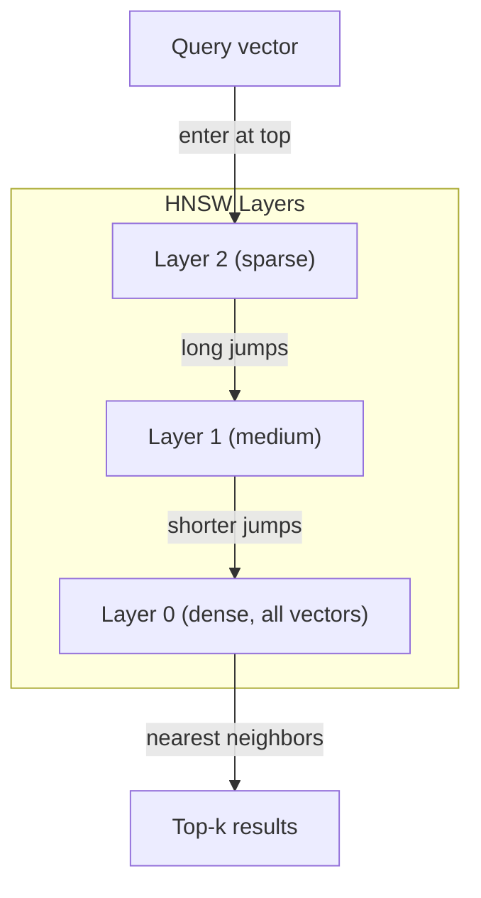

# 嵌入和向量表示

> 文本是离散的。数学是连续的。每当你要求LLM找到“相似”的文档，比较含义，或者超越关键字进行搜索时，你都是在依赖这两个世界之间的桥梁。那座桥是嵌入物。如果你不理解嵌入，你就不理解现代人工智能。你只要使用它。

**Type:** Build
**Languages:** Python
**Prerequisites:** Phase 11, Lesson 01 (Prompt Engineering)
**Time:** ~75 minutes
**相关：**第5·22阶段（嵌入模型深度潜水）涵盖密集、稀疏、多向量、套表截断和每轴模型选择。本课的重点是生产管道（向量db， HNSW，相似数学）。在选择模型之前阅读第5·22阶段。

## 学习目标

- 使用API提供商和开源模型生成文本嵌入，并计算它们之间的余弦相似度
- 解释为什么嵌入可以解决关键词搜索无法解决的词汇不匹配问题
- 构建语义搜索索引，根据含义而不是精确的关键字匹配检索文档
- 使用检索基准（precision@k, recall）评估嵌入质量，并为您的任务选择正确的嵌入模型

## 这个问题

你有一万张支持票。一位顾客写道：“我的付款没有通过。”你需要找到相似的过去机票。关键字搜索可以找到包含“付款”和“未通过”的门票。它忽略了“交易失败”、“收费被拒绝”和“计费错误”。这些票用完全不同的词描述了同样的问题。

这就是词汇不匹配问题。人类语言有几十种方式来表达同一件事。关键字搜索将每个单词视为没有意义的独立符号。它不能知道“拒绝”和“没有通过”指的是同一个概念。

您需要文本的表示形式，其中含义而不是拼写决定相似性。你需要一种方法将“我的付款未通过”和“交易被拒绝”放在某个数学空间中，同时将“我的付款按时到达”推到很远的地方，尽管共享“付款”这个词。

这种表示就是嵌入。

## 这个概念

### 什么是嵌入？

嵌入是表示文本含义的浮点数密集向量。“密集”这个词很重要——每个维度都携带信息，不像稀疏表示（词袋，TF-IDF），其中大多数维度为零。

“猫坐在垫子上”变成了这样的东西这些数字编码意义。你从不直接检查它们。你比较它们。

### Word2Vec的突破

2013年，Tomas Mikolov和谷歌的同事发布了Word2Vec。核心见解：训练神经网络从其邻居（或从一个词的邻居）中预测一个词，并且隐藏层权重成为有意义的向量表示。

著名的结果是：

```
king - man + woman = queen
```

词嵌入的向量算法捕获语义关系。从“男人”到“女人”的方向与从“国王”到“王后”的方向大致相同。这一刻，学界意识到几何可以编码意义。

Word2Vec生成300维向量。无论上下文如何，每个单词都有一个向量。“河岸”中的“银行”与“银行账户”的嵌入相同。这一限制推动了接下来十年的研究。

### 从单词到句子

单词嵌入表示单个标记。生产系统需要嵌入整个句子、段落或文档。出现了四种方法：

**平均**：取句子中所有单词向量的平均值。便宜，有损，对于短文本来说出奇的好。完全失去词序——“狗咬人”和“人咬狗”得到相同的嵌入。

**CLS令牌**：变压器模型（BERT, 2018）输出一个特殊的[CLS]令牌嵌入，表示整个输入。比平均要好，但[CLS]标记是为下一句话预测而不是相似度训练的。

**对比学习**：明确地训练模型，将相似的对放在一起，将不相似的对分开。Sentence-BERT （Reimers & Gurevych, 2019）使用了这种方法，并成为现代嵌入模型的基础。给定“我如何重置密码？”和“我需要更改密码”，模型学习到它们应该具有几乎相同的向量。

**指令调谐嵌入**：最新的方法。像E5和GTE这样的模型接受一个任务前缀（“search_query：”，“search_document：”），它告诉模型要生成什么样的嵌入。这使得一个模型可以服务于多个任务。

“‘mermaid
图LR
子图“2013:Word2Vec”
W1["king"]—> V1["[0.2, -0.1，…]"]
W2[“queen”]—> V2[“[0.3,-0.2，…]”]
结束

子图“2019:Sentence-BERT”
“如何重置密码？”——> e1["[0.04, 0.12，…]"]
S2(“我需要改变我的密码”)——> E2(“(0.05,0.11,……)”
结束

子图“2024：指令调谐”
I1(“search_query:密码重置”)——> T1(“(0.08,0.09,……)”
I2[“search_document：要重置密码，请点击…”—> t2["[0.07, 0.10，…]"]
结束
```

### Modern Embedding Models

The market has settled into a handful of production-grade options (MTEB scores as of early 2026, MTEB v2):

| Model | Provider | Dimensions | MTEB | Context | Cost / 1M tokens |
|-------|----------|-----------|------|---------|------------------|
| Gemini Embedding 2 | Google | 3072 (Matryoshka) | 67.7 (retrieval) | 8192 | $0.15 |
| embed-v4 | Cohere | 1024 (Matryoshka) | 65.2 | 128K | $0.12 |
| voyage-4 | Voyage AI | 1024/2048 (Matryoshka) | 66.8 | 32K | $0.12 |
| text-embedding-3-large | OpenAI | 3072 (Matryoshka) | 64.6 | 8192 | $0.13 |
| text-embedding-3-small | OpenAI | 1536 (Matryoshka) | 62.3 | 8192 | $0.02 |
| BGE-M3 | BAAI | 1024 (dense+sparse+ColBERT) | 63.0 multilingual | 8192 | Open-weight |
| Qwen3-Embedding | Alibaba | 4096 (Matryoshka) | 66.9 | 32K | Open-weight |
| Nomic-embed-v2 | Nomic | 768 (Matryoshka) | 63.1 | 8192 | Open-weight |

MTEB (Massive Text Embedding Benchmark) v2 covers 100+ tasks across retrieval, classification, clustering, reranking, and summarization. Higher is better. By 2026, open-weight models (Qwen3-Embedding, BGE-M3) match or beat closed hosted models on most axes. Gemini Embedding 2 leads pure retrieval; Voyage/Cohere lead specific domains (finance, law, code). Always benchmark on your own queries before committing.

### Similarity Metrics

Given two embedding vectors, three ways to measure how similar they are:

**Cosine similarity**: the cosine of the angle between two vectors. Ranges from -1 (opposite) to 1 (identical direction). Ignores magnitude -- a 10-word sentence and a 500-word document can score 1.0 if they point the same direction. This is the default for 90% of use cases.

```
Cosine_sim (a, b) = dot(a, b) / （||a|| * ||b||）
```

**Dot product**: the raw inner product of two vectors. Identical to cosine similarity when vectors are normalized (unit length). Faster to compute. OpenAI's embeddings are normalized, so dot product and cosine give the same ranking.

```
Dot (a, b) = sum（a_i * b_i）
```

**Euclidean (L2) distance**: straight-line distance in the vector space. Smaller = more similar. Sensitive to magnitude differences. Use when the absolute position in space matters, not just the direction.

```
L2(a, b) = sqrt（sum((a_i - b_i)^2)）
```

When to use which:

| Metric | Use when | Avoid when |
|--------|----------|------------|
| Cosine similarity | Comparing texts of different lengths; most retrieval tasks | Magnitude carries information |
| Dot product | Embeddings are already normalized; maximum speed | Vectors have varying magnitudes |
| Euclidean distance | Clustering; spatial nearest-neighbor problems | Comparing documents of wildly different lengths |

### Vector Databases and HNSW

A brute-force similarity search compares the query against every stored vector. At 1 million vectors with 1536 dimensions, that is 1.5 billion multiply-add operations per query. Too slow.

Vector databases solve this with Approximate Nearest Neighbor (ANN) algorithms. The dominant algorithm is HNSW (Hierarchical Navigable Small World):

1. Build a multi-layer graph of vectors
2. Top layers are sparse -- long-range connections between distant clusters
3. Bottom layers are dense -- fine-grained connections between nearby vectors
4. Search starts at the top layer, greedily descending to refine
5. Returns approximate top-k results in O(log n) time instead of O(n)

HNSW trades a small accuracy loss (typically 95-99% recall) for massive speed gains. At 10 million vectors, brute force takes seconds. HNSW takes milliseconds.



产品选择:

| Database | Type | Best for | Max scale |
|----------|------|----------|-----------|
| Pinecone | Managed SaaS | Zero-ops production | Billions |
| Weaviate | Open source | Self-hosted, hybrid search | 100M+ |
| Qdrant | Open source | High performance, filtering | 100M+ |
| ChromaDB | Embedded | Prototyping, local dev | 1M |
| pgvector | Postgres extension | Already using Postgres | 10M |
| FAISS | Library | In-process, research | 1B+ |

### 分块策略

文档太长，无法作为单个向量嵌入。一份50页的PDF涵盖了几十个主题——它的嵌入变成了所有内容的平均值，类似于没有具体内容。您将文档分成多个块并嵌入每个块。

**固定大小的分块**：拆分每N个令牌与m个令牌重叠。简单且可预测。当文档没有清晰的结构时，效果很好。一个有50个令牌重叠的512个令牌块：块1是令牌0-511，块2是令牌462-973。

**基于句子的分块**：在句子边界拆分，分组句子直到达到令牌限制。每个块至少是一个完整的句子。比固定尺寸更好，因为你永远不会把一个想法切成两半。

**递归分块**：尝试在最大的边界（节头）分裂。如果仍然太大，试试段落边界。然后是句子边界。然后是字符限制。这是LangChain的

*语义分块：嵌入每个句子，然后将嵌入相似的连续句子分组。当嵌入相似度低于阈值时，开始一个新的块。昂贵（需要单独嵌入每个句子），但产生最连贯的块。

| Strategy | Complexity | Quality | Best for |
|----------|-----------|---------|----------|
| Fixed-size | Low | Decent | Unstructured text, logs |
| Sentence-based | Low | Good | Articles, emails |
| Recursive | Medium | Good | Markdown, HTML, mixed docs |
| Semantic | High | Best | Critical retrieval quality |

大多数系统的最佳点是：256-512个令牌块，其中50个令牌重叠。

### 双编码器vs交叉编码器

双编码器独立嵌入查询和文档，然后比较向量。快速——只嵌入查询一次，并与预先计算的文档嵌入进行比较。这是你用来检索的。

交叉编码器将查询和文档作为单个输入，并输出相关性评分。慢——它通过整个模型处理每个查询文档对。但是更准确，因为它可以同时处理查询和文档标记。

生产模式：双编码器检索前100名候选人，交叉编码器将它们重新排序到前10名。这是检索然后重新排序的管道。

“‘mermaid
图LR
Q[“查询”]—> BE["Bi-Encoder: embed Query"]
BE—> VS[“矢量搜索：前100名”]
VS—> CE[“交叉编码器：重新排序”]
CE—> R[“十大结果”]
```

Reranking models: Cohere Rerank 3.5 ($2 per 1000 queries), BGE-reranker-v2 (free, open source), Jina Reranker v2 (free, open source).

### Matryoshka Embeddings

Traditional embeddings are all-or-nothing. A 1536-dimensional vector uses 1536 floats. You cannot truncate to 256 dimensions without retraining.

Matryoshka Representation Learning (Kusupati et al., 2022) fixes this. The model is trained so that the first N dimensions capture the most important information, like a Russian nesting doll. Truncating a 1536-d Matryoshka embedding to 256 dimensions loses some accuracy but remains functional.

OpenAI's text-embedding-3-small and text-embedding-3-large support Matryoshka truncation via the `dimensions` parameter. Requesting 256 dimensions instead of 1536 cuts storage by 6x with roughly 3-5% accuracy loss on MTEB benchmarks.

### Binary Quantization

A 1536-dimensional embedding stored as float32 uses 6,144 bytes. Multiply by 10 million documents: 61 GB just for vectors.

Binary quantization converts each float to a single bit: positive values become 1, negative values become 0. Storage drops from 6,144 bytes to 192 bytes -- a 32x reduction. Similarity is computed using Hamming distance (count differing bits), which CPUs can do in a single instruction.

The accuracy hit is around 5-10% on retrieval recall. The common pattern: binary quantization for the first-pass search over millions of vectors, then rescore the top-1000 with full-precision vectors. This gets you 95%+ of full-precision accuracy at 32x less memory.

## Build It

We build a semantic search engine from scratch. No vector database. No external embedding API. Pure Python with numpy for the math.

### Step 1: Text Chunking

```python
def chunk_text(text, chunk_size=200, overlap=50):
    words = text.split()
    chunks = []
    start = 0
    while start < len(words):
        end = start + chunk_size
        chunk = " ".join(words[start:end])
        chunks.append(chunk)
        start += chunk_size - overlap
    return chunks


def chunk_by_sentences(text, max_chunk_tokens=200):
    sentences = text.replace("\n", " ").split(".")
    sentences = [s.strip() + "." for s in sentences if s.strip()]
    chunks = []
    current_chunk = []
    current_length = 0
    for sentence in sentences:
        sentence_length = len(sentence.split())
        if current_length + sentence_length > max_chunk_tokens and current_chunk:
            chunks.append(" ".join(current_chunk))
            current_chunk = []
            current_length = 0
        current_chunk.append(sentence)
        current_length += sentence_length
    if current_chunk:
        chunks.append(" ".join(current_chunk))
    return chunks
```

### 步骤2：从头开始构建嵌入

我们使用TF-IDF和L2归一化实现了一个简单的密集嵌入。这不是神经嵌入，但它遵循相同的契约：文本输入，固定大小的向量输出，相似的文本产生相似的向量。

”“python
导入数学
import numpy as np
从集合导入计数器

类SimpleEmbedder:
def __init__(自我):
自我。词汇= []
自我。Idf = []
自我。Word_to_idx = {}

Def (self, documents)：
Vocab_set = set（）
文件中的文件：
.split vocab_set.update (doc.lower () ())
自我。Vocab = sorted（vocab_set）
自我。Word_to_idx = {w: I for I, w in enumerate(self.vocab)}
N = len（文件）
自我。Idf = np.zero （len(self.vocab)）
对于i， word在enumerate（self.vocab）中：
Doc_count = sum(如果word在doc.lower（).split（）中）
自我。Idf [i] = math.log((n + 1) / (doc_count + 1)) + 1

Def embed(self, text)：
Words = text.lower().split（）
count =计数器（单词）
Total = len(words) if words else 1
Vec = np.zero （len(self.vocab)）
对于word， count.items（）中的频率：
如果word in self.word_to_idx：
Tf =频率/总数
vec(自我。Word_to_idx [word]] = tf * self.idf[self.word_to_idx[word]]
Norm = np. linalgn . Norm （vec）
如果norm > 0：
Vec = Vec / norm
返回矢量
```

### Step 3: Similarity Functions

```python
def cosine_similarity(a, b):
    dot = np.dot(a, b)
    norm_a = np.linalg.norm(a)
    norm_b = np.linalg.norm(b)
    if norm_a == 0 or norm_b == 0:
        return 0.0
    return float(dot / (norm_a * norm_b))


def dot_product(a, b):
    return float(np.dot(a, b))


def euclidean_distance(a, b):
    return float(np.linalg.norm(a - b))
```

### 步骤4：矢量索引与蛮力搜索

”“python
类VectorIndex:
def __init__(自我):
自我。向量= []
自我。文本= []
自我。元数据= []

def add(self, vector, text, meta=None)：
self.vectors.append(向量)
self.texts.append(文本)
self.metadata。追加（meta或{}）

Def search(self, query_vector, top_k=5, metric="cos ")：
分数= []
对于i， vec在enumerate（self.vectors）中：
如果metric ==“cos”：
得分= cosine_similarity（query_vector, vec）
Elif metric == "dot"：
得分= dot_product（query_vector, vec）
Elif metric == “欧几里得”：
得分= -euclidean_distance（query_vector, vec）
其他:
抛出ValueError（f“未知度量：{metric}”）
分数。追加((我,分数))
分数。sort（key=lambda x: x[1], reverse=True）
结果= []
对于idx， score in scores[:top_k]：
results.append ({
“文本”:self.texts [idx],
“分数”:分数,
“元数据”:self.metadata [idx],
“指数”:idx
})
返回结果

def大小(自我):
返回len (self.vectors)
```

### Step 5: The Semantic Search Engine

```python
class SemanticSearchEngine:
    def __init__(self, chunk_size=200, overlap=50):
        self.embedder = SimpleEmbedder()
        self.index = VectorIndex()
        self.chunk_size = chunk_size
        self.overlap = overlap

    def index_documents(self, documents, source_names=None):
        all_chunks = []
        all_sources = []
        for i, doc in enumerate(documents):
            chunks = chunk_text(doc, self.chunk_size, self.overlap)
            all_chunks.extend(chunks)
            name = source_names[i] if source_names else f"doc_{i}"
            all_sources.extend([name] * len(chunks))
        self.embedder.fit(all_chunks)
        for chunk, source in zip(all_chunks, all_sources):
            vec = self.embedder.embed(chunk)
            self.index.add(vec, chunk, {"source": source})
        return len(all_chunks)

    def search(self, query, top_k=5, metric="cosine"):
        query_vec = self.embedder.embed(query)
        return self.index.search(query_vec, top_k, metric)

    def search_with_scores(self, query, top_k=5):
        results = self.search(query, top_k)
        return [
            {
                "text": r["text"][:200],
                "source": r["metadata"].get("source", "unknown"),
                "score": round(r["score"], 4)
            }
            for r in results
        ]
```

### 步骤6：比较相似性指标

”“python
Def compare_metrics（引擎，查询，top_k=3）：
结果= {}
对于["cos ", "dot", "euclidean"]中的度规：
点击=引擎。查询（查询，top_k=top_k, metric=metric）
结果[度量]= [
{“分数”:圆形(h(“分数”),4),“预览”:h(“文本”)[80]}
对于h命中数
］
返回结果
```

## Use It

With a production embedding API, the architecture stays identical. Only the embedder changes:

```python
from openai import OpenAI

client = OpenAI()

def openai_embed(texts, model="text-embedding-3-small", dimensions=None):
    kwargs = {"model": model, "input": texts}
    if dimensions:
        kwargs["dimensions"] = dimensions
    response = client.embeddings.create(**kwargs)
    return [item.embedding for item in response.data]
```

使用OpenAI进行套娃截断——相同的模型，更少的维度，更低的存储空间；

”“python
Full = openai_embed（[“语义搜索查询”],dimensions=1536）
Compact = openai_embed（["semantic search query"], dimensions=256）
```

The 256-d vector uses 6x less storage. For 10 million documents, that is 10 GB vs 61 GB. The accuracy loss is roughly 3-5% on standard benchmarks.

For reranking with Cohere:

```python
import cohere

co = cohere.ClientV2()

results = co.rerank(
    model="rerank-v3.5",
    query="What is the refund policy?",
    documents=["Full refund within 30 days...", "No refunds after 90 days..."],
    top_n=3
)
```

对于没有API依赖的本地嵌入：

”“python
从sentence_transformer导入SentenceTransformer

model = SentenceTransformer（"BAAI/ big -small-en-v1.5"）
嵌入=模型。编码（[“语义搜索查询”，“另一个文档”]）
```

The VectorIndex class from our build works with any of these. Swap the embedding function, keep the search logic.

## Ship It

This lesson produces:
- `outputs/prompt-embedding-advisor.md` -- a prompt for choosing embedding models and strategies for specific use cases
- `outputs/skill-embedding-patterns.md` -- a skill that teaches agents how to use embeddings effectively in production

## Exercises

1. **Metric comparison**: run the same 5 queries against the sample documents using cosine similarity, dot product, and euclidean distance. Record the top-3 results for each. For which queries do the metrics disagree? Why?

2. **Chunk size experiment**: index the sample documents with chunk sizes of 50, 100, 200, and 500 words. For each, run 5 queries and record the top-1 similarity score. Plot the relationship between chunk size and retrieval quality. Find the point where larger chunks start hurting.

3. **Matryoshka simulation**: build a SimpleEmbedder that produces 500-d vectors. Truncate to 50, 100, 200, and 500 dimensions. Measure how retrieval recall degrades at each truncation. This simulates Matryoshka behavior without needing the real training trick.

4. **Binary quantization**: take the embeddings from the search engine, convert them to binary (1 if positive, 0 if negative), and implement Hamming distance search. Compare the top-10 results against full-precision cosine similarity. Measure the overlap percentage.

5. **Sentence-based chunking**: replace fixed-size chunking with `chunk_by_sentences`. Run the same queries and compare retrieval scores. Does respecting sentence boundaries improve the results?

## Key Terms

| Term | What people say | What it actually means |
|------|----------------|----------------------|
| Embedding | "Text to numbers" | A dense vector where geometric proximity encodes semantic similarity |
| Word2Vec | "The OG embedding" | 2013 model that learned word vectors by predicting context words; proved vector arithmetic encodes meaning |
| Cosine similarity | "How similar are two vectors" | Cosine of the angle between vectors; 1 = identical direction, 0 = orthogonal, -1 = opposite |
| HNSW | "Fast vector search" | Hierarchical Navigable Small World graph -- multi-layer structure enabling O(log n) approximate nearest neighbor search |
| Bi-encoder | "Embed separately, compare fast" | Encodes query and document independently into vectors; enables pre-computation and fast retrieval |
| Cross-encoder | "Slow but accurate reranker" | Processes query-document pair jointly through the full model; higher accuracy, no pre-computation |
| Matryoshka embeddings | "Truncatable vectors" | Embeddings trained so the first N dimensions capture the most important information, enabling variable-size storage |
| Binary quantization | "1-bit embeddings" | Converting float vectors to binary (sign bit only) for 32x storage reduction with Hamming distance search |
| Chunking | "Split docs for embedding" | Breaking documents into 256-512 token segments so each can be independently embedded and retrieved |
| Vector database | "Search engine for embeddings" | Data store optimized for storing vectors and performing approximate nearest neighbor search at scale |
| Contrastive learning | "Train by comparison" | Training approach that pushes similar pair embeddings together and dissimilar pair embeddings apart |
| MTEB | "The embedding benchmark" | Massive Text Embedding Benchmark -- 56 datasets across 8 tasks; standard for comparing embedding models |

## Further Reading

- Mikolov et al., "Efficient Estimation of Word Representations in Vector Space" (2013) -- the Word2Vec paper that started the embedding revolution with the king-queen analogy
- Reimers & Gurevych, "Sentence-BERT: Sentence Embeddings using Siamese BERT-Networks" (2019) -- how to train bi-encoders for sentence-level similarity, foundation of modern embedding models
- Kusupati et al., "Matryoshka Representation Learning" (2022) -- the technique behind variable-dimension embeddings that OpenAI adopted for text-embedding-3
- Malkov & Yashunin, "Efficient and Robust Approximate Nearest Neighbor using Hierarchical Navigable Small World Graphs" (2018) -- the HNSW paper, the algorithm behind most production vector search
- OpenAI Embeddings Guide (platform.openai.com/docs/guides/embeddings) -- practical reference for text-embedding-3 models including Matryoshka dimension reduction
- MTEB Leaderboard (huggingface.co/spaces/mteb/leaderboard) -- live benchmark comparing all embedding models across tasks and languages
- [Muennighoff et al., "MTEB: Massive Text Embedding Benchmark" (EACL 2023)](https://arxiv.org/abs/2210.07316) -- the benchmark defining 8 task categories (classification, clustering, pair classification, reranking, retrieval, STS, summarization, bitext mining) that the leaderboard reports; read before trusting any single MTEB score.
- [Sentence Transformers documentation](https://www.sbert.net/) -- canonical reference for bi-encoder vs cross-encoder, pooling strategies, and the ingest-split-embed-store RAG pipeline this lesson implements.