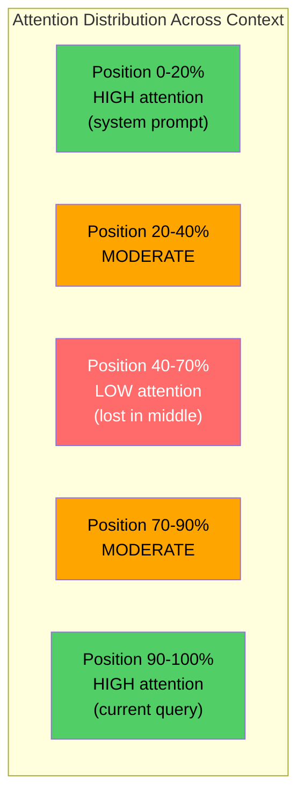

# 上下文工程：Windows，预算，内存和检索

> 提示工程是一个子集。环境工程是整个游戏。提示符是您键入的字符串。上下文是进入模型窗口的所有内容：系统指令、检索的文档、工具定义、对话历史、少量示例和提示本身。2026年最好的人工智能工程师是情境工程师。他们决定什么能进，什么不能出，以及以什么顺序。

**Type:** Build
**Languages:** Python
**Prerequisites:** Phase 10 (LLMs from Scratch), Phase 11 Lesson 01-02
**Time:** ~90 minutes
**相关：**阶段11·15（提示缓存）-缓存友好的布局是上下文工程的扩展。第5·28阶段（长期情境评估）：如何使用NIAH/RULER测量中间损失。

## 学习目标

- 计算所有上下文窗口组件（系统提示符、工具、历史记录、检索文档、生成空间）的令牌预算
- 实现上下文窗口管理策略：对话历史记录的截断、摘要和滑动窗口
- 对上下文组件进行优先排序和排序，以最大限度地提高模型对最相关信息的关注
- 构建上下文汇编程序，根据查询类型和可用窗口空间动态分配令牌

## 这个问题

Claude Opus 4.7有一个200K的令牌窗口（测试版为1M）。GPT-5有400K。双子座3 Pro有2M。羊驼4声称1000万。这些数字听起来很大，直到你把它们填满。

这是一个真正的编码助理分解。系统提示：500个token。50个工具的工具定义：8000个令牌。检索的文档：4,000个令牌。会话记录（10轮）：6000个token。当前用户查询：200个token。生成预算（最大输出）：4,000代币。总数：22,700个代币。这只是128K窗口的18%。

但注意力不随上下文长度线性增长。具有128K个上下文标记的模型支付二次注意力成本（在普通转换器中为O(n^2)，尽管大多数生产模型使用有效的注意力变体）。更重要的是，检索精度降低了。“大海捞针”测试表明，模型很难找到放置在长上下文中间的信息。Liu等人（2023）的研究表明，llm在长上下文的开始和结束处检索信息的准确率接近完美，但对于放置在中间（上下文的40-70%位置）的信息，准确率下降10-20%。这种“中间丢失”效应因模型而异，但会影响所有当前架构。

实践经验：拥有200K个令牌并不意味着使用200K个令牌是有效的。精心策划的10K令牌上下文通常优于转储的100K令牌上下文。上下文工程是在上下文窗口内最大化信噪比的学科。

你在窗口中放置的每一个标记都会取代一个可以携带更多相关信息的标记。每一个不相关的工具定义，每一个陈年的对话，每一个不能回答问题的检索文本块——每一个都会使模型在任务中稍微变差。

## 这个概念

### 上下文窗口是一种稀缺资源

将上下文窗口看作RAM，而不是磁盘。它是快速和直接访问，但有限。你不可能适应所有的东西。你必须选择。

“‘美人鱼
图道明
子图窗口[“上下文窗口（128K令牌）”]
方向结核病
S[“系统提示符\n~500个令牌”]—> T[“工具定义\n~2K-8K个令牌”]
T—> R[“检索上下文\n~2K-10K令牌”]
R—> H[“会话记录\n~2K-20K代币”]
H—> F[“少量示例\n~1K-3K代币”]
F—> Q[“用户查询\n~100-500个令牌”]
Q—> G[“代币预算\n~2K-8K”]
结束

    style S fill:#1a1a2e,stroke:#e94560,color:#fff
    style T fill:#1a1a2e,stroke:#0f3460,color:#fff
    style R fill:#1a1a2e,stroke:#ffa500,color:#fff
    style H fill:#1a1a2e,stroke:#51cf66,color:#fff
    style F fill:#1a1a2e,stroke:#9b59b6,color:#fff
    style Q fill:#1a1a2e,stroke:#e94560,color:#fff
    style G fill:#1a1a2e,stroke:#0f3460,color:#fff
```

Each component competes for space. Adding more tool definitions means less room for conversation history. Adding more retrieved context means less room for few-shot examples. Context engineering is the art of allocating this budget to maximize task performance.

### Lost-in-the-Middle

The most important empirical finding in context engineering. Models attend better to information at the beginning and end of the context. Information in the middle gets lower attention scores and is more likely to be ignored.

Liu et al. (2023) tested this systematically. They placed a relevant document among 20 irrelevant documents at various positions and measured answer accuracy. When the relevant document was first or last, accuracy was 85-90%. When it was in the middle (position 10 of 20), accuracy dropped to 60-70%.

This has direct engineering implications:

- Put the most important information first (system prompt, critical instructions)
- Put the current query and most relevant context last (recency bias helps)
- Treat the middle of the context as the lowest-priority zone
- If you must include information in the middle, duplicate the key point at the end



### 上下文组件

**系统提示符**：设置角色、约束和行为规则。这是第一个，在转弯时保持不变。Claude Code使用大约6000个令牌作为其系统提示符，包括工具定义和行为指令。保持紧绷。系统提示符中的每个单词在每个API调用中都会重复。

**工具定义**：每个工具添加50-200个标记（名称，描述，参数模式）。50个工具，每个150个令牌，在任何对话发生之前是7500个令牌。动态工具选择——只包括与当前查询相关的工具——可以将此减少60-80%。

**检索上下文**：来自矢量数据库的文档，搜索结果，文件内容。检索的质量直接决定响应的质量。糟糕的检索比没有检索更糟糕——它使窗口充满噪音，并主动误导模型。

**会话记录**：以前的每条用户消息和助理回复。随对话长度线性增长。一个50回合的对话，每回合200个代币，就是10000个历史代币。其中大部分与当前查询无关。

**几个镜头的例子**：输入/输出对演示所需的行为。两到三个精心选择的示例通常比数以千计的指令令牌更能提高输出质量。但它们需要空间。

**生成预算**：为模型响应保留的令牌。如果你把窗口填满，模型就没有回答的余地了。预留至少2000 - 4000个代币用于生成。

### 上下文压缩策略

**历史总结**：不要逐字逐句地记录之前的对话，而是定期总结对话。“我们讨论了X，决定了Y，用户想要Z”，用100个代币取代了花费2000个代币的10个回合。当历史记录超过阈值（例如，5,000个令牌）时运行摘要。

**相关性过滤**：根据当前查询对每个检索文档进行评分，并将文档降至阈值以下。如果您检索了10个块，但只有3个是相关的，则丢弃其他7个。最好有3个高度相关的块，而不是10个平庸的块。

**工具修剪**：分类用户的查询意图，只包括与该意图相关的工具。代码问题不需要日历工具。调度问题不需要文件系统工具。这可以将工具定义从8,000个令牌减少到1,000个。

**递归总结**：对于很长的文档，分阶段总结。首先总结每个部分，然后总结总结。一份50页的文档变成了500个令牌摘要，其中包含了关键点。

### 内存系统

上下文工程跨越三个时间范围。

**短期记忆**：当前对话。直接存储在上下文窗口中。每一次都在成长。通过摘要和截断管理。

**长期记忆**：在对话中持续存在的事实和偏好。“用户更喜欢TypeScript。”“项目使用PostgreSQL。”存储在数据库中，在会话开始时检索。Claude Code将其存储在Claude中。md文件。ChatGPT将其存储在其内存功能中。

*情景记忆：可能相关的特定的过去互动。“上周二，我们在验证模块中调试了一个类似的问题。”作为嵌入存储，当当前对话匹配过去的情节时检索。

“‘美人鱼
图道明
子图内存[“内存架构”]
方向结核病
短时记忆\n（当前对话）\nDirect in context window
LTM[“长期记忆\n（事实，偏好）\nDB ->在会话开始时检索”]
情景记忆\n（过去的互动）\nEmbeddings ->根据相似性检索
结束

q[“当前查询”]--> STM
Q–> LTM
Q -> EM

STM——> CW["上下文窗口"]
LTM——> CW
EM -> CW

样式：STM填充：#1a1a2e，描边：#51cf66，颜色：#fff
样式：LTM，填充：#1a1a2e，描边：#0f3460，颜色：#fff
样式EM填充：#1a1a2e，描边：#e94560，颜色：#fff
样式：CW:#1a1a2e，描边：#ffa500，颜色：#fff
```

### Dynamic Context Assembly

The key insight: different queries need different context. A static system prompt + static tools + static history is wasteful. The best systems dynamically assemble context per query.

1. Classify the query intent
2. Select relevant tools (not all tools)
3. Retrieve relevant documents (not a fixed set)
4. Include relevant history turns (not all history)
5. Add few-shot examples that match the task type
6. Order everything by importance: critical first, important last, optional in the middle

This is what separates a good AI application from a great one. The model is the same. The context is the differentiator.

## Build It

### Step 1: Token Counter

You cannot budget what you cannot measure. Build a simple token counter (approximation using whitespace splitting, since the exact count depends on the tokenizer).

```python
import json
import numpy as np
from collections import OrderedDict

def count_tokens(text):
    if not text:
        return 0
    return int(len(text.split()) * 1.3)

def count_tokens_json(obj):
    return count_tokens(json.dumps(obj))
```

### 步骤2：情境预算管理器

核心抽象。预算管理器跟踪每个组件使用的令牌数量并实施限制。

”“python
类ContextBudget:
Def __init__(self, max_tokens=128000, generation_reserve=4000)：
自我。max_token = max_token
自我。Generation_reserve = Generation_reserve
自我。可用= max_tokens - generation_reserve
自我。分配= OrderedDict（）

def allocate(self, component, content, max_tokens=None)：
token = count_tokens（content）
如果max_tokens和token > max_token：
Words = content.split（）
Target_words = int（max_tokens / 1.3）
内容= " ".join（words[:target_words]）
token = count_tokens（content）

Used = sum（self.allocations.values()）
如果使用+ tokens > self.available：
允许=自我。Available - used
如果允许<= 0：
返回None， 0
Words = content.split（）
Target_words = int（允许/ 1.3）
内容= " ".join（words[:target_words]）
token = count_tokens（content）

自我。分配[组件]=令牌
返回内容，令牌

def剩余(自我):
Used = sum（self.allocations.values()）
回归自我。Available - used

def利用率(自我):
Used = sum（self.allocations.values()）
返回used / self.max_tokens

def报告(自我):
Total_used = sum（self.allocations.values()）
台词= []
行。附加(f)上下文预算报告({self。Max_tokens:，} token窗口)"
行。追加（"-" * 50）
对于组件，self.allocations.items（）中的token：
PCT = tokens / self。Max_tokens * 100
Bar = "#" * int（pct / 2）
行。append (f“{组件:< 25}{令牌:> 6}标记({pct: > 5.1 f} %){酒吧}”)
行。追加（"-" * 50）
行。追加(f“{“使用”:< 25}{total_used: > 6}标记({total_used / self.max_tokens * 100: .1f} %)”)
行。{'Generation reserve':<25} {generation_reserve: > 6}标记”)
行。{‘剩余’：<25}{剩余():> 6}标记”)
返回" \ n " . join()行
```

### Step 3: Lost-in-the-Middle Reordering

Implement the reordering strategy: most important items go first and last, least important go in the middle.

```python
def reorder_lost_in_middle(items, scores):
    paired = sorted(zip(scores, items), reverse=True)
    sorted_items = [item for _, item in paired]

    if len(sorted_items) <= 2:
        return sorted_items

    first_half = sorted_items[::2]
    second_half = sorted_items[1::2]
    second_half.reverse()

    return first_half + second_half

def score_relevance(query, documents):
    query_words = set(query.lower().split())
    scores = []
    for doc in documents:
        doc_words = set(doc.lower().split())
        if not query_words:
            scores.append(0.0)
            continue
        overlap = len(query_words & doc_words) / len(query_words)
        scores.append(round(overlap, 3))
    return scores
```

### 步骤4：对话记录压缩器

总结旧的谈话转向收回token预算。

”“python
类ConversationManager:
Def __init__(self, max_history_tokens=5000)：
自我。turn = []
自我。摘要= []
自我。max_history_token = max_history_token

Def add_turn(self, role, content)：
self.turns。Append （{"role": role, "content": content}）
self._compress_if_needed ()

def _compress_if_needed(自我):
Total = sum（count_tokens(t["content"]) for t in self.turns）
如果total <= self.max_history_tokens：
返回

而总>自我。Max_history_tokens和len(self。转)> 4：
Old_turns = self.turns[:2]
Summary = self._summarize_turns（old_turns）
self.summaries.append(总结)
自我。Turns = self.turns[2:]
Total = sum（count_tokens(t["content"]) for t in self.turns）

Def _summarize_turns(self, turns)：
零件= []
对于t依次：
Content = t[" Content "]
如果len(content) > 100：
Content = Content[:100] + “…”
部分。追加(f”{t(的角色)}:{内容}”)
return "Previous: " + " | ".join（parts）

def get_context(自我):
零件= []
如果self.summaries:
部分。追加(“[谈话摘要]”)
在自我总结中：
parts.append (s)
部分。追加(“(最近的谈话)”)
因为t in self.turn：
部分。追加(f”{t(的角色)}:{t(“内容”)}”)
返回" \ n " . join(部分)

def token_count(自我):
返回count_tokens (self.get_context ())
```

### Step 5: Dynamic Tool Selector

Only include tools relevant to the current query. Classify intent, then filter.

```python
TOOL_REGISTRY = {
    "read_file": {
        "description": "Read contents of a file",
        "tokens": 120,
        "categories": ["code", "files"],
    },
    "write_file": {
        "description": "Write content to a file",
        "tokens": 150,
        "categories": ["code", "files"],
    },
    "search_code": {
        "description": "Search for patterns in codebase",
        "tokens": 130,
        "categories": ["code"],
    },
    "run_command": {
        "description": "Execute a shell command",
        "tokens": 140,
        "categories": ["code", "system"],
    },
    "create_calendar_event": {
        "description": "Create a new calendar event",
        "tokens": 180,
        "categories": ["calendar"],
    },
    "list_emails": {
        "description": "List recent emails",
        "tokens": 160,
        "categories": ["email"],
    },
    "send_email": {
        "description": "Send an email message",
        "tokens": 200,
        "categories": ["email"],
    },
    "web_search": {
        "description": "Search the web for information",
        "tokens": 140,
        "categories": ["research"],
    },
    "query_database": {
        "description": "Run a SQL query on the database",
        "tokens": 170,
        "categories": ["code", "data"],
    },
    "generate_chart": {
        "description": "Generate a chart from data",
        "tokens": 190,
        "categories": ["data", "visualization"],
    },
}

def classify_intent(query):
    query_lower = query.lower()

    intent_keywords = {
        "code": ["code", "function", "bug", "error", "file", "implement", "refactor", "debug", "test"],
        "calendar": ["meeting", "schedule", "calendar", "appointment", "event"],
        "email": ["email", "mail", "send", "inbox", "message"],
        "research": ["search", "find", "what is", "how does", "explain", "look up"],
        "data": ["data", "query", "database", "chart", "graph", "analytics", "sql"],
    }

    scores = {}
    for intent, keywords in intent_keywords.items():
        score = sum(1 for kw in keywords if kw in query_lower)
        if score > 0:
            scores[intent] = score

    if not scores:
        return ["code"]

    max_score = max(scores.values())
    return [intent for intent, score in scores.items() if score >= max_score * 0.5]

def select_tools(query, token_budget=2000):
    intents = classify_intent(query)
    relevant = {}
    total_tokens = 0

    for name, tool in TOOL_REGISTRY.items():
        if any(cat in intents for cat in tool["categories"]):
            if total_tokens + tool["tokens"] <= token_budget:
                relevant[name] = tool
                total_tokens += tool["tokens"]

    return relevant, total_tokens
```

### 步骤6：全上下文组装管道

把所有东西连接起来。给定一个查询，动态地组装最优上下文。

”“python
类ContextEngine:
Def __init__(self, max_tokens=128000, generation_reserve=4000)：
自我。budget = ContextBudget（max_tokens, generation_reserve）
自我。conversation = ConversationManager（max_history_tokens=5000）
自我。System_prompt = (
“你是一个有用的人工智能助手。你可以使用工具
代码编辑、文件管理、网络搜索和数据分析。
“为每项任务使用合适的工具。要简洁准确。”
）
自我。知识库= [
“Python 3.12引入了使用括号符号的泛型类的类型参数语法。”，
该项目使用PostgreSQL 16和pgvector来嵌入存储。
“身份验证由Supabase Auth使用JWT令牌处理。”
“前端是用Next.js 15使用App Router构建的。”
API速率限制设置为每用户每分钟100个请求。
“部署管道使用GitHub Actions与Docker多阶段构建。”
“所有新模块的测试覆盖率必须超过80%。”
“代码库遵循数据访问的存储库模式。”
］

Def assemble(self, query)：
自我。预算= ContextBudget（self.budget.）max_tokens self.budget.generation_reserve)

System_content, _ = self.budget。分配(“system_prompt”,自我。system_prompt max_tokens = 1000)

工具，tool_tokens = select_tools（查询，token_budget=2000）
Tool_text = json.dumps（list(tools.keys())）
Tool_content, _ = self.budget。分配（"tools", tool_text, max_tokens=2000）

关联= score_relevance（查询，self.knowledge_base）
阈值= 0.1
Relevant_docs = [
医生对医生，分数在zip（self）。knowledge_base相关性)
如果score >= threshold
］

如果relevant_docs:
Doc_scores = [s for s in relevance if s >= threshold]
Reordered = reorder_lost_in_middle（relevant_docs, doc_scores）
Doc_text = "\n".join（重新排序）
Doc_content, _ = self.budget。分配（"retrieved_context", doc_text, max_tokens=3000）

History_text = self.conversation.get_context（）
如果history_text.strip ():
History_content, _ = self.budget。分配（"conversation_history", history_text, max_tokens=5000）

Query_content, _ = self.budget。分配（"user_query", query, max_tokens=500）

返回self.budget

Def chat(self, query)：
self.conversation。add_turn(“用户”,查询)
预算= self.assemble（查询）
response = f“[响应：{query[:50]}…]”
self.conversation。add_turn(“助理”,响应)
返回的预算


def run_demo ():
Print （"=" * 60）
打印（“上下文工程管道演示”）
Print （"=" * 60）

engine = ContextEngine（max_tokens=128000, generation_reserve=4000）

print（“\n——查询1：代码任务——”）
预算=引擎。chat（“修复了身份验证模块中JWT令牌过早过期的bug”）
print (budget.report ())

print（“\n——查询2：研究任务——”）
预算=引擎。在PostgreSQL中实现矢量搜索的最佳方法是什么？
print (budget.report ())

print（“\n——查询3：在会话历史建立之后——”）
对于I在(8)范围内：
engine.conversation。add_turn（“用户”，f“关于系统实现细节的后续问题号{i+1}”）
engine.conversation。add_turn（“助手”，f“这是对后续{i+1}的响应，包含有关架构的技术细节”）

预算=引擎。聊天（“现在实现我们讨论过的更改”）
print (budget.report ())

print（“\n——工具选择示例——”）
Test_queries = [
“修复auth.py中的错误”，
“安排周二和团队开会”
“Show me the database query performance stats”，
“搜寻处理错误的最佳做法”，
］

对于test_queries中的q：
Tools, tokens = select_tools(q)
意图= classify_intent(q)
print（f"\n查询：{q}"）
print（f" intent: {intent}"）
print(f" Tools: {list（Tools .）Keys ())} ({token} token)"

print（“\n——中间丢失的重新排序——”）
docs =[“文件A（最相关）”，“文件B（有些相关）”，“文件C（最不相关）”，
“D文件（相关）”、“E文件（中等相关）”]
得分= [0.95,0.60,0.20,0.80,0.50]
Reordered = reorder_lost_in_middle（docs, scores）
print（f“原订单：{docs}”）
print（f" Scores: {Scores}"）
print（f" Reordered: {Reordered}"）
print（f“（开头和结尾最相关，中间最不相关）”）
```

## Use It

### Claude Code's Context Strategy

Claude Code manages context with a layered approach. The system prompt includes behavioral rules and tool definitions (~6K tokens). When you open a file, its contents are injected as context. When you search, results are added. Old conversation turns are summarized. CLAUDE.md provides long-term memory that persists across sessions.

The key engineering decision: Claude Code does not dump your entire codebase into the context. It retrieves relevant files on demand. This is context engineering in practice.

### Cursor's Dynamic Context Loading

Cursor indexes your entire codebase into embeddings. When you type a query, it retrieves the most relevant files and code blocks using vector similarity. Only those pieces go into the context window. A 500K-line codebase is compressed into the 5-10 most relevant code blocks.

This is the pattern: embed everything, retrieve on demand, include only what matters.

### ChatGPT Memory

ChatGPT stores user preferences and facts as long-term memory. On each conversation start, relevant memories are retrieved and included in the system prompt. "The user prefers Python" costs 5 tokens but saves hundreds of tokens of repeated instructions across conversations.

### RAG as Context Engineering

Retrieval-Augmented Generation is context engineering formalized. Instead of stuffing knowledge into the model's weights (training) or the system prompt (static context), you retrieve relevant documents at query time and inject them into the context window. The entire RAG pipeline -- chunking, embedding, retrieval, reranking -- exists to solve one problem: putting the right information in the context window.

## Ship It

This lesson produces `outputs/prompt-context-optimizer.md` -- a reusable prompt that audits a context assembly strategy and recommends optimizations. Feed it your system prompt, tool count, average history length, and retrieval strategy, and it identifies token waste and suggests improvements.

It also produces `outputs/skill-context-engineering.md` -- a decision framework for designing context assembly pipelines based on task type, context window size, and latency budget.

## Exercises

1. Add a "token waste detector" to the ContextBudget class. It should flag components using more than 30% of the budget and suggest compression strategies specific to each component type (summarize history, prune tools, re-rank documents).

2. Implement semantic deduplication for retrieved context. If two retrieved documents are more than 80% similar (by word overlap or cosine similarity of their embeddings), keep only the higher-scored one. Measure how much token budget this recovers.

3. Build a "context replay" tool. Given a conversation transcript, replay it through the ContextEngine and visualize how the budget allocation changes turn by turn. Plot token usage per component over time. Identify the turn where context starts getting compressed.

4. Implement a priority-based tool selector. Instead of binary include/exclude, assign each tool a relevance score to the current query. Include tools in descending relevance order until the tool budget is exhausted. Compare task performance with 5, 10, 20, and 50 tools included.

5. Build a multi-strategy context compressor. Implement three compression strategies (truncation, summarization, extraction of key sentences) and benchmark them on a set of 20 documents. Measure the tradeoff between compression ratio and information retention (does the compressed version still contain the answer to the query?).

## Key Terms

| Term | What people say | What it actually means |
|------|----------------|----------------------|
| Context window | "How much the model can read" | The maximum number of tokens (input + output) the model processes in a single forward pass -- 400K for GPT-5, 200K (1M beta) for Claude Opus 4.7, 2M for Gemini 3 Pro |
| Context engineering | "Advanced prompt engineering" | The discipline of deciding what goes into the context window, in what order, and at what priority -- encompasses retrieval, compression, tool selection, and memory management |
| Lost-in-the-middle | "Models forget stuff in the middle" | Empirical finding that LLMs attend better to the beginning and end of context, with 10-20% accuracy drop for information placed in the middle |
| Token budget | "How many tokens you have left" | An explicit allocation of context window capacity across components (system prompt, tools, history, retrieval, generation) with per-component limits |
| Dynamic context | "Loading stuff on the fly" | Assembling the context window differently for each query based on intent classification, relevant tool selection, and retrieval results |
| History summarization | "Compressing the conversation" | Replacing verbatim old conversation turns with a concise summary, reducing token cost while preserving key information |
| Tool pruning | "Only including relevant tools" | Classifying query intent and only including tool definitions that match, reducing tool token cost by 60-80% |
| Long-term memory | "Remembering across sessions" | Facts and preferences stored in a database and retrieved at session start -- CLAUDE.md, ChatGPT Memory, and similar systems |
| Episodic memory | "Remembering specific past events" | Past interactions stored as embeddings and retrieved when the current query is similar to a past conversation |
| Generation budget | "Room for the answer" | Tokens reserved for the model's output -- if the context fills the window completely, the model has no room to respond |

## Further Reading

- [Liu et al., 2023 -- "Lost in the Middle: How Language Models Use Long Contexts"](https://arxiv.org/abs/2307.03172) -- the definitive study on position-dependent attention, showing that models struggle with information in the middle of long contexts
- [Anthropic's Contextual Retrieval blog post](https://www.anthropic.com/news/contextual-retrieval) -- how Anthropic approaches context-aware chunk retrieval, reducing retrieval failure by 49%
- [Simon Willison's "Context Engineering"](https://simonwillison.net/2025/Jun/27/context-engineering/) -- the blog post that named the discipline and distinguished it from prompt engineering
- [LangChain documentation on RAG](https://python.langchain.com/docs/tutorials/rag/) -- practical implementation of retrieval-augmented generation as a context engineering pattern
- [Greg Kamradt's Needle in a Haystack test](https://github.com/gkamradt/LLMTest_NeedleInAHaystack) -- the benchmark that revealed position-dependent retrieval failures across all major models
- [Pope et al., "Efficiently Scaling Transformer Inference" (2022)](https://arxiv.org/abs/2211.05102) -- why context length drives memory and latency, and how KV cache, MQA, and GQA change the budget calculation.
- [Agrawal et al., "SARATHI: Efficient LLM Inference by Piggybacking Decodes with Chunked Prefills" (2023)](https://arxiv.org/abs/2308.16369) -- the two phases of inference that make long prompts expensive in TTFT but cheap in TPOT; the ground truth behind context-packing tradeoffs.
- [Ainslie et al., "GQA: Training Generalized Multi-Query Transformer Models from Multi-Head Checkpoints" (EMNLP 2023)](https://arxiv.org/abs/2305.13245) -- the grouped-query attention paper that cut KV memory 8× in production decoders without quality loss.