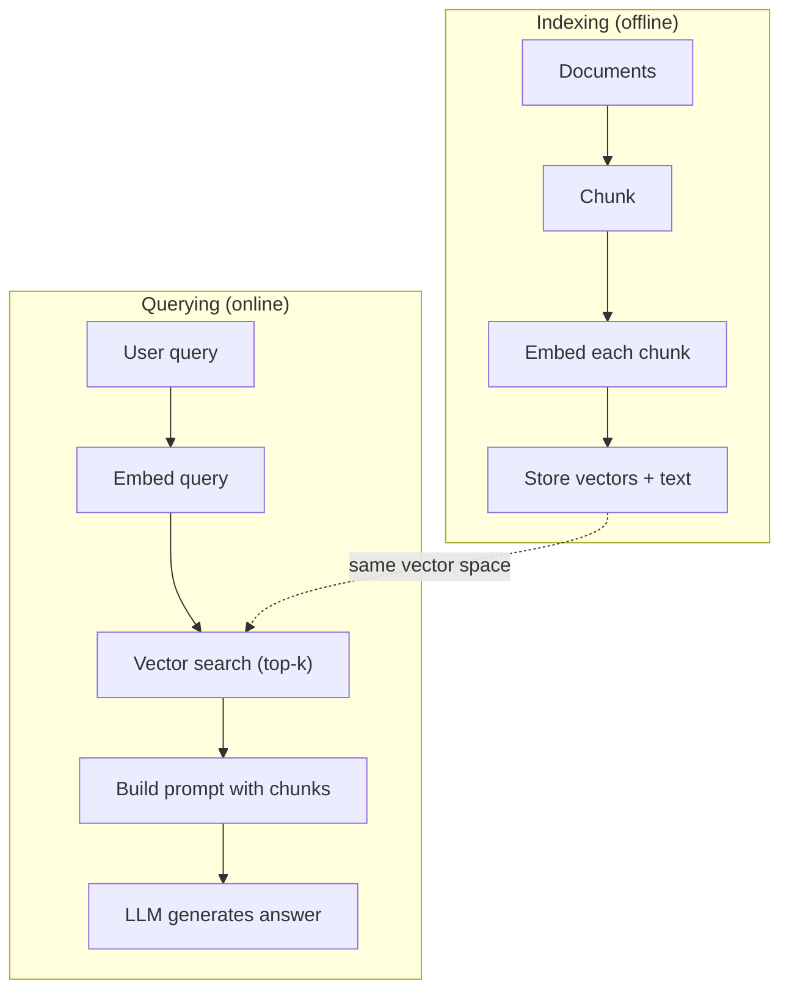

# 检索-增强生成

> 你的法学硕士知道一切直到培训结束。它对你公司的文档、代码库或上周的会议记录一无所知。RAG通过检索相关文档并将它们填充到提示符中来解决这个问题。它是生产人工智能中部署最多的模式。如果你从这个课程中构建一个东西，构建一个RAG管道。

**Type:** Build
**Languages:** Python
**Prerequisites:** Phase 10 (LLMs from Scratch), Phase 11 Lessons 01-05
**Time:** ~90 minutes
**相关：**阶段5·23 （chunk Strategies for RAG）六种分块算法以及每种算法获胜的时间。阶段5·22（嵌入模型深度挖掘）用于选择嵌入器。阶段11·07（高级RAG）用于混合搜索、重新排序和查询转换。

## 学习目标

- 构建完整的RAG管道：文档加载、分块、嵌入、矢量存储、检索和生成
- 使用具有适当索引的矢量数据库（ChromaDB， FAISS或Pinecone）实现语义搜索
- 解释为什么RAG比基于知识的应用程序的微调更受欢迎（成本、新鲜度、归属）
- 使用检索指标（精确度、召回率）和生成指标（忠实度、相关性）评估RAG质量

## 这个问题

你为你的公司建立了一个聊天机器人。一个客户问：“企业计划的退款政策是什么？”法学硕士给出了一个关于典型SaaS退款政策的一般性答案。实际的政策隐藏在200页的内部wiki中，说企业客户有60天的退款期限。法学硕士从未见过这份文件。它不可能知道自己没有受过什么训练。

微调是一个解决方案。采用LLM，在内部文档中进行培训，并部署更新后的模型。这种方法有效，但存在严重问题。微调在计算上要花费数千美元。当文档发生变化时，模型就会变得陈旧。您无法知道模型是从哪个来源绘制的。如果公司下个月收购了另一条产品线，你就再进行微调。

RAG是另一种解决方案。保持模型不变。当出现问题时，在文档存储中搜索相关段落，将它们粘贴到问题前的提示中，并让模型使用这些段落作为上下文进行回答。文档存储可以在几分钟内更新。您可以准确地看到哪些文档被检索。模型本身永远不会改变。这就是为什么RAG是生产中的主导模式：它更便宜、更新鲜、更可审计，并且可以与任何LLM一起使用。

## 这个概念

### RAG模式

整个模式分为四个步骤：

“‘美人鱼
图LR
Q[“用户查询”]—> R[“检索”]
R—> A[“增强提示”]
A—> G[“生成”]
G—> Ans[“答案”]

子图“检索”
R—> Embed[“嵌入查询”]
嵌入—>搜索[“搜索矢量存储”]
搜索—> TopK[“返回top-k块”]
结束

子图“增加”
TopK—>格式[“将块格式化为提示符”]
格式—> Combine[“与用户问题结合”]
结束

子图“生成”
Combine—> LLM[“LLM生成答案”]
LLM—> Cite[“基于检索文档的答案”]
结束
```

Query -> Retrieve -> Augment prompt -> Generate. Every RAG system follows this pattern. The differences between production RAG systems are in the details of each step: how you chunk, how you embed, how you search, and how you construct the prompt.

### Why RAG Beats Fine-Tuning

| Concern | Fine-tuning | RAG |
|---------|------------|-----|
| Cost | $1,000-$100,000+ per training run | $0.01-$0.10 per query (embedding + LLM) |
| Freshness | Stale until retrained | Updated in minutes by re-indexing docs |
| Auditability | Cannot trace answer to source | Can show exact retrieved passages |
| Hallucination | Still hallucinates freely | Grounded in retrieved documents |
| Data privacy | Training data baked into weights | Documents stay in your vector store |

Fine-tuning changes the model's weights permanently. RAG changes the model's context temporarily. For most applications, temporary context is what you want.

The one case where fine-tuning wins: when you need the model to adopt a specific style, tone, or reasoning pattern that cannot be achieved through prompting alone. For factual knowledge retrieval, RAG wins every time.

### Embedding Models

An embedding model converts text into a dense vector. Similar texts produce vectors that are close together in this high-dimensional space. "How do I reset my password?" and "I need to change my password" produce nearly identical vectors despite sharing few words. "The cat sat on the mat" produces a very different vector.

Common embedding models (2026 lineup — see Phase 5 · 22 for full analysis):

| Model | Dimensions | Provider | Notes |
|-------|-----------|----------|-------|
| text-embedding-3-small | 1536 (Matryoshka) | OpenAI | Best price/performance for most use cases |
| text-embedding-3-large | 3072 (Matryoshka) | OpenAI | Higher accuracy, truncatable to 256/512/1024 |
| Gemini Embedding 2 | 3072 (Matryoshka) | Google | Top MTEB retrieval; 8K context |
| voyage-4 | 1024/2048 (Matryoshka) | Voyage AI | Domain variants (code, finance, law) |
| Cohere embed-v4 | 1024 (Matryoshka) | Cohere | Strong multilingual, 128K context |
| BGE-M3 | 1024 (dense + sparse + ColBERT) | BAAI (open-weight) | Three views from one model |
| Qwen3-Embedding | 4096 (Matryoshka) | Alibaba (open-weight) | Top open-weight retrieval score |
| all-MiniLM-L6-v2 | 384 | Open-weight (Sentence Transformers) | Prototyping baseline |

For this lesson, we build our own simple embedding using TF-IDF. Not because TF-IDF is what production systems use, but because it makes the concept concrete: text goes in, a vector comes out, similar texts produce similar vectors.

### Vector Similarity

Given two vectors, how do you measure similarity? Three options:

**Cosine similarity**: the cosine of the angle between two vectors. Ranges from -1 (opposite) to 1 (identical). Ignores magnitude, only cares about direction. This is the default for RAG.

```
Cosine_sim (a, b) = dot(a, b) / （||a|| * ||b||）
```

**Dot product**: the raw inner product. Larger vectors get higher scores. Useful when magnitude carries information (longer documents might be more relevant).

```
Dot (a, b) = sum（a_i * b_i）
```

**L2 (Euclidean) distance**: straight-line distance in the vector space. Smaller distance = more similar. Sensitive to magnitude differences.

```
L2(a, b) = sqrt（sum((a_i - b_i)^2)）
```

Cosine similarity is the standard. It handles documents of different lengths gracefully because it normalizes by magnitude. When someone says "vector search," they almost always mean cosine similarity.

### Chunking Strategies

Documents are too long to embed as single vectors. A 50-page PDF might produce a terrible embedding because it contains dozens of topics. Instead, you split documents into chunks and embed each chunk separately.

**Fixed-size chunking**: split every N tokens. Simple and predictable. A 512-token chunk with 50-token overlap means chunk 1 is tokens 0-511, chunk 2 is tokens 462-973, and so on. The overlap ensures you do not split a sentence at an unlucky boundary.

**Semantic chunking**: split at natural boundaries. Paragraphs, sections, or markdown headers. Each chunk is a coherent unit of meaning. More complex to implement but produces better retrieval.

**Recursive chunking**: try to split at the largest boundary first (section headers). If a section is still too large, split at paragraph boundaries. If a paragraph is still too large, split at sentence boundaries. This is the LangChain RecursiveCharacterTextSplitter approach and it works well in practice.

Chunk size matters more than people think:

- Too small (64-128 tokens): each chunk lacks context. "It increased 15% last quarter" means nothing without knowing what "it" refers to.
- Too large (2048+ tokens): each chunk covers multiple topics, diluting relevance. When you search for revenue data, you get a chunk that's 10% about revenue and 90% about headcount.
- Sweet spot (256-512 tokens): enough context to be self-contained, focused enough to be relevant.

Most production RAG systems use 256-512 token chunks with 50-token overlap. Anthropic's RAG guidelines recommend this range.

### Vector Databases

Once you have embeddings, you need somewhere to store and search them. Options:

| Database | Type | Best for |
|----------|------|----------|
| FAISS | Library (in-process) | Prototyping, small to medium datasets |
| Chroma | Lightweight DB | Local development, small deployments |
| Pinecone | Managed service | Production without ops overhead |
| Weaviate | Open source DB | Self-hosted production |
| pgvector | Postgres extension | Already using Postgres |
| Qdrant | Open source DB | High-performance self-hosted |

For this lesson, we build a simple in-memory vector store. It stores vectors in a list and does brute-force cosine similarity search. This is equivalent to FAISS with a flat index. It scales to maybe 100,000 vectors before getting slow. Production systems use approximate nearest neighbor (ANN) algorithms like HNSW to search millions of vectors in milliseconds.

### The Full Pipeline



索引阶段对每个文档运行一次（或在文档更新时）。查询阶段在每个用户请求上运行。在生产中，索引可能会在数小时内处理数百万个文档。查询必须在一秒内响应。

### 实数

大多数生产RAG系统使用这些参数：

- **k =每个查询5到10**个检索块
- **块大小= 256到512个令牌**与50个令牌重叠
- **上下文预算**：每个查询检索内容的2500 - 5000个令牌
- **总提示**:~8,000-16,000个令牌（系统提示+检索块+会话历史+用户查询）
- **嵌入尺寸**:384-3072取决于型号
- **索引吞吐量**：每秒100-1,000个文档与API嵌入
- **查询延迟**：检索50-200ms，生成500-3000ms

## 构建它

### 步骤1：文档分块

”“python
Def chunk_text(text, chunk_size=200, overlap=50)：
Words = text.split（）
Chunks = []
开始= 0
当start < len(words)：
End = start + chunk_size
Chunk = " ".join（words[start:end]）
chunks.append(块)
Start += chunk_size - overlap
返回的块
```

### Step 2: TF-IDF Embeddings

We build a simple embedding function. TF-IDF (Term Frequency-Inverse Document Frequency) is not a neural embedding, but it converts text to vectors in a way that captures word importance. Frequent words in a document get higher TF. Rare words across the corpus get higher IDF. The product gives a vector where important, distinctive words have high values.

```python
import math
from collections import Counter

def build_vocabulary(documents):
    vocab = set()
    for doc in documents:
        vocab.update(doc.lower().split())
    return sorted(vocab)

def compute_tf(text, vocab):
    words = text.lower().split()
    count = Counter(words)
    total = len(words)
    return [count.get(word, 0) / total for word in vocab]

def compute_idf(documents, vocab):
    n = len(documents)
    idf = []
    for word in vocab:
        doc_count = sum(1 for doc in documents if word in doc.lower().split())
        idf.append(math.log((n + 1) / (doc_count + 1)) + 1)
    return idf

def tfidf_embed(text, vocab, idf):
    tf = compute_tf(text, vocab)
    return [t * i for t, i in zip(tf, idf)]
```

### 步骤3：余弦相似度搜索

”“python
Def cosine_similarity(a, b)：
= sum（x * y for x, y in zip(a, b)）
Norm_a = math。根号（sum(x * x for x in a)）
Norm_b = math。根号（sum(x * x for x in b)）
当norm_a == 0或norm_b == 0时：
返回0.0
返回点/ （norm_a * norm_b）

（query_embeddings, stored_embeddings, top_k=5）：
分数= []
对于i， emb在enumerate（stored_embeddings）中：
Sim = cosine_similarity（query_embedding, emb）
分数。追加((我,sim))
分数。sort（key=lambda x: x[1], reverse=True）
返回分数(top_k):
```

### Step 4: Prompt Construction

This is where the "augmented" in RAG happens. Take the retrieved chunks, format them into a prompt, and ask the LLM to answer based on the provided context.

```python
def build_rag_prompt(query, retrieved_chunks):
    context = "\n\n---\n\n".join(
        f"[Source {i+1}]\n{chunk}"
        for i, chunk in enumerate(retrieved_chunks)
    )
    return f"""Answer the question based ONLY on the following context.
If the context doesn't contain enough information, say "I don't have enough information to answer that."

Context:
{context}

Question: {query}

Answer:"""
```

### 步骤5：完整的RAG管道

”“python
类RAGPipeline:
def __init__(自我):
自我。Chunks = []
自我。嵌入= []
自我。词汇= []
自我。Idf = []

Def index(self, documents)：
All_chunks = []
文件中的文件：
all_chunks.extend (chunk_text (doc))
自我。Chunks = all_chunks
自我。Vocab = build_vocabulary（all_chunks）
自我。Idf = compute_idf（all_chunks, self.vocab）
自我。嵌入= [
tfidf_embed(块,自我。词汇,self.idf)
对于all_chunks中的chunk
］

Def query(self, question, top_k=5)：
Query_emb = tfidf_embed(问题，self。词汇,self.idf)
结果=搜索(query_emb, self。嵌入,top_k)
检索到的= [(self。Chunks [i], score) for i, score in results]
提示= build_rag_prompt(
问题，[block for chunk, _ in retrieval]
）
返回提示符，检索到
```

### Step 6: Generation (simulated)

In production, this is where you call the LLM API. For this lesson, we simulate generation by extracting the most relevant sentence from the retrieved context.

```python
def simple_generate(prompt, retrieved_chunks):
    query_words = set(prompt.lower().split("question:")[-1].split())
    best_sentence = ""
    best_score = 0
    for chunk in retrieved_chunks:
        for sentence in chunk.split("."):
            sentence = sentence.strip()
            if not sentence:
                continue
            words = set(sentence.lower().split())
            overlap = len(query_words & words)
            if overlap > best_score:
                best_score = overlap
                best_sentence = sentence
    return best_sentence if best_sentence else "I don't have enough information."
```

## 使用它

使用真正的嵌入模型和LLM，代码几乎没有变化：

”“python
导入openai

client = OpenAI（）

def嵌入(文本):
Response = client.embeddings.create(
模型= " text-embedding-3-small ",
输入=文本
）
返回response.data [0] .embedding

def生成(提示):
Response = client.chat.completions.create(
模型= " gpt-4o-mini ",
Messages =[{"role": "user", "content": prompt}]，
温度= 0
）
返回response.choices [0] .message.content
```

Or with Anthropic:

```python
import anthropic

client = anthropic.Anthropic()

def generate(prompt):
    response = client.messages.create(
        model="claude-sonnet-4-20250514",
        max_tokens=1024,
        messages=[{"role": "user", "content": prompt}]
    )
    return response.content[0].text
```

管道是一样的。交换嵌入函数。交换生成函数。检索逻辑、分块、提示构建——无论您使用哪种模型，所有这些都是相同的。

对于大规模的矢量存储，用适当的矢量数据库替换暴力搜索：

”“python
进口chromadb

client = chromadb.Client（）
Collection = client.create_collection（"my_docs"）

collection.add (
文件=块,
id =[f"chunk_{i}" for i in range(len(chunks))]
）

Results = collection.query(
query_texts=[“退款政策是什么？”]，
n_results = 5
）
```

Chroma handles the embedding internally (it uses all-MiniLM-L6-v2 by default) and stores the vectors in a local database. Same pattern, different plumbing.

## Ship It

This lesson produces:
- `outputs/prompt-rag-architect.md` -- a prompt for designing RAG systems for specific use cases
- `outputs/skill-rag-pipeline.md` -- a skill that teaches agents how to build and debug RAG pipelines

## Exercises

1. Replace the TF-IDF embeddings with a simple bag-of-words approach (binary: 1 if word present, 0 if not). Compare retrieval quality on the sample documents. TF-IDF should outperform because it weights rare words higher.

2. Experiment with chunk sizes: try 50, 100, 200, and 500 words on the same document set. For each size, run the same 5 queries and count how many return a relevant chunk in the top-3. Find the sweet spot where retrieval quality peaks.

3. Add metadata to each chunk (source document name, chunk position). Modify the prompt template to include source attribution so the LLM cites its sources.

4. Implement a simple evaluation: given 10 question-answer pairs, run each question through the RAG pipeline, and measure what percentage of retrieved chunks contain the answer. This is retrieval recall at k.

5. Build a conversation-aware RAG pipeline: maintain a history of the last 3 exchanges and include them in the prompt alongside the retrieved chunks. Test with follow-up questions like "What about enterprise?" after asking about pricing.

## Key Terms

| Term | What people say | What it actually means |
|------|----------------|----------------------|
| RAG | "AI that reads your docs" | Retrieve relevant documents, paste them into the prompt, and generate an answer grounded in those documents |
| Embedding | "Convert text to numbers" | A dense vector representation of text where similar meanings produce similar vectors |
| Vector database | "Search engine for AI" | A data store optimized for storing vectors and finding the nearest neighbors by similarity |
| Chunking | "Split docs into pieces" | Breaking documents into smaller segments (typically 256-512 tokens) so each can be embedded and retrieved independently |
| Cosine similarity | "How similar are two vectors" | The cosine of the angle between two vectors; 1 = identical direction, 0 = orthogonal, -1 = opposite |
| Top-k retrieval | "Get the k best matches" | Return the k most similar chunks to the query from the vector store |
| Context window | "How much text the LLM can see" | The maximum number of tokens the LLM can process in a single request; retrieved chunks must fit within this |
| Augmented generation | "Answer using given context" | Generating a response using retrieved documents as context rather than relying solely on trained knowledge |
| TF-IDF | "Word importance scoring" | Term Frequency times Inverse Document Frequency; weights words by how distinctive they are within a corpus |
| Indexing | "Preparing docs for search" | The offline process of chunking, embedding, and storing documents so they can be searched at query time |

## Further Reading

- Lewis et al., "Retrieval-Augmented Generation for Knowledge-Intensive NLP Tasks" (2020) -- the original RAG paper from Facebook AI Research that formalized the retrieve-then-generate pattern
- Anthropic's RAG documentation (docs.anthropic.com) -- practical guidelines for chunk sizes, prompt construction, and evaluation
- Pinecone Learning Center, "What is RAG?" -- clear visual explanations of the RAG pipeline with production considerations
- Sentence-BERT: Reimers & Gurevych (2019) -- the paper behind the all-MiniLM embedding models, showing how to train bi-encoders for semantic similarity
- [Karpukhin et al., "Dense Passage Retrieval for Open-Domain Question Answering" (EMNLP 2020)](https://arxiv.org/abs/2004.04906) -- the DPR paper that proved dense bi-encoder retrieval beats BM25 on open-domain QA and set the pattern for modern RAG retrievers.
- [LlamaIndex High-Level Concepts](https://docs.llamaindex.ai/en/stable/getting_started/concepts.html) -- the main concepts to know when building RAG pipelines: data loaders, node parsers, indices, retrievers, response synthesizers.
- [LangChain RAG tutorial](https://python.langchain.com/docs/tutorials/rag/) -- the opposite-flavor orchestrator; chain-of-runnables view of the same retrieve-then-generate pattern.