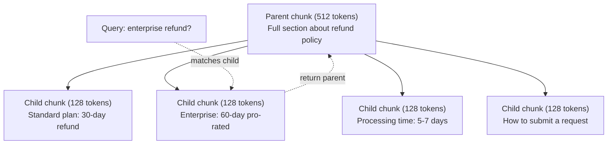

# 高级RAG（分块、重排序、混合搜索）

> 基本RAG检索top-k最相似的块。这适用于简单的问题。对于多跳推理、模糊查询和大型语料库，它会崩溃。高级RAG是处理10个文档的演示和处理1000万个文档的系统之间的区别。

**Type:** Build
**Languages:** Python
**Prerequisites:** Phase 11, Lesson 06 (RAG)
**Time:** ~90 minutes
**相关：**第5·23阶段（面向RAG的分块策略）涵盖了所有六种分块算法——递归、语义、句子、父文档、后期分块、上下文检索——并以Vectara/Anthropic为基准。本课的基础是：混合搜索、重新排序、查询转换。

## 学习目标

- 实现保留文档结构和上下文的高级分块策略（语义、递归、父子）
- 构建BM25关键字匹配、语义向量搜索和跨编码器重排序相结合的混合搜索管道
- 应用查询转换技术（HyDE、multi-query、step-back）改进对歧义或复杂问题的检索
- 诊断和修复常见的RAG故障：错误的块检索，回答不符合上下文，多跳推理故障

## 这个问题

在第06课中，您构建了一个基本的RAG管道。它适用于小语料库上的简单问题。现在试试这些：

*模棱两可的问题：“上个季度的营收是多少？”语义搜索会返回有关收入战略、收入预测以及首席财务官对收入增长的看法的大块信息。所有的语义都类似于“收入”这个词。不包含实际数字。正确的部分应该是“2025年第三季度4720万美元”，但使用的是“收益”而不是“收入”。嵌入模型认为“收入策略”比“第三季度收益为4720万美元”更接近问题。

**多跳问题**：“哪个团队的客户满意度得分提高最高？”这需要找到每个团队的满意度分数，比较它们，并确定最大值。没有一个块包含答案。这些信息分散在团队报告中。

**大型语料库问题**：你有200万个块。正确答案在第1,847,293块中。你的前5个检索块是#14，#89,201,#1,200,000，#44和#901,333。嵌入空间接近，但没有包含答案。在这种规模下，近似最近邻搜索会引入足够的误差，导致相关结果被排除在top-k之外。

基本的RAG失败是因为向量相似性与相关性不同。块可以在语义上类似于查询，但对回答查询没有用处。高级RAG通过四种技术解决了这个问题：混合搜索（添加关键字匹配）、重新排序（更仔细地为候选对象评分）、查询转换（在搜索之前修复查询）和更好的分块（以正确的粒度检索）。

## 这个概念

### 混合搜索：语义+关键字

语义搜索（向量相似度）擅长理解意义。“我如何取消我的订阅？”与“终止计划的步骤”相匹配，尽管它们没有共同的文字。但它没有完全匹配。如果嵌入模型将包含“E-4021”的块视为噪声，则“错误代码E-4021”可能不匹配。

关键字搜索（BM25）则相反。它擅长精确匹配。“E-4021”完全匹配。但是，如果文档显示“终止您的计划”，“取消我的订阅”将返回零结果。

混合搜索同时运行两者，然后合并结果。

**BM25**（最佳匹配25）是标准的关键字搜索算法。自20世纪90年代以来，它一直是搜索引擎的支柱。这个公式:

```
BM25(q, d) = sum over terms t in q:
    IDF(t) * (tf(t,d) * (k1 + 1)) / (tf(t,d) + k1 * (1 - b + b * |d| / avgdl))
```

其中tf（t,d）为文档d中t的项频率，IDF(t)为逆文档频率，|d|为文档长度，avgdl为文档平均长度，k1控制项频率饱和度（默认为1.2），b控制长度归一化（默认为0.75）。

简而言之：当文档包含查询词（尤其是罕见的词）时，BM25对文档的评分会更高，但是对于重复的词，BM25的评分会递减。一份文档中出现50次“收益”这个词并不比只出现一次的文档更有相关性。

### 倒序融合（RRF）

你有两个排名列表：一个来自矢量搜索，一个来自BM25。如何把它们结合起来？互序融合是标准的方法。

```
RRF_score(d) = sum over rankings R:
    1 / (k + rank_R(d))
```

k是一个常数（通常是60），它可以防止排名靠前的结果占据主导地位。

在矢量搜索中排名第一，在BM25中排名第五的文档得到：1/(60+1)+1 /(60+5)= 0.0164 + 0.0154 = 0.0318

在矢量搜索中排名第3，在BM25中排名第2的文档得到：1/(60+3)+ 1/(60+2)= 0.0159 + 0.0161 = 0.0320

RRF自然地平衡了这两个信号。在两个列表中都排名靠前的文档得分最高。如果文档在一个列表中排名第一，但在另一个列表中没有出现，则得到中等分数。这是稳健的，因为它使用的是排名，而不是原始分数，所以两个系统之间的分数分布差异并不重要。

### Reranking

检索（无论是矢量、关键字还是混合）速度快，但不精确。它使用双编码器：查询和每个文档是独立嵌入的，然后进行比较。嵌入只计算一次并缓存。这可以扩展到数百万个文档。

重新排序使用交叉编码器：查询和候选文档一起馈送到输出相关性评分的模型中。该模型同时看到这两个文本，并可以捕获它们之间的细粒度交互。交叉编码器可以理解“第三季度收益是多少？”与包含“第三季度4720万美元”的数据块高度相关，即使双编码器忽略了两者之间的联系。

权衡：交叉编码器比双编码器慢100-1000倍，因为它们联合处理查询文档对。您无法预先计算一百万个文档的交叉编码器分数。解决方案：检索更大的候选集（从混合搜索中获得前50名），然后使用交叉编码器重新排名以获得最终的前5名。

“‘美人鱼
图LR
Q[“查询”]—> H[“混合搜索”]
H—> C50[“前50名候选人”]
C50—> RR[“交叉编码器重新排序”]
r -> C5[“前5个最终结果”]
C5—> P[“构建提示”]
P—> LLM[“生成答案”]
```

Common reranking models (2026 lineup):
- Cohere Rerank 3.5: managed API, multilingual, best recall gain on mixed corpora
- Voyage rerank-2.5: managed API, lowest latency of the hosted options
- Jina-Reranker-v2 Multilingual: open-weight, 100+ languages
- bge-reranker-v2-m3: open-weight, strong baseline
- cross-encoder/ms-marco-MiniLM-L-6-v2: open-weight, runs on CPU for prototyping
- ColBERTv2 / Jina-ColBERT-v2: late-interaction multi-vector rerankers — O(tokens) not O(docs) at scoring time

### Query Transformation

Sometimes the problem is not retrieval but the query itself. "What was that thing about the new policy change?" is a terrible search query. It contains no specific terms. The embedding is vague. No retrieval system can find the right documents from this.

**Query rewriting**: rephrase the user's query into a better search query. An LLM can do this:

```
用户：“新的政策变化是怎么回事？”
改写为“最近的政策变化和更新”
```

**HyDE (Hypothetical Document Embeddings)**: instead of searching with the query, generate a hypothetical answer, embed that, and search for similar real documents.

```
查询：“企业退款政策是什么？”
假设的答案是：“企业客户有资格获得全额退款
购买后60天内。退款是根据剩余金额按比例计算的
订阅期，并在5-7个工作日内处理。”
```

Embed the hypothetical answer and search for real documents similar to it. The intuition: the hypothetical answer lives closer in embedding space to the real answer than the original question does. Questions and answers have different linguistic structures. By generating a hypothetical answer, you bridge the gap between "question space" and "answer space" in the embedding.

HyDE adds one LLM call before retrieval. This increases latency by 500-2000ms. Worth it when retrieval quality is poor on raw queries.

### Parent-Child Chunking

Standard chunking forces a trade-off: small chunks for precise retrieval, large chunks for sufficient context. Parent-child chunking eliminates this trade-off.

Index small chunks (128 tokens) for retrieval. When a small chunk is retrieved, return its parent chunk (512 tokens) for the prompt. The small chunk matches the query precisely. The parent chunk provides enough context for the LLM to generate a good answer.



查询“企业退款？”精确匹配子块C2。但是，提示符接收完整的父块P，其中包括有关处理时间和提交过程的周围上下文。

### 元数据过滤

在运行向量搜索之前，按元数据过滤语料库：日期、来源、类别、作者、语言。这减少了搜索空间并防止了不相关的结果。

“上个月安全政策发生了什么变化？”应该只搜索安全类别中最近30天内的文件。如果没有元数据过滤，您将搜索整个语料库，并可能检索到语义相似的2年前的安全文档。

生产RAG系统在每个块旁边存储元数据：源文档、创建日期、类别、作者、版本。向量数据库支持在相似性搜索之前通过元数据进行预过滤，这对大规模性能至关重要。

### 评价

你建立了一个RAG系统。你怎么知道它是否有效？三个指标:

**检索相关性(Recall@k)**：对于一组已知相关文档的测试问题，在前k个结果中出现的相关文档的百分比是多少？如果问题的答案在第47块中，第47块是否会出现在前5名中？

**忠实度**：生成的答案是否基于检索到的文档？如果检索到的块显示为“60天退款窗口”，而模型显示为“90天退款窗口”，那么这就是忠实失败。尽管有正确的背景，模型还是产生了幻觉。

**答案正确性**：生成的答案是否与预期的答案匹配？这是端到端度量。它结合了检索质量和生成质量。

一个简单的可信度检查：获取生成的答案中的每个声明，并验证它在检索到的块中出现（实质上）。如果答案包含任何检索块中没有的事实，则可能是幻觉。

“‘美人鱼
图道明
子图“评估框架”
Q[“测试问题<br/>+预期答案<br/>+相关文档id”]
Q—> Ret[“检索评估<br/>Recall@k：是否正确<br/>文档检索？”］
Q—>信心[“信心评估<br/>在检索的文档中答案是否基于<br/> ?”］
正确评估<br/>答案是否符合<br/>预期答案？］
结束
```

## Build It

### Step 1: BM25 Implementation

```python
import math
from collections import Counter

class BM25:
    def __init__(self, k1=1.2, b=0.75):
        self.k1 = k1
        self.b = b
        self.docs = []
        self.doc_lengths = []
        self.avg_dl = 0
        self.doc_freqs = {}
        self.n_docs = 0

    def index(self, documents):
        self.docs = documents
        self.n_docs = len(documents)
        self.doc_lengths = []
        self.doc_freqs = {}

        for doc in documents:
            words = doc.lower().split()
            self.doc_lengths.append(len(words))
            unique_words = set(words)
            for word in unique_words:
                self.doc_freqs[word] = self.doc_freqs.get(word, 0) + 1

        self.avg_dl = sum(self.doc_lengths) / self.n_docs if self.n_docs else 1

    def score(self, query, doc_idx):
        query_words = query.lower().split()
        doc_words = self.docs[doc_idx].lower().split()
        doc_len = self.doc_lengths[doc_idx]
        word_counts = Counter(doc_words)
        score = 0.0

        for term in query_words:
            if term not in word_counts:
                continue
            tf = word_counts[term]
            df = self.doc_freqs.get(term, 0)
            idf = math.log((self.n_docs - df + 0.5) / (df + 0.5) + 1)
            numerator = tf * (self.k1 + 1)
            denominator = tf + self.k1 * (1 - self.b + self.b * doc_len / self.avg_dl)
            score += idf * numerator / denominator

        return score

    def search(self, query, top_k=10):
        scores = [(i, self.score(query, i)) for i in range(self.n_docs)]
        scores.sort(key=lambda x: x[1], reverse=True)
        return scores[:top_k]
```

### 步骤2：秩互融合

”“python
Def reciprocal_rank_fusion(ranked_lists, k=60)：
分数= {}
对于ranked_lists中的ranked_list：
（doc_id, _）在enumerate(ranked_list)：
如果doc_id不在scores中：
[doc_id] = 0.0
[doc_id] += 1.0 / （k + rank + 1）
融合=排序（分数）。items(), key=lambda x: x[1], reverse=True)
返回融合
```

### Step 3: Hybrid Search Pipeline

```python
def hybrid_search(query, chunks, vector_embeddings, vocab, idf, bm25_index, top_k=5, fusion_k=60):
    query_emb = tfidf_embed(query, vocab, idf)
    vector_results = search(query_emb, vector_embeddings, top_k=top_k * 3)
    bm25_results = bm25_index.search(query, top_k=top_k * 3)
    fused = reciprocal_rank_fusion([vector_results, bm25_results], k=fusion_k)
    return fused[:top_k]
```

### 第四步：简单的重新排序

在生产中，您将使用交叉编码器模型。在这里，我们构建了一个重新排序器，它使用单词重叠、术语重要性和短语匹配对查询文档的相关性进行评分。

```python
def rerank(query, candidates, chunks):
    query_words = set(query.lower().split())
    stop_words = {"the", "a", "an", "is", "are", "was", "were", "what", "how",
                  "why", "when", "where", "do", "does", "for", "of", "in", "to",
                  "and", "or", "on", "at", "by", "it", "its", "this", "that",
                  "with", "from", "be", "has", "have", "had", "not", "but"}
    query_terms = query_words - stop_words

得分= []
对于候选的doc_id， initial_score：
Chunk = chunks[doc_id].lower（）
Chunk_words = set（chunk.split()）

Term_overlap = len（query_terms & chunk_words）

Query_bigrams = set（）
Q_list = [w for w in query.lower()]。Split () if w not in stop_words]
For I in range(len(q_list) - 1)：
query_bigrams。添加（q_list[i] + " " + q_list[i + 1]）
Bigram_matches = sum（如果bg在chunk中，则为query_bigrams中的1）

Position_boost = 0
对于query_terms中的term：
Pos = chunk.find（term）
如果是的话！= -1 and pos < len(chunk) // 3：
Position_boost += 0.5

Rerank_score = （）
Term_overlap * 1.0
            + Bigram_matches * 2.0
            + position_boost
            + Initial_score * 5.0
）
得分。追加((doc_id rerank_score))

得分。sort（key=lambda x: x[1], reverse=True）
返回得分
```

### Step 5: HyDE (Hypothetical Document Embeddings)

```python
def hyde_generate_hypothesis(query):
    templates = {
        "what": "The answer to '{query}' is as follows: Based on our documentation, {topic} involves specific policies and procedures that define how the process works.",
        "how": "To address '{query}': The process involves several steps. First, you need to initiate the request. Then, the system processes it according to the defined rules.",
        "default": "Regarding '{query}': Our records indicate specific details and policies related to this topic that provide a comprehensive answer."
    }
    query_lower = query.lower()
    if query_lower.startswith("what"):
        template = templates["what"]
    elif query_lower.startswith("how"):
        template = templates["how"]
    else:
        template = templates["default"]

    topic_words = [w for w in query.lower().split()
                   if w not in {"what", "is", "the", "how", "do", "does", "a", "an",
                                "for", "of", "to", "in", "on", "at", "by", "and", "or"}]
    topic = " ".join(topic_words) if topic_words else "this topic"

    return template.format(query=query, topic=topic)


def hyde_search(query, chunks, vector_embeddings, vocab, idf, top_k=5):
    hypothesis = hyde_generate_hypothesis(query)
    hypothesis_emb = tfidf_embed(hypothesis, vocab, idf)
    results = search(hypothesis_emb, vector_embeddings, top_k)
    return results, hypothesis
```

### 第六步：亲子分组

”“python
Def create_parent_child_chunks(text, parent_size=200, child_size=50)：
Words = text.split（）
父母= []
孩子= []
Child_to_parent = {}

Parent_idx = 0
开始= 0
当start < len(words)：
Parent_end = min（start + parent_size, len(words)）
Parent_text = " ".join（words[start:parent_end]）
parents.append (parent_text)

Child_start = start
当child_start < parent_end：
Child_end = min（child_start + child_size, parent_end）
Child_text = " ".join（words[child_start:child_end]）
Child_idx = len（children）
children.append (child_text)
Child_to_parent [child_idx] = parent_idx
Child_start += child_size

Parent_idx += 1
Start += parent_size

返回parents， children, child_to_parent
```

### Step 7: Faithfulness Evaluation

```python
def evaluate_faithfulness(answer, retrieved_chunks):
    answer_sentences = [s.strip() for s in answer.split(".") if len(s.strip()) > 10]
    if not answer_sentences:
        return 1.0, []

    grounded = 0
    ungrounded = []
    context = " ".join(retrieved_chunks).lower()

    for sentence in answer_sentences:
        words = set(sentence.lower().split())
        stop_words = {"the", "a", "an", "is", "are", "was", "were", "and", "or",
                      "to", "of", "in", "for", "on", "at", "by", "it", "this", "that"}
        content_words = words - stop_words
        if not content_words:
            grounded += 1
            continue

        matched = sum(1 for w in content_words if w in context)
        ratio = matched / len(content_words) if content_words else 0

        if ratio >= 0.5:
            grounded += 1
        else:
            ungrounded.append(sentence)

    score = grounded / len(answer_sentences) if answer_sentences else 1.0
    return score, ungrounded


def evaluate_retrieval_recall(queries_with_relevant, retrieval_fn, k=5):
    total_recall = 0.0
    results = []

    for query, relevant_indices in queries_with_relevant:
        retrieved = retrieval_fn(query, k)
        retrieved_indices = set(idx for idx, _ in retrieved)
        relevant_set = set(relevant_indices)
        hits = len(retrieved_indices & relevant_set)
        recall = hits / len(relevant_set) if relevant_set else 1.0
        total_recall += recall
        results.append({
            "query": query,
            "recall": recall,
            "hits": hits,
            "total_relevant": len(relevant_set)
        })

    avg_recall = total_recall / len(queries_with_relevant) if queries_with_relevant else 0
    return avg_recall, results
```

## 使用它

用真正的交叉编码器重新排序：

”“python
从sentence_transformers导入crosscode

reranker = cross-encoder （"cross-encoder/ms-marco-MiniLM-L-6-v2"）

defrerank_with_cross_encoder (query, candidate, chunks, top_k=5)：
Pairs = [(query, chunks[doc_id]) for doc_id, _ in candidate]
Scores = rerrank .predict（对）
scores = list（zip([doc_id for doc_id, _ in candidate], scores)）
得分。sort（key=lambda x: x[1], reverse=True）
返回得分(top_k):
```

With Cohere's managed reranker:

```python
import cohere

co = cohere.Client()

def rerank_with_cohere(query, candidates, chunks, top_k=5):
    docs = [chunks[doc_id] for doc_id, _ in candidates]
    response = co.rerank(
        model="rerank-english-v3.0",
        query=query,
        documents=docs,
        top_n=top_k
    )
    return [(candidates[r.index][0], r.relevance_score) for r in response.results]
```

对于拥有真正法学硕士学位的海德来说：

”“python
进口人择

client = anthropic.Anthropic（）

def hyde_with_llm(查询):
Response = client.messages.create(
模型=“克劳德-十四行诗- 4 - 20250514”,
max_tokens = 256,
消息= [{
“角色”:“用户”,
“写一个简短的段落，可以很好地回答这个问题。不要说你不知道。只要写出答案就行了。查询\ n \ nQuestion:{}”
})
）
返回response.content[0]。text
```

For production hybrid search with Weaviate:

```python
import weaviate

client = weaviate.connect_to_local()

collection = client.collections.get("Documents")
response = collection.query.hybrid(
    query="enterprise refund policy",
    alpha=0.5,
    limit=10
)
```

alpha参数控制平衡：0.0 =纯关键字（BM25）， 1.0 =纯向量，0.5 =相等权重。大多数生产系统使用0.3到0.7之间的alpha。

## 船这

这一课产生：
- Z0
- Z0

## 练习

1. 在示例文档上比较BM25、矢量搜索和混合搜索。对于5个测试查询中的每一个，记录哪种方法返回位置#1中最相关的块。混合搜索应该至少赢得3 / 5。

2. 实现元数据过滤器。为每个文档（安全、账单、api、产品）添加一个“类别”字段。在运行矢量搜索之前，将块过滤到相关的类别。测试“使用了什么加密？”并验证它只搜索安全类别块。

3. 使用第06课中的简单生成函数构建一个完整的HyDE管道。比较直接查询搜索和HyDE搜索在所有5个测试查询上的检索质量（前3相关性）。HyDE应该改进模糊查询的结果。

4. 在示例文档上实现父子分块策略。使用child_size=30和parent_size=100。使用子块搜索，但在提示符中返回父块。将生成的答案与chunk_size=50的标准分块进行比较。

5. 创建一个评估数据集：带有已知答案块的10个问题。测量Recall@3， Recall@5和Recall@10 (a)仅向量搜索，(b)仅BM25， (c)混合搜索，(d)混合+重新排名。绘制结果并确定重新排名的帮助最大的地方。

## 关键术语

| Term | What people say | What it actually means |
|------|----------------|----------------------|
| BM25 | "Keyword search" | A probabilistic ranking algorithm that scores documents by term frequency, inverse document frequency, and document length normalization |
| Hybrid search | "Best of both worlds" | Running semantic (vector) and keyword (BM25) search in parallel, then merging results with rank fusion |
| Reciprocal Rank Fusion | "Merge ranked lists" | Combining multiple ranked lists by summing 1/(k + rank) for each document across all lists |
| Reranking | "Second pass scoring" | Using a more expensive cross-encoder model to re-score a candidate set from initial retrieval |
| Cross-encoder | "Joint query-document model" | A model that takes a query and document as a single input, producing a relevance score; more accurate than bi-encoders but too slow for full corpus search |
| Bi-encoder | "Independent embedding model" | A model that embeds queries and documents independently; fast because embeddings are precomputed, but less accurate than cross-encoders |
| HyDE | "Search with a fake answer" | Generate a hypothetical answer to the query, embed it, and search for real documents similar to it |
| Parent-child chunking | "Small search, big context" | Index small chunks for precise retrieval but return the larger parent chunk to provide sufficient context |
| Metadata filtering | "Narrow before searching" | Filtering documents by attributes (date, source, category) before running vector search to reduce the search space |
| Faithfulness | "Did it stay grounded" | Whether the generated answer is supported by the retrieved documents, as opposed to hallucinated from the model's training data |

## 进一步的阅读

- Robertson & Zaragoza，《概率关联框架：BM25及以后》（2009）——BM25的权威参考，解释了公式背后的概率基础
- Cormack等人，“互秩融合优于Condorcet和个体秩学习方法”（2009）——RRF的原始论文显示它优于更复杂的融合方法
- Gao等人，“没有相关标签的精确零概率密集检索”（2022）——HyDE的论文证明了假设文档嵌入在没有任何训练数据的情况下提高了检索
- Nogueira和Cho，“用BERT重新排序段落”（2019），显示在BM25之上的交叉编码器重新排序显着提高了检索质量
- Z0请阅读“程序法学硕士”而不是“提示法学硕士”。
- Z0全局检索与局部检索的区别。
- Z0代理边界过去静态检索-然后生成。
- Z0