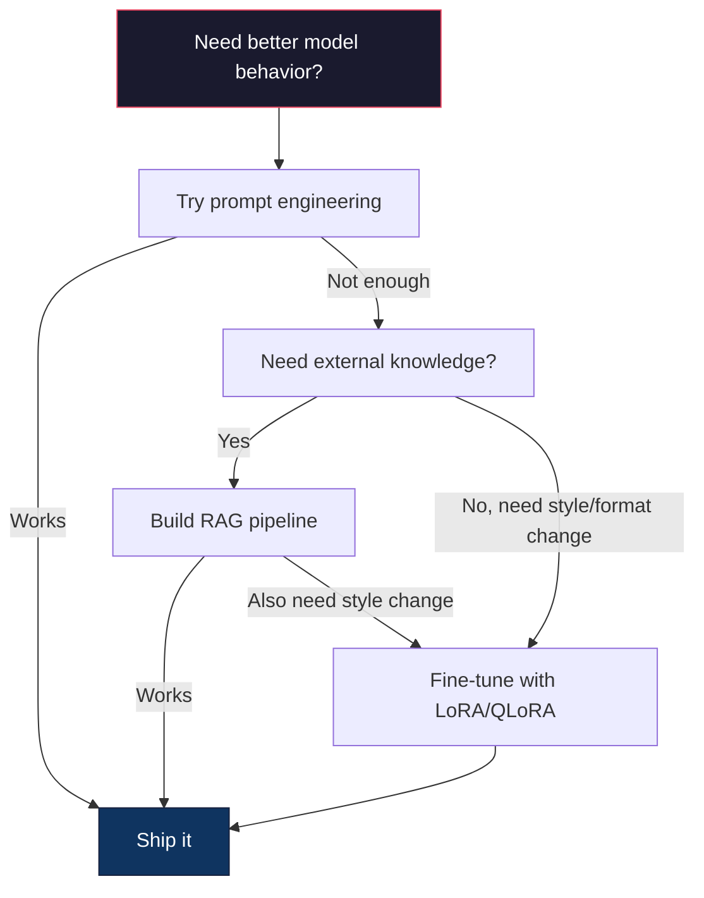

# 微调LoRA和QLoRA

> 完全微调7B型号需要56GB的VRAM。你没有。大多数公司也是如此。LoRA允许您通过训练不到1%的参数，在6GB内微调相同的模型。这并不是一种妥协——它与大多数任务的完全微调质量相匹配。整个开源微调生态系统都运行在这个技巧上。

**Type:** Build
**Languages:** Python
**Prerequisites:** Phase 10, Lesson 06 (Instruction Tuning / SFT)
**Time:** ~75 minutes
**相关：**第10阶段从头开始涵盖SFT/DPO循环。本课将这些插入2026 PEFT工具包（PEFT， TRL, Unsloth, Axolotl, LLaMA-Factory）。

## 学习目标

- 通过将低秩适配器矩阵（A和B）注入预训练模型的注意层来实现LoRA
- 计算LoRA与完全微调的参数节省：使用d_model dimensions训练2*r*d参数而不是d^2的rank r
- 使用QLoRA（4位量化基础+ LoRA适配器）微调模型以适应消费者GPU内存
- 将LoRA权重合并回基本模型以进行部署，并比较使用适配器和不使用适配器时的推理速度

## 这个问题

你有一个基本模型。羊驼38b。你想让它用你公司的声音回答客户支持问题。SFT就是答案。但SFT存在成本问题。

完全微调更新模型中的每个参数。羊驼38b有80亿个参数。在fp16中，每个参数占用2字节。仅加载权重就需要16GB。在训练期间，您还需要梯度（16GB）、Adam的优化器状态（32GB用于动量+方差）和激活。总共：一个8B型号大约56GB的VRAM。

一台80GB的A100几乎装不下这个。云提供商提供的两台a100每小时的价格为3-4美元。在5万个样本上训练3个epoch需要6-10个小时。每个实验30-40美元。运行10个实验来获得正确的超参数，在部署任何东西之前你已经花费了400美元。

将其扩展到羊驼370b，数字变得荒谬。仅权重就为140GB。你需要一个集群。每次实验100美元以上。

还有一个更深层次的问题。完全微调修改模型中的每个权重。如果您对客户支持数据进行微调，则可能会降低模型的一般功能。这被称为灾难性遗忘。模型在你的任务上做得更好，在其他方面做得更差。

您需要一种训练更少参数、使用更少内存并且不会破坏模型现有知识的方法。

## 这个概念

### LoRA：低级适应

微软的Edward Hu及其同事于2021年6月发布了LoRA。本文的见解是：微调过程中的权重更新具有较低的内在秩。您不需要更新4096x4096权重矩阵中的所有1670万个参数。更新中的有用信息可以通过排名为16或32的矩阵捕获。

这里是数学。一个标准的线性层计算：

```
y = Wx
```

其中W是一个d_out x d_in矩阵。对于4096x4096的注意力投影，有16,777,216个参数。

LoRA冻结W并添加低阶分解：

```
y = Wx + BAx
```

B是（d_out x r） A是（r x d_in）秩r比d小得多——通常是8、16或32。

在4096x4096的图层上，如果r=16：
- 原始参数：4096 × 4096 = 16,777,216
- LoRA参数：（4096 × 16） + (16 × 4096) = 65,536 + 65,536 = 131,072
- 减少：131,072 / 16,777,216 = 0.78%

你训练了0.78%的参数，得到了95-100%的质量。

```mermaid
graph LR
    X["Input x"] --> W["Frozen W (d x d)"]
    X --> A["A (r x d)"]
    A --> B["B (d x r)"]
    W --> Plus["+ (merge)"]
    B --> Plus
    Plus --> Y["Output y"]

样式：W，填充：#1a1a2e，描边：#e94560，颜色：#fff
样式A：填充：#0f3460，描边：#16213e，颜色：#fff
样式B：填充：#0f3460，描边：#16213e，颜色：#fff
```

A is initialized with a random Gaussian. B is initialized to zero. This means the LoRA contribution starts at zero -- the model begins training from its original behavior and gradually learns the adaptation.

### The Scaling Factor: Alpha

LoRA introduces a scaling factor alpha that controls how much the low-rank update affects the output:

```
y = Wx + (α / r) * BAx
```

When alpha = r, the scaling is 1x. When alpha = 2r (the common default), the scaling is 2x. This hyperparameter controls the learning rate of the LoRA path independently of the base learning rate.

Practical guidance:
- alpha = 2 * rank is a common community convention (the original paper used alpha = rank in most experiments)
- alpha = rank gives 1x scaling, conservative but stable
- Higher alpha means larger updates per step, which can speed convergence or cause instability

### Where to Apply LoRA

A transformer has many linear layers. You don't need to add LoRA to all of them. The original paper tested different combinations:

| Target Layers | Trainable Params (7B) | Quality |
|--------------|----------------------|---------|
| q_proj only | 4.7M | Good |
| q_proj + v_proj | 9.4M | Better |
| q_proj + k_proj + v_proj + o_proj | 18.9M | Best for attention |
| All linear (attention + MLP) | 37.7M | Marginal gain, 2x params |

The sweet spot for most tasks: q_proj + v_proj. This targets the query and value projections in self-attention, which control what the model attends to and what information it extracts. Adding MLP layers helps for complex tasks like code generation but doubles the parameter count for diminishing returns on simpler tasks.

### Rank Selection

The rank r controls the expressiveness of the adaptation:

| Rank | Trainable Params (per layer) | Best For |
|------|---------------------------|----------|
| 4 | 32,768 | Simple classification, sentiment |
| 8 | 65,536 | Single-domain Q&A, summarization |
| 16 | 131,072 | Multi-domain tasks, instruction following |
| 32 | 262,144 | Complex reasoning, code generation |
| 64 | 524,288 | Diminishing returns for most tasks |
| 128 | 1,048,576 | Rarely justified |

Hu et al. showed that r=4 already captures most of the adaptation for simple tasks. r=8 and r=16 are the most common choices in practice. Going beyond r=64 rarely improves quality and starts to lose LoRA's memory advantage.

### QLoRA: 4-Bit Quantization + LoRA

Tim Dettmers and colleagues at the University of Washington published QLoRA in May 2023. The idea: quantize the frozen base model to 4-bit precision, then attach LoRA adapters in fp16 on top.

This changes the memory equation dramatically:

| Method | Weight Memory (7B) | Training Memory (7B) | GPU Required |
|--------|-------------------|---------------------|-------------|
| Full fine-tune (fp16) | 14GB | ~56GB | 1x A100 80GB |
| LoRA (fp16 base) | 14GB | ~18GB | 1x A100 40GB |
| QLoRA (4-bit base) | 3.5GB | ~6GB | 1x RTX 3090 24GB |

QLoRA makes three technical contributions:

**NF4 (Normal Float 4-bit)**: A new data type designed specifically for neural network weights. Neural network weights follow a roughly normal distribution. NF4 places its 16 quantization levels at the quantiles of a standard normal distribution. This is information-theoretically optimal for normally distributed data. It loses less information than uniform 4-bit quantization (INT4) or standard Float4.

**Double quantization**: The quantization constants themselves take memory. Each block of 64 weights needs a fp32 scale factor (4 bytes). For a 7B model, that's an extra 0.4GB. Double quantization quantizes these constants to fp8, reducing the overhead to 0.1GB. Small but it adds up.

**Paged optimizers**: During training, optimizer states (Adam's momentum and variance) can exceed GPU memory on long sequences. Paged optimizers use NVIDIA's unified memory to automatically page optimizer states to CPU RAM when GPU memory is exhausted, and page them back when needed. This prevents OOM crashes at the cost of some throughput.

### The Quality Question

Does reducing parameters or quantizing the base hurt quality? The results from multiple papers:

| Method | MMLU (5-shot) | MT-Bench | HumanEval |
|--------|--------------|----------|-----------|
| Full fine-tune (Llama 2 7B) | 48.3 | 6.72 | 14.6 |
| LoRA r=16 | 47.9 | 6.68 | 14.0 |
| QLoRA r=16 (NF4) | 47.5 | 6.61 | 13.4 |
| QLoRA r=64 (NF4) | 48.1 | 6.70 | 14.2 |

LoRA at r=16 is within 1% of full fine-tuning on most benchmarks. QLoRA at r=16 loses another fraction of a percent. QLoRA at r=64 essentially matches full fine-tuning while using 90% less memory.

### Real-World Costs

Fine-tuning Llama 3 8B on 50,000 examples (3 epochs):

| Method | GPU | Time | Cost |
|--------|-----|------|------|
| Full fine-tune | 2x A100 80GB | 8 hours | ~$32 |
| LoRA r=16 | 1x A100 40GB | 4 hours | ~$8 |
| QLoRA r=16 | 1x RTX 4090 24GB | 6 hours | ~$5 |
| QLoRA r=16 (Unsloth) | 1x RTX 4090 24GB | 2.5 hours | ~$2 |
| QLoRA r=16 | 1x T4 16GB | 12 hours | ~$4 |

QLoRA on a single consumer GPU costs less than a lunch. This is why the open-weight fine-tuning community exploded in 2023 and why every training framework below ships QLoRA by default in 2026.

### The 2026 PEFT stack

| Framework | What it is | Pick when |
|-----------|-----------|-----------|
| **Hugging Face PEFT** | The canonical LoRA/QLoRA/DoRA/IA3 library | You want raw control and your training loop is already on `transformers.Trainer` |
| **TRL** | HF's reinforcement-from-feedback trainers (SFT, DPO, GRPO, PPO, ORPO) | You need DPO/GRPO after SFT; built on top of PEFT |
| **Unsloth** | Triton-kernel rewrite of the forward/backward pass | You want 2-5x speedup + half the VRAM with no accuracy loss; Llama/Mistral/Qwen family |
| **Axolotl** | YAML-config wrapper over PEFT + TRL + DeepSpeed + Unsloth | You want reproducible, version-controlled training runs |
| **LLaMA-Factory** | GUI/CLI/API over PEFT + TRL | You want zero-code fine-tuning; 100+ model families supported |
| **torchtune** | Native PyTorch recipes, no `transformers` dep | You want minimal deps and your org already standardizes on PyTorch |

Rule of thumb: research use or one-off experiment → PEFT. Repeatable production pipeline → Axolotl with Unsloth kernels enabled. Throwaway prototyping → LLaMA-Factory.

### Merging Adapters

After training, you have two things: the frozen base model and a small LoRA adapter (typically 10-100MB). You can either:

1. **Keep them separate**: Load the base model, load the adapter on top. Swap adapters for different tasks. This is how you serve multiple fine-tuned variants from one base model.

2. **Merge them permanently**: Compute W' = W + (alpha/r) * BA and save the result as a new full model. The merged model is the same size as the original. No inference overhead. No adapter to manage.

For serving multiple tasks (customer support adapter, code adapter, translation adapter), keep them separate. For deploying a single specialized model, merge.

Advanced merging techniques for combining multiple adapters:

- **TIES-Merging** (Yadav et al. 2023): Trims small-magnitude parameters, resolves sign conflicts, then merges. Reduces interference between adapters.
- **DARE** (Yu et al. 2023): Randomly drops adapter parameters before merging and rescales the rest. Surprisingly effective at combining capabilities.
- **Task arithmetic**: Simply add or subtract adapter weights. Adding a "code" adapter and a "math" adapter often produces a model good at both.

### When NOT to Fine-Tune

Fine-tuning is the third option, not the first.

**First: prompt engineering.** Write a better system prompt. Add few-shot examples. Use chain-of-thought. This costs nothing and takes minutes. If prompting gets you 80% of the way there, you probably don't need to fine-tune.

**Second: RAG.** If the model needs to know about your specific data (documents, knowledge base, product catalog), retrieval is cheaper and more maintainable than baking it into weights. See Lesson 06.

**Third: fine-tuning.** Use this when you need the model to adopt a specific style, format, or reasoning pattern that cannot be achieved through prompting. When you need consistent structured output. When you need to distill a larger model into a smaller one. When latency matters and you can't afford the extra tokens from few-shot prompting.



## 构建它

我们在纯PyTorch中从头开始实现LoRA。没有图书馆。没有魔法。您将构建LoRA层，将其注入模型，对其进行训练，并将权重合并回来。

### 步骤1:LoRA层

”“python
进口火炬
进口火炬。Nn as Nn
导入数学

类LoRALayer (nn。模块):
Def __init__(self, in_features, out_features, rank=8, alpha=16)：
super () . __init__ ()
自我。等级=等级
自我。= α
自我。缩放= alpha / rank

自我。A = n.参数（火炬）Randn （in_features, rank) * (1 / math.sqrt(rank))）
自我。B = n.参数（火炬）0(等级,out_features))

Def forward(self, x)：
返回（x @ self）。A @ self。B) *自我缩放
```

A is initialized with scaled random values. B is initialized to zero. The product BA starts at zero, so the model begins with its original behavior.

### Step 2: LoRA-Wrapped Linear Layer

```python
class LinearWithLoRA(nn.Module):
    def __init__(self, linear, rank=8, alpha=16):
        super().__init__()
        self.linear = linear
        self.lora = LoRALayer(
            linear.in_features, linear.out_features, rank, alpha
        )

        for param in self.linear.parameters():
            param.requires_grad = False

    def forward(self, x):
        return self.linear(x) + self.lora(x)
```

原来的线性层被冻结。只有LoRA参数（A和B）是可训练的。

### 步骤3：将LoRA注入模型

”“python
Def inject_lora(model, target_modules, rank=8, alpha=16)：
对于model.parameters（）中的参数：
参数。requires_grad = False

Lora_layers = {}
对于name， model.named_modules（）中的module：
如果是isinstance(module, nn。线性):
如果有（target_modules中的t在name中）：
Parent_name = ".".join（name.split(".")[:-1]）
Child_name = name.split(".")[-1]
Parent = dict(model.named_modules())[parent_name]
lora_linear = LinearWithLoRA（module, rank, alpha）
Setattr （parent, child_name, lora_linear）
Lora_layers [name] = lora_linear
返回lora_layers
```

First, freeze every parameter in the model. Then walk the model tree, find linear layers matching your target names, and replace them with LoRA-wrapped versions. The LoRA A and B matrices are the only trainable parameters in the entire model.

### Step 4: Count Parameters

```python
def count_parameters(model):
    total = sum(p.numel() for p in model.parameters())
    trainable = sum(p.numel() for p in model.parameters() if p.requires_grad)
    frozen = total - trainable
    return {
        "total": total,
        "trainable": trainable,
        "frozen": frozen,
        "trainable_pct": 100 * trainable / total if total > 0 else 0
    }
```

### 步骤5：合并权重

”“python
def merge_lora_weights(模型):
对于name， model.named_modules（）中的module：
如果isinstance(module, LinearWithLoRA)：
与torch.no_grad ():
合并= (
module. laura . a @ module. laura . b
) * module.lora.scaling
Module.linear.weight.data +=合并。T
Parent_name = ".".join（name.split(".")[:-1]）
Child_name = name.split(".")[-1]
如果parent_name:
Parent = dict(model.named_modules())[parent_name]
其他:
父=模型
Setattr （parent, child_name, module.linear）
```

After merging, the LoRA layers are gone. The model is the same size as the original with the adaptation baked into the weights. No inference overhead.

### Step 6: Simulated QLoRA Quantization

```python
def quantize_to_nf4(tensor, block_size=64):
    blocks = tensor.reshape(-1, block_size)
    scales = blocks.abs().max(dim=1, keepdim=True).values / 7.0
    scales = torch.clamp(scales, min=1e-8)
    quantized = torch.round(blocks / scales).clamp(-8, 7).to(torch.int8)
    return quantized, scales

def dequantize_from_nf4(quantized, scales, original_shape):
    dequantized = quantized.float() * scales
    return dequantized.reshape(original_shape)
```

这通过将权重映射到64块内的16个离散级别来模拟4位量化。生产QLoRA使用bitsandbytes库在GPU上实现真正的NF4。

### 步骤7：循环训练

”“python
Def train_lora(model, data, epochs=5, lr=1e-3, batch_size=4)：
optimizer = torch. optimer . adamw
[p for p in model.parameters() if p.requires_grad], lr=lr
）
criterion = nn.MSELoss（）

损失= []
对于range（epochs）中的epoch：
Epoch_loss = 0.0
N_batches = 0
index = torch.randperm（len(data["inputs"])）

对于I在range(0, len(indexes), batch_size)：
Batch_idx = indices[i:i + batch_size]
X = data["input "][batch_idx]
Y = data["targets"][batch_idx]

输出= model(x)
损耗=准则（输出，y）

optimizer.zero_grad ()
loss.backward ()
optimizer.step ()

Epoch_loss += loss.item（）
N_batches += 1

Avg_loss = epoch_loss / n_batches
losses.append (avg_loss)

返回损失
```

### Step 8: Full Demo

```python
def demo():
    torch.manual_seed(42)
    d_model = 256
    n_classes = 10

    model = nn.Sequential(
        nn.Linear(d_model, 512),
        nn.ReLU(),
        nn.Linear(512, 512),
        nn.ReLU(),
        nn.Linear(512, n_classes),
    )

    n_samples = 500
    x = torch.randn(n_samples, d_model)
    y = torch.randint(0, n_classes, (n_samples,))
    y_onehot = torch.zeros(n_samples, n_classes).scatter_(1, y.unsqueeze(1), 1.0)

    data = {"inputs": x, "targets": y_onehot}

    params_before = count_parameters(model)

    lora_layers = inject_lora(
        model, target_modules=["0", "2"], rank=8, alpha=16
    )

    params_after = count_parameters(model)

    losses = train_lora(model, data, epochs=20, lr=1e-3)

    merge_lora_weights(model)
    params_merged = count_parameters(model)

    return {
        "params_before": params_before,
        "params_after": params_after,
        "params_merged": params_merged,
        "losses": losses,
    }
```

该演示创建了一个小模型，将LoRA注入两个层，对其进行训练，并将权重合并回来。在LoRA训练过程中，参数计数从完全可训练下降到~1%可训练，然后在合并后返回到原始架构。

## 使用它

在hug Face生态系统中，真实模型上的LoRA大约需要20行：

”“python
从Transformer导入AutoModelForCausalLM， AutoTokenizer
从peft导入LoraConfig， get_peft_model, TaskType

model = AutoModelForCausalLM.from_pretrained（"meta-llama/ lama-3.1- 8b "）
tokenizer = AutoTokenizer.from_pretrained（"meta-llama/ lama-3.1- 8b "）

lora_config = LoraConfig(
task_type = TaskType。CAUSAL_LM,
r = 16,
lora_alpha = 32,
lora_dropout = 0.05,
target_modules =(“q_proj”、“v_proj”),
）

Model = get_peft_model（Model, lora_config）
model.print_trainable_parameters ()
```

For QLoRA, add bitsandbytes quantization:

```python
from transformers import BitsAndBytesConfig

bnb_config = BitsAndBytesConfig(
    load_in_4bit=True,
    bnb_4bit_quant_type="nf4",
    bnb_4bit_compute_dtype=torch.bfloat16,
    bnb_4bit_use_double_quant=True,
)

model = AutoModelForCausalLM.from_pretrained(
    "meta-llama/Llama-3.1-8B",
    quantization_config=bnb_config,
    device_map="auto",
)

model = get_peft_model(model, lora_config)
```

就是这样。同样的训练循环。相同的数据管道。基本模型现在是4位的，LoRA适配器在fp16中训练，整个东西适合6GB。

拥抱脸训练师的训练方法：

”“python
从Transformer导入TrainingArguments， Trainer
从数据集导入load_dataset

Dataset = load_dataset（"tatsu-lab/alpaca", split="train[:5000]"）

training_args = TrainingArguments(
output_dir = " . / lora-llama”,
num_train_epochs = 3,
per_device_train_batch_size = 4,
gradient_accumulation_steps = 4,
learning_rate = 2的军医,
fp16 = True,
logging_steps = 10,
save_strategy = "时代",
optim = " paged_adamw_8bit ",
）

培训师
模型=模型,
args = training_args,
train_dataset =数据集,
）

trainer.train ()

model.save_pretrained(“。/ lora-adapter”)
```

The saved adapter is 10-100MB. The base model stays untouched. You can share adapters on the Hugging Face Hub without redistributing the full model.

## Ship It

This lesson produces:
- `outputs/prompt-lora-advisor.md` -- a prompt that helps you decide LoRA rank, target modules, and hyperparameters for your specific task
- `outputs/skill-fine-tuning-guide.md` -- a skill that teaches agents the decision tree for when and how to fine-tune

## Exercises

1. **Rank ablation study.** Run the demo with ranks 2, 4, 8, 16, 32, and 64. Plot final loss vs. rank. Find the point of diminishing returns where doubling the rank no longer halves the loss. For a simple classification task on 256-dim features, this should be around r=8-16.

2. **Target module comparison.** Modify inject_lora to target only layer "0", only layer "2", only layer "4", and all three. Train each variant for 20 epochs. Compare convergence speed and final loss. This mirrors the real decision of targeting q_proj vs v_proj vs all linear layers.

3. **Quantization error analysis.** Take the trained model's weight matrices before and after quantize_to_nf4 / dequantize_from_nf4. Compute the mean squared error, max absolute error, and the correlation between original and reconstructed weights. Experiment with block_size values of 32, 64, 128, and 256.

4. **Multi-adapter serving.** Train two LoRA adapters on different subsets of the data (even indices vs odd indices). Save both adapters. Load the base model once, then swap adapters and verify that each produces different outputs on the same input. This is how production systems serve multiple fine-tuned models from one base.

5. **Merge vs. unmerged inference.** Compare the output of the LoRA model before and after merge_lora_weights on the same 100 inputs. Verify the outputs are identical (within floating-point tolerance of 1e-5). Then benchmark inference speed for both -- merged should be slightly faster since it's a single matrix multiply instead of two.

## Key Terms

| Term | What people say | What it actually means |
|------|----------------|----------------------|
| LoRA | "Efficient fine-tuning" | Low-Rank Adaptation: freeze base weights, train two small matrices A and B whose product approximates the full weight update |
| QLoRA | "Fine-tune on a laptop" | Quantized LoRA: load the base model in 4-bit NF4, train LoRA adapters in fp16 on top, enabling 7B fine-tuning in 6GB VRAM |
| Rank (r) | "How much the model can learn" | The inner dimension of the A and B matrices; controls expressiveness vs. parameter count |
| Alpha | "LoRA learning rate" | Scaling factor applied to the LoRA output; alpha/r scales the adaptation's contribution to the final output |
| NF4 | "4-bit quantization" | Normal Float 4: a 4-bit data type with quantization levels at normal distribution quantiles, optimal for neural network weights |
| Adapter | "The small trained part" | The LoRA A and B matrices saved as a separate file (10-100MB), loadable on top of any copy of the base model |
| Target modules | "Which layers to LoRA" | The specific linear layers (q_proj, v_proj, etc.) where LoRA adapters are injected |
| Merging | "Bake it in" | Computing W + (alpha/r) * BA and replacing the original weight, eliminating the adapter overhead at inference |
| Paged optimizers | "Don't OOM during training" | Offloading optimizer states (Adam momentum, variance) to CPU when GPU memory is exhausted |
| Catastrophic forgetting | "Fine-tuning broke everything else" | When updating all weights causes the model to lose previously learned capabilities |

## Further Reading

- Hu et al., "LoRA: Low-Rank Adaptation of Large Language Models" (2021) -- the original paper introducing the low-rank decomposition method, tested on GPT-3 175B with rank as low as 4
- Dettmers et al., "QLoRA: Efficient Finetuning of Quantized Language Models" (2023) -- introduces NF4, double quantization, and paged optimizers, enabling 65B fine-tuning on a single 48GB GPU
- PEFT library documentation (huggingface.co/docs/peft) -- the standard library for LoRA, QLoRA, and other parameter-efficient methods in the Hugging Face ecosystem
- Yadav et al., "TIES-Merging: Resolving Interference When Merging Models" (2023) -- techniques for combining multiple LoRA adapters without quality degradation
- [Rafailov et al., "Direct Preference Optimization: Your Language Model is Secretly a Reward Model" (NeurIPS 2023)](https://arxiv.org/abs/2305.18290) -- DPO derivation; the preference-tuning stage that comes after SFT, no reward model needed.
- [TRL documentation](https://huggingface.co/docs/trl/) -- official reference for `SFTTrainer`, `DPOTrainer`, `KTOTrainer`, and the integration surface with PEFT/bitsandbytes/Unsloth.
- [Unsloth documentation](https://docs.unsloth.ai/) -- fused kernels that double fine-tuning throughput and halve memory; the performance layer under TRL.
- [Axolotl documentation](https://axolotl-ai-cloud.github.io/axolotl/) -- YAML-configured multi-GPU SFT/DPO/QLoRA trainer; the config-as-code alternative to hand-written scripts.