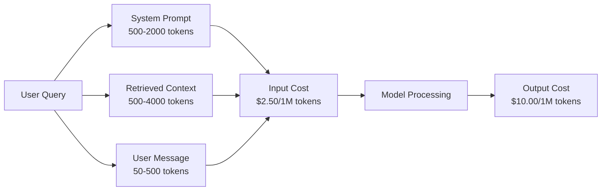
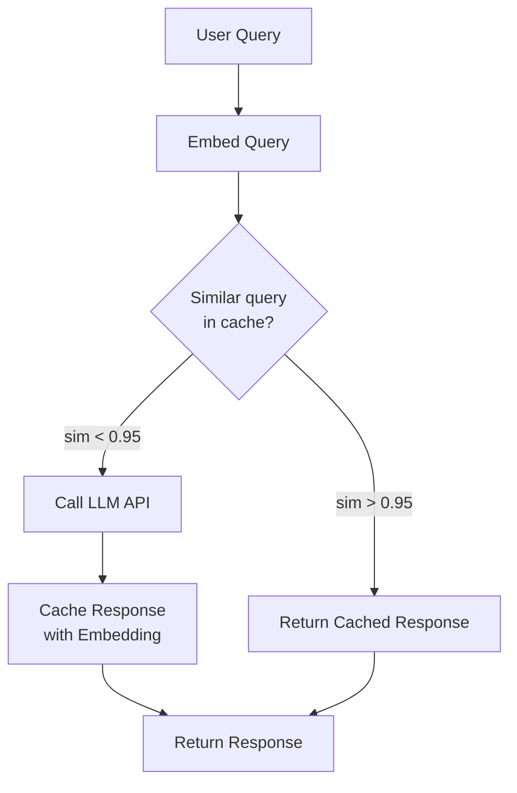

# 缓存，速率限制和成本优化

> 大多数人工智能创业公司并没有死于糟糕的模式。他们死于糟糕的单位经济。一次gpt - 40通话的费用不到一美分。1万名用户每天打10次电话，仅输入令牌一项就需要250美元——在你收取一美元之前。生存下来的公司是那些将每个API调用视为金融事务而不是函数调用的公司。

**Type:** Build
**Languages:** Python
**Prerequisites:** Phase 11 Lesson 09 (Function Calling)
**Time:** ~45 minutes
**相关：**阶段11·15（提示缓存）-本课涵盖应用层缓存（语义缓存，精确哈希缓存，模型路由）。第15课涵盖提供商层提示缓存（Anthropic cache_control, OpenAI automatic, Gemini CachedContent）。将两者结合起来可以降低50-95%的成本。

## 学习目标

- 实现语义缓存，从缓存中提供重复或类似的查询，而不是进行新的API调用
- 计算跨提供商的每个请求成本，并实现令牌感知速率限制和预算警报
- 构建具有提示压缩、模型路由（昂贵vs便宜）和响应缓存的成本优化层
- 为不同的查询类型设计一个使用精确匹配、语义相似性和前缀缓存的分层缓存策略

## 这个问题

您构建一个RAG聊天机器人。效果很好。用户喜欢它。

然后发票就到了。

GPT-5每百万输入代币的成本为5美元，每百万输出代币的成本为15美元。Claude Opus 4.7的投入成本为15美元，产出成本为75美元。Gemini 3 Pro的输入成本为1.25美元，输出成本为5美元。GPT-5-mini是0.25美元/ 2美元。以下价格是说明性的；始终检查提供商的当前定价页面。

以下是扼杀创业公司的数学法则：

- 日活跃用户1万
- 每个用户每天10次查询
- 每个查询1000个输入令牌（系统提示+上下文+用户消息）
- 每个响应500个输出令牌

**日投入成本：** 10,000 × 10 × 1,000 / 1,000,000 × 2.50美元= ** 250美元/天**
**日产量成本：** 10,000 × 10 × 500/ 1,000,000 × $10.00 = **$500/天**
**月总额：** **$22,500/月**

这只是法学硕士。添加嵌入，矢量数据库托管，基础设施。一个聊天机器人每月要花3万美元。

最残酷的是：40-60%的查询几乎是重复的。用户用略微不同的语言问同样的问题。您的系统提示符——在每个请求中都是相同的——每次都会被计费。由RAG检索的上下文文档在询问相同主题的用户之间重复。

您正在为冗余计算支付全价。

## 这个概念

### LLM Call的成本剖析

每个API调用都有五个成本组件。



System prompts are the silent killer. A 1,500-token system prompt sent with every request costs $3.75 per million requests just for that prefix. At 100K requests per day, that is $375/day -- $11,250/month -- for text that never changes.

### Provider Caching: Built-in Discounts

All three major providers offer provider-side prompt caching in 2026, but the mechanics differ. See Phase 11 · 15 for the deep dive.

| Provider | Mechanism | Discount | Minimum | Cache Duration |
|----------|-----------|----------|---------|----------------|
| Anthropic | Explicit cache_control markers | 90% on cache hits (pay 25% extra on write) | 1,024 tokens (Sonnet/Opus), 2,048 (Haiku) | 5 min default; 1h extended (2x write premium) |
| OpenAI | Automatic prefix matching | 50% on cache hits | 1,024 tokens | Best-effort up to 1 hour |
| Google Gemini | Explicit CachedContent API | ~75% reduction (plus storage) | 4,096 (Flash) / 32,768 (Pro) | User-configurable TTL |

**Anthropic's approach** is explicit. You mark sections of your prompt with `cache_control: {"type": "ephemeral"}`. The first request pays a 25% write premium. Subsequent requests with the same prefix get a 90% discount. A 2,000-token system prompt that costs $0.005 normally costs $0.000625 on cache hits. Over 100K requests, that saves $437.50/day.

**OpenAI's approach** is automatic. Any prompt prefix that matches a previous request gets a 50% discount. No markers needed. The tradeoff: less discount, less control, but zero implementation effort.

### Semantic Caching: Your Custom Layer

Provider caching only works for identical prefixes. Semantic caching handles the harder case: different queries with the same meaning.

"What is the return policy?" and "How do I return an item?" are different strings but identical intent. A semantic cache embeds both queries, computes cosine similarity, and returns the cached response if similarity exceeds a threshold (typically 0.92-0.95).



嵌入成本可以忽略不计。OpenAI的文本嵌入-3-small每百万代币的成本为0.02美元。与完整的LLM调用相比，检查缓存的成本几乎为零。

### 精确缓存：散列和匹配

对于确定性调用（温度=0、相同的模型、相同的提示符），精确缓存更简单、更快。散列完整提示，检查缓存，如果找到返回。

这适用于：
- 系统提示+固定上下文+相同的用户查询
- 使用相同的工具定义调用函数
- 批处理，对同一文档进行多次处理

### 限制费率：保护你的预算

限制费率不仅仅是为了公平。这关乎生存。

**令牌桶算法：**每个用户获得一个N个令牌的桶，以每秒R的速率重新填充。请求从桶中消耗令牌。如果桶为空，则拒绝请求。这允许突发（一次使用完整的桶），同时强制执行平均速率。

**每用户配额：**设置每用户层的每日/每月令牌限制。

| Tier | Daily Token Limit | Max Requests/min | Model Access |
|------|------------------|------------------|-------------|
| Free | 50,000 | 10 | GPT-4o-mini only |
| Pro | 500,000 | 60 | GPT-4o, Claude Sonnet |
| Enterprise | 5,000,000 | 300 | All models |

### 模型路由：正确的模型用于正确的工作

并不是每个查询都需要gpt - 40。

“商店什么时候关门？”不需要一个10美元/小时的输出模型。gpt - 40 -mini在$0.60/M输出处理它完美。克劳德·海库（Claude Haiku） 1.25美元/百万的产量可以解决这个问题。简单的分类器将便宜的查询路由到便宜的模型，将复杂的查询路由到昂贵的模型。

“‘美人鱼
流程图TD
A[用户查询]—b> B[复杂度分类器]
B ->|简单：查找，常见问题| C[gpt - 40 -mini<br/>$0.15/$0.60 / 1M]
D[克劳德十四行诗<br/>$3.00/$15.00 / 1M]
复杂：推理，代码| E[gpt - 40 / Claude Opus<br/>$2.50/$10.00+]
```

A well-tuned router saves 40-70% on model costs alone.

### Cost Tracking: Know Where the Money Goes

You cannot optimize what you do not measure. Log every API call with:

- Timestamp
- Model name
- Input tokens
- Output tokens
- Latency (ms)
- Computed cost ($)
- User ID
- Cache hit/miss
- Request category

This data reveals which features are expensive, which users are heavy consumers, and where caching has the most impact.

### Batching: Bulk Discounts

OpenAI's Batch API processes requests asynchronously at a 50% discount. You submit a batch of up to 50,000 requests, and results come back within 24 hours.

Use batching for:
- Nightly document processing
- Bulk classification
- Evaluation runs
- Data enrichment pipelines

Not for: real-time user-facing queries (latency matters).

### Budget Alerts and Circuit Breakers

A circuit breaker stops spending when you hit a limit. Without one, a bug or abuse can burn through your monthly budget in hours.

Set three thresholds:
1. **Warning** (70% of budget): send an alert
2. **Throttle** (85% of budget): switch to cheaper models only
3. **Stop** (95% of budget): reject new requests, return cached responses only

### The Optimization Stack

Apply these techniques in order. Each layer compounds on the previous ones.

| Layer | Technique | Typical Savings | Implementation Effort |
|-------|-----------|----------------|----------------------|
| 1 | Provider prompt caching | 30-50% | Low (add cache markers) |
| 2 | Exact caching | 10-20% | Low (hash + dict) |
| 3 | Semantic caching | 15-30% | Medium (embeddings + similarity) |
| 4 | Model routing | 40-70% | Medium (classifier) |
| 5 | Rate limiting | Budget protection | Low (token bucket) |
| 6 | Prompt compression | 10-30% | Medium (rewrite prompts) |
| 7 | Batching | 50% on eligible | Low (batch API) |

A RAG app applying layers 1-5 typically reduces costs from $22,500/month to $4,000-6,000/month. That is the difference between burning runway and building a business.

### Real Savings: Before and After

Here is a real breakdown for a RAG chatbot serving 10,000 DAU.

| Metric | Before Optimization | After Optimization | Savings |
|--------|--------------------|--------------------|---------|
| Monthly LLM cost | $22,500 | $5,200 | 77% |
| Avg cost per query | $0.0075 | $0.0017 | 77% |
| Cache hit rate | 0% | 52% | -- |
| Queries routed to mini | 0% | 65% | -- |
| P95 latency | 2,800ms | 900ms (cache hits: 50ms) | 68% |
| Monthly embedding cost | $0 | $180 | (new cost) |
| Total monthly cost | $22,500 | $5,380 | 76% |

The embedding cost for semantic caching ($180/month) pays for itself within the first hour of cache hits.

## Build It

### Step 1: Cost Calculator

Build a token cost calculator that knows current pricing for major models.

```python
import hashlib
import time
import json
import math
from dataclasses import dataclass, field


MODEL_PRICING = {
    "gpt-4o": {"input": 2.50, "output": 10.00, "cached_input": 1.25},
    "gpt-4o-mini": {"input": 0.15, "output": 0.60, "cached_input": 0.075},
    "gpt-4.1": {"input": 2.00, "output": 8.00, "cached_input": 0.50},
    "gpt-4.1-mini": {"input": 0.40, "output": 1.60, "cached_input": 0.10},
    "gpt-4.1-nano": {"input": 0.10, "output": 0.40, "cached_input": 0.025},
    "o3": {"input": 2.00, "output": 8.00, "cached_input": 0.50},
    "o3-mini": {"input": 1.10, "output": 4.40, "cached_input": 0.55},
    "o4-mini": {"input": 1.10, "output": 4.40, "cached_input": 0.275},
    "claude-opus-4": {"input": 15.00, "output": 75.00, "cached_input": 1.50},
    "claude-sonnet-4": {"input": 3.00, "output": 15.00, "cached_input": 0.30},
    "claude-haiku-3.5": {"input": 0.80, "output": 4.00, "cached_input": 0.08},
    "gemini-2.5-pro": {"input": 1.25, "output": 10.00, "cached_input": 0.3125},
    "gemini-2.5-flash": {"input": 0.15, "output": 0.60, "cached_input": 0.0375},
}


def calculate_cost(model, input_tokens, output_tokens, cached_input_tokens=0):
    if model not in MODEL_PRICING:
        return {"error": f"Unknown model: {model}"}
    pricing = MODEL_PRICING[model]
    non_cached = input_tokens - cached_input_tokens
    input_cost = (non_cached / 1_000_000) * pricing["input"]
    cached_cost = (cached_input_tokens / 1_000_000) * pricing["cached_input"]
    output_cost = (output_tokens / 1_000_000) * pricing["output"]
    total = input_cost + cached_cost + output_cost
    return {
        "model": model,
        "input_tokens": input_tokens,
        "output_tokens": output_tokens,
        "cached_input_tokens": cached_input_tokens,
        "input_cost": round(input_cost, 6),
        "cached_input_cost": round(cached_cost, 6),
        "output_cost": round(output_cost, 6),
        "total_cost": round(total, 6),
    }
```

### 步骤2：精确缓存

散列完整提示并返回相同请求的缓存响应。

”“python
类ExactCache:
Def __init__(self, max_size=1000, ttl_seconds=3600)：
Self.cache = {}
自我。Max_size = Max_size
自我。TTL = ttl_seconds
自我。命中数= 0
自我。失误= 0

Def _hash(self, model, messages, temperature)：
Key_data = json。dump （{"model": model, "messages": messages, "temperature": temperature}, sort_keys=True）
返回hashlib.sha256 (key_data.encode ()) .hexdigest ()

Def (self, model, messages, temperature=0.0)：
温度> 0：
自我。失误数+= 1
回来没有
键=自我。_hash（模型、消息、温度）
If key in self.cache：
Entry = self.cache[key]
如果time.time() - entry["timestamp"] < self.ttl：
自我。命中数+= 1
条目["access_count"] += 1
返回条目(“响应”)
德尔self.cache(例子)
自我。失误数+= 1
回来没有

Def (self, model, messages, temperature, response)：
温度> 0：
返回
如果len(self.cache) >= self.max_size：
Oldest_key = min（self.cache, key=lambda k: self.cache[k]["timestamp"]）
德尔self.cache [oldest_key]
键=自我。_hash（模型、消息、温度）
Self.cache [key] = {
“响应”:反应,
“时间戳”:time.time (),
“access_count”:1、
｝

def统计(自我):
Total = self。命中+ self。misses
返回{
“精选”:self.hits,
“想念”:self.misses,
“hit_rate”:圆形(自我。点击/ total， 4)如果total > 0则为0，
“cache_size”:len (self.cache),
｝
```

### Step 3: Semantic Cache

Embed queries and return cached responses when similarity exceeds a threshold.

```python
def simple_embed(text):
    words = text.lower().split()
    vocab = {}
    for w in words:
        vocab[w] = vocab.get(w, 0) + 1
    norm = math.sqrt(sum(v * v for v in vocab.values()))
    if norm == 0:
        return {}
    return {k: v / norm for k, v in vocab.items()}


def cosine_similarity(a, b):
    if not a or not b:
        return 0.0
    all_keys = set(a) | set(b)
    dot = sum(a.get(k, 0) * b.get(k, 0) for k in all_keys)
    return dot


class SemanticCache:
    def __init__(self, similarity_threshold=0.85, max_size=500, ttl_seconds=3600):
        self.entries = []
        self.threshold = similarity_threshold
        self.max_size = max_size
        self.ttl = ttl_seconds
        self.hits = 0
        self.misses = 0

    def get(self, query):
        query_embedding = simple_embed(query)
        now = time.time()
        best_match = None
        best_sim = 0.0
        for entry in self.entries:
            if now - entry["timestamp"] > self.ttl:
                continue
            sim = cosine_similarity(query_embedding, entry["embedding"])
            if sim > best_sim:
                best_sim = sim
                best_match = entry
        if best_match and best_sim >= self.threshold:
            self.hits += 1
            best_match["access_count"] += 1
            return {"response": best_match["response"], "similarity": round(best_sim, 4), "original_query": best_match["query"]}
        self.misses += 1
        return None

    def put(self, query, response):
        if len(self.entries) >= self.max_size:
            self.entries.sort(key=lambda e: e["timestamp"])
            self.entries.pop(0)
        self.entries.append({
            "query": query,
            "embedding": simple_embed(query),
            "response": response,
            "timestamp": time.time(),
            "access_count": 1,
        })

    def stats(self):
        total = self.hits + self.misses
        return {
            "hits": self.hits,
            "misses": self.misses,
            "hit_rate": round(self.hits / total, 4) if total > 0 else 0,
            "cache_size": len(self.entries),
        }
```

### 步骤4：速率限制器

带每个用户配额的令牌桶速率限制器。

”“python
类TokenBucketRateLimiter:
def __init__(自我):
自我。桶= {}
自我。等级= {
“free”： {"capacity": 50_000, "refill_rate": 500, "max_requests_per_min": 10}，
“pro”： {"capacity": 500_000, "refill_rate": 5_000, "max_requests_per_min": 60}，
“enterprise”： {"capacity": 5_000_000, "refill_rate": 50_000, "max_requests_per_min": 300}，
｝

Def _get_bucket(self, user_id, tier="free")：
如果user_id不在self.buckets中：
Tier_config = self.tiers。get(层,self.tiers[“免费”])
自我。桶[user_id] = {
“令牌”:tier_config(“能力”),
“能力”:tier_config(“能力”),
“refill_rate”:tier_config(“refill_rate”),
“last_refill”:time.time (),
“request_timestamps”:[],
“max_rpm”:tier_config(“max_requests_per_min”),
“层”:层,
“total_tokens_used”:0,
｝
返回self.buckets [user_id]

Def _fill (self, bucket)：
Now = time.time（）
Elapsed = now - bucket[" last_fill "]
fill = int（elapsed * bucket["refill_rate"]）
如果填充> 0：
桶["tokens"] = min（桶["capacity"]，桶["tokens"] +填充）
Bucket [" last_fill "] = now

Def check(self, user_id, tokens_needed, tier="free")：
Bucket = self。_get_bucket (user_id层)
self._refill(桶)
Now = time.time（）
Bucket ["request_timestamps"] = [t for t在Bucket ["request_timestamps"]如果现在- t < 60]
如果len(bucket["request_timestamp "]) >= bucket["max_rpm"]：
return {"allowed": False, "reason": "rate_limit", "retry_after_seconds": 60 - (now - bucket["request_timestamps"][0])}
如果bucket["tokens"] < tokens_needed：
Deficit = tokens_needed - bucket["tokens"]
Wait = deficit / bucket["refill_rate"]
return {"allowed": False, "reason": "token_limit", " token_available ": bucket["tokens"], "retry_after_seconds": round(wait, 1)}
return {"allowed": True, " token_available ": bucket["tokens"]}

Def consume(self, user_id, tokens_used, tier="free")：
Bucket = self。_get_bucket (user_id层)
桶["tokens"] -= tokens_used
桶(“request_timestamps”).append (time.time ())
Bucket ["total_tokens_used"] += tokens_used

Def get_usage(self, user_id)：
如果user_id不在self.buckets中：
返回{"error": "User not found"}
B = self.buckets[user_id]
返回{
“user_id”:user_id,
“层”:b(“层”),
“tokens_remaining”:b(“令牌”),
“能力”:b(“能力”),
“total_tokens_used”:b(“total_tokens_used”),
“utilization”： round(b[" total_token_used "] / b["capacity"], 4) if b["capacity"] else 0，
｝
```

### Step 5: Cost Tracker

Log every call and compute running totals.

```python
class CostTracker:
    def __init__(self, monthly_budget=1000.0):
        self.logs = []
        self.monthly_budget = monthly_budget
        self.alerts = []

    def log_call(self, model, input_tokens, output_tokens, cached_input_tokens=0, latency_ms=0, user_id="anonymous", cache_status="miss"):
        cost = calculate_cost(model, input_tokens, output_tokens, cached_input_tokens)
        entry = {
            "timestamp": time.time(),
            "model": model,
            "input_tokens": input_tokens,
            "output_tokens": output_tokens,
            "cached_input_tokens": cached_input_tokens,
            "latency_ms": latency_ms,
            "cost": cost["total_cost"],
            "user_id": user_id,
            "cache_status": cache_status,
        }
        self.logs.append(entry)
        self._check_budget()
        return entry

    def _check_budget(self):
        total = self.total_cost()
        pct = total / self.monthly_budget if self.monthly_budget > 0 else 0
        if pct >= 0.95 and not any(a["level"] == "stop" for a in self.alerts):
            self.alerts.append({"level": "stop", "message": f"Budget 95% consumed: ${total:.2f}/${self.monthly_budget:.2f}", "timestamp": time.time()})
        elif pct >= 0.85 and not any(a["level"] == "throttle" for a in self.alerts):
            self.alerts.append({"level": "throttle", "message": f"Budget 85% consumed: ${total:.2f}/${self.monthly_budget:.2f}", "timestamp": time.time()})
        elif pct >= 0.70 and not any(a["level"] == "warning" for a in self.alerts):
            self.alerts.append({"level": "warning", "message": f"Budget 70% consumed: ${total:.2f}/${self.monthly_budget:.2f}", "timestamp": time.time()})

    def total_cost(self):
        return round(sum(e["cost"] for e in self.logs), 6)

    def cost_by_model(self):
        by_model = {}
        for e in self.logs:
            m = e["model"]
            if m not in by_model:
                by_model[m] = {"calls": 0, "cost": 0, "input_tokens": 0, "output_tokens": 0}
            by_model[m]["calls"] += 1
            by_model[m]["cost"] = round(by_model[m]["cost"] + e["cost"], 6)
            by_model[m]["input_tokens"] += e["input_tokens"]
            by_model[m]["output_tokens"] += e["output_tokens"]
        return by_model

    def cache_savings(self):
        cache_hits = [e for e in self.logs if e["cache_status"] == "hit"]
        if not cache_hits:
            return {"saved": 0, "cache_hits": 0}
        saved = 0
        for e in cache_hits:
            full_cost = calculate_cost(e["model"], e["input_tokens"], e["output_tokens"])
            saved += full_cost["total_cost"]
        return {"saved": round(saved, 4), "cache_hits": len(cache_hits)}

    def summary(self):
        if not self.logs:
            return {"total_calls": 0, "total_cost": 0}
        total_latency = sum(e["latency_ms"] for e in self.logs)
        cache_hits = sum(1 for e in self.logs if e["cache_status"] == "hit")
        return {
            "total_calls": len(self.logs),
            "total_cost": self.total_cost(),
            "avg_cost_per_call": round(self.total_cost() / len(self.logs), 6),
            "avg_latency_ms": round(total_latency / len(self.logs), 1),
            "cache_hit_rate": round(cache_hits / len(self.logs), 4),
            "cost_by_model": self.cost_by_model(),
            "cache_savings": self.cache_savings(),
            "budget_remaining": round(self.monthly_budget - self.total_cost(), 2),
            "budget_utilization": round(self.total_cost() / self.monthly_budget, 4) if self.monthly_budget > 0 else 0,
            "alerts": self.alerts,
        }
```

### 步骤6：为路由器建模

将查询路由到可以处理它们的最便宜的模型。

```python
SIMPLE_KEYWORDS = ["what time", "hours", "address", "phone", "price", "return policy", "hello", "hi", "thanks", "yes", "no"]
COMPLEX_KEYWORDS = ["analyze", "compare", "explain why", "write code", "debug", "architect", "design", "trade-off", "evaluate"]


def classify_complexity(查询):
Q = query.lower（）
如果len (q。split()) <= 5或any(kw in q for kw in SIMPLE_KEYWORDS)：
返回“简单”
如果有（kw in q for kw in COMPLEX_KEYWORDS）：
返回“复杂”
返回“媒介”


Def route_model(query, tier="pro")：
复杂度= classify_complexity（query）
Routing_table = {
“简单”:{“免费”:“gpt - 4.1纳米”,“职业”:“gpt-4o-mini”,“企业”:“gpt-4o-mini”},
“媒介”:{“免费”:“gpt-4o-mini”、“pro”:“claude-sonnet-4”,“企业”:“claude-sonnet-4”},
“复杂”:{“免费”:“gpt-4o-mini”、“pro”:“gpt-4o”,“企业”:“claude-opus-4”},
｝
Model = routing_table[complexity]。get(层、“gpt-4o-mini”)
返回{"query“：查询，”complexity“：复杂度，”model“：模型，”tier"：分级}
```

### Step 7: Run the Demo

```python
def simulate_llm_call(model, query):
    input_tokens = len(query.split()) * 4 + 500
    output_tokens = 150 + (len(query.split()) * 2)
    latency = 200 + (output_tokens * 2)
    return {
        "model": model,
        "response": f"[Simulated {model} response to: {query[:50]}...]",
        "input_tokens": input_tokens,
        "output_tokens": output_tokens,
        "latency_ms": latency,
    }


def run_demo():
    print("=" * 60)
    print("  Caching, Rate Limiting & Cost Optimization Demo")
    print("=" * 60)

    print("\n--- Model Pricing ---")
    for model, pricing in list(MODEL_PRICING.items())[:6]:
        cost_1k = calculate_cost(model, 1000, 500)
        print(f"  {model}: ${cost_1k['total_cost']:.6f} per 1K in + 500 out")

    print("\n--- Cost Comparison: 100K Requests ---")
    for model in ["gpt-4o", "gpt-4o-mini", "claude-sonnet-4", "claude-haiku-3.5"]:
        cost = calculate_cost(model, 1000 * 100_000, 500 * 100_000)
        print(f"  {model}: ${cost['total_cost']:.2f}")

    print("\n--- Anthropic Cache Savings ---")
    no_cache = calculate_cost("claude-sonnet-4", 2000, 500, 0)
    with_cache = calculate_cost("claude-sonnet-4", 2000, 500, 1500)
    saving = no_cache["total_cost"] - with_cache["total_cost"]
    print(f"  Without cache: ${no_cache['total_cost']:.6f}")
    print(f"  With 1500 cached tokens: ${with_cache['total_cost']:.6f}")
    print(f"  Savings per call: ${saving:.6f} ({saving/no_cache['total_cost']*100:.1f}%)")

    exact_cache = ExactCache(max_size=100, ttl_seconds=300)
    semantic_cache = SemanticCache(similarity_threshold=0.75, max_size=100)
    rate_limiter = TokenBucketRateLimiter()
    tracker = CostTracker(monthly_budget=100.0)

    print("\n--- Exact Cache ---")
    messages_1 = [{"role": "user", "content": "What is the return policy?"}]
    result = exact_cache.get("gpt-4o-mini", messages_1, 0.0)
    print(f"  First lookup: {'HIT' if result else 'MISS'}")
    exact_cache.put("gpt-4o-mini", messages_1, 0.0, "You can return items within 30 days.")
    result = exact_cache.get("gpt-4o-mini", messages_1, 0.0)
    print(f"  Second lookup: {'HIT' if result else 'MISS'} -> {result}")
    result = exact_cache.get("gpt-4o-mini", messages_1, 0.7)
    print(f"  With temp=0.7: {'HIT' if result else 'MISS (non-deterministic, skip cache)'}")
    print(f"  Stats: {exact_cache.stats()}")

    print("\n--- Semantic Cache ---")
    test_queries = [
        ("What is the return policy?", "Items can be returned within 30 days with receipt."),
        ("How do I return an item?", None),
        ("What are your store hours?", "We are open 9am-9pm Monday through Saturday."),
        ("When does the store open?", None),
        ("Tell me about quantum computing", "Quantum computers use qubits..."),
        ("Explain quantum mechanics", None),
    ]
    for query, response in test_queries:
        cached = semantic_cache.get(query)
        if cached:
            print(f"  '{query[:40]}' -> CACHE HIT (sim={cached['similarity']}, original='{cached['original_query'][:40]}')")
        elif response:
            semantic_cache.put(query, response)
            print(f"  '{query[:40]}' -> MISS (stored)")
        else:
            print(f"  '{query[:40]}' -> MISS (no match)")
    print(f"  Stats: {semantic_cache.stats()}")

    print("\n--- Rate Limiting ---")
    for i in range(12):
        check = rate_limiter.check("user_1", 1000, "free")
        if check["allowed"]:
            rate_limiter.consume("user_1", 1000, "free")
        status = "OK" if check["allowed"] else f"BLOCKED ({check['reason']})"
        if i < 5 or not check["allowed"]:
            print(f"  Request {i+1}: {status}")
    print(f"  Usage: {rate_limiter.get_usage('user_1')}")

    print("\n--- Model Routing ---")
    routing_queries = [
        "What time do you close?",
        "Summarize this quarterly earnings report",
        "Analyze the trade-offs between microservices and monoliths",
        "Hello",
        "Write code for a binary search tree with deletion",
    ]
    for q in routing_queries:
        route = route_model(q, "pro")
        print(f"  '{q[:50]}' -> {route['model']} ({route['complexity']})")

    print("\n--- Full Pipeline: Before vs After Optimization ---")
    queries = [
        "What is the return policy?",
        "How do I return something?",
        "What are your hours?",
        "When do you open?",
        "Explain the difference between TCP and UDP",
        "Compare TCP vs UDP protocols",
        "Hello",
        "What is your phone number?",
        "Write a Python function to sort a list",
        "Analyze the pros and cons of serverless architecture",
    ]

    print("\n  [Before: no caching, single model (gpt-4o)]")
    tracker_before = CostTracker(monthly_budget=1000.0)
    for q in queries:
        result = simulate_llm_call("gpt-4o", q)
        tracker_before.log_call("gpt-4o", result["input_tokens"], result["output_tokens"], latency_ms=result["latency_ms"], cache_status="miss")
    before = tracker_before.summary()
    print(f"  Total cost: ${before['total_cost']:.6f}")
    print(f"  Avg cost/call: ${before['avg_cost_per_call']:.6f}")
    print(f"  Avg latency: {before['avg_latency_ms']}ms")

    print("\n  [After: caching + routing + rate limiting]")
    exact_c = ExactCache()
    semantic_c = SemanticCache(similarity_threshold=0.75)
    tracker_after = CostTracker(monthly_budget=1000.0)

    for q in queries:
        messages = [{"role": "user", "content": q}]
        cached = exact_c.get("gpt-4o", messages, 0.0)
        if cached:
            tracker_after.log_call("gpt-4o-mini", 0, 0, latency_ms=5, cache_status="hit")
            continue
        sem_cached = semantic_c.get(q)
        if sem_cached:
            tracker_after.log_call("gpt-4o-mini", 0, 0, latency_ms=15, cache_status="hit")
            continue
        route = route_model(q)
        result = simulate_llm_call(route["model"], q)
        tracker_after.log_call(route["model"], result["input_tokens"], result["output_tokens"], latency_ms=result["latency_ms"], cache_status="miss")
        exact_c.put(route["model"], messages, 0.0, result["response"])
        semantic_c.put(q, result["response"])

    after = tracker_after.summary()
    print(f"  Total cost: ${after['total_cost']:.6f}")
    print(f"  Avg cost/call: ${after['avg_cost_per_call']:.6f}")
    print(f"  Avg latency: {after['avg_latency_ms']}ms")
    print(f"  Cache hit rate: {after['cache_hit_rate']:.0%}")

    if before["total_cost"] > 0:
        savings_pct = (1 - after["total_cost"] / before["total_cost"]) * 100
        print(f"\n  SAVINGS: {savings_pct:.1f}% cost reduction")
        print(f"  Latency improvement: {(1 - after['avg_latency_ms'] / before['avg_latency_ms']) * 100:.1f}% faster")

    print("\n--- Budget Alerts Demo ---")
    alert_tracker = CostTracker(monthly_budget=0.01)
    for i in range(5):
        alert_tracker.log_call("gpt-4o", 5000, 2000, latency_ms=500)
    print(f"  Total spent: ${alert_tracker.total_cost():.6f} / ${alert_tracker.monthly_budget}")
    for alert in alert_tracker.alerts:
        print(f"  ALERT [{alert['level'].upper()}]: {alert['message']}")

    print("\n--- Cost Breakdown by Model ---")
    multi_tracker = CostTracker(monthly_budget=500.0)
    for _ in range(50):
        multi_tracker.log_call("gpt-4o-mini", 800, 200, latency_ms=150)
    for _ in range(30):
        multi_tracker.log_call("claude-sonnet-4", 1500, 500, latency_ms=400)
    for _ in range(10):
        multi_tracker.log_call("gpt-4o", 2000, 800, latency_ms=600)
    for _ in range(10):
        multi_tracker.log_call("claude-opus-4", 3000, 1000, latency_ms=1200)
    breakdown = multi_tracker.cost_by_model()
    for model, data in sorted(breakdown.items(), key=lambda x: x[1]["cost"], reverse=True):
        print(f"  {model}: {data['calls']} calls, ${data['cost']:.6f}, {data['input_tokens']:,} in / {data['output_tokens']:,} out")
    print(f"  Total: ${multi_tracker.total_cost():.6f}")

    print("\n" + "=" * 60)
    print("  Demo complete.")
    print("=" * 60)


if __name__ == "__main__":
    run_demo()
```

## 使用它

### 人为提示缓存

”“python
# 进口人择
#
# client = anthropic.Anthropic（）
#
# Response = client.messages.create(
#     model = claude-sonnet-4-20250514”,
#     max_tokens = 1024,
#     系统= [
#         ｛
#             “类型”:“文本”,
#             “短信”：“你是Acme公司一位乐于助人的客户支持代理……”
#             “cache_control”： {"type": "ephemeral"}，
#         }
#     ]，
#     messages=[{"role": "user", “content“: ”什么是返回策略？”}),
# ）
#
# print（f"Input tokens: {response.usage.input_tokens}"）
# print（f“缓存创建令牌：{response.usage.cache_creation_input_tokens}”）
# print（f"Cache read tokens: {response.usage.cache_read_input_tokens}"）
```

The first call writes to the cache (25% premium). Every subsequent call with the same system prompt prefix reads from the cache (90% discount). The cache lasts 5 minutes and resets the timer on every hit.

### OpenAI Automatic Caching

```python
# from openai import OpenAI
#
# client = OpenAI()
#
# response = client.chat.completions.create(
#     model="gpt-4o",
#     messages=[
#         {"role": "system", "content": "You are a helpful customer support agent..."},
#         {"role": "user", "content": "What is the return policy?"},
#     ],
# )
#
# print(f"Prompt tokens: {response.usage.prompt_tokens}")
# print(f"Cached tokens: {response.usage.prompt_tokens_details.cached_tokens}")
# print(f"Completion tokens: {response.usage.completion_tokens}")
```

OpenAI自动缓存。任何匹配最近请求的1024 +令牌的提示前缀都可以获得50%的折扣。不需要修改代码——只需要检查

### OpenAI批处理API

”“python
# 进口json
# 导入openai
#
# client = OpenAI（）
#
# 请求= []
# 对于i，在enumerate（queries）中查询：
#     requests.append({
#         “custom_id”:f“请求-{我}”,
#         “方法”:“文章”,
#         “url”:“/ v1 /聊天/完工量”,
#         “身体”:{
#             “模型”:“gpt-4o-mini”,
#             “messages”： [{"role": "user", "content": query}]，
#         }，
#     })
#
# 张开(“batch_input。Jsonl ", "w")作为f：
#     对于请求中的r：
#         f.write (json。Dumps (r) + "\n")
#
# Batch_file = client.files.create（file=open("batch_input.jsonl", "rb"), purpose="batch"）
# Batch = client. Batch .create（input_file_id=batch_file.）Id, endpoint="/v1/chat/completions", completion_window="24h")
# print(f"批处理ID: {Batch。id}，状态：{batch.status}")
```

Batch API gives a flat 50% discount on all tokens. Results arrive within 24 hours. Perfect for non-real-time workloads: evaluations, data labeling, bulk summarization.

### Production Semantic Cache with Redis

```python
# import redis
# import numpy as np
# from openai import OpenAI
#
# r = redis.Redis()
# client = OpenAI()
#
# def get_embedding(text):
#     response = client.embeddings.create(model="text-embedding-3-small", input=text)
#     return response.data[0].embedding
#
# def semantic_cache_lookup(query, threshold=0.95):
#     query_emb = np.array(get_embedding(query))
#     keys = r.keys("cache:emb:*")
#     best_sim, best_key = 0, None
#     for key in keys:
#         stored_emb = np.frombuffer(r.get(key), dtype=np.float32)
#         sim = np.dot(query_emb, stored_emb) / (np.linalg.norm(query_emb) * np.linalg.norm(stored_emb))
#         if sim > best_sim:
#             best_sim, best_key = sim, key
#     if best_sim >= threshold and best_key:
#         response_key = best_key.decode().replace("cache:emb:", "cache:resp:")
#         return r.get(response_key).decode()
#     return None
```

在生产中，将线性扫描替换为矢量索引（Redis vector Search， Pinecone或pgvector）。线性扫描适用于<1,000个条目。除此之外，使用ANN（近似最近邻）进行O（log n）查找。

## 船这

这一课产生了

它也产生

## 练习

1. **实现语义缓存的LRU驱逐。**用最近最少使用的替换最早的驱逐。跟踪每个条目的最后访问时间，并在缓存已满时退出访问时间最早的条目。在100次查询中比较两种策略的命中率。

2. **建立成本预测工具。**给定API调用日志（CostTracker日志），根据跟踪的7天平均值预测每月成本。考虑工作日/周末的模式。如果预计每月成本超过预算20%以上，则触发警报。

3. **实现分层语义缓存。**使用两个相似阈值：0.98表示高置信度结果（立即返回），0.90表示中等置信度结果（返回时附带免责声明：“基于之前类似的问题……”）。跟踪每个点击来自哪个层次，并衡量用户满意度的差异。

4. **构建模型路由分类器。**将基于关键字的分类器替换为基于嵌入的分类器。嵌入50个标记查询（简单/中等/复杂），然后通过找到最近的标记示例对新查询进行分类。针对20个查询的测试集测量分类准确性。

5. **实现具有退化级别的断路器。**在70%预算时，记录一个警告。在85%时，自动将所有路由切换到最便宜的型号（gpt- 40 -mini）。在95%时，只提供缓存的响应并拒绝新的查询。通过对$1.00预算模拟1,000个请求进行测试，并验证每个阈值触发器是否正确。

## 关键术语

| Term | What people say | What it actually means |
|------|----------------|----------------------|
| Prompt caching | "Cache the system prompt" | Provider-level caching where repeated prompt prefixes get a discount (90% Anthropic, 50% OpenAI) -- no code changes for OpenAI, explicit markers for Anthropic |
| Semantic caching | "Smart caching" | Embedding the query, computing similarity to past queries, and returning the cached response if similarity exceeds a threshold -- catches paraphrases that exact matching misses |
| Exact caching | "Hash caching" | Hashing the full prompt (model + messages + temperature) and returning the cached response for identical inputs -- only works for temperature=0 deterministic calls |
| Token bucket | "Rate limiter" | An algorithm where each user has a bucket of N tokens that refills at rate R per second -- allows bursts up to N while enforcing an average rate of R |
| Model routing | "Cheapskate routing" | Using a classifier to send simple queries to cheap models (GPT-4o-mini, Haiku) and complex queries to expensive models (GPT-4o, Opus) -- saves 40-70% on model costs |
| Cost tracking | "Metering" | Logging every API call with model, tokens, latency, cost, and user ID so you know exactly where money goes and which features are expensive |
| Circuit breaker | "Kill switch" | Automatically degrading service (cheaper models, cached-only) or stopping requests entirely when spending approaches the budget limit |
| Batch API | "Bulk discount" | OpenAI's asynchronous processing at 50% discount -- submit up to 50,000 requests, get results within 24 hours |
| Prompt compression | "Token diet" | Rewriting system prompts and context to use fewer tokens while preserving meaning -- shorter prompts cost less and often perform better |
| Cache hit rate | "Cache efficiency" | The percentage of requests served from cache instead of calling the LLM -- 40-60% is typical for production chatbots, saves proportionally on cost |

## 进一步的阅读

- Z0
- Z0
- Z0
- Z0
- Z0
- Z0
- Z0
- Z0“选择仍然符合P95的最便宜的型号”背后的成本模型。
- Z0为什么分页KV-cache +连续批处理在吞吐量上胜过单纯的服务器24倍，这是“缓存和成本”下的基础层。
- Z0请与推测解码和GQA一起阅读完整的成本曲线图。