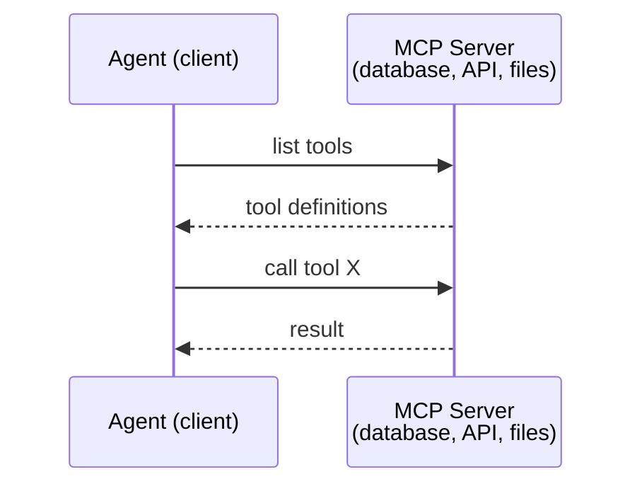
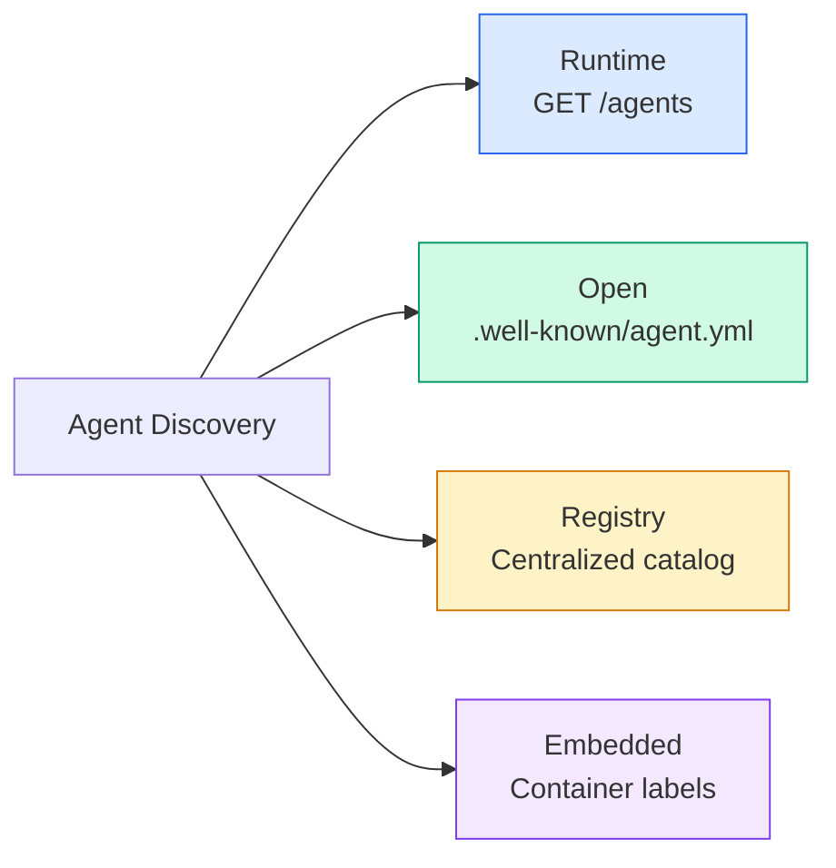
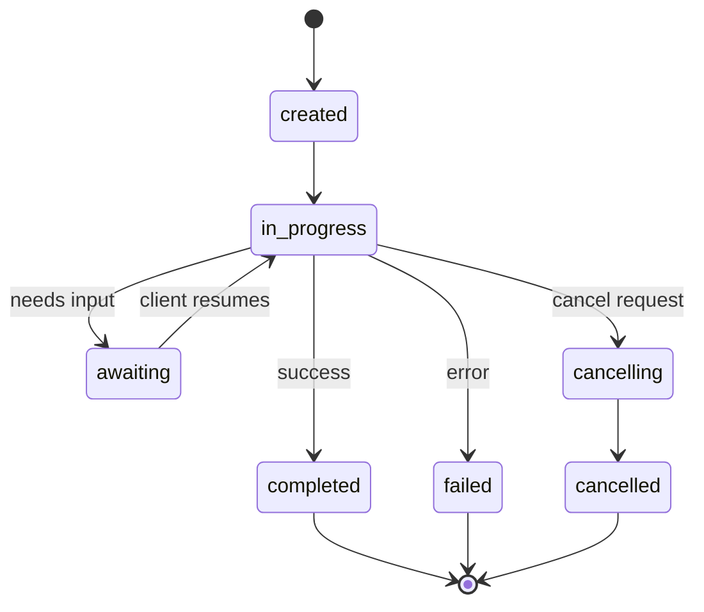
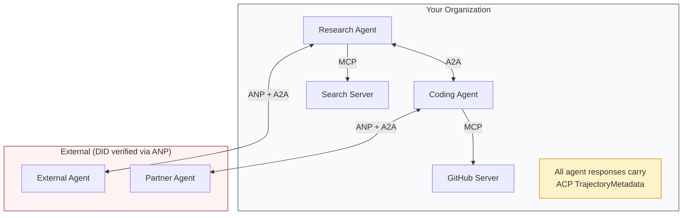
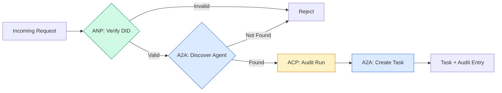

# 通信协议

> 不能说同一种语言的特工不是一个团队。他们是陌生人，对着虚空喊叫。

**Type:** Build
**Languages:** TypeScript
**Prerequisites:** Phase 14 (Agent Engineering), Lesson 16.01 (Why Multi-Agent)
**Time:** ~120 minutes

## 学习目标

- 实现MCP工具发现和调用，以便代理可以使用外部服务器公开的工具
- 构建A2A代理卡和任务端点，允许一个代理通过HTTP将工作委托给另一个代理
- 比较MCP（工具访问）、A2A（代理到代理）、ACP（企业审计）和ANP（分散信任），并解释哪个协议解决了哪个问题
- 将多个协议连接在一个系统中，其中代理通过MCP发现工具，并通过A2A委托任务

## 这个问题

您将系统拆分为多个代理。研究员，程序员，审稿人。他们都很擅长各自的工作。但现在你需要他们真正地相互交谈。

你的第一个尝试很明显：传递字符串。研究人员返回一团文本，编码员尽其所能对其进行解析。直到编码人员误解了研究摘要，或者两个代理死锁等待对方，或者您需要由不同团队构建的代理进行协作，它才会起作用。突然之间，“只传递字符串”就崩溃了。

这是通信协议问题。如果没有一个关于代理如何交换信息的共享契约，多代理系统是脆弱的、不可审计的，并且不可能扩展到您亲自编写的几个代理之外。

人工智能生态系统以四种协议作为回应，每种协议都解决了问题的不同部分：

- **MCP**用于工具访问
- **A2A**用于代理对代理协作
- **ACP**用于企业审核
- **ANP**用于去中心化的身份和信任

这个教训很深刻。您将从每个规范中阅读真正的连线格式，构建工作实现，并将所有四个规范连接到一个统一的系统中。

## 这个概念

### 协议景观

可以把这四个协议看作一个层，每个层都解决一个不同的问题：

“‘美人鱼
block-beta
列1
block:ANP - agent如何信任陌生人？\ n去中心化身份（DID）， E2EE，元协议"]
结束
block:A2A[“A2A -代理如何在目标上协作？\nAgent卡，任务生命周期，流，协商"]
结束
ACP -代理如何在可审计系统中对话？\nRuns，轨迹元数据，会话连续性"]
结束
block:MCP["MCP -代理如何使用工具？\nTool发现、执行、上下文共享"]
结束

样式ANP填充：#f3e8ff，描边：#7c3aed
样式A2A，填充：# dbee，描边：#2563eb
样式ACP填充：#fef3c7，描边：#d97706
样式MCP填充：#d1fae5，描边：#059669
```

They're not competitors. They solve different problems at different levels.

### MCP (Recap)

MCP is covered in depth in Phase 13. Quick recap: MCP standardizes how an LLM connects to external tools and data sources. It's a **client-server** protocol where the agent (client) discovers and calls tools exposed by a server.



MCP是**代理到工具的**通信。这对探员之间的交流没有帮助。

### A2A （Agent2Agent Protocol）

**由：**谷歌创建（现在在Linux Foundation下）
*规格版本：** 1.0.0
*问题：自治代理如何相互协作、协商和委派任务？

A2A是对等代理协作的协议。MCP是座席与工具的连接，A2A是座席与其他座席的连接。每个代理在一个众所周知的URL上发布一个代理卡，其他代理发现、协商并将任务委托给它。

#### A2A如何运作

“‘美人鱼
sequenceDiagram
participant Client作为Client Agent
participant Remote as Remote Agent

Client->>Remote: GET /. known/agent-card.json
客户端：Agent Card（技能、模式、安全）

Client->>Remote: POST /message：发送
客户端：Task（已提交/正在工作）

alt轮询
Client->>Remote: GET /tasks/{id}
Remote——>>客户端：任务状态+工件
其他流
Client->>Remote: POST /message:stream
Remote——>>Client: SSE: statusUpdate
Remote——>>客户端：SSE: artifacupdate
Remote——>>Client: SSE: completed
结束
```

#### The Real Agent Card

This is what an A2A Agent Card actually looks like in the wild. Served at `GET /.well-known/agent-card.json`:

```json
{
  "name": "Research Agent",
  "description": "Searches documentation and summarizes findings",
  "version": "1.0.0",
  "supportedInterfaces": [
    {
      "url": "https://research-agent.example.com/a2a/v1",
      "protocolBinding": "JSONRPC",
      "protocolVersion": "1.0"
    },
    {
      "url": "https://research-agent.example.com/a2a/rest",
      "protocolBinding": "HTTP+JSON",
      "protocolVersion": "1.0"
    }
  ],
  "provider": {
    "organization": "Your Company",
    "url": "https://example.com"
  },
  "capabilities": {
    "streaming": true,
    "pushNotifications": false
  },
  "defaultInputModes": ["text/plain", "application/json"],
  "defaultOutputModes": ["text/plain", "application/json"],
  "skills": [
    {
      "id": "web-research",
      "name": "Web Research",
      "description": "Searches the web and synthesizes findings",
      "tags": ["research", "search", "summarization"],
      "examples": ["Research the latest changes in React 19"]
    },
    {
      "id": "doc-analysis",
      "name": "Documentation Analysis",
      "description": "Reads and analyzes technical documentation",
      "tags": ["docs", "analysis"],
      "inputModes": ["text/plain", "application/pdf"],
      "outputModes": ["application/json"]
    }
  ],
  "securitySchemes": {
    "bearer": {
      "httpAuthSecurityScheme": {
        "scheme": "Bearer",
        "bearerFormat": "JWT"
      }
    }
  },
  "security": [{ "bearer": [] }]
}
```

需要注意的关键事项：
- **技能**是代理能做的。每个都有一个ID、标签和支持的输入/输出MIME类型。这就是客户端代理如何决定这个远程代理是否可以处理它的请求。
- **supportedInterfaces**列出了多个协议绑定。单个代理可以同时使用JSON-RPC、REST和gRPC。
- **安全**是内置在卡。客户机在发出单个请求之前就知道它需要什么认证。

#### 任务生命周期

任务是A2A的核心工作单元。它们在定义的状态中移动：

“‘美人鱼
stateDiagram-v2
[*]——>提交
提交——>工作
工作——> input_required：需要更多信息
Input_required——> working：客户端发送数据
工作——b>完成：成功
Working——> failed：错误
Working——> canceled：客户端取消
提交—>拒绝：代理拒绝

完成—> [*]
失败—> [*]
取消——> [*]
拒绝—> [*]

完成后的注释：终端状态是不可变的。后续任务在相同的上下文中创建新的任务。
```

All 8 states (the spec also defines `UNSPECIFIED` as a sentinel, omitted here):

| State | Terminal? | Meaning |
|---|---|---|
| `TASK_STATE_SUBMITTED` | No | Acknowledged, not yet processing |
| `TASK_STATE_WORKING` | No | Actively being processed |
| `TASK_STATE_INPUT_REQUIRED` | No | Agent needs more info from client |
| `TASK_STATE_AUTH_REQUIRED` | No | Authentication needed |
| `TASK_STATE_COMPLETED` | Yes | Finished successfully |
| `TASK_STATE_FAILED` | Yes | Finished with error |
| `TASK_STATE_CANCELED` | Yes | Canceled before completion |
| `TASK_STATE_REJECTED` | Yes | Agent declined the task |

Once a task reaches a terminal state, it's immutable. No further messages. Follow-ups create a new task within the same `contextId`.

#### Wire Format

A2A uses JSON-RPC 2.0. Here's what a real message exchange looks like:

**Client sends a task:**
```json
{
  "jsonrpc": "2.0",
  "id": 1,
  "method": "SendMessage",
  "params": {
    "message": {
      "messageId": "msg-001",
      "role": "ROLE_USER",
      "parts": [{ "text": "Research React 19 compiler features" }]
    },
    "configuration": {
      "acceptedOutputModes": ["text/plain", "application/json"],
      "historyLength": 10
    }
  }
}
```

**Agent响应任务：**
' ' ' json
｛
“jsonrpc”:“2.0”,
“id”:1、
"结果":{
“任务”:{
“id”:“任务- abc - 123”,
“contextId”:“ctx - xyz - 789”,
“状态”:{
“状态”:“TASK_STATE_COMPLETED”,
“时间戳”:“2026 - 03 - 27 t10:30:00z”
}，
“工件”:(
｛
“artifactId”:“艺术- 001”,
“名称”:“研究成果”,
“部件”:[{
“数据”:{
“发现”:(
“React 19编译器自动记忆组件”，
“不再需要手动使用ememo /useCallback”，
编译器在构建时运行，而不是运行时。
］
}，
“mediaType”:“application / json”
})
｝
］
｝
｝
｝
```

**Streaming via SSE:**
```text
POST /message:stream HTTP/1.1
Content-Type: application/json
A2A-Version: 1.0

data: {"task":{"id":"task-123","status":{"state":"TASK_STATE_WORKING"}}}

data: {"statusUpdate":{"taskId":"task-123","status":{"state":"TASK_STATE_WORKING","message":{"role":"ROLE_AGENT","parts":[{"text":"Searching documentation..."}]}}}}

data: {"artifactUpdate":{"taskId":"task-123","artifact":{"artifactId":"art-1","parts":[{"text":"partial findings..."}]},"append":true,"lastChunk":false}}

data: {"statusUpdate":{"taskId":"task-123","status":{"state":"TASK_STATE_COMPLETED"}}}
```

### 座席通信协议

**由** IBM / BeeAI创建
**规格版本：** 0.2.0 （OpenAPI 3.1.1）
**状态：**并入Linux基金会下的A2A
*问题：**代理如何与完全可审计性、会话连续性和轨迹跟踪进行通信？

ACP是**企业协议。与许多摘要所宣称的不同，ACP ** ** *不使用JSON-LD。它是通过OpenAPI定义的一个简单的REST/JSON API。它的特别之处在于轨迹元数据：每个代理响应都可以携带产生它的推理步骤和工具调用的详细日志。

“‘美人鱼
sequenceDiagram
参与者的客户
作为ACP代理的ACP参与者
参与者审计作为审计日志

客户端->>ACP: POST /runs （mode: sync）
ACP：处理请求…
ACP->>审计：日志轨迹：<br/>推理+工具调用
ACP—>>客户端：Response + TrajectoryMetadata
over Audit：每一步记录：<br/>tool_name, tool_input,<br/>tool_output, reasoning
```

#### Agent Discovery in ACP

ACP defines four discovery methods:



**AgentManifest**比A2A的Agent Card更简单：

' ' ' json
｛
“名称”:“史书”,
“description”： “带源引用的文档摘要”；
“input_content_types”： ["text/plain", "application/pdf"]，
“output_content_types”： ["text/plain", "application/json"]，
“元数据”:{
“tags”：[“summary”，“RAG”]，
“框架”:“BeeAI”,
“能力”:[
｛
“name”：“文件摘要”；
“description”：“将冗长的文档浓缩成要点”
｝
]，
“recommended_models”:“llama3.3:70b-instruct-fp16”,
“许可证”:“apache - 2.0”,
“programming_language”:“Python”
｝
｝
```

#### Run Lifecycle

ACP uses "Runs" instead of "Tasks". A Run is an agent execution with three modes:

| Mode | Behavior |
|---|---|
| `sync` | Blocking. Response contains the complete result. |
| `async` | Returns 202 immediately. Poll `GET /runs/{id}` for status. |
| `stream` | SSE stream. Events fire as the agent works. |



#### 轨迹元数据（审计跟踪）

这是ACP的关键区别。每个消息部分都可以包含显示代理所做操作的元数据：

' ' ' json
｛
“角色”:“代理/研究员”,
“部件”:(
｛
“content_type”:“text / plain”,
“旧金山的天气是72华氏度，阳光明媚。”
“元数据”:{
“类型”:“轨迹”,
“message”： “我需要查一下这个位置的天气”，
:“tool_name weather_api”,
“tool_input”： {"location": "San Francisco， CA"}，
“tool_output”： {"temperature": 72, "condition": "sunny"}
｝
｝
］
｝
```

For regulated industries this is gold. Every answer comes with a provable chain of reasoning: which tools were called, what inputs were used, what outputs were received. No black box.

ACP also supports **CitationMetadata** for source attribution:

```json
{
  "kind": "citation",
  "start_index": 0,
  "end_index": 47,
  "url": "https://weather.gov/sf",
  "title": "NWS San Francisco Forecast"
}
```

### 代理网络协议

**作者：**开源社区（张高伟创立）
*回购:* * *
**问题：**在没有中央权威的情况下，来自不同组织的代理如何相互信任？

ANP是去中心化身份协议。它使用W3C分散标识符（Decentralized Identifiers, DIDs）和端到端加密来建立信任。与通过已知端点发现代理的A2A不同，ANP允许代理以加密方式证明其身份。

ANP有三层：

“‘美人鱼
图结核病
子图Layer3[“第3层：应用协议”]
AD[代理描述文档]
盘(发现端点)
结束
子图Layer2[“第2层：元协议”]
NEG[人工智能协议协商]
CODE[动态代码生成]
结束
子图Layer1[“第1层：身份和安全通信”]
“ DID:wba (W3C DID)”
Hpke [Hpke e2ee - RFC 9180]
SIG(签名验证)
结束

Layer3—> Layer2
Layer2—> Layer1

样式Layer1填充：#d1fae5，描边：#059669
样式Layer2填充：# dbee，描边：#2563eb
样式Layer3填充：#f3e8ff，描边：#7c3aed
```

#### DID Documents (Real Structure)

ANP uses a custom DID method called `did:wba` (Web-Based Agent). The DID `did:wba:example.com:user:alice` resolves to `https://example.com/user/alice/did.json`:

```json
{
  "@context": [
    "https://www.w3.org/ns/did/v1",
    "https://w3id.org/security/suites/jws-2020/v1",
    "https://w3id.org/security/suites/secp256k1-2019/v1"
  ],
  "id": "did:wba:example.com:user:alice",
  "verificationMethod": [
    {
      "id": "did:wba:example.com:user:alice#key-1",
      "type": "EcdsaSecp256k1VerificationKey2019",
      "controller": "did:wba:example.com:user:alice",
      "publicKeyJwk": {
        "crv": "secp256k1",
        "x": "NtngWpJUr-rlNNbs0u-Aa8e16OwSJu6UiFf0Rdo1oJ4",
        "y": "qN1jKupJlFsPFc1UkWinqljv4YE0mq_Ickwnjgasvmo",
        "kty": "EC"
      }
    },
    {
      "id": "did:wba:example.com:user:alice#key-x25519-1",
      "type": "X25519KeyAgreementKey2019",
      "controller": "did:wba:example.com:user:alice",
      "publicKeyMultibase": "z9hFgmPVfmBZwRvFEyniQDBkz9LmV7gDEqytWyGZLmDXE"
    }
  ],
  "authentication": [
    "did:wba:example.com:user:alice#key-1"
  ],
  "keyAgreement": [
    "did:wba:example.com:user:alice#key-x25519-1"
  ],
  "humanAuthorization": [
    "did:wba:example.com:user:alice#key-1"
  ],
  "service": [
    {
      "id": "did:wba:example.com:user:alice#agent-description",
      "type": "AgentDescription",
      "serviceEndpoint": "https://example.com/agents/alice/ad.json"
    }
  ]
}
```

需要注意的关键事项：
- **键分离**是强制的。签名密钥（secp256k1）与加密密钥（X25519）是分开的。
- **这些密钥在使用前需要明确的人工批准（生物识别、密码、HSM）。像资金转移这样的高风险操作都要经过这条路径。
- **
- **服务**部分链接到代理描述文档。

#### 信任如何在ANP中起作用

ANP ** **不使用信任网络或背书图。信任是双边的，并在每次互动中得到验证；

“‘美人鱼
sequenceDiagram
座席A
participant Domain作为座席A的Domain
座席B

A->>B: HTTP请求+ DID +签名
B->>域：Fetch DID文档（HTTPS）
Domain——>>B: DID文档+公钥
B->>B：使用公钥验证签名
B——>>A：发出访问令牌
B：后续请求使用令牌
A,B: Trust = TLS域验证<br/>+ DID签名验证<br/>+最小信任原则
```

Trust comes from three sources:
1. **Domain-level TLS** verifies the DID document host
2. **DID cryptographic signatures** verify the agent's identity
3. **Principle of least trust** grants only minimum permissions

There's no gossip-based trust propagation or PageRank scoring. You verify each agent directly through its DID.

#### Meta-Protocol Negotiation

This is ANP's most novel feature. When two agents from different ecosystems meet, they don't need pre-agreed data formats. They negotiate in natural language:

```json
{
  "action": "protocolNegotiation",
  "sequenceId": 0,
  "candidateProtocols": "I can communicate using:\n1. JSON-RPC with hotel booking schema\n2. REST with OpenAPI 3.1 spec\n3. Natural language over HTTP",
  "modificationSummary": "Initial proposal",
  "status": "negotiating"
}
```

“‘美人鱼
sequenceDiagram
座席A
座席B

A->>B：协议协商（候选协议）
B->>A：协议协商（反提议）
A->>B：协议协商（接受）
注意A、B：代理动态生成代码<br/>来处理约定的格式。<br/>最多10轮，然后超时。
```

The agents go back and forth (max 10 rounds) until they agree on a format, then dynamically generate code to handle it. Status values: `negotiating`, `rejected`, `accepted`, `timeout`.

This means two agents that have never seen each other before can figure out how to communicate without anyone pre-defining a shared schema.

### Comparison (Corrected)

| | MCP | A2A | ACP | ANP |
|---|---|---|---|---|
| **Created by** | Anthropic | Google / Linux Foundation | IBM / BeeAI | Community |
| **Spec format** | JSON-RPC | JSON-RPC / REST / gRPC | OpenAPI 3.1 (REST) | JSON-RPC |
| **Primary use** | Agent to Tool | Agent to Agent | Agent to Agent | Agent to Agent |
| **Discovery** | Tool listing | `/.well-known/agent-card.json` | `GET /agents`, `/.well-known/agent.yml` | `/.well-known/agent-descriptions`, DID service endpoints |
| **Identity** | Implicit (local) | Security schemes (OAuth, mTLS) | Server-level | W3C DID (`did:wba`) with E2EE |
| **Audit trail** | N/A | Basic (task history) | TrajectoryMetadata (tool calls, reasoning) | Not formally specified |
| **State machine** | N/A | 9 task states | 7 run states | N/A |
| **Streaming** | N/A | SSE | SSE | Transport-agnostic |
| **Unique feature** | Tool schemas | Agent Cards + Skills | Trajectory audit trail | Meta-protocol negotiation |
| **Best for** | Tools & data | Dynamic collaboration | Regulated industries | Cross-org trust |
| **Status** | Stable | Stable (v1.0) | Merging into A2A | Active development |

### How They Work Together

These protocols are not mutually exclusive. A realistic enterprise system uses multiple:



- **MCP**将每个代理连接到其工具
- **A2A**处理代理之间的协作（内部和外部）
- **ACP**将响应封装在轨迹元数据中以供审计
- **ANP**为您无法控制的代理提供身份验证

## 构建它

### 步骤1：核心消息类型

每个多代理系统都以消息格式开始。我们定义映射到实际协议使用的类型：

“‘打印稿
从“node:crypto”导入crypto；

type MessageRole = "user" | "agent"；

类型MessagePart =
  | { kind: "text"; text: string }
  | { kind: "data"; data: unknown; mediaType: string }
  | { kind: "file"; name: string; url: string; mediaType: string };

type TrajectoryEntry = {
推理:字符串;
toolName吗?:字符串;
toolInput吗?:未知;
toolOutput吗?:未知;
时间戳:数量;
};

type AgentMessage = {
id:字符串;
作用:MessageRole;
部分:MessagePart [];
轨迹?: TrajectoryEntry [];
replyTo吗?:字符串;
时间戳:数量;
};

函数createMessage (
角色:MessageRole,
部分:MessagePart [],
replyTo吗?:字符串
): AgentMessage {
返回{
id: crypto.randomUUID (),
的角色,
部分,
replyTo,
时间戳:Date.now (),
};
｝

函数textMessage(role: MessageRole, text: string): AgentMessage {
return createMessage(role, [{kind: "text", text}])；
｝
```

Notice: `MessagePart` is multimodal (text, structured data, files) just like the real A2A and ACP specs. `TrajectoryEntry` captures the reasoning chain, matching ACP's TrajectoryMetadata.

### Step 2: A2A Agent Card and Registry

Build agent discovery that matches the real A2A spec:

```typescript
type Skill = {
  id: string;
  name: string;
  description: string;
  tags: string[];
  inputModes: string[];
  outputModes: string[];
};

type AgentCard = {
  name: string;
  description: string;
  version: string;
  url: string;
  capabilities: {
    streaming: boolean;
    pushNotifications: boolean;
  };
  defaultInputModes: string[];
  defaultOutputModes: string[];
  skills: Skill[];
};

class AgentRegistry {
  private cards: Map<string, AgentCard> = new Map();

  register(card: AgentCard) {
    this.cards.set(card.name, card);
  }

  discoverBySkillTag(tag: string): AgentCard[] {
    return [...this.cards.values()].filter((card) =>
      card.skills.some((skill) => skill.tags.includes(tag))
    );
  }

  discoverByInputMode(mimeType: string): AgentCard[] {
    return [...this.cards.values()].filter(
      (card) =>
        card.defaultInputModes.includes(mimeType) ||
        card.skills.some((skill) => skill.inputModes.includes(mimeType))
    );
  }

  resolve(name: string): AgentCard | undefined {
    return this.cards.get(name);
  }

  listAll(): AgentCard[] {
    return [...this.cards.values()];
  }
}
```

这比简单的名称到功能映射要丰富得多。您可以通过技能标记、输入MIME类型或名称来发现代理，就像真正的A2A规范所支持的那样。

### 步骤3:A2A任务生命周期

构建完整的任务状态机：

“‘打印稿
类型TaskState =
  | "submitted"
  | "working"
  | "input-required"
  | "auth-required"
  | "completed"
  | "failed"
  | "canceled"
  | "rejected";

const TERMINAL_STATES: TaskState[] = [
“完成”,
“失败”,
“取消”,
“拒绝”,
];

类型TaskStatus = {
状态:TaskState;
口信吗?: AgentMessage;
时间戳:数量;
};

类型工件= {
id:字符串;
名称:字符串;
部分:MessagePart [];
};

type Task = {
id:字符串;
contextId:字符串;
状态:TaskStatus;
构件:工件[];
历史:AgentMessage [];
};

类型TaskEvent =
  | { kind: "statusUpdate"; taskId: string; status: TaskStatus }
  | {
:“artifactUpdate”;
taskId:字符串;
工件:工件;
附加:布尔;
lastChunk:布尔;
};

TaskHandler = (
任务:任务,
信息:AgentMessage
) =>异步生成器<TaskEvent>；

类TaskManager {
private tasks: Map<string, Task> = new Map()；
私有处理程序：Map<string, TaskHandler> = new Map()；
private listener: Map<string, ((event: TaskEvent) => void)[]> = new Map()；

registerHandler(agentName: string, handler: TaskHandler) {
this.handlers .塞特(agentName,饲养员);
……

订阅（taskkid: string, listener: (event: TaskEvent) => void） {
Const existing = this.listeners。得到(taskId) ? ?[];
existing.push(听众);
this.listeners。集(taskId,现有的);
｝

异步sendMessage (
agentName:字符串,
信息:AgentMessage,
contextId吗?:字符串
): Promise<Task> {
const handler = this.handlers.get(agentName)；
如果(!处理程序){
const task = this.createTask(contextId)；
的任务。状态= {
状态:“拒绝”,
时间戳:Date.now (),
message: textMessage(“agent”，
};
返回任务;
｝

const task = this.createTask(contextId)；
task.history.push(消息);
的任务。status ={状态：“提交”，时间戳：Date.now()}；

这一点。processstask（任务，处理程序，消息）.catch((err) => {
的任务。状态= {
状态:“失败”,
时间戳:Date.now (),
message: textMessage("agent", String(err))，
};
})；
返回任务;
｝

getask (taskkid: string)：任务|未定义{
返回this.tasks.get (taskId);
｝

cancelTask(taskId: string): boolean {
const task = this.tasks.get(taskId)；
如果(!task || TERMINAL_STATES.includes（task.status.）状态))返回false；
的任务。status ={状态：“已取消”，时间戳：Date.now()}；
这一点。发出(taskId, {
:“statusUpdate”,
taskId,
状态:task.status,
})；
返回true;
｝

私人createTask (contextId ?：字符串)：任务{
const task: task = {
id: crypto.randomUUID (),
语境tid：语境tid ?？crypto.randomUUID (),
状态：{状态：“提交”，时间戳：Date.now()}，
构件:[],
历史:[],
};
this.tasks.set(任务。id、任务);
返回任务;
｝

私有异步进程任务(
任务:任务,
处理程序:TaskHandler,
信息:AgentMessage
) {
的任务。status ={状态：“working”，时间戳：Date.now()}；
this.emit(任务。id, {
:“statusUpdate”,
taskId: task.id,
状态:task.status,
})；

尝试{
For await (const event of handler(task, message)) {
if (TERMINAL_STATES.includes(task.status.state)) break；

如果事件。kind === "statusUpdate") {
的任务。Status = event.status；
｝
如果事件。kind === "artifactUpdate") {
Const existing = task.artifacts.find(
(a) => a.d === event.artifact.id
）;
如果（存在&&事件）。附加){
existing.parts.push(…event.artifact.parts);
} else {
task.artifacts.push (event.artifact);
｝
｝
this.emit(任务。id、事件);
｝
} catch (err) {
的任务。状态= {
状态:“失败”,
时间戳:Date.now (),
message: textMessage("agent", String(err))，
};
this.emit(任务。id, {
:“statusUpdate”,
taskId: task.id,
状态:task.status,
})；
｝
｝

private emit(taskkid: string, event: TaskEvent) {
For （const listener of this.listeners.）得到(taskId) ? ?[]) {
侦听器(事件);
｝
｝
｝
```

This implements the real A2A task lifecycle: submitted, working, input-required, terminal states. Handlers are async generators that yield events (status updates and artifact chunks) matching the SSE streaming model.

### Step 4: ACP-Style Audit Trail

Wrap communication with trajectory tracking:

```typescript
type AuditEntry = {
  runId: string;
  agentName: string;
  input: AgentMessage[];
  output: AgentMessage[];
  trajectory: TrajectoryEntry[];
  status: "created" | "in-progress" | "completed" | "failed" | "awaiting";
  startedAt: number;
  completedAt?: number;
  sessionId?: string;
};

class AuditableRunner {
  private log: AuditEntry[] = [];
  private handlers: Map<
    string,
    (input: AgentMessage[]) => Promise<{
      output: AgentMessage[];
      trajectory: TrajectoryEntry[];
    }>
  > = new Map();

  registerAgent(
    name: string,
    handler: (input: AgentMessage[]) => Promise<{
      output: AgentMessage[];
      trajectory: TrajectoryEntry[];
    }>
  ) {
    this.handlers.set(name, handler);
  }

  async run(
    agentName: string,
    input: AgentMessage[],
    sessionId?: string
  ): Promise<AuditEntry> {
    const entry: AuditEntry = {
      runId: crypto.randomUUID(),
      agentName,
      input: structuredClone(input),
      output: [],
      trajectory: [],
      status: "created",
      startedAt: Date.now(),
      sessionId,
    };
    this.log.push(entry);

    const handler = this.handlers.get(agentName);
    if (!handler) {
      entry.status = "failed";
      return entry;
    }

    entry.status = "in-progress";
    try {
      const result = await handler(input);
      entry.output = structuredClone(result.output);
      entry.trajectory = structuredClone(result.trajectory);
      entry.status = "completed";
      entry.completedAt = Date.now();
    } catch (err) {
      entry.status = "failed";
      entry.trajectory.push({
        reasoning: `Error: ${String(err)}`,
        timestamp: Date.now(),
      });
      entry.completedAt = Date.now();
    }
    return entry;
  }

  getFullAuditLog(): AuditEntry[] {
    return structuredClone(this.log);
  }

  getAuditLogForAgent(agentName: string): AuditEntry[] {
    return structuredClone(
      this.log.filter((e) => e.agentName === agentName)
    );
  }

  getAuditLogForSession(sessionId: string): AuditEntry[] {
    return structuredClone(
      this.log.filter((e) => e.sessionId === sessionId)
    );
  }

  getTrajectoryForRun(runId: string): TrajectoryEntry[] {
    const entry = this.log.find((e) => e.runId === runId);
    return entry ? structuredClone(entry.trajectory) : [];
  }
}
```

每次代理执行都会生成一个完整的审计条目：输入的内容、输出的内容、工具调用的完整轨迹以及其间的推理步骤。您可以按代理、按会话或按单个运行进行查询。

### 步骤5:anp风格的身份验证

建立基于id的身份和验证：

“‘打印稿
类型验证方法= {
id:字符串;
类型:字符串;
控制器:字符串;
publicKeyDer:字符串;
};

type DIDDocument = {
id:字符串;
verificationMethod: verificationMethod [];
身份验证:string [];
keyAgreement: string [];
humanAuthorization: string [];
服务：{id：字符串；类型:字符串;serviceEndpoint: string}[]；
};

类型AgentIdentity = {
引出:丁字裤;
第一部分:DIDDocument;
privateKey: crypto.KeyObject;
publicKey: crypto.KeyObject;
新程序;

类IdentityRegistry {
private documents: Map<string, DIDDocument> = new Map()；

发布（doc: DIDDocument） {
this.documents.set (doc。id、doc);
｝

解析（did: string）： DIDDocument | undefined {
返回this.documents.get(做);
｝

验证（did：字符串，签名：字符串，有效载荷：字符串）：布尔{
Const doc = this.documents.get(did)；
如果(!Doc)返回false；

const authKeyIds = doc.authentication；
const authKeys = doc.verificationMethod.filter((vm) =>
authKeyIds.includes (vm.id)
）;

for (const key of authKeys) {
const publicKey = crypto.createPublicKey({
key: Buffer.from(key. publickeyder, "base64")，
格式:“火线”,
类型:“spki”,
})；
const isValid = crypto.verify(
空,
Buffer.from(载荷),
publicKey,
Buffer.from(签名,“六角”)
）;
if （isValid）返回true；
｝
返回错误;
｝

requiresHumanAuth(did: string, operationKeyId: string): boolean {
Const doc = this.documents.get(did)；
如果(!Doc)返回false；
返回doc.humanAuthorization.includes (operationKeyId);
｝
｝

createIdentity(domain: string, agentName: string): AgentIdentity {
const did =
const {publicKey, privateKey} = crypto.generateKeyPairSync("ed25519")；

const publicKeyDer = publicKey
．导出（{格式：“der”，类型：“spki”}）
.toString(“base64”);

const keyId =
const encKeyId =

const document: DIDDocument = {
id:,
verificationMethod:(
｛
id: keyId,
类型:“Ed25519VerificationKey2020”,
控制器:,
publicKeyDer,
}，
｛
id: encKeyId,
类型:“X25519KeyAgreementKey2019”,
控制器:,
publicKeyDer,
}，
]，
身份验证:[keyId],
keyAgreement:(encKeyId),
humanAuthorization: [],
服务:[
｛
id：
类型:“AgentDescription”,
serviceEndpoint：
}，
]，
};

返回{did， document, privateKey, publicKey}；
｝

函数signPayload(identity: AgentIdentity, payload: string): string {
返回加密
．sign（null, Buffer.from(payload), identity.privateKey）
.toString(十六进制);
｝
```

This mirrors the real ANP identity model: agents have DID documents with separate authentication, key agreement, and human authorization keys. The `IdentityRegistry` simulates DID resolution (in production this would be HTTP fetches to the agent's domain).

### Step 6: Protocol Gateway

Connect all four protocols into a unified system:



“‘打印稿
类ProtocolGateway {
私有注册表：AgentRegistry；
private taskManager: taskManager；
private auditRunner: auditablerrunner；
private identityRegistry: identityRegistry；

  constructor(
    registry: AgentRegistry,
    taskManager: TaskManager,
    auditRunner: AuditableRunner,
    identityRegistry: IdentityRegistry
  ) {
    this.registry = registry;
    this.taskManager = taskManager;
    this.auditRunner = auditRunner;
    this.identityRegistry = identityRegistry;
  }

异步delegateTask (
fromDid:字符串,
签名:字符串,
targetAgent:字符串,
信息:AgentMessage,
sessionId吗?:字符串
): Promise<{task: task；审计：AuditEntry} |{错误：string}> {
如果(! this.identityRegistry。验证（fromDid, signature, message）。id)) {
返回{错误：“身份验证失败”}；
｝

const card = this.registry.resolve(targetAgent)；
如果(!卡){
返回{错误：
｝

const audit = await this.auditRunner.run（）
targetAgent,
(消息)
sessionId
）;
const task = await this.taskManager。sendMessage (targetAgent消息);

返回{task， audit}；
｝

discoverAndDelegate (
fromDid:字符串,
签名:字符串,
skillTag:字符串,
信息:AgentMessage
): Promise<{task: task；审计：AuditEntry} |{错误：string}> {
const候选人= this.registry.discoverBySkillTag(skillTag)；
如果候选人。长度=== 0){
返回Promise.resolve ({
错误：
})；
｝
返回this.delegateTask (
fromDid,
签名,
候选人[0]. name,
消息
）;
｝
｝
```

The gateway does four things in one call:
1. **ANP**: Verifies the caller's identity via DID signature
2. **A2A**: Discovers the target agent and checks capabilities
3. **ACP**: Wraps the execution in an audit trail with trajectory
4. **A2A**: Creates a task with full lifecycle tracking

### Step 7: Wire It All Together

```typescript
async function protocolDemo() {
  const registry = new AgentRegistry();
  registry.register({
    name: "researcher",
    description: "Searches and summarizes findings",
    version: "1.0.0",
    url: "https://researcher.local/a2a/v1",
    capabilities: { streaming: true, pushNotifications: false },
    defaultInputModes: ["text/plain"],
    defaultOutputModes: ["text/plain", "application/json"],
    skills: [
      {
        id: "web-research",
        name: "Web Research",
        description: "Searches the web",
        tags: ["research", "search", "summarization"],
        inputModes: ["text/plain"],
        outputModes: ["application/json"],
      },
    ],
  });
  registry.register({
    name: "coder",
    description: "Writes code from specs",
    version: "1.0.0",
    url: "https://coder.local/a2a/v1",
    capabilities: { streaming: false, pushNotifications: false },
    defaultInputModes: ["text/plain", "application/json"],
    defaultOutputModes: ["text/plain"],
    skills: [
      {
        id: "code-gen",
        name: "Code Generation",
        description: "Generates code",
        tags: ["coding", "generation"],
        inputModes: ["text/plain", "application/json"],
        outputModes: ["text/plain"],
      },
    ],
  });

  const taskManager = new TaskManager();
  const auditRunner = new AuditableRunner();

  const researchTrajectory: TrajectoryEntry[] = [];

  taskManager.registerHandler(
    "researcher",
    async function* (task, message) {
      yield {
        kind: "statusUpdate" as const,
        taskId: task.id,
        status: { state: "working" as const, timestamp: Date.now() },
      };

      researchTrajectory.push({
        reasoning: "Searching for React 19 documentation",
        toolName: "web_search",
        toolInput: { query: "React 19 compiler features" },
        toolOutput: {
          results: ["react.dev/blog/react-19", "github.com/react/react"],
        },
        timestamp: Date.now(),
      });

      researchTrajectory.push({
        reasoning: "Extracting key findings from search results",
        toolName: "doc_analysis",
        toolInput: { url: "react.dev/blog/react-19" },
        toolOutput: {
          summary:
            "React 19 compiler auto-memoizes, no manual useMemo needed",
        },
        timestamp: Date.now(),
      });

      yield {
        kind: "artifactUpdate" as const,
        taskId: task.id,
        artifact: {
          id: crypto.randomUUID(),
          name: "research-results",
          parts: [
            {
              kind: "data" as const,
              data: {
                findings: [
                  "React 19 compiler auto-memoizes components",
                  "No more manual useMemo/useCallback needed",
                  "Compiler runs at build time, not runtime",
                ],
                sources: ["react.dev/blog/react-19"],
              },
              mediaType: "application/json",
            },
          ],
        },
        append: false,
        lastChunk: true,
      };

      yield {
        kind: "statusUpdate" as const,
        taskId: task.id,
        status: { state: "completed" as const, timestamp: Date.now() },
      };
    }
  );

  auditRunner.registerAgent("researcher", async () => ({
    output: [
      textMessage("agent", "React 19 compiler auto-memoizes components"),
    ],
    trajectory: researchTrajectory,
  }));

  const identityRegistry = new IdentityRegistry();

  const coderIdentity = createIdentity("coder.local", "coder");
  const researcherIdentity = createIdentity("researcher.local", "researcher");

  identityRegistry.publish(coderIdentity.document);
  identityRegistry.publish(researcherIdentity.document);

  const gateway = new ProtocolGateway(
    registry,
    taskManager,
    auditRunner,
    identityRegistry
  );

  console.log("=== Protocol Demo ===\n");

  console.log("1. Agent Discovery (A2A)");
  const researchAgents = registry.discoverBySkillTag("research");
  console.log(
    `   Found ${researchAgents.length} agent(s):`,
    researchAgents.map((a) => a.name)
  );

  console.log("\n2. Identity Verification (ANP)");
  const message = textMessage("user", "Research React 19 compiler features");
  const signature = signPayload(coderIdentity, message.id);
  const verified = identityRegistry.verify(
    coderIdentity.did,
    signature,
    message.id
  );
  console.log(`   Coder DID: ${coderIdentity.did}`);
  console.log(`   Signature verified: ${verified}`);

  console.log("\n3. Task Delegation (A2A + ACP + ANP)");
  const result = await gateway.delegateTask(
    coderIdentity.did,
    signature,
    "researcher",
    message,
    "session-001"
  );

  if ("error" in result) {
    console.log(`   Error: ${result.error}`);
    return;
  }

  console.log(`   Task ID: ${result.task.id}`);
  console.log(`   Task state: ${result.task.status.state}`);
  console.log(`   Artifacts: ${result.task.artifacts.length}`);

  console.log("\n4. Audit Trail (ACP)");
  console.log(`   Run ID: ${result.audit.runId}`);
  console.log(`   Status: ${result.audit.status}`);
  console.log(`   Trajectory steps: ${result.audit.trajectory.length}`);
  for (const step of result.audit.trajectory) {
    console.log(`     - ${step.reasoning}`);
    if (step.toolName) {
      console.log(`       Tool: ${step.toolName}`);
    }
  }

  console.log("\n5. Full Audit Log");
  const fullLog = auditRunner.getFullAuditLog();
  console.log(`   Total runs: ${fullLog.length}`);
  for (const entry of fullLog) {
    const duration = entry.completedAt
      ? `${entry.completedAt - entry.startedAt}ms`
      : "in-progress";
    console.log(`   ${entry.agentName}: ${entry.status} (${duration})`);
  }
}

protocolDemo().catch((err) => {
  console.error("Protocol demo failed:", err);
  process.exitCode = 1;
});
```

## 出了什么问题

协议解决了快乐路径。以下是在生产过程中出现的问题：

**模式漂移。**代理商A发布代理商卡广告但是JSON模式在不同版本之间会发生变化。代理B解析旧格式并获取垃圾。修复：版本你的技能和输出模式。A2A规范支持

**状态机违规。**代理处理程序产生一个任务是不变的。您的代码会静默地丢弃更新或抛出。修正：在屈服前检查终端状态。The

**信任解决失败。**座席A试图验证座席B的DID，但座席B的域已关闭。无法获取DID文档。打开失败（接受未经验证的代理）还是关闭失败（拒绝所有代理）？ANP建议以最少信任原则关闭失败。

**轨迹膨胀。** ACP轨迹测井功能强大，但价格昂贵。每次运行调用200个工具的复杂代理会产生大量审计条目。修正：日志轨迹在可配置的冗长级别。记录工具名称和IO的遵从性，跳过非规范工作负载的推理步骤。

**发现惊雷群。** 50个座席全部查询修正：缓存代理卡与TTL，交错发现间隔，或使用基于推送的注册而不是轮询。

## 使用它

### 真正的实现

**A2A**是最成熟的。b谷歌Python和TypeScript的sdk。如果您的代理需要动态发现和协作，请从这里开始。

**ACP**并入A2A。IBM的即使使用A2A作为传输，也要使用ACP模式（轨迹记录、运行生命周期）。

**ANP**是最具实验性的。The元协议协商的概念确实很新颖。跨组织代理部署值得关注。

**MCP**已经涵盖在第13阶段。如果您希望代理使用工具，MCP是标准选择。

### 选择正确的协议

“‘美人鱼
图道明
START{座席是否需要<br/>才能使用工具？｝
START—>|是| MCP_R[使用MCP]
START——>|否| TALK{代理之间需要<br/>通话吗？｝
TALK—>|No| NONE[你不需要<br/>a协议]
TALK—>|是|审计{需要审计跟踪<br/>的合规性？｝
审计—>|是| ACP_R[A2A + ACP<br/>轨迹模式]
审计——>|没有| ORG{所有代理<br/>在您的组织？｝
ORG—>|是| A2A_R[A2A<br/>代理卡+任务]
ORG——>|否| INFRA{共享<br/>基础设施？｝
INFRA—b> |是| BROKER[A2A +消息代理]
INFRA—>|No| ANP_R[ANP + A2A<br/>DID验证]

样式MCP_R填充：#d1fae5，描边：#059669
样式：A2A_R，填充：# dbee，描边：#2563eb
样式ACP_R填充：#fef3c7，描边：#d97706
样式ANP_R填充：#f3e8ff，描边：#7c3aed
样式代理填充：#e0e7ff，描边：#4338ca
```

## Ship It

This lesson produces:
- `code/main.ts` -- complete implementation of all four protocol patterns
- `outputs/prompt-protocol-selector.md` -- a prompt that helps you choose protocols for your system

## Exercises

1. **Multi-hop task delegation.** Extend the `TaskManager` so an agent handler can delegate subtasks to other agents. The researcher receives a task, delegates "search" and "summarize" subtasks to two specialist agents, waits for both to complete, then merges the results into its own artifacts.

2. **Streaming audit trail.** Modify the `AuditableRunner` to support streaming mode. Instead of waiting for the full result, yield `AuditEntry` updates in real-time as trajectory entries are added. Use an async generator that produces audit snapshots.

3. **DID rotation.** Add key rotation to the `IdentityRegistry`. An agent should be able to publish a new DID document with updated keys while maintaining a `previousDid` reference. Verifiers should accept signatures from both the current and previous key during a grace period.

4. **Protocol negotiation.** Implement ANP's meta-protocol concept. Two agents exchange `protocolNegotiation` messages with candidate formats (e.g., "I can speak JSON-RPC" vs "I prefer REST"). After max 3 rounds, they agree on a format or timeout. The agreed format determines which `TaskManager` or `AuditableRunner` they use.

5. **Rate-limited discovery.** Add a `RateLimitedRegistry` wrapper that caches Agent Card lookups with a configurable TTL and limits discovery queries per agent per second. Simulate a thundering herd of 100 agents discovering each other on startup and measure the difference.

## Key Terms

| Term | What people say | What it actually means |
|------|----------------|----------------------|
| MCP | "The protocol for AI tools" | A client-server protocol for agents to discover and use tools. Agent-to-tool, not agent-to-agent. |
| A2A | "Google's agent protocol" | A peer-to-peer protocol for agent collaboration under the Linux Foundation. Discovery via Agent Cards, 9-state task lifecycle, streaming via SSE. Supports JSON-RPC, REST, and gRPC bindings. |
| ACP | "Enterprise agent messaging" | IBM/BeeAI's REST API for agent runs with TrajectoryMetadata: every response carries the full chain of reasoning and tool calls. Merging into A2A. |
| ANP | "Decentralized agent identity" | A community protocol using `did:wba` (DID) for cryptographic identity, HPKE for E2EE, and AI-powered meta-protocol negotiation for agents that have never seen each other. |
| Agent Card | "An agent's business card" | A JSON document at `/.well-known/agent-card.json` describing skills, supported MIME types, security schemes, and protocol bindings. |
| DID | "Decentralized ID" | W3C standard for cryptographically verifiable identities hosted on the agent's own domain. ANP uses `did:wba` method. |
| TrajectoryMetadata | "The audit receipt" | ACP's mechanism for attaching reasoning steps, tool calls, and their inputs/outputs to every agent response. |
| Meta-protocol | "Agents negotiating how to talk" | ANP's approach where agents use natural language to dynamically agree on data formats, then generate code to handle them. |
| Task | "A unit of work" | A2A's stateful object tracking work from submission through completion. Immutable once terminal. |

## Further Reading

- [Google A2A specification](https://github.com/google/A2A) -- official spec and SDKs (v1.0.0, Linux Foundation)
- [IBM/BeeAI ACP specification](https://github.com/i-am-bee/acp) -- OpenAPI 3.1 spec for agent runs and trajectory metadata
- [Agent Network Protocol](https://github.com/agent-network-protocol/AgentNetworkProtocol) -- DID-based identity, E2EE, meta-protocol negotiation
- [Model Context Protocol docs](https://modelcontextprotocol.io/) -- Anthropic's MCP specification (covered in Phase 13)
- [W3C Decentralized Identifiers](https://www.w3.org/TR/did-core/) -- the identity standard underpinning ANP
- [RFC 9180 (HPKE)](https://www.rfc-editor.org/rfc/rfc9180) -- the encryption scheme ANP uses for E2EE
- [FIPA Agent Communication Language](http://www.fipa.org/specs/fipa00061/SC00061G.html) -- the academic precursor to modern agent protocols