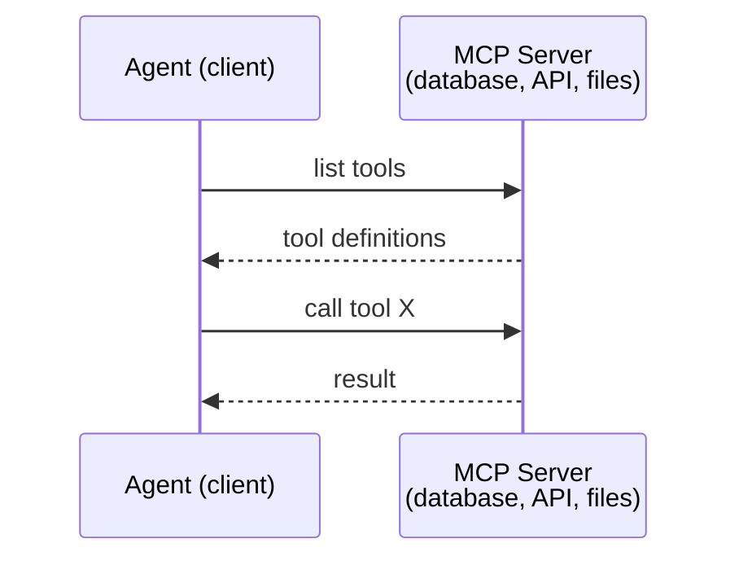
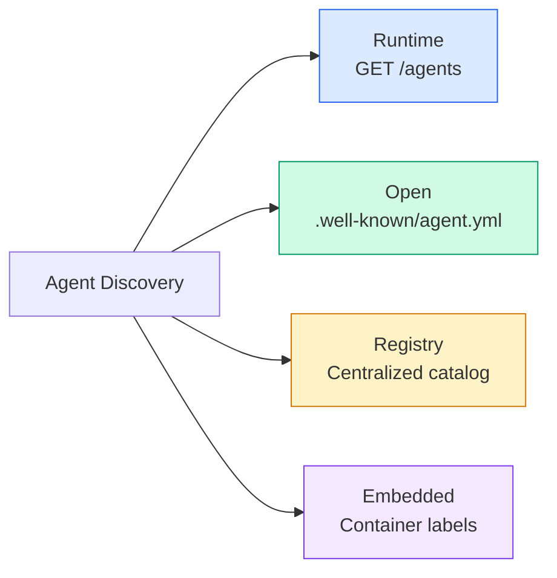
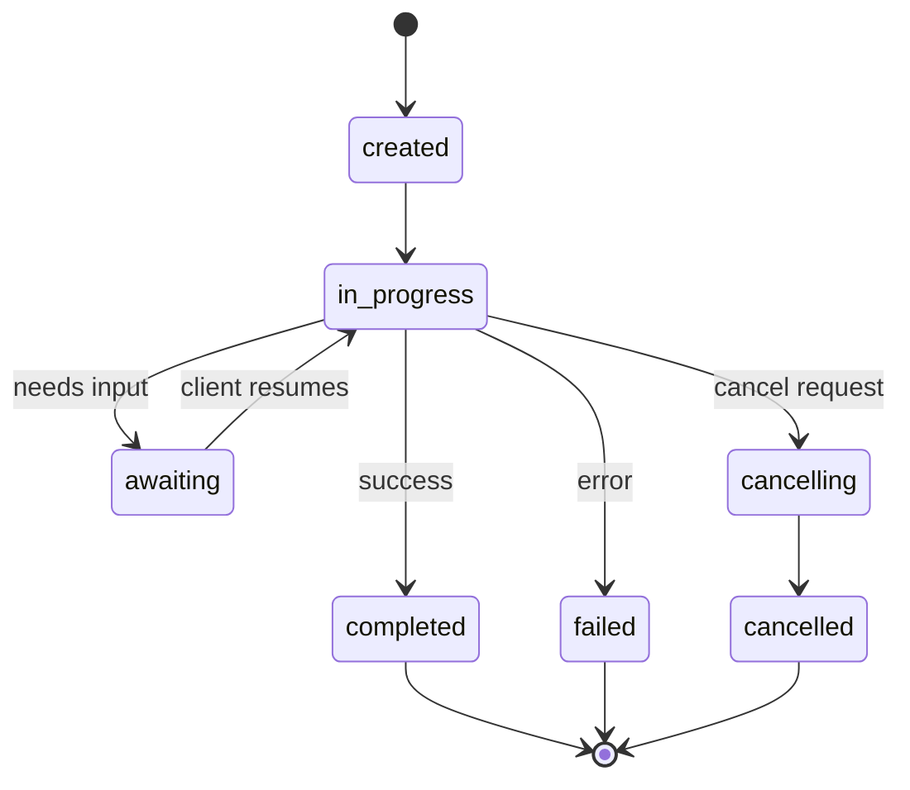
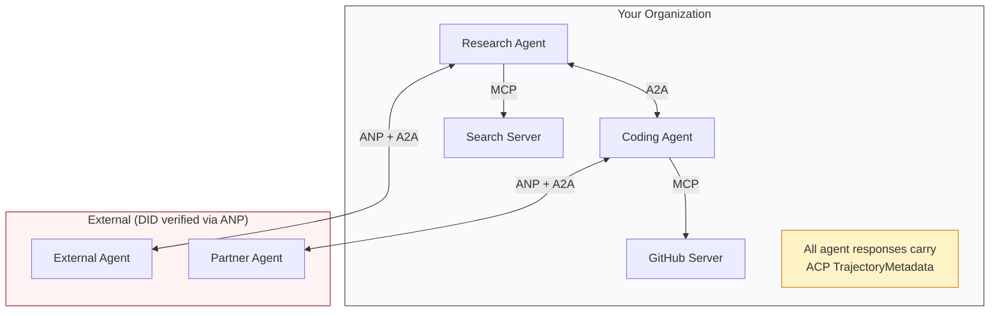
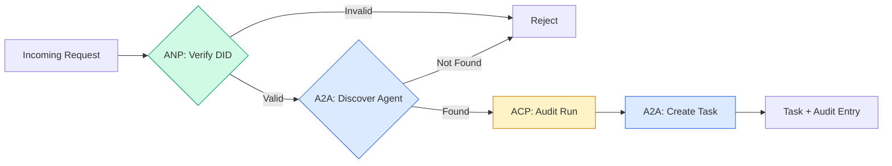

# Communication protocol

> Agents who cannot speak the same language are not in the same team. They were strangers, Shouting into the void.

**Type:** Build
**Languages:** TypeScript
**Prerequisites:** Phase 14 (Agent Engineering), Lesson 16.01 (Why Multi-Agent)
**Time:** ~120 minutes

## Learning objectives

- Implement the discovery and invocation of MCP tools so that the agent can use the tools exposed by the external server
- Build A2A proxy cards and task endpoints, allowing one proxy to delegate work to another proxy via HTTP
- Compare MCP (Tool Access), A2A (Agent-to-Agent), ACP (Enterprise Audit), and ANP (Decentralized Trust), and explain which protocol solves which problem
- Connect multiple protocols in one system, where the agent discovers the tool through MCP and delegates tasks through A2A

## This question

You split the system into multiple agents. Researcher, programmer, reviewer. They are all very good at their respective jobs. But now you need them to really talk to each other.

Your first attempt was obvious: passing a string. The researchers returned a mass of text, and the coders did their best to parse it. It won't work until the coders misunderstand the research summary, or two agents are deadlocked waiting for each other, or you need agents built by different teams to collaborate. All of a sudden, "Pass only strings" crashed.

This is a communication protocol issue. Without a shared contract on how agents exchange information, a multi-agent system is fragile, unauditable, and cannot be extended beyond the several agents you write yourself.

The artificial intelligence ecosystem responds with four protocols, each addressing a different part of the problem:

- "MCP" is used for tool access
- "A2A" is used for agent-to-agent collaboration
- ACP is used for enterprise audits
- ANP is used for decentralized identity and trust

This lesson is very profound. You will read the true connection format from each specification, build the working implementation, and connect all four specifications to a unified system.

## This concept

### Agreement Landscape

These four protocols can be regarded as a layer, each addressing a different problem:

"Mermaid"
block-beta
Column 1
block: How does an ANP-agent trust strangers? Decentralized Identity (DID), E2EE, meta-protocol
Over
block:A2A[" A2A - How Do Agents Collaborate on Targets? \nAgent Card, Task Lifecycle, Flow, Negotiation "]
Over
How does an ACP-agent communicate in an auditable system? \nRuns, trajectory metadata, session continuity "]
Over
block:MCP[" How does an McP-agent use tools? \nTool Discovery, Execution, Context Sharing "]
Over

Style ANP fill: #f3e8ff, stroke: #7c3aed
Style A2A, fill: # dbee, stroke: #2563eb
Style ACP fill: #fef3c7, stroke: #d97706
Style MCP fill: #d1fae5, stroke: #059669
```

They're not competitors. They solve different problems at different levels.

### MCP (Recap)

MCP is covered in depth in Phase 13. Quick recap: MCP standardizes how an LLM connects to external tools and data sources. It's a **client-server** protocol where the agent (client) discovers and calls tools exposed by a server.



MCP is the communication from agent to tool. This is of no help to the communication among agents.

### A2A （Agent2Agent Protocol）

*Created by: Google (now under the Linux Foundation)
*Specification version: ** 1.0.0
*Question: How do autonomous agents collaborate, negotiate and delegate tasks to each other?

A2A is a protocol for peer proxy collaboration. MCP is the connection between the agent and the tool, and A2A is the connection between the agent and other agents. Each agent publishes an agent card at a well-known URL, and other agents discover, negotiate and delegate tasks to it.

#### How does A2A work

"Mermaid"
sequenceDiagram
participant Client acts as the Client Agent
participant Remote as Remote Agent

Client->>Remote: GET /. known/agent-card.json
Client: Agent Card (Skills, Patterns, Security)

Client->>Remote: POST /message: Send
Client: Task (Submitted/Working)

alt polling
Client->>Remote: GET /tasks/{id}
Remote -- >> Client: Task status + artifact
Other streams
Client->>Remote: POST /message:stream
Remote——>>Client: SSE: statusUpdate
Remote -- >> Client: SSE: artifacupdate
Remote——>>Client: SSE: completed
Over
```

#### The Real Agent Card

This is what an A2A Agent Card actually looks like in the wild. Served at `GET /.well-known/agent-card.json`:

```json
{
  "name": "Research Agent",
  "description": "Searches documentation and summarizes findings",
  "version": "1.0.0",
  "supportedInterfaces": [
    {
      "url": "https://research-agent.example.com/a2a/v1",
      "protocolBinding": "JSONRPC",
      "protocolVersion": "1.0"
    },
    {
      "url": "https://research-agent.example.com/a2a/rest",
      "protocolBinding": "HTTP+JSON",
      "protocolVersion": "1.0"
    }
  ],
  "provider": {
    "organization": "Your Company",
    "url": "https://example.com"
  },
  "capabilities": {
    "streaming": true,
    "pushNotifications": false
  },
  "defaultInputModes": ["text/plain", "application/json"],
  "defaultOutputModes": ["text/plain", "application/json"],
  "skills": [
    {
      "id": "web-research",
      "name": "Web Research",
      "description": "Searches the web and synthesizes findings",
      "tags": ["research", "search", "summarization"],
      "examples": ["Research the latest changes in React 19"]
    },
    {
      "id": "doc-analysis",
      "name": "Documentation Analysis",
      "description": "Reads and analyzes technical documentation",
      "tags": ["docs", "analysis"],
      "inputModes": ["text/plain", "application/pdf"],
      "outputModes": ["application/json"]
    }
  ],
  "securitySchemes": {
    "bearer": {
      "httpAuthSecurityScheme": {
        "scheme": "Bearer",
        "bearerFormat": "JWT"
      }
    }
  },
  "security": [{ "bearer": [] }]
}
```

Key points to note:
- "Skills" are what agents can do. Each one has an ID, a tag, and supported input/output MIME types. This is how the client proxy decides whether this remote proxy can handle its request.
- **supportedInterfaces** lists multiple protocol bindings. A single agent can use JSON-RPC, REST and gRPC simultaneously.
- "Security" is built into the card. The client knows what authentication it needs before sending a single request.

#### Task lifecycle

The task is the core working unit of A2A. They move within the defined states:

"Mermaid"
stateDiagram-v2
[*] -- > Submit
Submit -- > Work
Work -- > input_required: More information is needed
Input_required -- > working: The client sends data
Work - b> Completion: Success
Working -- > failed: Error
Working -- > canceled: client cancel
Submit - > Reject: The agent rejects

Completed - > [*]
Failure - > [*]
Cancel -- > [*]
Reject - > [*]

The terminal state is immutable. Subsequent tasks create new tasks in the same context.
```

All 8 states (the spec also defines `UNSPECIFIED` as a sentinel, omitted here):

| State | Terminal? | Meaning |
|---|---|---|
| `TASK_STATE_SUBMITTED` | No | Acknowledged, not yet processing |
| `TASK_STATE_WORKING` | No | Actively being processed |
| `TASK_STATE_INPUT_REQUIRED` | No | Agent needs more info from client |
| `TASK_STATE_AUTH_REQUIRED` | No | Authentication needed |
| `TASK_STATE_COMPLETED` | Yes | Finished successfully |
| `TASK_STATE_FAILED` | Yes | Finished with error |
| `TASK_STATE_CANCELED` | Yes | Canceled before completion |
| `TASK_STATE_REJECTED` | Yes | Agent declined the task |

Once a task reaches a terminal state, it's immutable. No further messages. Follow-ups create a new task within the same `contextId`.

#### Wire Format

A2A uses JSON-RPC 2.0. Here's what a real message exchange looks like:

**Client sends a task:**
```json
{
  "jsonrpc": "2.0",
  "id": 1,
  "method": "SendMessage",
  "params": {
    "message": {
      "messageId": "msg-001",
      "role": "ROLE_USER",
      "parts": [{ "text": "Research React 19 compiler features" }]
    },
    "configuration": {
      "acceptedOutputModes": ["text/plain", "application/json"],
      "historyLength": 10
    }
  }
}
```

**Agent Response task: **
' ' ' json
{
"Jsonrpc" : "2.0",
"id :1
"Result ":{
"Task" :{
"id" : "Task-ABC-123"
“contextId”:“ctx - xyz - 789”,
"Status" :{
"Status" : "TASK_STATE_COMPLETED"
"Timestamp" : "2026-03-27 T 10:30:00z
}
"Workpiece" :
{
"artifactId" : "Art-001"
"Name" : "Research Achievement"
"Component" :[{
"Data" :{
"Discovery" :
"React 19 Compiler Auto-Memory Components"
"No more manual use of ememo /useCallback"
The compiler runs at build time, not at runtime.
]
}
“mediaType”:“application / json”
})
}
]
}
}
}
```

**Streaming via SSE:**
```text
POST /message:stream HTTP/1.1
Content-Type: application/json
A2A-Version: 1.0

data: {"task":{"id":"task-123","status":{"state":"TASK_STATE_WORKING"}}}

data: {"statusUpdate":{"taskId":"task-123","status":{"state":"TASK_STATE_WORKING","message":{"role":"ROLE_AGENT","parts":[{"text":"Searching documentation..."}]}}}}

data: {"artifactUpdate":{"taskId":"task-123","artifact":{"artifactId":"art-1","parts":[{"text":"partial findings..."}]},"append":true,"lastChunk":false}}

data: {"statusUpdate":{"taskId":"task-123","status":{"state":"TASK_STATE_COMPLETED"}}}
```

### Agent communication protocol

*Created by IBM/BeeAI
** Specification Version: 0.2.0 (OpenAPI 3.1.1)
** Status: Integrated into A2A under the Linux Foundation
*Question: How do agents communicate with full auditability, session continuity, and trajectory tracking?

ACP stands for Enterprise Protocol. Contrary to what many summaries claim, ACP ** ** * does not use JSON-LD. It is a simple REST/JSON API defined through OpenAPI. Its uniqueness lies in the trajectory metadata: each agent response can carry detailed logs of the reasoning steps and tool calls that generated it.

"Mermaid"
sequenceDiagram
The customers of the participants
ACP participants acting as ACP agents
Participant audits are recorded as audit logs

Client ->>ACP: POST /runs (mode: sync)
ACP: Handling Requests...
ACP->> Audit: Log Trajectory: <br/> Inference + Tool Invocation
ACP - >> client: Response + TrajectoryMetadata
over Audit: Record each step: <br/>tool_name, tool_input,<br/>tool_output, reasoning
```

#### Agent Discovery in ACP

ACP defines four discovery methods:



**AgentManifest** is simpler than A2A's Agent Card:

' ' ' json
{
"Name" : "History Book"
"description" : "Summary of the document with source references"
"input_content_types" : ["text/plain", "application/pdf"]
"output_content_types" : ["text/plain", "application/json"]
"Metadata" :{
"tags" : [" summary ", "RAG"]
"Framework" : "BeeAI"
"Ability" :[
{
"name" : "File Summary"
"description" : "Condense lengthy documents into key points
}
"
"Recommended_models" : "llama3.3:70 - instruct - fp16 b",
"License" : "apache 2.0"
“programming_language”:“Python”
}
}
```

#### Run Lifecycle

ACP uses "Runs" instead of "Tasks". A Run is an agent execution with three modes:

| Mode | Behavior |
|---|---|
| `sync` | Blocking. Response contains the complete result. |
| `async` | Returns 202 immediately. Poll `GET /runs/{id}` for status. |
| `stream` | SSE stream. Events fire as the agent works. |



#### Trajectory metadata (Audit trail)

This is the key difference of ACP. Each message section can contain metadata that shows the operations performed by the agent:

' ' ' json
{
"Role" : "Agent/Researcher"
"Component" :
{
“content_type”:“text / plain”,
The weather in San Francisco is 72 degrees Fahrenheit and it's sunny.
"Metadata" :{
"Type" : "Trajectory"
"message" : "I need to check the weather at this location."
:“tool_name weather_api”,
"tool_input ": {"location": "San Francisco, CA"}
"tool_output ": {"temperature": 72, "condition": "sunny"}
}
}
]
}
```

For regulated industries this is gold. Every answer comes with a provable chain of reasoning: which tools were called, what inputs were used, what outputs were received. No black box.

ACP also supports **CitationMetadata** for source attribution:

```json
{
  "kind": "citation",
  "start_index": 0,
  "end_index": 47,
  "url": "https://weather.gov/sf",
  "title": "NWS San Francisco Forecast"
}
```

### Proxy Network Protocol

** Author: ** Open Source Community (Founded by Zhang Gaowei
*Repurchase :* * *
** Question: ** How can agents from different organizations trust each other in the absence of a central authority?

ANP is a decentralized identity protocol. It uses W3C Decentralized Identifiers (DIDs) and end-to-end encryption to establish trust. Unlike A2A, which discovers proxies through known endpoints, ANP allows proxies to prove their identities in an encrypted manner.

ANP has three floors:

"Mermaid"
Picture: Tuberculosis
Subgraph Layer3[" Layer3: Application Protocol "]
AD[Proxy Description Document]
Disk (Discover Endpoint
Over
Subgraph Layer2[" Layer2: Meta-Protocol "]
NEG[Agreement on Artificial Intelligence]
"CODE[Dynamic Code Generation
Over
Subgraph Layer1[" Layer1: Identity and Secure Communication "]
“ DID:wba (W3C DID)”
Hpke [Hpke e2ee - RFC 9180]
SIG(Signature Verification
Over

Layer3 - > Layer2
Layer2 - > Layer1

Style Layer1 fill: #d1fae5, stroke: #059669
Style Layer2 fill: # dbee, stroke: #2563eb
Style Layer3 fill: #f3e8ff, stroke: #7c3aed
```

#### DID Documents (Real Structure)

ANP uses a custom DID method called `did:wba` (Web-Based Agent). The DID `did:wba:example.com:user:alice` resolves to `https://example.com/user/alice/did.json`:

```json
{
  "@context": [
    "https://www.w3.org/ns/did/v1",
    "https://w3id.org/security/suites/jws-2020/v1",
    "https://w3id.org/security/suites/secp256k1-2019/v1"
  ],
  "id": "did:wba:example.com:user:alice",
  "verificationMethod": [
    {
      "id": "did:wba:example.com:user:alice#key-1",
      "type": "EcdsaSecp256k1VerificationKey2019",
      "controller": "did:wba:example.com:user:alice",
      "publicKeyJwk": {
        "crv": "secp256k1",
        "x": "NtngWpJUr-rlNNbs0u-Aa8e16OwSJu6UiFf0Rdo1oJ4",
        "y": "qN1jKupJlFsPFc1UkWinqljv4YE0mq_Ickwnjgasvmo",
        "kty": "EC"
      }
    },
    {
      "id": "did:wba:example.com:user:alice#key-x25519-1",
      "type": "X25519KeyAgreementKey2019",
      "controller": "did:wba:example.com:user:alice",
      "publicKeyMultibase": "z9hFgmPVfmBZwRvFEyniQDBkz9LmV7gDEqytWyGZLmDXE"
    }
  ],
  "authentication": [
    "did:wba:example.com:user:alice#key-1"
  ],
  "keyAgreement": [
    "did:wba:example.com:user:alice#key-x25519-1"
  ],
  "humanAuthorization": [
    "did:wba:example.com:user:alice#key-1"
  ],
  "service": [
    {
      "id": "did:wba:example.com:user:alice#agent-description",
      "type": "AgentDescription",
      "serviceEndpoint": "https://example.com/agents/alice/ad.json"
    }
  ]
}
```

Key points to note:
- "Key separation" is mandatory. The signature key (secp256k1) and the encryption key (X25519) are separate.
- These keys require explicit manual approval (biometric, password, HSM) before use. High-risk operations like fund transfer all have to go through this path.
- **
- The "Services" section links to the agent description document.

#### How does trust play a role in ANP

ANP ** ** does not use trust networks or endorsement graphs. Trust is bilateral and is verified in every interaction.

"Mermaid"
sequenceDiagram
Seat A
The participant Domain serves as the Domain of Agent A
Seat B

A->>B: HTTP request + DID + signature
B->> Domain: Fetch DID document (HTTPS)
Domain -- >>B: DID document + public key
B->>B: Verify the signature using the public key
B -- >>A: Issue an access token
B: Use tokens for subsequent requests
A,B: Trust = TLS domain verification <br/>+ DID signature verification <br/>+ Minimum trust principle
```

Trust comes from three sources:
1. **Domain-level TLS** verifies the DID document host
2. **DID cryptographic signatures** verify the agent's identity
3. **Principle of least trust** grants only minimum permissions

There's no gossip-based trust propagation or PageRank scoring. You verify each agent directly through its DID.

#### Meta-Protocol Negotiation

This is ANP's most novel feature. When two agents from different ecosystems meet, they don't need pre-agreed data formats. They negotiate in natural language:

```json
{
  "action": "protocolNegotiation",
  "sequenceId": 0,
  "candidateProtocols": "I can communicate using:\n1. JSON-RPC with hotel booking schema\n2. REST with OpenAPI 3.1 spec\n3. Natural language over HTTP",
  "modificationSummary": "Initial proposal",
  "status": "negotiating"
}
```

"Mermaid"
sequenceDiagram
Seat A
Seat B

A->>B: Agreement Negotiation (Candidate Agreement)
B->>A: Agreement Negotiation (Counter-proposal)
A->>B: Agreement Negotiation (Accepted)
Note A and B: The agent dynamically generates code <br/> to handle the agreed format. At most 10 rounds, then time out.
```

The agents go back and forth (max 10 rounds) until they agree on a format, then dynamically generate code to handle it. Status values: `negotiating`, `rejected`, `accepted`, `timeout`.

This means two agents that have never seen each other before can figure out how to communicate without anyone pre-defining a shared schema.

### Comparison (Corrected)

| | MCP | A2A | ACP | ANP |
|---|---|---|---|---|
| **Created by** | Anthropic | Google / Linux Foundation | IBM / BeeAI | Community |
| **Spec format** | JSON-RPC | JSON-RPC / REST / gRPC | OpenAPI 3.1 (REST) | JSON-RPC |
| **Primary use** | Agent to Tool | Agent to Agent | Agent to Agent | Agent to Agent |
| **Discovery** | Tool listing | `/.well-known/agent-card.json` | `GET /agents`, `/.well-known/agent.yml` | `/.well-known/agent-descriptions`, DID service endpoints |
| **Identity** | Implicit (local) | Security schemes (OAuth, mTLS) | Server-level | W3C DID (`did:wba`) with E2EE |
| **Audit trail** | N/A | Basic (task history) | TrajectoryMetadata (tool calls, reasoning) | Not formally specified |
| **State machine** | N/A | 9 task states | 7 run states | N/A |
| **Streaming** | N/A | SSE | SSE | Transport-agnostic |
| **Unique feature** | Tool schemas | Agent Cards + Skills | Trajectory audit trail | Meta-protocol negotiation |
| **Best for** | Tools & data | Dynamic collaboration | Regulated industries | Cross-org trust |
| **Status** | Stable | Stable (v1.0) | Merging into A2A | Active development |

### How They Work Together

These protocols are not mutually exclusive. A realistic enterprise system uses multiple:



- **MCP** connects each agent to its tool
- **A2A** Handles collaboration among agents (internal and external)
- **ACP** encapsulates responses in trajectory metadata for auditing
- **ANP** provides authentication for agents that you cannot control

## Build it

### Step 1: Core message type

Each multi-agent system starts in a message format. We define the types mapped to the actual protocol usage:

"Printout.
Import crypto from "node:crypto";

type MessageRole = "user" | "agent"；

Type MessagePart =
  | { kind: "text"; text: string }
  | { kind: "data"; data: unknown; mediaType: string }
  | { kind: "file"; name: string; url: string; mediaType: string };

type TrajectoryEntry = {
Reasoning: String;
"toolName?" : String;
toolInput? Unknown;
"toolOutput?" Unknown;
Timestamp: Quantity
};

type AgentMessage = {
id: String;
Function :Message Ole;
Part :MessagePart [];
"Trajectory?" : TrajectoryEntry [];
replyTo? : String;
Timestamp: Quantity
};

Function createMessage (
Role :MessageRole
Part :MessagePart []
replyTo? "String"
): AgentMessage {
Return to {
id: crypto.randomUUID (),
The role
Part
replyTo,
Timestamp :Date.now ()
};
}

textMessage（角色：MessageRole，文本：string）： AgentMessage {
return createMessage(role, [{kind: "text", text}])；
｝
```

Notice: `MessagePart` is multimodal (text, structured data, files) just like the real A2A and ACP specs. `TrajectoryEntry` captures the reasoning chain, matching ACP's TrajectoryMetadata.

### Step 2: A2A Agent Card and Registry

Build agent discovery that matches the real A2A spec:

```typescript
type Skill = {
  id: string;
  name: string;
  description: string;
  tags: string[];
  inputModes: string[];
  outputModes: string[];
};

type AgentCard = {
  name: string;
  description: string;
  version: string;
  url: string;
  capabilities: {
    streaming: boolean;
    pushNotifications: boolean;
  };
  defaultInputModes: string[];
  defaultOutputModes: string[];
  skills: Skill[];
};

class AgentRegistry {
  private cards: Map<string, AgentCard> = new Map();

  register(card: AgentCard) {
    this.cards.set(card.name, card);
  }

  discoverBySkillTag(tag: string): AgentCard[] {
    return [...this.cards.values()].filter((card) =>
      card.skills.some((skill) => skill.tags.includes(tag))
    );
  }

  discoverByInputMode(mimeType: string): AgentCard[] {
    return [...this.cards.values()].filter(
      (card) =>
        card.defaultInputModes.includes(mimeType) ||
        card.skills.some((skill) => skill.inputModes.includes(mimeType))
    );
  }

  resolve(name: string): AgentCard | undefined {
    return this.cards.get(name);
  }

  listAll(): AgentCard[] {
    return [...this.cards.values()];
  }
}
```

This is much richer than a simple name-to-function mapping. You can discover proxies by skill tags, entering MIME types or names, just as the true A2A specification supports.

### Step 3:A2A Task Lifecycle

Build a complete task state machine

"Printout.
Type TaskState =
  | "submitted"
  | "working"
  | "input-required"
  | "auth-required"
  | "completed"
  | "failed"
  | "canceled"
  | "rejected";

const TERMINAL_STATES: TaskState[] = [
"Completed"
"Failure"
"Cancel"
"Refuse"
];

Type TaskStatus = {
Status :TaskState;"
A message? : AgentMessage;
Timestamp: Quantity
};

Type workpiece = {
id: String;
Name: String
Part :MessagePart [];
};

type Task = {
id: String;
contextId: String;
Status :TaskStatus;"
Component: Workpiece [];
History :AgentMessage [];
};

Type TaskEvent =
  | { kind: "statusUpdate"; taskId: string; status: TaskStatus }
  | {
:“artifactUpdate”;
taskId: String;
Workpiece: Workpiece;
Additional: Boolean;
lastChunk: Boolean;
};

TaskHandler = (
Task: Task
Information :AgentMessage
Asynchronous generator <TaskEvent>;

TaskManager {
private tasks: Map<string, Task> = new Map()；
Map<string, TaskHandler> = new Map()；
private listener: Map<string, ((event: TaskEvent) => void)[]> = new Map()；

registerHandler(agentName: string, handler: TaskHandler) {
This.handlers.sett (agentName, keeper);
...

Subscription (taskkid: string, listener: (event: TaskEvent) => void) {
Const existing = this.listeners. Get (taskId)? ? [];
existing.push(listener);
this.listeners." Set (taskId, existing);
}

Asynchronous sendMessage
agentName: String
Information :AgentMessage
contextId? "String"
): Promise<Task> {
const handler = this.handlers.get(agentName);
If "Processing program" {
const task = this.createTask(contextId);
The task. Status = {
Status: "Rejected"
Timestamp :Date.now ()
message: textMessage(" agent ")
};
Return to the task;
}

const task = this.createTask(contextId);
task.history.push(Message);
The task. status ={Status: "Submitted", timestamp: Date.now()};

This point. processstask (task, handler, message).catch((err) => {
The task. Status = {
Status: "Failed"
Timestamp :Date.now ()
message: textMessage("agent", String(err))
};
});
Return to the task;
}

getask (taskkid: string) : task undefined {
Return this.tasks.get (taskId);
}

cancelTask(taskId: string): boolean {
const task = this.tasks.get(taskId);
If task: terminal_stats.includes (task.status.) status)) returns false;
The task. status ={Status: "Cancelled", timestamp: Date.now()};
This point. Send out (taskId, {
:“statusUpdate”,
taskId,
Status :task.status
});
Return true;
}

Private createTask (contextId?) : String) : task {
const task: task = {
id: crypto.randomUUID (),
Context tid: Context tid? ? crypto.randomUUID (),
Status: {Status: "Submitted", timestamp: Date.now()}
Component :[]
History :[]
};
this.tasks.set(Tasks. (id, task);
Return to the task;
}

Private asynchronous process task
Task: Task
Handler :TaskHandler
Information :AgentMessage
{"
The task. status ={Status: "working", timestamp: Date.now()};
this.emit(task. id, {
:“statusUpdate”,
taskId: task.id,
Status :task.status
});

尝试{
For await (const event of handler(task, message)) {
if (TERMINAL_STATES.includes(task.status.state)) break；

If the event. kind === "statusUpdate") {
The task. Status = event.status;
}
If the event. kind === "artifactUpdate") {
Const existing = task.artifacts.find(
(a) => a.d === event.artifact.id
";"
If (an && event exists). Additional){
existing.parts.push(… event.artifact.parts);
} else {
task.artifacts.push (event.artifact);
}
}
this.emit(task. id, event;
}
} catch (err) {
The task. Status = {
Status: "Failed"
Timestamp :Date.now ()
message: textMessage("agent", String(err))
};
this.emit(task. id, {
:“statusUpdate”,
taskId: task.id,
Status :task.status
});
}
}

private emit(taskkid: string, event: TaskEvent) {
For (const listener of this.listeners.) gets (taskId)? ? []) {
Listener (event);
}
}
}
```

This implements the real A2A task lifecycle: submitted, working, input-required, terminal states. Handlers are async generators that yield events (status updates and artifact chunks) matching the SSE streaming model.

### Step 4: ACP-Style Audit Trail

Wrap communication with trajectory tracking:

```typescript
type AuditEntry = {
  runId: string;
  agentName: string;
  input: AgentMessage[];
  output: AgentMessage[];
  trajectory: TrajectoryEntry[];
  status: "created" | "in-progress" | "completed" | "failed" | "awaiting";
  startedAt: number;
  completedAt?: number;
  sessionId?: string;
};

class AuditableRunner {
  private log: AuditEntry[] = [];
  private handlers: Map<
    string,
    (input: AgentMessage[]) => Promise<{
      output: AgentMessage[];
      trajectory: TrajectoryEntry[];
    }>
  > = new Map();

  registerAgent(
    name: string,
    handler: (input: AgentMessage[]) => Promise<{
      output: AgentMessage[];
      trajectory: TrajectoryEntry[];
    }>
  ) {
    this.handlers.set(name, handler);
  }

  async run(
    agentName: string,
    input: AgentMessage[],
    sessionId?: string
  ): Promise<AuditEntry> {
    const entry: AuditEntry = {
      runId: crypto.randomUUID(),
      agentName,
      input: structuredClone(input),
      output: [],
      trajectory: [],
      status: "created",
      startedAt: Date.now(),
      sessionId,
    };
    this.log.push(entry);

    const handler = this.handlers.get(agentName);
    if (!handler) {
      entry.status = "failed";
      return entry;
    }

    entry.status = "in-progress";
    try {
      const result = await handler(input);
      entry.output = structuredClone(result.output);
      entry.trajectory = structuredClone(result.trajectory);
      entry.status = "completed";
      entry.completedAt = Date.now();
    } catch (err) {
      entry.status = "failed";
      entry.trajectory.push({
        reasoning: `Error: ${String(err)}`,
        timestamp: Date.now(),
      });
      entry.completedAt = Date.now();
    }
    return entry;
  }

  getFullAuditLog(): AuditEntry[] {
    return structuredClone(this.log);
  }

  getAuditLogForAgent(agentName: string): AuditEntry[] {
    return structuredClone(
      this.log.filter((e) => e.agentName === agentName)
    );
  }

  getAuditLogForSession(sessionId: string): AuditEntry[] {
    return structuredClone(
      this.log.filter((e) => e.sessionId === sessionId)
    );
  }

  getTrajectoryForRun(runId: string): TrajectoryEntry[] {
    const entry = this.log.find((e) => e.runId === runId);
    return entry ? structuredClone(entry.trajectory) : [];
  }
}
```

Each time the agent is executed, a complete audit entry is generated: the input content, the output content, the complete trajectory of the tool call, and the reasoning steps in between. You can query by agent, by session, or by individual run.

### Step 5: ANP-style authentication

Establish ID-based identity and verification:

"Printout.
Type validation method = {
id: String;
Type: String
Controller: String;
publicKeyDer: String;
};

type DIDDocument = {
id: String;
verificationMethod: verificationMethod [];
Authentication :string [];
keyAgreement: string [];
humanAuthorization: string [];
Service: {id: string; Type: String serviceEndpoint: string}[];
};

Type AgentIdentity = {
Introduction: Thong;
Part One :DIDDocument;
privateKey: crypto.KeyObject;
publicKey: crypto.KeyObject;
New program;

IdentityRegistry {
private documents: Map<string, DIDDocument> = new Map()；

Publish (doc: DIDDocument) {
this.documents.set (doc. (id, doc);
}

Parsing (did: string) : DIDDocument: undefined {
Return this.documents.get(do);
}

Verification (did: string, signature: string, payload: string) : Boolean {
Const doc = this.documents.get(did);
If "Doc) returns false;"

const authKeyIds = doc.authentication；
const authKeys = doc.verificationMethod.filter((vm) =>
authKeyIds。包括(vm.id)
）;

for (const key of authKeys) {
const publicKey = crypto.createPublicKey({
key: Buffer.from(key.publickeyder, "base64")
Format: "Fireline"
Type: "spki"
});
const isValid = crypto.verify(
"Empty"
Buffer.from(Load)
publicKey,
Buffer.from(signature, "hexagon")
";"
if (isValid) returns true;
}
Return an error;
}

requiresHumanAuth(did: string, operationKeyId: string): boolean {
Const doc = this.documents.get(did);
If "Doc) returns false;"
Return doc. HumanAuthorization. Includes (operationKeyId);
}
}

createIdentity(domain: string, agentName: string): AgentIdentity {
Const did =
const {publicKey, privateKey} = crypto.generateKeyPairSync("ed25519")；

const publicKeyDer = publicKey
. Export ({Format: "der", type: "spki"})
.toString(“base64”);

const keyId =
const encKeyId =

const document: DIDDocument = {
id:,
verificationMethod:(
{
id: keyId,
Type: "Ed25519VerificationKey2020",
Controller:
publicKeyDer,
}
{
id: encKeyId,
Type: "X25519KeyAgreementKey2019",
Controller:
publicKeyDer,
}
"
Identity verification :[keyId]
keyAgreement:(encKeyId),
humanAuthorization: [],
Service:
{
id
Type: "AgentDescription"
serviceEndpoint
}
"
};

Return {did, document, privateKey, publicKey};
}

Function signPayload(identity: AgentIdentity, payload: string): string {
Return encryption
. sign (null, Buffer.from(payload), identity-privatekey)
.toString(hexadecimal);
}
```

This mirrors the real ANP identity model: agents have DID documents with separate authentication, key agreement, and human authorization keys. The `IdentityRegistry` simulates DID resolution (in production this would be HTTP fetches to the agent's domain).

### Step 6: Protocol Gateway

Connect all four protocols into a unified system:



"Printout.
Class ProtocolGateway {
Private registry: AgentRegistry;
private taskManager: taskManager;
private auditRunner: auditablerrunner;
private identityRegistry: identityRegistry;

  constructor(
    registry: AgentRegistry,
    taskManager: TaskManager,
    auditRunner: AuditableRunner,
    identityRegistry: IdentityRegistry
  ) {
    this.registry = registry;
    this.taskManager = taskManager;
    this.auditRunner = auditRunner;
    this.identityRegistry = identityRegistry;
  }

Asynchronous delegateTask
fromDid: String
Signature: String
targetAgent: String
Information :AgentMessage
sessionId? "String"
Promise<{task: task; Audit: AuditEntry} / {Error: string}> {
If this.identityRegistry. Verification (fromDid, signature, message). id)) {
Return {Error: "Authentication Failed"};
}

const card = this.registry.resolve(targetAgent);
If "Card" {
Return {error:
}

const audit = await this.auditRunner.run（）
targetAgent,
(消息)
sessionId
）;
const task = await this.taskManager。sendMessage (targetAgent)；

Return {task, audit};
}

discoverAndDelegate (
fromDid: String
Signature: String
skillTag: String
Information :AgentMessage
Promise<{task: task; Audit: AuditEntry} / {Error: string}> {
= this const candidates. Registry. DiscoverBySkillTag (skillTag);
If the candidate. Length === 0){
Return Promise.resolve ({
Error
});
}
Return this.delegateTask (
fromDid,
Signature
Candidate [0].name
News
";"
}
}
```

The gateway does four things in one call:
1. **ANP**: Verifies the caller's identity via DID signature
2. **A2A**: Discovers the target agent and checks capabilities
3. **ACP**: Wraps the execution in an audit trail with trajectory
4. **A2A**: Creates a task with full lifecycle tracking

### Step 7: Wire It All Together

```typescript
async function protocolDemo() {
  const registry = new AgentRegistry();
  registry.register({
    name: "researcher",
    description: "Searches and summarizes findings",
    version: "1.0.0",
    url: "https://researcher.local/a2a/v1",
    capabilities: { streaming: true, pushNotifications: false },
    defaultInputModes: ["text/plain"],
    defaultOutputModes: ["text/plain", "application/json"],
    skills: [
      {
        id: "web-research",
        name: "Web Research",
        description: "Searches the web",
        tags: ["research", "search", "summarization"],
        inputModes: ["text/plain"],
        outputModes: ["application/json"],
      },
    ],
  });
  registry.register({
    name: "coder",
    description: "Writes code from specs",
    version: "1.0.0",
    url: "https://coder.local/a2a/v1",
    capabilities: { streaming: false, pushNotifications: false },
    defaultInputModes: ["text/plain", "application/json"],
    defaultOutputModes: ["text/plain"],
    skills: [
      {
        id: "code-gen",
        name: "Code Generation",
        description: "Generates code",
        tags: ["coding", "generation"],
        inputModes: ["text/plain", "application/json"],
        outputModes: ["text/plain"],
      },
    ],
  });

  const taskManager = new TaskManager();
  const auditRunner = new AuditableRunner();

  const researchTrajectory: TrajectoryEntry[] = [];

  taskManager.registerHandler(
    "researcher",
    async function* (task, message) {
      yield {
        kind: "statusUpdate" as const,
        taskId: task.id,
        status: { state: "working" as const, timestamp: Date.now() },
      };

      researchTrajectory.push({
        reasoning: "Searching for React 19 documentation",
        toolName: "web_search",
        toolInput: { query: "React 19 compiler features" },
        toolOutput: {
          results: ["react.dev/blog/react-19", "github.com/react/react"],
        },
        timestamp: Date.now(),
      });

      researchTrajectory.push({
        reasoning: "Extracting key findings from search results",
        toolName: "doc_analysis",
        toolInput: { url: "react.dev/blog/react-19" },
        toolOutput: {
          summary:
            "React 19 compiler auto-memoizes, no manual useMemo needed",
        },
        timestamp: Date.now(),
      });

      yield {
        kind: "artifactUpdate" as const,
        taskId: task.id,
        artifact: {
          id: crypto.randomUUID(),
          name: "research-results",
          parts: [
            {
              kind: "data" as const,
              data: {
                findings: [
                  "React 19 compiler auto-memoizes components",
                  "No more manual useMemo/useCallback needed",
                  "Compiler runs at build time, not runtime",
                ],
                sources: ["react.dev/blog/react-19"],
              },
              mediaType: "application/json",
            },
          ],
        },
        append: false,
        lastChunk: true,
      };

      yield {
        kind: "statusUpdate" as const,
        taskId: task.id,
        status: { state: "completed" as const, timestamp: Date.now() },
      };
    }
  );

  auditRunner.registerAgent("researcher", async () => ({
    output: [
      textMessage("agent", "React 19 compiler auto-memoizes components"),
    ],
    trajectory: researchTrajectory,
  }));

  const identityRegistry = new IdentityRegistry();

  const coderIdentity = createIdentity("coder.local", "coder");
  const researcherIdentity = createIdentity("researcher.local", "researcher");

  identityRegistry.publish(coderIdentity.document);
  identityRegistry.publish(researcherIdentity.document);

  const gateway = new ProtocolGateway(
    registry,
    taskManager,
    auditRunner,
    identityRegistry
  );

  console.log("=== Protocol Demo ===\n");

  console.log("1. Agent Discovery (A2A)");
  const researchAgents = registry.discoverBySkillTag("research");
  console.log(
    `   Found ${researchAgents.length} agent(s):`,
    researchAgents.map((a) => a.name)
  );

  console.log("\n2. Identity Verification (ANP)");
  const message = textMessage("user", "Research React 19 compiler features");
  const signature = signPayload(coderIdentity, message.id);
  const verified = identityRegistry.verify(
    coderIdentity.did,
    signature,
    message.id
  );
  console.log(`   Coder DID: ${coderIdentity.did}`);
  console.log(`   Signature verified: ${verified}`);

  console.log("\n3. Task Delegation (A2A + ACP + ANP)");
  const result = await gateway.delegateTask(
    coderIdentity.did,
    signature,
    "researcher",
    message,
    "session-001"
  );

  if ("error" in result) {
    console.log(`   Error: ${result.error}`);
    return;
  }

  console.log(`   Task ID: ${result.task.id}`);
  console.log(`   Task state: ${result.task.status.state}`);
  console.log(`   Artifacts: ${result.task.artifacts.length}`);

  console.log("\n4. Audit Trail (ACP)");
  console.log(`   Run ID: ${result.audit.runId}`);
  console.log(`   Status: ${result.audit.status}`);
  console.log(`   Trajectory steps: ${result.audit.trajectory.length}`);
  for (const step of result.audit.trajectory) {
    console.log(`     - ${step.reasoning}`);
    if (step.toolName) {
      console.log(`       Tool: ${step.toolName}`);
    }
  }

  console.log("\n5. Full Audit Log");
  const fullLog = auditRunner.getFullAuditLog();
  console.log(`   Total runs: ${fullLog.length}`);
  for (const entry of fullLog) {
    const duration = entry.completedAt
      ? `${entry.completedAt - entry.startedAt}ms`
      : "in-progress";
    console.log(`   ${entry.agentName}: ${entry.status} (${duration})`);
  }
}

protocolDemo().catch((err) => {
  console.error("Protocol demo failed:", err);
  process.exitCode = 1;
});
```

## What's the problem

The agreement resolves the path to happiness. The following are the problems that occurred during the production process:

*Mode drift. Agent A publishes agent card advertisements, but the JSON mode may change between different versions. Agent B parses the old format and retrieves the garbage. Fix: Update your skills and output modes. A2A specification support

*State machine violation. The task generated by the agent handler is immutable. Your code will silently discard updates or throw them out. Correction: Check the terminal status before giving in. The

*Trust resolution failed. Agent A attempted to verify the DID of Agent B, but the domain of Agent B was closed. The DID document cannot be obtained. Failed to open (accepting unverified proxies) or failed to close (rejecting all proxies)? The ANP suggests closing failures based on the principle of least trust.

*Trajectory expansion. ACP trajectory logging is powerful, but it is expensive. A complex agent that calls 200 tools each time it runs will generate a large number of audit entries. Correction: The log trajectory is at a configurable lengthy level. Record the tool name and IO compliance, and skip the inference steps of non-standard workloads.

*A group of thunderbolts was discovered. All 50 agents' queries have been corrected: cache proxy cards and TTL, interleaved discovery intervals, or use pus-based registration instead of polling.

## Use it

### True realization

**A2A** is the most mature. Google's sdk for Python and TypeScript. If your agent needs dynamic discovery and collaboration, start here.

*ACP is incorporated into A2A. Even if IBM uses A2A for transmission, it still needs to use the ACP mode (Trajectory recording, Runtime Lifecycle).

*ANP is the most experimental. The concept of the meta-protocol negotiation is indeed very novel. Cross-organizational agent deployment deserves attention.

**MCP** has been covered in Stage 13. If you want the agent to use the tool, MCP is the standard choice.

### Choose the correct protocol

"Mermaid"
Tu Daoming
Does the START{agent need <br/> to use the tool? }
START - > is MCP_R[using MCP]
START -- > No TALK{Do agents need to have a call with each other? }
TALK - > No - NONE[You don't need Protocol a]
TALK - > Is it an audit {that requires audit tracking <br/> compliance? }
Audit - > is ACP_R[A2A + ACP trajectory mode]
Audit - > > There are no ORG{all agents <br/> in your organization? }
ORG - > is A2A_R[A2A agent card + task]
ORG -- > No INFRA{Shared infrastructure? }
Infra-b > is BROKER[A2A + Message Broker]
INFRA - > No: ANP_R[ANP + A2A<br/>DID verification]

Style MCP_R fill: #d1fae5, stroke: #059669
Style: A2A_R, fill: # dbee, stroke: #2563eb
Style ACP_R fill: #fef3c7, stroke: #d97706
Style ANP_R fill: #f3e8ff, stroke: #7c3aed
Style proxy fill: #e0e7ff, stroke: #4338ca
```

## Ship It

This lesson produces:
- `code/main.ts` -- complete implementation of all four protocol patterns
- `outputs/prompt-protocol-selector.md` -- a prompt that helps you choose protocols for your system

## Exercises

1. **Multi-hop task delegation.** Extend the `TaskManager` so an agent handler can delegate subtasks to other agents. The researcher receives a task, delegates "search" and "summarize" subtasks to two specialist agents, waits for both to complete, then merges the results into its own artifacts.

2. **Streaming audit trail.** Modify the `AuditableRunner` to support streaming mode. Instead of waiting for the full result, yield `AuditEntry` updates in real-time as trajectory entries are added. Use an async generator that produces audit snapshots.

3. **DID rotation.** Add key rotation to the `IdentityRegistry`. An agent should be able to publish a new DID document with updated keys while maintaining a `previousDid` reference. Verifiers should accept signatures from both the current and previous key during a grace period.

4. **Protocol negotiation.** Implement ANP's meta-protocol concept. Two agents exchange `protocolNegotiation` messages with candidate formats (e.g., "I can speak JSON-RPC" vs "I prefer REST"). After max 3 rounds, they agree on a format or timeout. The agreed format determines which `TaskManager` or `AuditableRunner` they use.

5. **Rate-limited discovery.** Add a `RateLimitedRegistry` wrapper that caches Agent Card lookups with a configurable TTL and limits discovery queries per agent per second. Simulate a thundering herd of 100 agents discovering each other on startup and measure the difference.

## Key Terms

| Term | What people say | What it actually means |
|------|----------------|----------------------|
| MCP | "The protocol for AI tools" | A client-server protocol for agents to discover and use tools. Agent-to-tool, not agent-to-agent. |
| A2A | "Google's agent protocol" | A peer-to-peer protocol for agent collaboration under the Linux Foundation. Discovery via Agent Cards, 9-state task lifecycle, streaming via SSE. Supports JSON-RPC, REST, and gRPC bindings. |
| ACP | "Enterprise agent messaging" | IBM/BeeAI's REST API for agent runs with TrajectoryMetadata: every response carries the full chain of reasoning and tool calls. Merging into A2A. |
| ANP | "Decentralized agent identity" | A community protocol using `did:wba` (DID) for cryptographic identity, HPKE for E2EE, and AI-powered meta-protocol negotiation for agents that have never seen each other. |
| Agent Card | "An agent's business card" | A JSON document at `/.well-known/agent-card.json` describing skills, supported MIME types, security schemes, and protocol bindings. |
| DID | "Decentralized ID" | W3C standard for cryptographically verifiable identities hosted on the agent's own domain. ANP uses `did:wba` method. |
| TrajectoryMetadata | "The audit receipt" | ACP's mechanism for attaching reasoning steps, tool calls, and their inputs/outputs to every agent response. |
| Meta-protocol | "Agents negotiating how to talk" | ANP's approach where agents use natural language to dynamically agree on data formats, then generate code to handle them. |
| Task | "A unit of work" | A2A's stateful object tracking work from submission through completion. Immutable once terminal. |

## Further Reading

- [Google A2A specification](https://github.com/google/A2A) -- official spec and SDKs (v1.0.0, Linux Foundation)
- [IBM/BeeAI ACP specification](https://github.com/i-am-bee/acp) -- OpenAPI 3.1 spec for agent runs and trajectory metadata
- [Agent Network Protocol](https://github.com/agent-network-protocol/AgentNetworkProtocol) -- DID-based identity, E2EE, meta-protocol negotiation
- [Model Context Protocol docs](https://modelcontextprotocol.io/) -- Anthropic's MCP specification (covered in Phase 13)
- [W3C Decentralized Identifiers](https://www.w3.org/TR/did-core/) -- the identity standard underpinning ANP
- [RFC 9180 (HPKE)](https://www.rfc-editor.org/rfc/rfc9180) -- the encryption scheme ANP uses for E2EE
- [FIPA Agent Communication Language](http://www.fipa.org/specs/fipa00061/SC00061G.html) -- the academic precursor to modern agent protocols